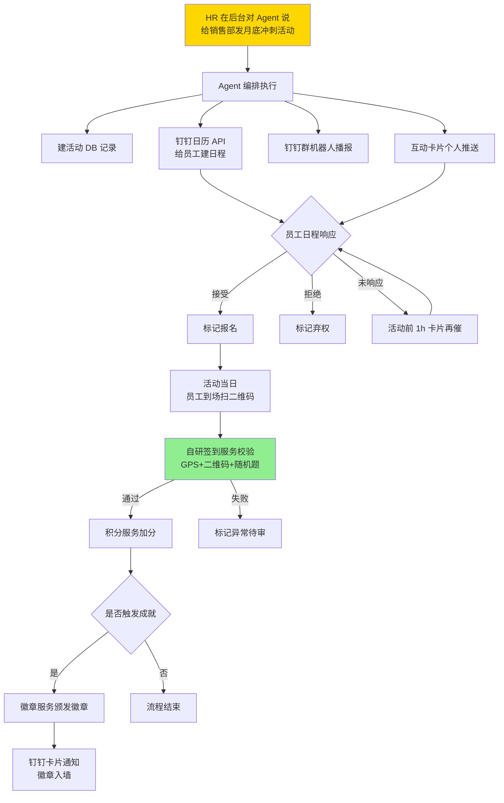
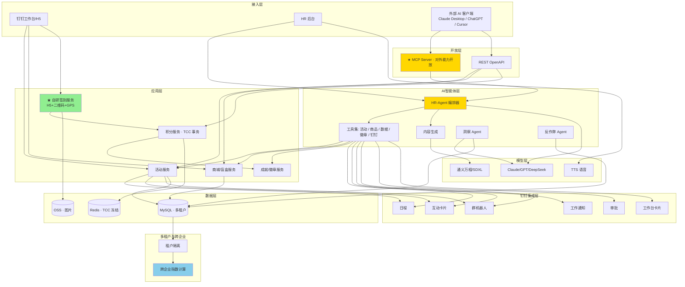
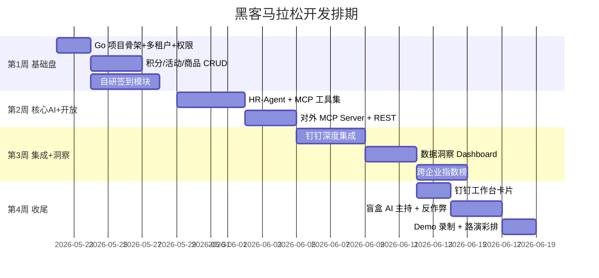

# 文化积分商城 · AI 智能运营平台 项目方案 v4

> 黑客马拉松最终交付版 · 后端 Go 实现 · 已核验钉钉 API 边界

---

## 一、背景与痛点

| 维度 | 现状 | 风险 |
|------|------|------|
| 数据载体 | 仅靠共享 Excel | 误操作、并发冲突、无审计（图一陈先生 -4 分） |
| 业务流程 | 全人工，HR 手工加减分 | 公平性存疑、规则不透明 |
| 规则不闭环 | "扫码即扣分"无校验 | 没抽奖也被扣分（图二），体验差 |
| 增长瓶颈 | 频次低、无沉淀 | 文化氛围难量化，激励无积累 |

---

## 二、项目定位

> **「钉钉里的企业文化 AI 运营官 × 开放生态平台」**
> 以积分为燃料，AI 为大脑，**MCP 为神经接口**，把企业文化从「Excel 台账」升级为「自动化运营 + 开放生态 + 跨企业互联」的完整闭环。

**三大差异化叙事**：

1. 🤖 **AI 智能化** — HR 自然语言即可运营文化，等于一支文化运营团队
2. 🔌 **开放生态** — MCP 协议接入 Claude / ChatGPT 等任意 AI 客户端
3. 🌐 **SaaS 想象** — 跨企业文化指数榜，行业基础设施雏形

---

## 三、核心功能盘（图三四需求落地）

1. **文化分排行榜**：部门 / 个人 / 季度榜单
2. **活动中心**：HR 发布 → 钉钉日程邀请 → 员工日程接受=报名 → 现场签到 → HR 审核加分
3. **我的**：个人积分、流水、成就徽章墙
4. **积分商城**：商品兑换 + 盲盒抽奖（**TCC 事务修复"扫码即扣分"BUG**）
5. **后台管理**：积分管理、签到审核、活动/商品/二维码发布
6. **钉钉深度集成**：日程、通知、卡片、群机器人、审批、工作台卡片

---

## 四、亮点功能（7 项，按竞赛冲击力排序）

### ① HR-Agent · 自然语言一键运营 🤖 **王牌**

**场景**：HR 后台聊天框输入：
> "给销售部发一场月底冲刺活动，下周三 18:00，奖励 50 分，限 30 人，海报用红色科技风"

**Agent 自动执行**：

1. 调用「活动创建」工具 → 写入 DB
2. 调用「钉钉日程」工具 → 给目标员工建日程
3. 调用「内容生成」工具 → 生成海报 + 钉钉群推送文案
4. 调用「互动卡片」工具 → 群内发可点击报名卡片
5. 调用「群机器人」工具 → 部门群播报
6. 返回执行报告

**技术**：Claude / GPT Function Calling + **Go 自研 MCP 工具集**

---

### ② 开放 API + MCP Server 🔌 **技术深度爆点**

**核心理念**：把整个平台的能力**全部 MCP 化**，让任意 AI 客户端都能调用。

**两层开放**：

- **REST OpenAPI**：标准 API + OAuth，企业自有系统对接
- **MCP Server**：完整工具集（查积分、加分、发活动、查排名、发徽章…）

**Demo 杀手锏**：
> 1. 现场打开 **Claude Desktop**
> 2. 连接到我们的 MCP Server
> 3. 输入："帮我查本月销售部前 3 名，给第一名加 100 分，并给他颁发『销售之星』徽章"
> 4. Claude 直接调用工具链完成 ✅

**业务价值**：企业可用任意 AI 工具操控积分系统，真正「AI 时代 ready」的中台。

---

### ③ AI 内容生成助手 ✍️

**一句话生成**：

- 活动文案（Claude / GPT）
- 海报、奖品图（通义万相 / SDXL）
- 钉钉推送话术（正式 / 活泼 / 紧急多语气）
- 个性化签到二维码（嵌入品牌元素）

**一键发布**：内容生成 → HR 确认 → 全渠道分发。

---

### ④ AI 文化数据洞察 Dashboard 📊 **给老板看的杀手锏**

**场景**：HR 总监输入：
> "为什么本月研发部参与度下降 30%？"

**AI 回答**：
> "研发部本月有 2 场重大版本发布（4/8、4/22），冲突活动 3 场。建议把活动调整到周三午餐时段，并联动技术分享主题。预测参与率可回升至 65%。"

**技术**：业务数据 → SQL Agent → 归因分析 → 策略推荐（RAG 历史活动效果库）

---

### ⑤ 盲盒 AI 互动主持人 🎁 **现场演示张力**

抽奖时弹出 Live2D 形象 + 语音 + 表情：
> "恭喜你！这是本周第 3 个抽到星巴克卡的同学～"
> "差一点点就是 iPad 啦！要不要再来一次？"

**技术**：TTS（火山 / Edge-TTS）+ Live2D + LLM 实时文案生成

---

### ⑥ 跨企业文化指数榜 🌐 **SaaS 想象空间**

**两个维度**：

- **企业文化指数**：参与率、活跃度、活动多样性聚合计算（脱敏）
- **行业排行榜**：互联网、电商、外贸分赛道

**展示规则**：

- 企业自愿加入（opt-in）
- 公开榜只显示**匿名代号 + 指数**（如「互联网 A 厂 · 88.6」）
- HR 内部可看：「我司在互联网赛道排第 X / Y」

**演化路径**：Phase 1 演示（虚拟对手 + 我司）→ Phase 2 邀请合作企业 → Phase 3 行业基础设施

---

### ⑦ AI 反作弊与异常检测 🛡️

实时监测同 IP 多次扫码、部门积分异常膨胀、兑换频次异常 → 孤立森林 + LLM 解释 → 自动生成预警工单。

---

## 五、钉钉深度集成（独立模块）

> 已通过官方文档核验，明确边界。

### ✅ 实施清单

| 能力 | 用法 | 钉钉 API |
|------|------|---------|
| 活动日程 | 自动建日程邀请员工，**接受 = 报名意向** | 日历 API |
| 互动卡片 | 群内/个人收到可点击报名卡片 | 互动卡片 + 回调 |
| 工作通知 | 个人级活动/中奖/积分通知 | asyncsend_v2 |
| 群机器人 | 部门群每周播报排名、月报、获奖名单 | 自定义机器人 webhook |
| OA 审批 | 积分异议申诉、大额调整走标准审批流 | 审批流 API |
| 工作台卡片 | 钉钉首页"我的积分"一屏直达 | 自定义工作台 |

### ⚠️ 谨慎使用

- **DING 强提醒**：仅企业自建 + 专业版有配额，**只用于关键事件**（中奖通知、异议结果）

### ❌ 不依赖钉钉（自建模块）

- **签到模块自研**：钉钉考勤 API 只读，无法创建签到任务 →
  - 自建：H5 + 二维码动态刷新 + GPS / WiFi 围栏 + 防代签随机校验

### 💰 配额预算（透明告知）

> 本系统按 **钉钉专业版（50 万次 API/月）** 预算设计。标准版（1 万次/月）几天就会爆配额。客户落地前需升级一次到专业版。

---

## 六、关键业务流程：活动报名与签到

---

## 七、整体架构图

---

## 八、技术选型（Go 版）

| 层 | 选型 | 理由 |
|----|------|------|
| Web 框架 | **Gin** | 生态成熟、性能高、上手快 |
| ORM | **GORM** + sqlx | Go 标准选择 |
| LLM | Claude 4.6 Sonnet（主）+ DeepSeek V3（降本） | Function Calling 强、中文好 |
| LLM SDK | 直接 HTTP 调用（Anthropic 无官方 Go SDK） | 自封装很轻 |
| MCP Server | **自研 JSON-RPC over SSE**（Go） | MCP 官方 Go SDK 不稳，自研刚好是亮点 |
| 图像 | 通义万相 / SD-XL | 国内可用、API 简单 |
| TTS | 火山引擎 / Edge-TTS | 中文好、低成本 |
| 钉钉 SDK | **alibabacloud-go/dingtalk** 系列（官方） | 钉钉官方维护 |
| 签到 | H5 + 二维码动态刷新 + GPS（自研） | 钉钉考勤 API 只读 |
| 任务队列 | **asynq**（基于 Redis） | Go 社区主流 |
| 多租户 | 共享库 + tenant_id 隔离 | 演示足够 |
| 部署 | **静态二进制 + Docker Compose** | 镜像小、启动快 |

---

## 九、里程碑与排期（4 周）

> **必保**：① HR-Agent、② 开放 MCP、⑤ 盲盒主持、自研签到、钉钉日程+群机器人+卡片
> **时间不够时砍**：⑦ 反作弊 → ⑥ 跨企业（保留 1 个虚拟对手即可）

---

## 十、黑客马拉松竞赛亮点总结（评委一页纸）

| 评分维度 | 我们的亮点 |
|----------|-----------|
| **创新性** | 国内首个 **MCP Agent 协议** 在企业内部场景落地 |
| **AI 浓度** | HR-Agent / 内容生成 / 数据洞察 / 反作弊 / 盲盒主持 = 5 大 AI 模块 |
| **技术深度** | MCP 协议自研 Server（Go）+ 多 Agent 编排 + 多租户 + TCC 事务 |
| **生态价值** | MCP 把系统能力开放给 Claude / ChatGPT 等任意 AI 客户端 |
| **商业想象** | 跨企业指数榜 → SaaS → 中国企业文化数据平台 |
| **工程严谨** | 已核验钉钉 API 边界、明确专业版预算、签到自建不强行集成 |
| **可演示** | Claude Desktop 调用 + AI 语音主持，Demo 张力拉满 |
| **可落地** | 已对接钉钉、4 周可交付，单二进制部署即装即用 |

---

## 十一、Demo 演示脚本（5 分钟版本）

| 步骤 | 时长 | 内容 |
|------|------|------|
| 1. 开场 | 30s | Excel 痛点截图（图一图二）→ 问题引出 |
| 2. HR-Agent | 60s | HR 说"发个销售部冲刺活动"→ Agent 自动建活动+建钉钉日程+发互动卡片+群机器人播报，**评委手机现场收到钉钉推送** |
| 3. ★ 开放 MCP | 75s | **打开 Claude Desktop → 连我们的 MCP Server → "查本月前 3 名，给第一加 100 分并颁发『销售之星』徽章"** → Claude 直接执行 |
| 4. 签到+加分 | 45s | 员工扫二维码 → 自研签到校验通过 → 积分入账 + 触发成就徽章 |
| 5. 盲盒抽奖 | 60s | 扫码抽奖 → AI 主持人语音互动 → 中奖 |
| 6. 洞察 + 跨企业榜 | 60s | 问"为什么参与度下降"→ AI 归因 + 看「我司在互联网公司排第 3」 |
| 7. 收官 | 15s | 架构图 + 三大叙事金句 |

---

## 十二、三大叙事金句（路演反复强调）

> 1. **"我们不是把 Excel 搬上线，而是把企业文化变成可被任意 AI 操控的中台。"**
> 2. **"HR 一句话，钉钉里全套自动跑完。"**
> 3. **"今天是一个企业的工具，明天是整个行业的基础设施。"**

---

## 十三、风险与应对

| 风险 | 应对 |
|------|------|
| 钉钉专业版升级要求 | 路演时坦诚说明，强调"工程严谨度"反而是加分 |
| MCP 客户端版本兼容 | Demo 当天用 Claude Desktop 已知稳定版本，预录备份 |
| 自研签到防作弊不完美 | 演示用 GPS+二维码足够，路演不深究细节 |
| 跨企业数据冷启动 | 内置 3 家虚拟对手企业，演示足够 |
| LLM API 不稳定 | 主用 Claude，备 DeepSeek，关键 Demo 预录视频 |
| Go MCP SDK 不成熟 | 自研轻量 JSON-RPC 实现，**反而成为技术亮点** |

---

## 十四、可选锦上添花（如还有时间）

- 🎙️ 钉钉语音直接下达 HR-Agent 指令
- 📜 年度数字文化报告（自动生成 PDF）
- 📺 钉钉直播观看时长加分（大型全员会场景）
- 📄 钉钉文档自动归档活动总结
- 🎯 员工"文化护照"（成就墙可分享到朋友圈/简历）

---

## 十五、版本演进记录

### v1 → v2
- ➕ 新增：开放 API + MCP Server、跨企业排行榜、文化 NFT 数字勋章
- ➖ 移除：AI 视觉签到防作弊、AI 个性化推荐引擎、企业文化数字分身

### v2 → v3
- ➕ 新增：钉钉深度集成模块（日程、卡片、通知、群机器人、审批、工作台）
- 🛠 修正：钉钉签到 → 自研签到（考勤 API 只读）；视频会议 → 仅用日程；明确专业版预算
- 📊 强化：业务流程图（日程+签到协同）

### v3 → v4
- ➖ 移除：文化 NFT / 数字勋章模块（含区块链层、Polygon、IPFS）
- 🔄 调整：四大叙事 → **三大叙事**（AI / 开放 / SaaS）
- 🔄 调整：后端 PHP/Hyperf → **Go (Gin)**
- 🔄 调整：节省 3 天 → 用于钉钉集成 + 数据洞察 + 跨企业打磨
- 🔄 保留：成就徽章墙（仅 DB 存储，不上链）
