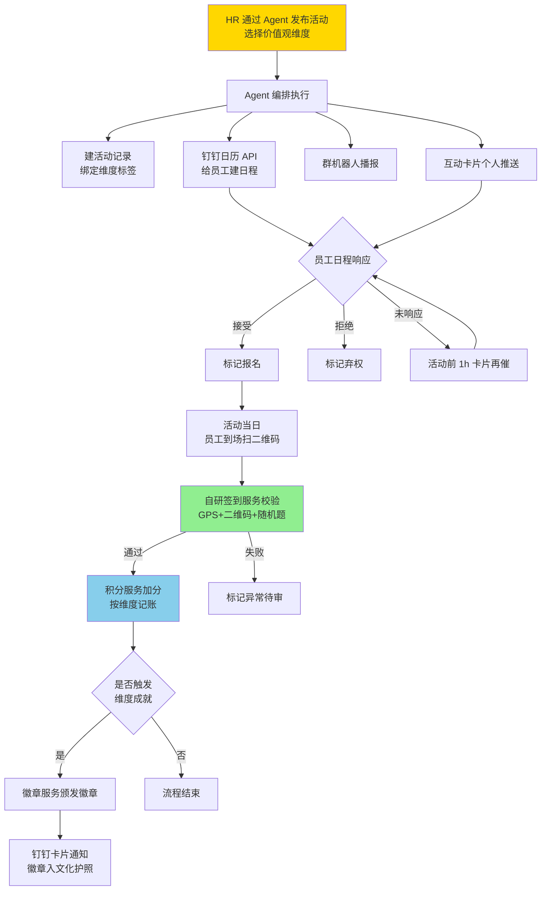
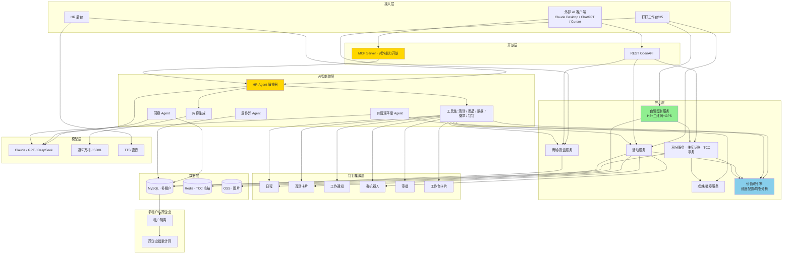
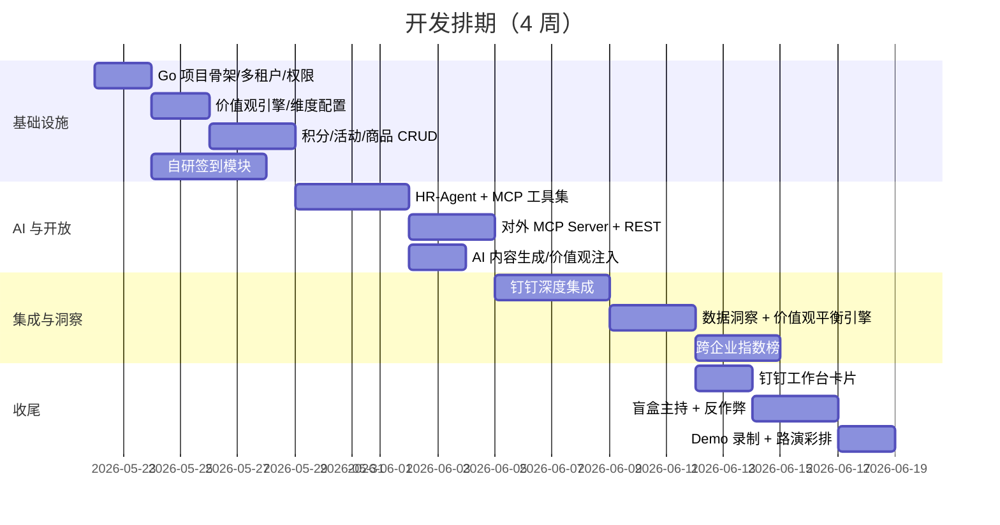

# 文化官 · AI 智能运营平台 项目方案

---

## 一、项目背景

公司核心价值观的落地长期面临"墙上写一套，做事另一套"的运营难题。现有的文化官管理仅依靠一份共享 Excel，存在四大瓶颈：

| 维度 | 现状 | 风险 |
|------|------|------|
| 数据载体 | 共享 Excel 单点管理 | 误操作、并发冲突、无审计、负数积分等异常无法预防 |
| 业务流程 | 全人工台账，HR 手工加减分 | 公平性存疑，员工无从核对，规则不透明 |
| 规则不闭环 | "扫码即扣分"无校验机制 | 即使未抽到奖品也被扣分，体验差、申诉成本高 |
| 数据沉淀 | 仅记录数值，无维度归属 | 无法回答"哪个价值观在公司最薄弱"，文化运营缺乏量化抓手 |

文化官系统不仅要解决工具问题，更要回答一个核心命题：**如何让企业文化从口号变成可观测、可调节、可优化的运营指标**。

---

## 二、项目定位

**「钉钉里的企业文化 AI 运营官 × 开放生态平台」**

以**核心价值观为骨架**，以积分为燃料，以 AI 为大脑，以 MCP 协议为开放接口，构建覆盖"价值观定义 → 行为激励 → 数据沉淀 → 智能洞察 → 持续优化"的完整闭环。

三大设计原则：

1. **价值观驱动** — 每个积分、徽章、活动都绑定明确的价值观维度，使文化运营具备可量化的指标体系
2. **AI 智能化** — HR 通过自然语言即可完成活动策划、内容生产、数据归因、决策建议全流程
3. **开放生态** — 通过 MCP 协议将系统能力开放给任意 AI 客户端，企业自有 AI 工具可直接接入

---

## 三、价值观映射模型（核心设计基础）

### 3.1 设计思路

文化官的本质不是"加分扣分"，而是**将公司核心价值观转化为可量化、可激励、可观测的运营指标**。系统以"价值观维度"为骨架贯穿所有模块，确保每一份积分都有归属，每一个徽章都有代表，每一次活动都有指向。

### 3.2 价值观维度配置

系统默认提供 6 个典型企业文化维度，企业可基于自身价值观体系灵活增删、重命名、调整权重：

| 维度 | 关键词 | 典型激励场景 |
|------|-------|--------------|
| **客户至上** | 用户思维、服务意识、价值创造 | 客户走访、用户调研、满意度专项、客户故事征集 |
| **团队协作** | 跨部门合作、互助互信、共同成长 | 跨部门项目、知识共享、互助任务、团建活动 |
| **创新求变** | 突破常规、勇于尝试、变革驱动 | 创意提案、技术预研、流程优化、内部 Hackathon |
| **诚信务实** | 担当负责、说到做到、落地为王 | 项目复盘、责任领取、关键交付、合规建设 |
| **极致专注** | 工匠精神、追求卓越、品质至上 | 技能竞赛、质量改进、深度专研、最佳实践沉淀 |
| **学习成长** | 持续学习、知识分享、自我突破 | 培训、读书会、技术分享、技能认证 |

### 3.3 价值观与系统模块的映射

| 系统模块 | 价值观融入方式 |
|----------|---------------|
| 积分体系 | 每次加分绑定一个价值观维度，员工拥有"总积分 + 多维分值" |
| 排行榜 | 总榜 + 维度分榜，支持员工/部门双视角 |
| 活动中心 | 活动发布时选择主推维度，作为积分归属 |
| 徽章成就 | 每个徽章绑定一个维度，按稀有度分阶 |
| 数据洞察 | 维度参与度对比、薄弱维度归因、均衡度评估 |
| 跨企业指数 | 按维度跨企业对标，形成行业价值观图谱 |
| AI 内容生成 | Prompt 注入公司价值观语境，文案贴合企业文化 |
| HR-Agent | 发布活动时自动推荐维度归属，预警维度失衡 |

### 3.4 员工文化护照

每位员工拥有一份个人文化档案：

- **价值观雷达图**：多维分值可视化，直观展示个人文化偏好
- **维度成就路径**：每个维度的徽章成就阶梯
- **季度/年度文化报告**：AI 自动生成个人文化画像
- **应用场景**：年度评优、晋升参考、内部转岗匹配的客观依据

---

## 四、核心功能模块

| 模块 | 核心能力 |
|------|---------|
| 文化分排行榜 | 总榜 + 多维度分榜，部门/个人/季度/年度多视角切换 |
| 活动中心 | HR 发布 → 钉钉日程邀请 → 员工接受=报名 → 现场签到 → HR 审核加分；活动必须绑定价值观维度 |
| 我的（文化护照） | 个人积分、维度雷达图、流水明细、成就徽章墙、年度报告 |
| 积分商城 | 商品兑换 + 盲盒抽奖；采用 TCC 事务确保"未中奖不扣分" |
| 后台管理 | 价值观维度配置、积分管理、签到审核、活动/商品/二维码发布 |
| 钉钉集成 | 日程、工作通知、互动卡片、群机器人、OA 审批、工作台卡片 |

---

## 五、AI 智能亮点

### 5.1 HR-Agent · 自然语言运营

HR 在后台聊天框输入自然语言指令，Agent 自动完成多步骤运营任务：

> 输入示例："给销售部发一场月底冲刺活动，下周三 18:00，主推团队协作维度，奖励 50 分，限 30 人。"

Agent 的执行链：

1. 「活动创建」工具 → 写入 DB，绑定"团队协作"维度
2. 「内容生成」工具 → 生成海报与推送文案（注入价值观语境）
3. 「钉钉日程」工具 → 向目标员工创建日程邀请
4. 「互动卡片」工具 → 群内发布可点击报名卡片
5. 「群机器人」工具 → 部门群播报活动信息
6. 返回结构化执行报告

技术实现：Claude / GPT 函数调用 + Go 自研 MCP 工具集。

### 5.2 开放 API + MCP Server

系统提供两层对外开放能力：

- **REST OpenAPI**：标准 API + OAuth，企业自有系统对接
- **MCP Server**：实现 Model Context Protocol，将业务能力封装为标准工具集（查询积分、加分、发布活动、查排名、颁发徽章、调用钉钉等）

任意支持 MCP 的 AI 客户端（Claude Desktop、ChatGPT、Cursor 等）可直接连接，使企业级 AI 工具无缝接入文化运营系统。

### 5.3 AI 内容生成

支持一句话生成：

- 活动文案（注入公司价值观关键词，确保语境一致）
- 活动海报、奖品图（通义万相 / SD-XL）
- 钉钉推送话术（正式/活泼/紧急多语气切换）
- 个性化签到二维码（嵌入品牌元素）

生成 → HR 确认 → 一键全渠道分发。

### 5.4 AI 数据洞察 Dashboard

支持自然语言查询业务数据，AI 自动完成 SQL 生成、归因分析、策略推荐。

> 输入示例："本季度哪个价值观维度参与度最低？"
>
> AI 回答："『诚信务实』维度参与度 12%，远低于其他维度均值 28%。主要原因：该维度仅举办 2 场活动，且均集中在 1 月。建议：① 增加项目复盘类活动；② 设置维度均衡补贴积分；③ 关联现有 OKR 复盘流程。预测调整后参与度可回升至 25%。"

技术实现：Text-to-SQL Agent + 归因引擎 + RAG 历史活动效果库。

### 5.5 AI 价值观平衡引擎

针对企业文化运营中常见的"维度失衡"问题，系统主动监测：

- **维度均衡度评分**：基于活动数、参与人次、积分总量计算
- **失衡预警**：某维度连续 N 周低于阈值时触发提醒
- **活动建议**：自动推荐补足该维度的活动模板
- **HR-Agent 联动**：HR 发布活动时，若选择已饱和维度，主动建议改投薄弱维度

避免"年终复盘才发现某价值观全年只有 2 场活动"的运营盲区。

### 5.6 盲盒互动主持

抽奖环节引入虚拟主持人（Live2D + TTS + LLM 实时文案）：

- 基于中奖结果、员工历史行为生成个性化互动台词
- 配合表情、语音提升参与体验
- 增强商城的趣味性与传播性

### 5.7 跨企业文化指数

支持多企业以脱敏方式接入，形成行业级文化运营对标：

- **企业文化指数**：参与率、活跃度、活动多样性聚合计算
- **行业排行**：互联网、电商、外贸等赛道分别成榜
- **维度对标**：按价值观维度跨企业对比，形成行业价值观图谱
- **展示规则**：opt-in 接入，仅展示匿名代号 + 指数，HR 可看自身排名

### 5.8 AI 反作弊与异常检测

实时监测同 IP 多次扫码、部门积分异常膨胀、兑换频次异常等行为。基于规则引擎 + 孤立森林算法识别异常，LLM 自动生成可读的预警工单。

---

## 六、钉钉深度集成

### 6.1 实施清单

基于钉钉开放平台官方文档核验，明确以下能力可直接对接：

| 能力 | 用法 | 钉钉 API |
|------|------|---------|
| 活动日程 | 自动创建日程并邀请员工，**接受=报名意向** | 日历 API |
| 互动卡片 | 群内/个人推送可点击报名卡片 | 互动卡片 + 回调 |
| 工作通知 | 个人级活动/中奖/积分通知 | asyncsend_v2 |
| 群机器人 | 部门群周报、月榜、获奖名单播报 | 自定义机器人 webhook |
| OA 审批 | 积分异议申诉、大额调整走标准审批流 | 审批流 API |
| 工作台卡片 | 钉钉首页"我的积分"一屏直达 | 自定义工作台 |

### 6.2 谨慎使用

- **DING 强提醒**：仅企业自建应用 + 专业版有配额，限关键事件使用（中奖通知、异议结果）

### 6.3 自建模块（不依赖钉钉）

- **签到模块自研**：钉钉考勤 API 仅支持只读，无法程序化创建签到任务。自建方案：H5 + 二维码动态刷新 + GPS / WiFi 围栏 + 防代签随机校验

### 6.4 配额预算

系统按**钉钉专业版（50 万次 API/月）** 预算设计。标准版（1 万次/月）无法支撑日常运营。企业落地前需完成专业版升级。

---

## 七、关键业务流程



---

## 八、整体架构



---

## 九、技术选型

| 层 | 选型 | 说明 |
|----|------|------|
| Web 框架 | Gin | Go 生态主流，性能高、上手快 |
| ORM | GORM + sqlx | 标准 ORM + 复杂查询场景 |
| LLM | Claude 4.6 Sonnet（主）+ DeepSeek V3（降本） | Function Calling 能力强 |
| LLM SDK | 直接 HTTP 调用 + 自封装 Client | Anthropic 无官方 Go SDK |
| MCP Server | 自研 JSON-RPC over SSE（Go） | 官方 Go SDK 不稳，自研轻量实现 |
| 图像生成 | 通义万相 / SD-XL | 国内可用、API 简单 |
| TTS | 火山引擎 / Edge-TTS | 中文表现好、成本可控 |
| 钉钉 SDK | alibabacloud-go/dingtalk 系列 | 钉钉官方维护 |
| 签到 | H5 + 二维码动态刷新 + GPS | 自研，钉钉考勤 API 只读 |
| 任务队列 | asynq（基于 Redis） | Go 社区主流 |
| 多租户 | 共享库 + tenant_id 隔离 | 演示与中小规模足够 |
| 部署 | 静态二进制 + Docker Compose | 镜像小、启动快 |

---

## 十、里程碑与排期



**优先级策略**：

- **必保**：HR-Agent、开放 MCP、价值观引擎、自研签到、钉钉日程+卡片+群机器人
- **次要**：盲盒主持、AI 内容生成
- **可砍**：反作弊、跨企业指数（保留最小演示版本）

---

## 十一、Demo 演示脚本

| # | 时长 | 内容 |
|---|------|------|
| 1 | 30s | 痛点呈现：Excel 管理截图与负数积分实例 |
| 2 | 60s | HR-Agent：自然语言"发布团队协作维度活动" → 自动建活动+日程+卡片+群播报，现场可见钉钉推送 |
| 3 | 75s | 开放 MCP：Claude Desktop 连接 MCP Server，自然语言完成"查月度前 3 名、加分、颁发徽章"全链路 |
| 4 | 45s | 签到加分：员工扫二维码 → 自研签到校验 → 积分入账 + 触发成就 → 钉钉通知 |
| 5 | 60s | 价值观洞察：自然语言查询"哪个维度参与度最低"，AI 给出归因与建议 |
| 6 | 60s | 盲盒抽奖：扫码 → AI 主持人语音互动 → 中奖 → 流程闭环 |
| 7 | 30s | 跨企业指数：展示行业内价值观维度排名图谱 |
| 8 | 20s | 收尾：架构概览与价值观映射模型回顾 |

总时长：约 6 分钟，可按现场情况压缩为 5 分钟。

---

## 十二、风险与应对

| 风险 | 应对策略 |
|------|---------|
| 钉钉专业版升级要求 | 路演时明确说明配额预算，体现工程预判能力 |
| MCP 客户端版本兼容 | Demo 使用稳定版 Claude Desktop，关键场景预录视频备份 |
| 自研签到防作弊不完美 | 演示场景 GPS + 二维码 + 随机题足够，深度反作弊纳入后续迭代 |
| 跨企业数据冷启动 | 内置 3 家虚拟对手企业数据，演示与早期推广均可用 |
| LLM API 不稳定 | 主用 Claude，备 DeepSeek，关键 Demo 链路预录视频 |
| Go MCP SDK 不成熟 | 自研轻量 JSON-RPC 实现，作为技术亮点 |
| 价值观维度配置过于主观 | 提供 6 大典型维度模板，企业可自定义但有最佳实践参考 |

---

## 十三、远期演化路径

### Phase 1：单企业落地（当前阶段）
- 完整 AI 运营闭环
- 价值观维度体系
- 钉钉深度集成

### Phase 2：多企业 SaaS 化（3-6 个月）
- 多租户能力上线
- 跨企业指数榜对外开放
- 价值观模板市场（不同行业最佳实践共享）

### Phase 3：行业基础设施（12 个月+）
- 中国企业文化运营数据平台
- 行业价值观图谱定期发布
- 文化运营行业标准制定参与
- 与 HR 招聘、培训、咨询生态打通

---

## 十四、附录：价值观维度数据模型示例

```sql
-- 价值观维度配置（租户级）
CREATE TABLE value_dimensions (
    id BIGINT PRIMARY KEY,
    tenant_id BIGINT NOT NULL,
    code VARCHAR(32) NOT NULL COMMENT '维度编码 e.g. customer_first',
    name VARCHAR(64) NOT NULL COMMENT '维度显示名',
    keywords VARCHAR(255) COMMENT '关键词，用于 AI Prompt 注入',
    weight DECIMAL(3,2) DEFAULT 1.00 COMMENT '权重',
    sort_order INT DEFAULT 0,
    enabled TINYINT DEFAULT 1,
    UNIQUE KEY uk_tenant_code (tenant_id, code)
);

-- 积分流水（维度记账）
CREATE TABLE point_transactions (
    id BIGINT PRIMARY KEY,
    tenant_id BIGINT NOT NULL,
    user_id BIGINT NOT NULL,
    dimension_id BIGINT NOT NULL COMMENT '价值观维度',
    amount INT NOT NULL COMMENT '积分变动（正负）',
    activity_id BIGINT COMMENT '关联活动',
    reason VARCHAR(255),
    operator_id BIGINT,
    created_at TIMESTAMP,
    INDEX idx_user_dim (user_id, dimension_id),
    INDEX idx_tenant_dim_time (tenant_id, dimension_id, created_at)
);

-- 员工维度积分快照（用于雷达图与排行榜）
CREATE TABLE user_dimension_scores (
    user_id BIGINT NOT NULL,
    tenant_id BIGINT NOT NULL,
    dimension_id BIGINT NOT NULL,
    total_score INT DEFAULT 0,
    quarter_score INT DEFAULT 0,
    year_score INT DEFAULT 0,
    updated_at TIMESTAMP,
    PRIMARY KEY (user_id, dimension_id)
);
```
