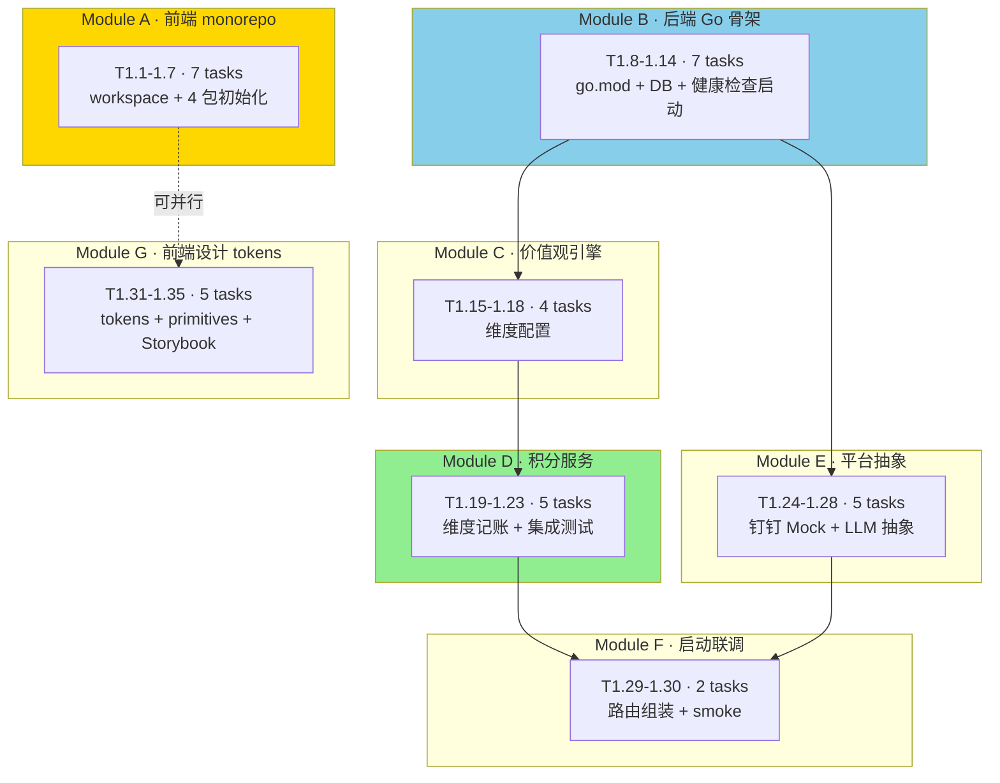

# Phase 1 · 骨架 实现计划

> **面向 Agent 执行：** 必须使用 `superpowers:subagent-driven-development`（推荐）或 `superpowers:executing-plans` 逐任务执行。步骤使用 checkbox（`- [ ]`）追踪。
>
> 关联文档：[总路线图](2026-05-22-总路线图.md) · [设计文档](../specs/2026-05-22-文化积分商城-动漫风钉钉应用-design.md)

**目标：** 搭建前后端骨架——前端 Monorepo（pnpm + Turborepo）、后端 Go 模块化单体（go.mod + go.work + 模块分层）、完整 DB schema 与迁移工具、价值观引擎、积分维度记账服务、钉钉 Mock 适配层、LLM 抽象接口（含 Claude 实现）、动漫风设计系统 tokens 与基础 primitives。完成本 Phase 后整个项目可一键启动（docker-compose + go run + pnpm dev），跑通最小 smoke 路径。

**架构概述：** 前端建在 `culture_points_mall_web/` 新仓，后端在已存在的 `culture_points_mall/`。后端 module 内部严格四层（domain / repository / service / handler），module 间只通过 service 接口互调。LLM 与钉钉走接口抽象，便于切换。

**技术栈：** Go 1.23 / Gin / GORM / asynq / spf13/viper / MySQL 8 / Redis 7 / React 19 / Vite 5 / pnpm 9 / Turborepo / UnoCSS / Storybook 8

---

## 一、实现流程



**模块间依赖**：A 与 B 可并行。C 依赖 B。D 依赖 C。E 依赖 B。F 是收口。G 与所有后端任务正交，可全程并行。

---

## 二、Module A · 前端 Monorepo 初始化

### Task 1.1 · 创建前端仓库与 workspace 根

**Files:**
- Create: `culture_points_mall_web/pnpm-workspace.yaml`
- Create: `culture_points_mall_web/turbo.json`
- Create: `culture_points_mall_web/package.json`
- Create: `culture_points_mall_web/.gitignore`
- Create: `culture_points_mall_web/.npmrc`

- [ ] **步骤 1：创建目录**

```bash
mkdir -p /Users/standardsoftware/go/culture_points_mall_web/{apps,packages}
cd /Users/standardsoftware/go/culture_points_mall_web
git init
```

- [ ] **步骤 2：写 `pnpm-workspace.yaml`**

```yaml
packages:
  - "apps/*"
  - "packages/*"
```

- [ ] **步骤 3：写 `turbo.json`**

```json
{
  "$schema": "https://turbo.build/schema.json",
  "tasks": {
    "build": { "dependsOn": ["^build"], "outputs": ["dist/**", ".next/**"] },
    "dev": { "cache": false, "persistent": true },
    "lint": {},
    "typecheck": { "dependsOn": ["^build"] },
    "test": { "dependsOn": ["^build"] }
  }
}
```

- [ ] **步骤 4：写根 `package.json`**

```json
{
  "name": "culture-points-mall-web",
  "version": "0.0.1",
  "private": true,
  "packageManager": "pnpm@9.12.0",
  "scripts": {
    "dev": "turbo run dev",
    "build": "turbo run build",
    "lint": "turbo run lint",
    "typecheck": "turbo run typecheck",
    "test": "turbo run test"
  },
  "devDependencies": {
    "turbo": "^2.1.0",
    "typescript": "^5.5.0",
    "@biomejs/biome": "^1.9.0"
  }
}
```

- [ ] **步骤 5：写 `.npmrc` 与 `.gitignore`**

```ini
# .npmrc
shamefully-hoist=false
strict-peer-dependencies=false
```

```gitignore
# .gitignore
node_modules/
dist/
.turbo/
*.log
.env.local
.DS_Store
storybook-static/
```

- [ ] **步骤 6：安装依赖与验证**

```bash
pnpm install
pnpm turbo --version  # 期望输出 2.x.x
```

- [ ] **步骤 7：提交**

```bash
git add .
git commit -m "chore:初始化前端 monorepo 工作空间"
```

---

### Task 1.2 · 根 TS 与代码风格配置

**Files:**
- Create: `culture_points_mall_web/tsconfig.base.json`
- Create: `culture_points_mall_web/biome.json`

- [ ] **步骤 1：写 `tsconfig.base.json`**

```json
{
  "compilerOptions": {
    "target": "ES2022",
    "module": "ESNext",
    "moduleResolution": "Bundler",
    "lib": ["ES2022", "DOM", "DOM.Iterable"],
    "jsx": "react-jsx",
    "strict": true,
    "noUnusedLocals": true,
    "noUnusedParameters": true,
    "noImplicitOverride": true,
    "exactOptionalPropertyTypes": false,
    "verbatimModuleSyntax": true,
    "isolatedModules": true,
    "esModuleInterop": true,
    "skipLibCheck": true,
    "resolveJsonModule": true,
    "useDefineForClassFields": true
  }
}
```

- [ ] **步骤 2：写 `biome.json`**

```json
{
  "$schema": "https://biomejs.dev/schemas/1.9.0/schema.json",
  "files": { "ignore": ["dist/**", ".turbo/**", "node_modules/**", "storybook-static/**"] },
  "formatter": { "indentStyle": "space", "indentWidth": 2, "lineWidth": 120 },
  "linter": {
    "rules": {
      "recommended": true,
      "suspicious": { "noExplicitAny": "warn" },
      "style": { "useImportType": "error" }
    }
  },
  "javascript": { "formatter": { "quoteStyle": "single", "trailingCommas": "all", "semicolons": "always" } }
}
```

- [ ] **步骤 3：验证**

```bash
pnpm exec biome check .  # 应输出 "No fixable errors found"
```

- [ ] **步骤 4：提交**

```bash
git add tsconfig.base.json biome.json
git commit -m "chore:加入 TypeScript 基础配置与 Biome 风格规则"
```

---

### Task 1.3 · `packages/types` 共享类型包

**Files:**
- Create: `packages/types/package.json`
- Create: `packages/types/tsconfig.json`
- Create: `packages/types/src/index.ts`
- Create: `packages/types/src/value.ts`
- Create: `packages/types/src/user.ts`
- Create: `packages/types/src/passport.ts`
- Create: `packages/types/src/leaderboard.ts`

- [ ] **步骤 1：`packages/types/package.json`**

```json
{
  "name": "@cpm/types",
  "version": "0.0.1",
  "private": true,
  "type": "module",
  "main": "./src/index.ts",
  "types": "./src/index.ts",
  "scripts": { "typecheck": "tsc --noEmit" },
  "devDependencies": { "typescript": "^5.5.0" }
}
```

- [ ] **步骤 2：`packages/types/tsconfig.json`**

```json
{
  "extends": "../../tsconfig.base.json",
  "compilerOptions": { "noEmit": true },
  "include": ["src/**/*"]
}
```

- [ ] **步骤 3：`packages/types/src/value.ts`**

```typescript
export type DimensionCode =
  | 'customer_first'
  | 'team_collab'
  | 'innovation'
  | 'integrity'
  | 'craftsmanship'
  | 'growth';

export interface Dimension {
  id: number;
  tenantId: number;
  code: DimensionCode | string;
  name: string;
  keywords: string;
  weight: number;
  sortOrder: number;
  enabled: boolean;
}
```

- [ ] **步骤 4：`packages/types/src/user.ts`**

```typescript
export interface User {
  id: number;
  tenantId: number;
  dingUserId: string | null;
  name: string;
  avatarUrl: string;
  deptId: number | null;
}
```

- [ ] **步骤 5：`packages/types/src/passport.ts`**

```typescript
import type { Dimension } from './value';

export interface DimensionScore {
  dimensionId: number;
  dimensionCode: string;
  dimensionName: string;
  totalScore: number;
  quarterScore: number;
  yearScore: number;
}

export interface PassportSummary {
  totalScore: number;
  scoresByDimension: DimensionScore[];
  badgeCount: number;
  dimensions: Dimension[];
}

export interface PointTransaction {
  id: number;
  dimensionId: number;
  dimensionCode: string;
  amount: number;
  reason: string;
  activityId: number | null;
  createdAt: string;
}

export type BadgeRarity = 'common' | 'rare' | 'epic' | 'legendary';

export interface Badge {
  id: number;
  dimensionId: number;
  dimensionCode: string;
  name: string;
  rarity: BadgeRarity;
  iconUrl: string;
  earned: boolean;
  earnedAt: string | null;
}
```

- [ ] **步骤 6：`packages/types/src/leaderboard.ts`**

```typescript
export type LeaderboardScope = 'total' | 'dim' | 'dept';
export type LeaderboardWindow = 'week' | 'month' | 'quarter' | 'year';

export interface LeaderboardEntry {
  rank: number;
  userId: number;
  name: string;
  avatarUrl: string;
  deptName: string;
  score: number;
  trend: number;
}

export interface LeaderboardResponse {
  scope: LeaderboardScope;
  window: LeaderboardWindow;
  dimensionId: number | null;
  entries: LeaderboardEntry[];
  total: number;
}
```

- [ ] **步骤 7：`packages/types/src/index.ts`**

```typescript
export * from './value';
export * from './user';
export * from './passport';
export * from './leaderboard';
```

- [ ] **步骤 8：验证**

```bash
cd /Users/standardsoftware/go/culture_points_mall_web
pnpm install
pnpm --filter @cpm/types typecheck  # 应通过
```

- [ ] **步骤 9：提交**

```bash
git add packages/types
git commit -m "feat:新增共享类型包 @cpm/types"
```

---

### Task 1.4 · `packages/ui` 动漫风设计系统包初始化

**Files:**
- Create: `packages/ui/package.json`
- Create: `packages/ui/tsconfig.json`
- Create: `packages/ui/uno.config.ts`
- Create: `packages/ui/src/index.ts`
- Create: `packages/ui/src/tokens/colors.css`
- Create: `packages/ui/src/tokens/typography.css`
- Create: `packages/ui/src/tokens/shadows.css`
- Create: `packages/ui/src/tokens/index.css`

> **本 task 只做包初始化 + tokens；primitives 与 components 在 Task 1.32-1.34 实现。**

- [ ] **步骤 1：`packages/ui/package.json`**

```json
{
  "name": "@cpm/ui",
  "version": "0.0.1",
  "private": true,
  "type": "module",
  "main": "./src/index.ts",
  "types": "./src/index.ts",
  "exports": {
    ".": "./src/index.ts",
    "./tokens.css": "./src/tokens/index.css"
  },
  "scripts": {
    "typecheck": "tsc --noEmit",
    "storybook": "storybook dev -p 6006",
    "build-storybook": "storybook build"
  },
  "dependencies": {
    "framer-motion": "^11.11.0",
    "gsap": "^3.12.5",
    "lottie-react": "^2.4.0",
    "@react-three/fiber": "^8.17.0",
    "@react-three/drei": "^9.114.0",
    "three": "^0.169.0"
  },
  "peerDependencies": {
    "react": "^19.0.0",
    "react-dom": "^19.0.0"
  },
  "devDependencies": {
    "@types/react": "^19.0.0",
    "@types/react-dom": "^19.0.0",
    "@types/three": "^0.169.0",
    "@storybook/react-vite": "^8.3.0",
    "@storybook/test": "^8.3.0",
    "@unocss/preset-uno": "^0.62.0",
    "react": "^19.0.0",
    "react-dom": "^19.0.0",
    "storybook": "^8.3.0",
    "typescript": "^5.5.0",
    "unocss": "^0.62.0",
    "vite": "^5.4.0"
  }
}
```

- [ ] **步骤 2：`packages/ui/tsconfig.json`**

```json
{
  "extends": "../../tsconfig.base.json",
  "compilerOptions": { "noEmit": true, "types": ["vite/client"] },
  "include": ["src/**/*"]
}
```

- [ ] **步骤 3：`packages/ui/uno.config.ts`**

```typescript
import { defineConfig, presetUno } from 'unocss';

export const cpmUnoConfig = defineConfig({
  presets: [presetUno()],
  theme: {
    colors: {
      ink: 'var(--cpm-ink)',
      paper: 'var(--cpm-paper)',
      cRed: 'var(--cpm-red)',
      cOrange: 'var(--cpm-orange)',
      cYellow: 'var(--cpm-yellow)',
      cBlue: 'var(--cpm-blue)',
      cPink: 'var(--cpm-pink)',
      cGreen: 'var(--cpm-green)',
      cPurple: 'var(--cpm-purple)',
      cTeal: 'var(--cpm-teal)',
    },
    fontFamily: {
      kuaile: '"ZCOOL KuaiLe", "PingFang SC", sans-serif',
      qingke: '"ZCOOL QingKe HuangYou", "PingFang SC", sans-serif',
      bangers: '"Bangers", cursive',
      marker: '"Permanent Marker", cursive',
    },
  },
});

export default cpmUnoConfig;
```

- [ ] **步骤 4：`packages/ui/src/tokens/colors.css`**

```css
:root {
  --cpm-ink: #1a1a1a;
  --cpm-paper: #fffef8;
  --cpm-red: #ff4757;
  --cpm-orange: #ff9f43;
  --cpm-yellow: #ffd93d;
  --cpm-blue: #4facfe;
  --cpm-pink: #ff7eb3;
  --cpm-green: #6dd5a3;
  --cpm-purple: #a55eea;
  --cpm-teal: #38b6a8;
  --cpm-halftone: rgba(0, 0, 0, 0.08);

  --cpm-dim-customer_first: var(--cpm-orange);
  --cpm-dim-team_collab: var(--cpm-blue);
  --cpm-dim-innovation: var(--cpm-pink);
  --cpm-dim-integrity: var(--cpm-green);
  --cpm-dim-craftsmanship: var(--cpm-purple);
  --cpm-dim-growth: var(--cpm-yellow);
}
```

- [ ] **步骤 5：`packages/ui/src/tokens/typography.css`**

```css
@import url('https://fonts.font.im/css2?family=Bangers&family=Permanent+Marker&family=ZCOOL+KuaiLe&family=ZCOOL+QingKe+HuangYou&family=Ma+Shan+Zheng&display=swap');

:root {
  --cpm-font-h1: 64px;
  --cpm-font-h2: 40px;
  --cpm-font-h3: 24px;
  --cpm-font-body: 16px;
  --cpm-font-sm: 13px;
}
```

- [ ] **步骤 6：`packages/ui/src/tokens/shadows.css`**

```css
:root {
  --cpm-shadow-panel: 6px 6px 0 var(--cpm-ink);
  --cpm-shadow-card: 4px 4px 0 var(--cpm-ink);
  --cpm-shadow-button: 3px 3px 0 var(--cpm-ink);
  --cpm-shadow-panel-red: 6px 6px 0 var(--cpm-red);
  --cpm-shadow-panel-blue: 6px 6px 0 var(--cpm-blue);
  --cpm-shadow-panel-yellow: 6px 6px 0 var(--cpm-yellow);
  --cpm-radius-panel: 14px;
  --cpm-radius-card: 12px;
  --cpm-radius-button: 8px;

  --cpm-halftone-bg:
    radial-gradient(circle at 20% 30%, var(--cpm-halftone) 1px, transparent 1.6px) 0 0 / 18px 18px,
    radial-gradient(circle at 70% 70%, var(--cpm-halftone) 1px, transparent 1.6px) 0 0 / 26px 26px;
}
```

- [ ] **步骤 7：`packages/ui/src/tokens/index.css`**

```css
@import './colors.css';
@import './typography.css';
@import './shadows.css';
```

- [ ] **步骤 8：`packages/ui/src/index.ts`**

```typescript
export { cpmUnoConfig } from '../uno.config';
```

- [ ] **步骤 9：验证**

```bash
pnpm install
pnpm --filter @cpm/ui typecheck
```

- [ ] **步骤 10：提交**

```bash
git add packages/ui
git commit -m "feat:新增动漫风设计系统包 @cpm/ui 与设计 tokens"
```

---

### Task 1.5 · `packages/api-client` 包初始化

**Files:**
- Create: `packages/api-client/package.json`
- Create: `packages/api-client/tsconfig.json`
- Create: `packages/api-client/src/index.ts`
- Create: `packages/api-client/src/http.ts`
- Create: `packages/api-client/src/hooks/usePassport.ts`
- Create: `packages/api-client/src/hooks/useLeaderboard.ts`
- Create: `packages/api-client/src/hooks/useDimensions.ts`

- [ ] **步骤 1：`packages/api-client/package.json`**

```json
{
  "name": "@cpm/api-client",
  "version": "0.0.1",
  "private": true,
  "type": "module",
  "main": "./src/index.ts",
  "types": "./src/index.ts",
  "scripts": { "typecheck": "tsc --noEmit" },
  "dependencies": {
    "axios": "^1.7.0",
    "@tanstack/react-query": "^5.59.0"
  },
  "peerDependencies": {
    "@cpm/types": "workspace:*",
    "react": "^19.0.0"
  },
  "devDependencies": {
    "@cpm/types": "workspace:*",
    "@types/react": "^19.0.0",
    "typescript": "^5.5.0",
    "react": "^19.0.0"
  }
}
```

- [ ] **步骤 2：`packages/api-client/src/http.ts`**

```typescript
import axios, { type AxiosInstance } from 'axios';

let instance: AxiosInstance | null = null;

export function setupHttp(baseURL: string, getToken?: () => string | null): AxiosInstance {
  instance = axios.create({ baseURL, timeout: 15_000 });
  if (getToken) {
    instance.interceptors.request.use((config) => {
      const token = getToken();
      if (token) {
        config.headers.Authorization = `Bearer ${token}`;
      }
      return config;
    });
  }
  return instance;
}

export function http(): AxiosInstance {
  if (!instance) throw new Error('@cpm/api-client: call setupHttp() before requests');
  return instance;
}
```

- [ ] **步骤 3：`packages/api-client/src/hooks/useDimensions.ts`**

```typescript
import type { Dimension } from '@cpm/types';
import { useQuery } from '@tanstack/react-query';
import { http } from '../http';

export function useDimensions() {
  return useQuery<Dimension[]>({
    queryKey: ['dimensions'],
    queryFn: async () => {
      const { data } = await http().get<{ items: Dimension[] }>('/api/v1/values/dimensions');
      return data.items;
    },
    staleTime: 5 * 60_000,
  });
}
```

- [ ] **步骤 4：`packages/api-client/src/hooks/usePassport.ts`**

```typescript
import type { PassportSummary, PointTransaction, Badge } from '@cpm/types';
import { useQuery, useInfiniteQuery } from '@tanstack/react-query';
import { http } from '../http';

export function usePassport() {
  return useQuery<PassportSummary>({
    queryKey: ['me', 'passport'],
    queryFn: async () => (await http().get('/api/v1/me/passport')).data,
  });
}

export function useMyTransactions(limit = 20) {
  return useInfiniteQuery<{ items: PointTransaction[]; nextCursor: string | null }>({
    queryKey: ['me', 'transactions'],
    initialPageParam: '',
    queryFn: async ({ pageParam }) => {
      const { data } = await http().get('/api/v1/me/transactions', {
        params: { cursor: pageParam, limit },
      });
      return data;
    },
    getNextPageParam: (last) => last.nextCursor,
  });
}

export function useMyBadges() {
  return useQuery<{ items: Badge[] }>({
    queryKey: ['me', 'badges'],
    queryFn: async () => (await http().get('/api/v1/me/badges')).data,
  });
}
```

- [ ] **步骤 5：`packages/api-client/src/hooks/useLeaderboard.ts`**

```typescript
import type { LeaderboardResponse, LeaderboardScope, LeaderboardWindow } from '@cpm/types';
import { useQuery } from '@tanstack/react-query';
import { http } from '../http';

export interface LeaderboardParams {
  scope: LeaderboardScope;
  window: LeaderboardWindow;
  dimensionId?: number;
}

export function useLeaderboard(p: LeaderboardParams) {
  return useQuery<LeaderboardResponse>({
    queryKey: ['leaderboard', p],
    queryFn: async () =>
      (
        await http().get('/api/v1/leaderboard', {
          params: { scope: p.scope, window: p.window, dimension_id: p.dimensionId },
        })
      ).data,
  });
}
```

- [ ] **步骤 6：`packages/api-client/src/index.ts`**

```typescript
export { setupHttp, http } from './http';
export * from './hooks/useDimensions';
export * from './hooks/usePassport';
export * from './hooks/useLeaderboard';
```

- [ ] **步骤 7：验证 + 提交**

```bash
pnpm install
pnpm --filter @cpm/api-client typecheck
git add packages/api-client
git commit -m "feat:新增 API 客户端包 @cpm/api-client 与 TanStack Query hooks"
```

---

### Task 1.6 · `apps/h5` 应用初始化

**Files:**
- Create: `apps/h5/package.json`
- Create: `apps/h5/tsconfig.json`
- Create: `apps/h5/vite.config.ts`
- Create: `apps/h5/uno.config.ts`
- Create: `apps/h5/index.html`
- Create: `apps/h5/src/main.tsx`
- Create: `apps/h5/src/App.tsx`
- Create: `apps/h5/src/router.tsx`
- Create: `apps/h5/src/pages/home/HomePage.tsx`

- [ ] **步骤 1：`apps/h5/package.json`**

```json
{
  "name": "@cpm/h5",
  "version": "0.0.1",
  "private": true,
  "type": "module",
  "scripts": {
    "dev": "vite --port 5173",
    "build": "tsc --noEmit && vite build",
    "preview": "vite preview",
    "typecheck": "tsc --noEmit",
    "lint": "biome check src"
  },
  "dependencies": {
    "@cpm/api-client": "workspace:*",
    "@cpm/types": "workspace:*",
    "@cpm/ui": "workspace:*",
    "@tanstack/react-query": "^5.59.0",
    "axios": "^1.7.0",
    "framer-motion": "^11.11.0",
    "react": "^19.0.0",
    "react-dom": "^19.0.0",
    "react-router-dom": "^6.26.0",
    "zustand": "^4.5.0",
    "dingtalk-jsapi": "^3.0.42"
  },
  "devDependencies": {
    "@types/react": "^19.0.0",
    "@types/react-dom": "^19.0.0",
    "@vitejs/plugin-react": "^4.3.0",
    "typescript": "^5.5.0",
    "unocss": "^0.62.0",
    "vite": "^5.4.0"
  }
}
```

- [ ] **步骤 2：`apps/h5/vite.config.ts`**

```typescript
import { defineConfig } from 'vite';
import react from '@vitejs/plugin-react';
import unocss from 'unocss/vite';
import { cpmUnoConfig } from '@cpm/ui';

export default defineConfig({
  plugins: [react(), unocss(cpmUnoConfig)],
  server: {
    port: 5173,
    proxy: {
      '/api': { target: 'http://localhost:8080', changeOrigin: true },
      '/auth': { target: 'http://localhost:8080', changeOrigin: true },
    },
  },
});
```

- [ ] **步骤 3：`apps/h5/tsconfig.json`**

```json
{
  "extends": "../../tsconfig.base.json",
  "compilerOptions": { "types": ["vite/client"] },
  "include": ["src/**/*"]
}
```

- [ ] **步骤 4：`apps/h5/index.html`**

```html
<!doctype html>
<html lang="zh-CN">
<head>
  <meta charset="UTF-8" />
  <meta name="viewport" content="width=device-width,initial-scale=1,viewport-fit=cover" />
  <title>文化积分商城</title>
</head>
<body>
  <div id="root"></div>
  <script type="module" src="/src/main.tsx"></script>
</body>
</html>
```

- [ ] **步骤 5：`apps/h5/src/main.tsx`**

```tsx
import 'virtual:uno.css';
import '@cpm/ui/tokens.css';
import { StrictMode } from 'react';
import { createRoot } from 'react-dom/client';
import { QueryClient, QueryClientProvider } from '@tanstack/react-query';
import { BrowserRouter } from 'react-router-dom';
import { setupHttp } from '@cpm/api-client';
import { App } from './App';

setupHttp('/', () => localStorage.getItem('cpm_jwt'));

const queryClient = new QueryClient({
  defaultOptions: { queries: { refetchOnWindowFocus: false } },
});

createRoot(document.getElementById('root')!).render(
  <StrictMode>
    <QueryClientProvider client={queryClient}>
      <BrowserRouter>
        <App />
      </BrowserRouter>
    </QueryClientProvider>
  </StrictMode>,
);
```

- [ ] **步骤 6：`apps/h5/src/App.tsx` 与 `router.tsx`**

```tsx
// App.tsx
import { AppRouter } from './router';
export function App() { return <AppRouter />; }
```

```tsx
// router.tsx
import { Routes, Route, Navigate } from 'react-router-dom';
import { HomePage } from './pages/home/HomePage';

export function AppRouter() {
  return (
    <Routes>
      <Route path="/" element={<HomePage />} />
      <Route path="/passport" element={<div>passport · 占位 · Phase 2 实现</div>} />
      <Route path="/leaderboard" element={<div>leaderboard · 占位 · Phase 2 实现</div>} />
      <Route path="/activities" element={<div>activities · 占位 · Phase 3 实现</div>} />
      <Route path="/signin" element={<div>signin · 占位 · Phase 4 实现</div>} />
      <Route path="/mall" element={<div>mall · 占位 · Phase 4 实现</div>} />
      <Route path="*" element={<Navigate to="/" replace />} />
    </Routes>
  );
}
```

- [ ] **步骤 7：`apps/h5/src/pages/home/HomePage.tsx`**

```tsx
export function HomePage() {
  return (
    <main className="min-h-screen bg-paper text-ink p-4 font-kuaile">
      <h1 className="text-3xl font-qingke">文化积分商城</h1>
      <p>骨架阶段 · 各页面将在后续 Phase 实现</p>
    </main>
  );
}
```

- [ ] **步骤 8：验证 + 提交**

```bash
pnpm install
pnpm --filter @cpm/h5 typecheck
pnpm --filter @cpm/h5 dev    # 打开 http://localhost:5173，应看到首页骨架
# Ctrl+C 退出
git add apps/h5
git commit -m "feat:新增员工 H5 应用 @cpm/h5 骨架"
```

---

### Task 1.7 · `apps/admin` 应用初始化

**Files:**
- Create: `apps/admin/package.json`
- Create: `apps/admin/tsconfig.json`
- Create: `apps/admin/vite.config.ts`
- Create: `apps/admin/index.html`
- Create: `apps/admin/src/main.tsx`
- Create: `apps/admin/src/App.tsx`
- Create: `apps/admin/src/router.tsx`
- Create: `apps/admin/src/pages/home/AdminHomePage.tsx`

> 与 Task 1.6 结构同构。差异：端口 5174、HR 后台路由布局、preview 风格。

- [ ] **步骤 1：`apps/admin/package.json`**

```json
{
  "name": "@cpm/admin",
  "version": "0.0.1",
  "private": true,
  "type": "module",
  "scripts": {
    "dev": "vite --port 5174",
    "build": "tsc --noEmit && vite build",
    "preview": "vite preview",
    "typecheck": "tsc --noEmit",
    "lint": "biome check src"
  },
  "dependencies": {
    "@cpm/api-client": "workspace:*",
    "@cpm/types": "workspace:*",
    "@cpm/ui": "workspace:*",
    "@tanstack/react-query": "^5.59.0",
    "axios": "^1.7.0",
    "framer-motion": "^11.11.0",
    "react": "^19.0.0",
    "react-dom": "^19.0.0",
    "react-router-dom": "^6.26.0",
    "zustand": "^4.5.0"
  },
  "devDependencies": {
    "@types/react": "^19.0.0",
    "@types/react-dom": "^19.0.0",
    "@vitejs/plugin-react": "^4.3.0",
    "typescript": "^5.5.0",
    "unocss": "^0.62.0",
    "vite": "^5.4.0"
  }
}
```

- [ ] **步骤 2：`apps/admin/vite.config.ts`**（同 H5 但端口 5174）

```typescript
import { defineConfig } from 'vite';
import react from '@vitejs/plugin-react';
import unocss from 'unocss/vite';
import { cpmUnoConfig } from '@cpm/ui';

export default defineConfig({
  plugins: [react(), unocss(cpmUnoConfig)],
  server: {
    port: 5174,
    proxy: {
      '/api': { target: 'http://localhost:8080', changeOrigin: true },
      '/admin': { target: 'http://localhost:8080', changeOrigin: true },
      '/auth': { target: 'http://localhost:8080', changeOrigin: true },
    },
  },
});
```

- [ ] **步骤 3-7：复制 H5 的 tsconfig / index.html / main.tsx / App.tsx，对照修改 title 为「文化积分商城 · 管理后台」**

- [ ] **步骤 8：`apps/admin/src/router.tsx`**

```tsx
import { Routes, Route, Navigate } from 'react-router-dom';
import { AdminHomePage } from './pages/home/AdminHomePage';

export function AdminRouter() {
  return (
    <Routes>
      <Route path="/" element={<AdminHomePage />} />
      <Route path="/chat" element={<div>chat · Phase 3 实现</div>} />
      <Route path="/values" element={<div>values · Phase 1 后端就绪后实现</div>} />
      <Route path="/activities" element={<div>activities · Phase 3 实现</div>} />
      <Route path="/points" element={<div>points · 占位</div>} />
      <Route path="/insights" element={<div>insights · 占位</div>} />
      <Route path="/mall" element={<div>mall · Phase 4 实现</div>} />
      <Route path="/dingtalk/mock-outbox" element={<div>钉钉模拟推送面板 · Phase 3 实现</div>} />
      <Route path="*" element={<Navigate to="/" replace />} />
    </Routes>
  );
}
```

- [ ] **步骤 9：验证 + 提交**

```bash
pnpm install
pnpm --filter @cpm/admin typecheck
pnpm --filter @cpm/admin dev    # http://localhost:5174 可访问
git add apps/admin
git commit -m "feat:新增 HR 管理后台 @cpm/admin 骨架"
```

---

## 三、Module B · 后端 Go 项目骨架

### Task 1.8 · go.mod / go.work / cmd 目录结构

**Files:**
- Create: `culture_points_mall/go.mod`
- Create: `culture_points_mall/go.work`
- Create: `culture_points_mall/cmd/server/main.go`
- Create: `culture_points_mall/cmd/mcp/main.go`
- Create: `culture_points_mall/cmd/migrate/main.go`
- Create: `culture_points_mall/.gitignore`

- [ ] **步骤 1：初始化 git 仓库**

```bash
cd /Users/standardsoftware/go/culture_points_mall
git init
git add docs/
git commit -m "docs:加入项目方案 spec 与 plan 文档"
```

- [ ] **步骤 2：写 `.gitignore`**

```gitignore
# .gitignore
bin/
*.log
.env
.env.local
.DS_Store
tmp/
configs/config.yaml         # 不提交本地配置（保留 example）
```

- [ ] **步骤 3：`go.mod`（初始化）**

```bash
go mod init github.com/standardsoftware/culture_points_mall
```

- [ ] **步骤 4：拉关键依赖**

```bash
go get github.com/gin-gonic/gin@v1.10.0
go get gorm.io/gorm@v1.25.10
go get gorm.io/driver/mysql@v1.5.7
go get github.com/redis/go-redis/v9@v9.7.0
go get github.com/spf13/viper@v1.19.0
go get github.com/golang-jwt/jwt/v5@v5.2.1
go get github.com/hibiken/asynq@v0.25.0
go get go.uber.org/fx@v1.22.0
go get github.com/stretchr/testify@v1.9.0
```

- [ ] **步骤 5：`go.work`（保留为后续可扩展位）**

```
go 1.23

use (
  .
)
```

- [ ] **步骤 6：`cmd/server/main.go` 占位**

```go
package main

import (
	"log"

	"github.com/gin-gonic/gin"
)

func main() {
	r := gin.Default()
	r.GET("/healthz", func(c *gin.Context) { c.JSON(200, gin.H{"ok": true}) })
	log.Println("server starting on :8080")
	if err := r.Run(":8080"); err != nil {
		log.Fatal(err)
	}
}
```

- [ ] **步骤 7：`cmd/mcp/main.go` 与 `cmd/migrate/main.go` 占位**

```go
// cmd/mcp/main.go
package main

import "log"

func main() {
	log.Println("mcp server placeholder · 将在 Task 1.30 与 Phase 3 完成")
}
```

```go
// cmd/migrate/main.go
package main

import "log"

func main() {
	log.Println("migrate cli placeholder · 将在 Task 1.13 完成")
}
```

- [ ] **步骤 8：验证启动**

```bash
cd /Users/standardsoftware/go/culture_points_mall
go build ./...
go run ./cmd/server &
sleep 1
curl -s http://localhost:8080/healthz   # 期望 {"ok":true}
kill %1
```

- [ ] **步骤 9：提交**

```bash
git add go.mod go.sum go.work cmd/ .gitignore
git commit -m "chore:初始化 Go 后端项目骨架"
```

---

### Task 1.9 · 配置加载（viper）

**Files:**
- Create: `configs/config.example.yaml`
- Create: `configs/value_dimensions.yaml`
- Create: `internal/config/config.go`
- Create: `internal/config/config_test.go`

- [ ] **步骤 1：`configs/config.example.yaml`**

```yaml
server:
  port: 8080
mcp:
  port: 8090
mysql:
  dsn: "root:root@tcp(localhost:3306)/cpm?charset=utf8mb4&parseTime=true&loc=Local"
redis:
  addr: "localhost:6379"
  db: 0
jwt:
  secret: "dev-secret-change-me"
  ttl_hours: 168
dingtalk:
  mode: "mock"                 # mock | real
  app_key: ""
  app_secret: ""
  corp_id: ""
  agent_id: 0
llm:
  provider: "claude"           # claude | openai | deepseek | qwen
  claude:
    api_key: "${ANTHROPIC_API_KEY}"
    base_url: "https://api.anthropic.com"
    model: "claude-sonnet-4-7"
  openai:
    api_key: "${OPENAI_API_KEY}"
    base_url: "https://api.openai.com/v1"
    model: "gpt-5"
  deepseek:
    api_key: "${DEEPSEEK_API_KEY}"
    base_url: "https://api.deepseek.com"
    model: "deepseek-chat"
signin:
  secret: "dev-signin-secret"
  window_seconds: 60
seed:
  default_tenant_id: 1
```

- [ ] **步骤 2：`configs/value_dimensions.yaml`**

```yaml
dimensions:
  - code: customer_first
    name: 客户至上
    keywords: 用户思维,服务意识,价值创造
    weight: 1.00
    sort_order: 1
  - code: team_collab
    name: 团队协作
    keywords: 跨部门合作,互助互信,共同成长
    weight: 1.00
    sort_order: 2
  - code: innovation
    name: 创新求变
    keywords: 突破常规,勇于尝试,变革驱动
    weight: 1.00
    sort_order: 3
  - code: integrity
    name: 诚信务实
    keywords: 担当负责,说到做到,落地为王
    weight: 1.00
    sort_order: 4
  - code: craftsmanship
    name: 极致专注
    keywords: 工匠精神,追求卓越,品质至上
    weight: 1.00
    sort_order: 5
  - code: growth
    name: 学习成长
    keywords: 持续学习,知识分享,自我突破
    weight: 1.00
    sort_order: 6
```

- [ ] **步骤 3：`internal/config/config.go`**

```go
package config

import (
	"os"
	"strings"

	"github.com/spf13/viper"
)

type Config struct {
	Server   ServerCfg   `mapstructure:"server"`
	MCP      MCPCfg      `mapstructure:"mcp"`
	MySQL    MySQLCfg    `mapstructure:"mysql"`
	Redis    RedisCfg    `mapstructure:"redis"`
	JWT      JWTCfg      `mapstructure:"jwt"`
	DingTalk DingTalkCfg `mapstructure:"dingtalk"`
	LLM      LLMCfg      `mapstructure:"llm"`
	Signin   SigninCfg   `mapstructure:"signin"`
	Seed     SeedCfg     `mapstructure:"seed"`
}

type ServerCfg struct{ Port int }
type MCPCfg struct{ Port int }
type MySQLCfg struct{ DSN string }
type RedisCfg struct {
	Addr string
	DB   int
}
type JWTCfg struct {
	Secret   string
	TTLHours int `mapstructure:"ttl_hours"`
}
type DingTalkCfg struct {
	Mode      string
	AppKey    string `mapstructure:"app_key"`
	AppSecret string `mapstructure:"app_secret"`
	CorpID    string `mapstructure:"corp_id"`
	AgentID   int64  `mapstructure:"agent_id"`
}
type LLMCfg struct {
	Provider string
	Claude   ProviderCfg
	OpenAI   ProviderCfg `mapstructure:"openai"`
	DeepSeek ProviderCfg `mapstructure:"deepseek"`
	Qwen     ProviderCfg `mapstructure:"qwen"`
}
type ProviderCfg struct {
	APIKey  string `mapstructure:"api_key"`
	BaseURL string `mapstructure:"base_url"`
	Model   string
}
type SigninCfg struct {
	Secret        string
	WindowSeconds int `mapstructure:"window_seconds"`
}
type SeedCfg struct {
	DefaultTenantID int64 `mapstructure:"default_tenant_id"`
}

func Load(paths ...string) (*Config, error) {
	v := viper.New()
	v.SetConfigName("config")
	v.SetConfigType("yaml")
	for _, p := range paths {
		v.AddConfigPath(p)
	}
	v.AutomaticEnv()
	v.SetEnvKeyReplacer(strings.NewReplacer(".", "_"))

	if err := v.ReadInConfig(); err != nil {
		var nf viper.ConfigFileNotFoundError
		if !isNotFound(err, &nf) {
			return nil, err
		}
		// 无 config.yaml 时退化为读 config.example.yaml
		v.SetConfigName("config.example")
		if err := v.ReadInConfig(); err != nil {
			return nil, err
		}
	}
	var c Config
	if err := v.Unmarshal(&c); err != nil {
		return nil, err
	}
	expandEnv(&c)
	return &c, nil
}

func isNotFound(err error, target *viper.ConfigFileNotFoundError) bool {
	_, ok := err.(viper.ConfigFileNotFoundError)
	if ok {
		*target = err.(viper.ConfigFileNotFoundError)
	}
	return ok
}

func expandEnv(c *Config) {
	c.LLM.Claude.APIKey = os.ExpandEnv(c.LLM.Claude.APIKey)
	c.LLM.OpenAI.APIKey = os.ExpandEnv(c.LLM.OpenAI.APIKey)
	c.LLM.DeepSeek.APIKey = os.ExpandEnv(c.LLM.DeepSeek.APIKey)
	c.LLM.Qwen.APIKey = os.ExpandEnv(c.LLM.Qwen.APIKey)
}
```

- [ ] **步骤 4：`internal/config/config_test.go`**

```go
package config

import (
	"testing"

	"github.com/stretchr/testify/require"
)

func TestLoadExample(t *testing.T) {
	cfg, err := Load("../../configs")
	require.NoError(t, err)
	require.Equal(t, 8080, cfg.Server.Port)
	require.Equal(t, "mock", cfg.DingTalk.Mode)
	require.Equal(t, "claude", cfg.LLM.Provider)
	require.Equal(t, "claude-sonnet-4-7", cfg.LLM.Claude.Model)
}
```

- [ ] **步骤 5：跑测试**

```bash
go test -run TestLoadExample ./internal/config/...
# 期望 PASS
```

- [ ] **步骤 6：提交**

```bash
git add configs/ internal/config/
git commit -m "feat:接入 viper 配置加载与价值观维度默认配置"
```

---

### Task 1.10 · docker-compose（MySQL + Redis）

**Files:**
- Create: `docker-compose.yml`
- Create: `docker-compose.test.yml`

- [ ] **步骤 1：`docker-compose.yml`**

```yaml
services:
  mysql:
    image: mysql:8.4
    container_name: cpm-mysql
    restart: unless-stopped
    environment:
      MYSQL_ROOT_PASSWORD: root
      MYSQL_DATABASE: cpm
    ports: ["3306:3306"]
    volumes:
      - cpm-mysql:/var/lib/mysql

  redis:
    image: redis:7-alpine
    container_name: cpm-redis
    restart: unless-stopped
    ports: ["6379:6379"]

volumes:
  cpm-mysql: {}
```

- [ ] **步骤 2：`docker-compose.test.yml`**（独立端口跑测试）

```yaml
services:
  mysql-test:
    image: mysql:8.4
    environment:
      MYSQL_ROOT_PASSWORD: root
      MYSQL_DATABASE: cpm_test
    ports: ["33306:3306"]
    tmpfs: ["/var/lib/mysql"]

  redis-test:
    image: redis:7-alpine
    ports: ["36379:6379"]
```

- [ ] **步骤 3：启动并验证**

```bash
docker-compose up -d
sleep 8
docker exec cpm-mysql mysqladmin ping -uroot -proot   # 期望 mysqld is alive
docker exec cpm-redis redis-cli ping                  # 期望 PONG
```

- [ ] **步骤 4：提交**

```bash
git add docker-compose.yml docker-compose.test.yml
git commit -m "chore:加入 MySQL/Redis docker-compose 配置"
```

---

### Task 1.11 · MySQL + Redis 客户端封装

**Files:**
- Create: `internal/platform/storage/mysql.go`
- Create: `internal/platform/storage/mysql_test.go`
- Create: `internal/platform/storage/redis.go`
- Create: `internal/platform/storage/redis_test.go`

- [ ] **步骤 1：`internal/platform/storage/mysql.go`**

```go
package storage

import (
	"fmt"
	"time"

	"gorm.io/driver/mysql"
	"gorm.io/gorm"
	"gorm.io/gorm/logger"

	"github.com/standardsoftware/culture_points_mall/internal/config"
)

func NewMySQL(cfg config.MySQLCfg) (*gorm.DB, error) {
	db, err := gorm.Open(mysql.Open(cfg.DSN), &gorm.Config{
		Logger: logger.Default.LogMode(logger.Warn),
	})
	if err != nil {
		return nil, fmt.Errorf("open mysql: %w", err)
	}
	sqlDB, err := db.DB()
	if err != nil {
		return nil, err
	}
	sqlDB.SetMaxOpenConns(50)
	sqlDB.SetMaxIdleConns(10)
	sqlDB.SetConnMaxLifetime(time.Hour)
	return db, nil
}
```

- [ ] **步骤 2：`internal/platform/storage/redis.go`**

```go
package storage

import (
	"context"
	"fmt"

	"github.com/redis/go-redis/v9"

	"github.com/standardsoftware/culture_points_mall/internal/config"
)

func NewRedis(cfg config.RedisCfg) (*redis.Client, error) {
	c := redis.NewClient(&redis.Options{Addr: cfg.Addr, DB: cfg.DB})
	if err := c.Ping(context.Background()).Err(); err != nil {
		return nil, fmt.Errorf("ping redis: %w", err)
	}
	return c, nil
}
```

- [ ] **步骤 3：集成测试 `mysql_test.go`**（用 build tag `integration`）

```go
//go:build integration

package storage

import (
	"testing"

	"github.com/standardsoftware/culture_points_mall/internal/config"
	"github.com/stretchr/testify/require"
)

func TestMySQLConnect_Integration(t *testing.T) {
	cfg := config.MySQLCfg{DSN: "root:root@tcp(127.0.0.1:33306)/cpm_test?charset=utf8mb4&parseTime=true&loc=Local"}
	db, err := NewMySQL(cfg)
	require.NoError(t, err)
	require.NotNil(t, db)
	sqlDB, _ := db.DB()
	defer sqlDB.Close()
}
```

- [ ] **步骤 4：集成测试 `redis_test.go`**

```go
//go:build integration

package storage

import (
	"testing"

	"github.com/standardsoftware/culture_points_mall/internal/config"
	"github.com/stretchr/testify/require"
)

func TestRedisConnect_Integration(t *testing.T) {
	c, err := NewRedis(config.RedisCfg{Addr: "127.0.0.1:36379"})
	require.NoError(t, err)
	defer c.Close()
}
```

- [ ] **步骤 5：跑集成测试**

```bash
docker-compose -f docker-compose.test.yml up -d
sleep 8
go test -tags=integration ./internal/platform/storage/...
# 期望 PASS
docker-compose -f docker-compose.test.yml down
```

- [ ] **步骤 6：提交**

```bash
git add internal/platform/storage/
git commit -m "feat:封装 MySQL/Redis 客户端并加入集成测试"
```

---

### Task 1.12 · 数据库 schema 全量迁移

**Files:**
- Create: `migrations/001_init_schema.up.sql`
- Create: `migrations/001_init_schema.down.sql`

完整 DDL 见 spec 第 5.1.2 节，本任务把全部表写入一份迁移。

- [ ] **步骤 1：`migrations/001_init_schema.up.sql`**

```sql
-- 价值观维度
CREATE TABLE value_dimensions (
  id BIGINT AUTO_INCREMENT PRIMARY KEY,
  tenant_id BIGINT NOT NULL,
  code VARCHAR(32) NOT NULL,
  name VARCHAR(64) NOT NULL,
  keywords VARCHAR(255) DEFAULT '',
  weight DECIMAL(3,2) DEFAULT 1.00,
  sort_order INT DEFAULT 0,
  enabled TINYINT DEFAULT 1,
  created_at TIMESTAMP DEFAULT CURRENT_TIMESTAMP,
  updated_at TIMESTAMP DEFAULT CURRENT_TIMESTAMP ON UPDATE CURRENT_TIMESTAMP,
  UNIQUE KEY uk_tenant_code (tenant_id, code)
) ENGINE=InnoDB CHARSET=utf8mb4;

-- 租户
CREATE TABLE tenants (
  id BIGINT AUTO_INCREMENT PRIMARY KEY,
  name VARCHAR(64) NOT NULL,
  ding_corp_id VARCHAR(64) DEFAULT NULL,
  config_json JSON DEFAULT NULL,
  created_at TIMESTAMP DEFAULT CURRENT_TIMESTAMP,
  UNIQUE KEY uk_corp (ding_corp_id)
) ENGINE=InnoDB CHARSET=utf8mb4;

-- 用户
CREATE TABLE users (
  id BIGINT AUTO_INCREMENT PRIMARY KEY,
  tenant_id BIGINT NOT NULL,
  ding_user_id VARCHAR(64) DEFAULT NULL,
  name VARCHAR(64) NOT NULL,
  avatar_url VARCHAR(255) DEFAULT '',
  dept_id BIGINT DEFAULT NULL,
  created_at TIMESTAMP DEFAULT CURRENT_TIMESTAMP,
  UNIQUE KEY uk_tenant_ding (tenant_id, ding_user_id),
  KEY idx_tenant_dept (tenant_id, dept_id)
) ENGINE=InnoDB CHARSET=utf8mb4;

-- 部门
CREATE TABLE departments (
  id BIGINT AUTO_INCREMENT PRIMARY KEY,
  tenant_id BIGINT NOT NULL,
  name VARCHAR(64) NOT NULL,
  KEY idx_tenant (tenant_id)
) ENGINE=InnoDB CHARSET=utf8mb4;

-- 积分流水
CREATE TABLE point_transactions (
  id BIGINT AUTO_INCREMENT PRIMARY KEY,
  tenant_id BIGINT NOT NULL,
  user_id BIGINT NOT NULL,
  dimension_id BIGINT NOT NULL,
  amount INT NOT NULL,
  activity_id BIGINT DEFAULT NULL,
  reason VARCHAR(255) DEFAULT '',
  operator_id BIGINT DEFAULT NULL,
  created_at TIMESTAMP DEFAULT CURRENT_TIMESTAMP,
  KEY idx_user_dim (user_id, dimension_id),
  KEY idx_tenant_dim_time (tenant_id, dimension_id, created_at)
) ENGINE=InnoDB CHARSET=utf8mb4;

-- 用户维度快照
CREATE TABLE user_dimension_scores (
  user_id BIGINT NOT NULL,
  tenant_id BIGINT NOT NULL,
  dimension_id BIGINT NOT NULL,
  total_score INT DEFAULT 0,
  quarter_score INT DEFAULT 0,
  year_score INT DEFAULT 0,
  updated_at TIMESTAMP DEFAULT CURRENT_TIMESTAMP ON UPDATE CURRENT_TIMESTAMP,
  PRIMARY KEY (user_id, dimension_id),
  KEY idx_tenant_dim (tenant_id, dimension_id, total_score)
) ENGINE=InnoDB CHARSET=utf8mb4;

-- 活动
CREATE TABLE activities (
  id BIGINT AUTO_INCREMENT PRIMARY KEY,
  tenant_id BIGINT NOT NULL,
  dimension_id BIGINT NOT NULL,
  title VARCHAR(128) NOT NULL,
  status ENUM('draft','published','running','closed') NOT NULL DEFAULT 'draft',
  capacity INT DEFAULT NULL,
  start_at TIMESTAMP NULL,
  end_at TIMESTAMP NULL,
  location_lat DECIMAL(10,6) DEFAULT NULL,
  location_lng DECIMAL(10,6) DEFAULT NULL,
  radius_m INT DEFAULT NULL,
  points_reward INT DEFAULT 0,
  created_at TIMESTAMP DEFAULT CURRENT_TIMESTAMP,
  KEY idx_tenant_status (tenant_id, status, start_at)
) ENGINE=InnoDB CHARSET=utf8mb4;

CREATE TABLE activity_enrollments (
  id BIGINT AUTO_INCREMENT PRIMARY KEY,
  activity_id BIGINT NOT NULL,
  user_id BIGINT NOT NULL,
  status ENUM('enrolled','checked_in','absent') NOT NULL DEFAULT 'enrolled',
  created_at TIMESTAMP DEFAULT CURRENT_TIMESTAMP,
  UNIQUE KEY uk_act_user (activity_id, user_id)
) ENGINE=InnoDB CHARSET=utf8mb4;

-- 签到二维码
CREATE TABLE signin_codes (
  id BIGINT AUTO_INCREMENT PRIMARY KEY,
  activity_id BIGINT NOT NULL,
  code VARCHAR(64) NOT NULL,
  issued_at TIMESTAMP DEFAULT CURRENT_TIMESTAMP,
  expires_at TIMESTAMP NOT NULL,
  KEY idx_act_exp (activity_id, expires_at)
) ENGINE=InnoDB CHARSET=utf8mb4;

CREATE TABLE signin_records (
  id BIGINT AUTO_INCREMENT PRIMARY KEY,
  activity_id BIGINT NOT NULL,
  user_id BIGINT NOT NULL,
  gps_lat DECIMAL(10,6) DEFAULT NULL,
  gps_lng DECIMAL(10,6) DEFAULT NULL,
  quiz_answer VARCHAR(128) DEFAULT '',
  result ENUM('passed','rejected','suspect') NOT NULL,
  reason VARCHAR(255) DEFAULT '',
  created_at TIMESTAMP DEFAULT CURRENT_TIMESTAMP,
  KEY idx_user_act (user_id, activity_id)
) ENGINE=InnoDB CHARSET=utf8mb4;

-- 徽章
CREATE TABLE badges (
  id BIGINT AUTO_INCREMENT PRIMARY KEY,
  tenant_id BIGINT NOT NULL,
  dimension_id BIGINT NOT NULL,
  name VARCHAR(64) NOT NULL,
  rarity ENUM('common','rare','epic','legendary') NOT NULL,
  rule_json JSON DEFAULT NULL,
  icon_url VARCHAR(255) DEFAULT '',
  KEY idx_tenant_dim (tenant_id, dimension_id)
) ENGINE=InnoDB CHARSET=utf8mb4;

CREATE TABLE user_badges (
  user_id BIGINT NOT NULL,
  badge_id BIGINT NOT NULL,
  earned_at TIMESTAMP DEFAULT CURRENT_TIMESTAMP,
  PRIMARY KEY (user_id, badge_id)
) ENGINE=InnoDB CHARSET=utf8mb4;

-- 商品
CREATE TABLE mall_items (
  id BIGINT AUTO_INCREMENT PRIMARY KEY,
  tenant_id BIGINT NOT NULL,
  type ENUM('item','blindbox') NOT NULL,
  name VARCHAR(128) NOT NULL,
  cost INT NOT NULL,
  stock INT DEFAULT NULL,
  image_url VARCHAR(255) DEFAULT '',
  KEY idx_tenant_type (tenant_id, type)
) ENGINE=InnoDB CHARSET=utf8mb4;

CREATE TABLE mall_blindbox_pool (
  id BIGINT AUTO_INCREMENT PRIMARY KEY,
  box_item_id BIGINT NOT NULL,
  prize_name VARCHAR(128) NOT NULL,
  prize_image VARCHAR(255) DEFAULT '',
  weight INT NOT NULL,
  stock INT DEFAULT NULL,
  KEY idx_box (box_item_id)
) ENGINE=InnoDB CHARSET=utf8mb4;

CREATE TABLE mall_blindbox_freeze (
  id BIGINT AUTO_INCREMENT PRIMARY KEY,
  tx_id VARCHAR(64) NOT NULL,
  user_id BIGINT NOT NULL,
  box_item_id BIGINT NOT NULL,
  amount INT NOT NULL,
  status ENUM('try','confirmed','cancelled') NOT NULL DEFAULT 'try',
  expires_at TIMESTAMP NOT NULL,
  created_at TIMESTAMP DEFAULT CURRENT_TIMESTAMP,
  UNIQUE KEY uk_tx (tx_id),
  KEY idx_status_exp (status, expires_at)
) ENGINE=InnoDB CHARSET=utf8mb4;

CREATE TABLE mall_orders (
  id BIGINT AUTO_INCREMENT PRIMARY KEY,
  tenant_id BIGINT NOT NULL,
  user_id BIGINT NOT NULL,
  item_id BIGINT DEFAULT NULL,
  prize_id BIGINT DEFAULT NULL,
  cost INT NOT NULL,
  status ENUM('paid','shipped','done','cancelled') NOT NULL DEFAULT 'paid',
  created_at TIMESTAMP DEFAULT CURRENT_TIMESTAMP,
  KEY idx_user (user_id)
) ENGINE=InnoDB CHARSET=utf8mb4;

-- Agent 会话
CREATE TABLE agent_sessions (
  id BIGINT AUTO_INCREMENT PRIMARY KEY,
  tenant_id BIGINT NOT NULL,
  operator_id BIGINT NOT NULL,
  title VARCHAR(128) DEFAULT '',
  created_at TIMESTAMP DEFAULT CURRENT_TIMESTAMP,
  KEY idx_tenant_op (tenant_id, operator_id)
) ENGINE=InnoDB CHARSET=utf8mb4;

CREATE TABLE agent_messages (
  id BIGINT AUTO_INCREMENT PRIMARY KEY,
  session_id BIGINT NOT NULL,
  role ENUM('user','assistant','tool','system') NOT NULL,
  content JSON NOT NULL,
  created_at TIMESTAMP DEFAULT CURRENT_TIMESTAMP,
  KEY idx_session (session_id, created_at)
) ENGINE=InnoDB CHARSET=utf8mb4;

-- 钉钉 Mock 出库
CREATE TABLE dingtalk_mock_outbox (
  id BIGINT AUTO_INCREMENT PRIMARY KEY,
  tenant_id BIGINT NOT NULL,
  api VARCHAR(64) NOT NULL,
  target VARCHAR(255) DEFAULT '',
  payload JSON NOT NULL,
  created_at TIMESTAMP DEFAULT CURRENT_TIMESTAMP,
  KEY idx_tenant_time (tenant_id, created_at)
) ENGINE=InnoDB CHARSET=utf8mb4;
```

- [ ] **步骤 2：`migrations/001_init_schema.down.sql`**

```sql
DROP TABLE IF EXISTS dingtalk_mock_outbox;
DROP TABLE IF EXISTS agent_messages;
DROP TABLE IF EXISTS agent_sessions;
DROP TABLE IF EXISTS mall_orders;
DROP TABLE IF EXISTS mall_blindbox_freeze;
DROP TABLE IF EXISTS mall_blindbox_pool;
DROP TABLE IF EXISTS mall_items;
DROP TABLE IF EXISTS user_badges;
DROP TABLE IF EXISTS badges;
DROP TABLE IF EXISTS signin_records;
DROP TABLE IF EXISTS signin_codes;
DROP TABLE IF EXISTS activity_enrollments;
DROP TABLE IF EXISTS activities;
DROP TABLE IF EXISTS user_dimension_scores;
DROP TABLE IF EXISTS point_transactions;
DROP TABLE IF EXISTS departments;
DROP TABLE IF EXISTS users;
DROP TABLE IF EXISTS tenants;
DROP TABLE IF EXISTS value_dimensions;
```

- [ ] **步骤 3：提交**

```bash
git add migrations/
git commit -m "feat:加入完整数据库 schema 迁移脚本"
```

---

### Task 1.13 · `cmd/migrate` CLI（apply/seed）

**Files:**
- Modify: `culture_points_mall/cmd/migrate/main.go`
- Create: `internal/migrate/runner.go`
- Create: `internal/migrate/runner_test.go`

- [ ] **步骤 1：`internal/migrate/runner.go`**

```go
package migrate

import (
	"fmt"
	"os"
	"path/filepath"
	"sort"
	"strings"

	"gorm.io/gorm"
)

type Runner struct {
	DB  *gorm.DB
	Dir string
}

func (r *Runner) Up() error {
	files, err := filepath.Glob(filepath.Join(r.Dir, "*.up.sql"))
	if err != nil {
		return err
	}
	sort.Strings(files)
	for _, f := range files {
		raw, err := os.ReadFile(f)
		if err != nil {
			return err
		}
		for _, stmt := range splitSQL(string(raw)) {
			if strings.TrimSpace(stmt) == "" {
				continue
			}
			if err := r.DB.Exec(stmt).Error; err != nil {
				return fmt.Errorf("apply %s: %w", filepath.Base(f), err)
			}
		}
		fmt.Println("applied:", filepath.Base(f))
	}
	return nil
}

func splitSQL(raw string) []string {
	return strings.Split(raw, ";\n")
}
```

- [ ] **步骤 2：`cmd/migrate/main.go`**

```go
package main

import (
	"flag"
	"log"

	"github.com/standardsoftware/culture_points_mall/internal/config"
	"github.com/standardsoftware/culture_points_mall/internal/migrate"
	"github.com/standardsoftware/culture_points_mall/internal/platform/storage"
)

func main() {
	action := flag.String("action", "up", "up | seed")
	configPath := flag.String("config", "./configs", "config dir")
	flag.Parse()

	cfg, err := config.Load(*configPath)
	if err != nil {
		log.Fatalf("load config: %v", err)
	}
	db, err := storage.NewMySQL(cfg.MySQL)
	if err != nil {
		log.Fatalf("mysql: %v", err)
	}
	r := &migrate.Runner{DB: db, Dir: "./migrations"}
	switch *action {
	case "up":
		if err := r.Up(); err != nil {
			log.Fatalf("migrate up: %v", err)
		}
	case "seed":
		log.Println("seed not implemented yet · 将在 Phase 2 Task 2.16 实现完整 seed")
	default:
		log.Fatalf("unknown action: %s", *action)
	}
}
```

- [ ] **步骤 3：跑迁移**

```bash
docker-compose up -d
sleep 8
go run ./cmd/migrate -action=up
# 期望 applied: 001_init_schema.up.sql
docker exec cpm-mysql mysql -uroot -proot -e "SHOW TABLES IN cpm" | wc -l
# 期望 ≥ 18（表数量 + 1 标题）
```

- [ ] **步骤 4：提交**

```bash
git add cmd/migrate/ internal/migrate/
git commit -m "feat:新增数据库迁移 CLI 与运行器"
```

---

### Task 1.14 · 共享上下文与多租户中间件

**Files:**
- Create: `internal/shared/ctx/ctx.go`
- Create: `internal/shared/ctx/ctx_test.go`
- Create: `internal/auth/middleware.go`
- Create: `internal/auth/middleware_test.go`
- Create: `internal/auth/jwt.go`
- Create: `internal/auth/jwt_test.go`

- [ ] **步骤 1：`internal/shared/ctx/ctx.go`**

```go
package cpmctx

import "context"

type ctxKey int

const (
	keyTenantID ctxKey = iota + 1
	keyUserID
	keyRoles
)

func WithTenant(ctx context.Context, id int64) context.Context {
	return context.WithValue(ctx, keyTenantID, id)
}
func TenantID(ctx context.Context) int64 {
	if v, ok := ctx.Value(keyTenantID).(int64); ok {
		return v
	}
	return 0
}

func WithUser(ctx context.Context, id int64) context.Context {
	return context.WithValue(ctx, keyUserID, id)
}
func UserID(ctx context.Context) int64 {
	if v, ok := ctx.Value(keyUserID).(int64); ok {
		return v
	}
	return 0
}

func WithRoles(ctx context.Context, roles []string) context.Context {
	return context.WithValue(ctx, keyRoles, roles)
}
func Roles(ctx context.Context) []string {
	if v, ok := ctx.Value(keyRoles).([]string); ok {
		return v
	}
	return nil
}
```

- [ ] **步骤 2：`internal/auth/jwt.go`**

```go
package auth

import (
	"errors"
	"time"

	"github.com/golang-jwt/jwt/v5"
)

type Claims struct {
	UserID   int64    `json:"uid"`
	TenantID int64    `json:"tid"`
	Roles    []string `json:"roles,omitempty"`
	jwt.RegisteredClaims
}

type Signer struct {
	Secret []byte
	TTL    time.Duration
}

func (s *Signer) Issue(userID, tenantID int64, roles []string) (string, error) {
	now := time.Now()
	c := Claims{
		UserID:   userID,
		TenantID: tenantID,
		Roles:    roles,
		RegisteredClaims: jwt.RegisteredClaims{
			ExpiresAt: jwt.NewNumericDate(now.Add(s.TTL)),
			IssuedAt:  jwt.NewNumericDate(now),
		},
	}
	t := jwt.NewWithClaims(jwt.SigningMethodHS256, c)
	return t.SignedString(s.Secret)
}

func (s *Signer) Parse(token string) (*Claims, error) {
	var c Claims
	parsed, err := jwt.ParseWithClaims(token, &c, func(t *jwt.Token) (any, error) {
		if t.Method != jwt.SigningMethodHS256 {
			return nil, errors.New("unexpected signing method")
		}
		return s.Secret, nil
	})
	if err != nil {
		return nil, err
	}
	if !parsed.Valid {
		return nil, errors.New("invalid token")
	}
	return &c, nil
}
```

- [ ] **步骤 3：`internal/auth/middleware.go`**

```go
package auth

import (
	"strings"

	"github.com/gin-gonic/gin"

	cpmctx "github.com/standardsoftware/culture_points_mall/internal/shared/ctx"
)

func RequireJWT(s *Signer) gin.HandlerFunc {
	return func(c *gin.Context) {
		h := c.GetHeader("Authorization")
		if !strings.HasPrefix(h, "Bearer ") {
			c.AbortWithStatusJSON(401, gin.H{"error": "missing bearer"})
			return
		}
		token := strings.TrimPrefix(h, "Bearer ")
		claims, err := s.Parse(token)
		if err != nil {
			c.AbortWithStatusJSON(401, gin.H{"error": "invalid token"})
			return
		}
		ctx := c.Request.Context()
		ctx = cpmctx.WithTenant(ctx, claims.TenantID)
		ctx = cpmctx.WithUser(ctx, claims.UserID)
		ctx = cpmctx.WithRoles(ctx, claims.Roles)
		c.Request = c.Request.WithContext(ctx)
		c.Next()
	}
}
```

- [ ] **步骤 4：`internal/auth/jwt_test.go`**

```go
package auth

import (
	"testing"
	"time"

	"github.com/stretchr/testify/require"
)

func TestJWTRoundTrip(t *testing.T) {
	s := &Signer{Secret: []byte("test"), TTL: time.Hour}
	tok, err := s.Issue(42, 1, []string{"hr"})
	require.NoError(t, err)
	c, err := s.Parse(tok)
	require.NoError(t, err)
	require.Equal(t, int64(42), c.UserID)
	require.Equal(t, int64(1), c.TenantID)
	require.Equal(t, []string{"hr"}, c.Roles)
}
```

- [ ] **步骤 5：跑测试 + 提交**

```bash
go test ./internal/auth/... ./internal/shared/...
git add internal/auth/ internal/shared/
git commit -m "feat:实现 JWT 签发与多租户上下文中间件"
```

---

## 四、Module C · 价值观引擎

### Task 1.15 · `values/domain` 实体与仓储接口

**Files:**
- Create: `internal/modules/values/domain/dimension.go`
- Create: `internal/modules/values/domain/repository.go`

- [ ] **步骤 1：`dimension.go`**

```go
package domain

import "time"

type Dimension struct {
	ID        int64     `gorm:"primaryKey"`
	TenantID  int64     `gorm:"column:tenant_id"`
	Code      string    `gorm:"column:code"`
	Name      string    `gorm:"column:name"`
	Keywords  string    `gorm:"column:keywords"`
	Weight    float64   `gorm:"column:weight"`
	SortOrder int       `gorm:"column:sort_order"`
	Enabled   bool      `gorm:"column:enabled"`
	CreatedAt time.Time `gorm:"column:created_at"`
	UpdatedAt time.Time `gorm:"column:updated_at"`
}

func (Dimension) TableName() string { return "value_dimensions" }
```

- [ ] **步骤 2：`repository.go`**

```go
package domain

import "context"

type Repository interface {
	ListByTenant(ctx context.Context, tenantID int64) ([]Dimension, error)
	GetByCode(ctx context.Context, tenantID int64, code string) (*Dimension, error)
	Upsert(ctx context.Context, d *Dimension) error
	SetEnabled(ctx context.Context, tenantID, id int64, enabled bool) error
}
```

- [ ] **步骤 3：提交**

```bash
git add internal/modules/values/domain/
git commit -m "feat:value 模块新增维度实体与仓储接口"
```

---

### Task 1.16 · `values/repository` GORM 实现 + 集成测试

**Files:**
- Create: `internal/modules/values/repository/gorm_repo.go`
- Create: `internal/modules/values/repository/gorm_repo_test.go`

- [ ] **步骤 1：`gorm_repo.go`**

```go
package repository

import (
	"context"

	"gorm.io/gorm"
	"gorm.io/gorm/clause"

	"github.com/standardsoftware/culture_points_mall/internal/modules/values/domain"
)

type GormRepo struct{ DB *gorm.DB }

func New(db *gorm.DB) *GormRepo { return &GormRepo{DB: db} }

func (r *GormRepo) ListByTenant(ctx context.Context, tenantID int64) ([]domain.Dimension, error) {
	var rows []domain.Dimension
	err := r.DB.WithContext(ctx).
		Where("tenant_id = ? AND enabled = 1", tenantID).
		Order("sort_order, id").
		Find(&rows).Error
	return rows, err
}

func (r *GormRepo) GetByCode(ctx context.Context, tenantID int64, code string) (*domain.Dimension, error) {
	var d domain.Dimension
	err := r.DB.WithContext(ctx).Where("tenant_id = ? AND code = ?", tenantID, code).First(&d).Error
	if err != nil {
		return nil, err
	}
	return &d, nil
}

func (r *GormRepo) Upsert(ctx context.Context, d *domain.Dimension) error {
	return r.DB.WithContext(ctx).Clauses(clause.OnConflict{
		Columns:   []clause.Column{{Name: "tenant_id"}, {Name: "code"}},
		DoUpdates: clause.AssignmentColumns([]string{"name", "keywords", "weight", "sort_order", "enabled"}),
	}).Create(d).Error
}

func (r *GormRepo) SetEnabled(ctx context.Context, tenantID, id int64, enabled bool) error {
	return r.DB.WithContext(ctx).
		Model(&domain.Dimension{}).
		Where("tenant_id = ? AND id = ?", tenantID, id).
		Update("enabled", enabled).Error
}
```

- [ ] **步骤 2：`gorm_repo_test.go`**（真实 MySQL 集成）

```go
//go:build integration

package repository

import (
	"context"
	"testing"

	"github.com/standardsoftware/culture_points_mall/internal/config"
	"github.com/standardsoftware/culture_points_mall/internal/modules/values/domain"
	"github.com/standardsoftware/culture_points_mall/internal/platform/storage"
	"github.com/stretchr/testify/require"
)

func TestGormRepo_Upsert_List_Integration(t *testing.T) {
	db, err := storage.NewMySQL(config.MySQLCfg{DSN: "root:root@tcp(127.0.0.1:33306)/cpm_test?charset=utf8mb4&parseTime=true&loc=Local"})
	require.NoError(t, err)
	require.NoError(t, db.Exec("TRUNCATE value_dimensions").Error)

	r := New(db)
	ctx := context.Background()
	require.NoError(t, r.Upsert(ctx, &domain.Dimension{TenantID: 1, Code: "customer_first", Name: "客户至上", Weight: 1.0, SortOrder: 1, Enabled: true}))

	got, err := r.ListByTenant(ctx, 1)
	require.NoError(t, err)
	require.Len(t, got, 1)
	require.Equal(t, "customer_first", got[0].Code)
}
```

- [ ] **步骤 3：跑测试**

```bash
docker-compose -f docker-compose.test.yml up -d
sleep 8
go run ./cmd/migrate -action=up -config=./configs   # 先要让 test DB 也有 schema
# 注：test DB DSN 在 cfg 里指向 cpm_test，这里临时跑一次
go test -tags=integration ./internal/modules/values/repository/...
docker-compose -f docker-compose.test.yml down
```

> 注：实际操作中可以让 test 用专门的 cfg。本 task 暂用主 config，Task 2.x 引入测试专用配置。

- [ ] **步骤 4：提交**

```bash
git add internal/modules/values/repository/
git commit -m "feat:value 模块 GORM 仓储实现与集成测试"
```

---

### Task 1.17 · `values/service` 业务层 + 默认维度灌入

**Files:**
- Create: `internal/modules/values/service/service.go`
- Create: `internal/modules/values/service/seeder.go`
- Create: `internal/modules/values/service/service_test.go`

- [ ] **步骤 1：`service.go`**

```go
package service

import (
	"context"
	"sync"
	"time"

	"github.com/standardsoftware/culture_points_mall/internal/modules/values/domain"
)

type Service struct {
	repo  domain.Repository
	mu    sync.RWMutex
	cache map[int64][]domain.Dimension
	exp   time.Time
}

func New(repo domain.Repository) *Service {
	return &Service{repo: repo, cache: make(map[int64][]domain.Dimension)}
}

func (s *Service) GetDimensions(ctx context.Context, tenantID int64) ([]domain.Dimension, error) {
	s.mu.RLock()
	if time.Now().Before(s.exp) {
		if v, ok := s.cache[tenantID]; ok {
			s.mu.RUnlock()
			return v, nil
		}
	}
	s.mu.RUnlock()

	rows, err := s.repo.ListByTenant(ctx, tenantID)
	if err != nil {
		return nil, err
	}
	s.mu.Lock()
	s.cache[tenantID] = rows
	s.exp = time.Now().Add(5 * time.Minute)
	s.mu.Unlock()
	return rows, nil
}

func (s *Service) Upsert(ctx context.Context, d *domain.Dimension) error {
	if err := s.repo.Upsert(ctx, d); err != nil {
		return err
	}
	s.invalidate()
	return nil
}

func (s *Service) invalidate() {
	s.mu.Lock()
	s.cache = make(map[int64][]domain.Dimension)
	s.exp = time.Time{}
	s.mu.Unlock()
}
```

- [ ] **步骤 2：`seeder.go`**

```go
package service

import (
	"context"
	"os"

	"gopkg.in/yaml.v3"

	"github.com/standardsoftware/culture_points_mall/internal/modules/values/domain"
)

type dimensionDef struct {
	Code      string  `yaml:"code"`
	Name      string  `yaml:"name"`
	Keywords  string  `yaml:"keywords"`
	Weight    float64 `yaml:"weight"`
	SortOrder int     `yaml:"sort_order"`
}

type seedFile struct {
	Dimensions []dimensionDef `yaml:"dimensions"`
}

func (s *Service) SeedDefaults(ctx context.Context, tenantID int64, yamlPath string) error {
	raw, err := os.ReadFile(yamlPath)
	if err != nil {
		return err
	}
	var f seedFile
	if err := yaml.Unmarshal(raw, &f); err != nil {
		return err
	}
	for _, d := range f.Dimensions {
		if err := s.repo.Upsert(ctx, &domain.Dimension{
			TenantID: tenantID, Code: d.Code, Name: d.Name, Keywords: d.Keywords,
			Weight: d.Weight, SortOrder: d.SortOrder, Enabled: true,
		}); err != nil {
			return err
		}
	}
	s.invalidate()
	return nil
}
```

- [ ] **步骤 3：补 `gopkg.in/yaml.v3` 依赖**

```bash
go get gopkg.in/yaml.v3@v3.0.1
```

- [ ] **步骤 4：`service_test.go`**（用内存 mock repo）

```go
package service

import (
	"context"
	"testing"

	"github.com/standardsoftware/culture_points_mall/internal/modules/values/domain"
	"github.com/stretchr/testify/require"
)

type memRepo struct{ rows []domain.Dimension }

func (m *memRepo) ListByTenant(_ context.Context, tenantID int64) ([]domain.Dimension, error) {
	var out []domain.Dimension
	for _, r := range m.rows {
		if r.TenantID == tenantID {
			out = append(out, r)
		}
	}
	return out, nil
}
func (m *memRepo) GetByCode(_ context.Context, tenantID int64, code string) (*domain.Dimension, error) {
	for i := range m.rows {
		if m.rows[i].TenantID == tenantID && m.rows[i].Code == code {
			return &m.rows[i], nil
		}
	}
	return nil, nil
}
func (m *memRepo) Upsert(_ context.Context, d *domain.Dimension) error {
	for i := range m.rows {
		if m.rows[i].TenantID == d.TenantID && m.rows[i].Code == d.Code {
			m.rows[i] = *d
			return nil
		}
	}
	m.rows = append(m.rows, *d)
	return nil
}
func (m *memRepo) SetEnabled(_ context.Context, tenantID, id int64, enabled bool) error {
	for i := range m.rows {
		if m.rows[i].TenantID == tenantID && m.rows[i].ID == id {
			m.rows[i].Enabled = enabled
		}
	}
	return nil
}

func TestService_Cache(t *testing.T) {
	r := &memRepo{}
	s := New(r)
	ctx := context.Background()
	require.NoError(t, s.Upsert(ctx, &domain.Dimension{TenantID: 1, Code: "x", Name: "X", Enabled: true}))
	rows, err := s.GetDimensions(ctx, 1)
	require.NoError(t, err)
	require.Len(t, rows, 1)
}
```

> 注：mockRepo 是测试内存桩，仅供 service 单元测试。`memRepo` 不算违反 CLAUDE.md 的「不 mock 项目自有 repo」——因为这是 service 单元测试，集成测试已在 Task 1.16 用真实 MySQL 覆盖了 repository 层。

- [ ] **步骤 5：跑测试**

```bash
go test ./internal/modules/values/service/...
```

- [ ] **步骤 6：提交**

```bash
git add internal/modules/values/service/ go.mod go.sum
git commit -m "feat:values 模块新增 service 缓存层与默认维度灌入"
```

---

### Task 1.18 · `values/handler` HTTP 接口

**Files:**
- Create: `internal/modules/values/handler/handler.go`

- [ ] **步骤 1：`handler.go`**

```go
package handler

import (
	"github.com/gin-gonic/gin"

	"github.com/standardsoftware/culture_points_mall/internal/modules/values/domain"
	"github.com/standardsoftware/culture_points_mall/internal/modules/values/service"
	cpmctx "github.com/standardsoftware/culture_points_mall/internal/shared/ctx"
)

type Handler struct{ Svc *service.Service }

func New(svc *service.Service) *Handler { return &Handler{Svc: svc} }

func (h *Handler) Register(rg *gin.RouterGroup) {
	rg.GET("/api/v1/values/dimensions", h.list)
	rg.GET("/admin/values/dimensions", h.list)
	rg.POST("/admin/values/dimensions", h.upsert)
}

type dimResp struct {
	ID        int64   `json:"id"`
	Code      string  `json:"code"`
	Name      string  `json:"name"`
	Keywords  string  `json:"keywords"`
	Weight    float64 `json:"weight"`
	SortOrder int     `json:"sortOrder"`
	Enabled   bool    `json:"enabled"`
}

func toResp(d domain.Dimension) dimResp {
	return dimResp{d.ID, d.Code, d.Name, d.Keywords, d.Weight, d.SortOrder, d.Enabled}
}

func (h *Handler) list(c *gin.Context) {
	tid := cpmctx.TenantID(c.Request.Context())
	if tid == 0 {
		tid = 1 // demo 单租户兜底
	}
	rows, err := h.Svc.GetDimensions(c.Request.Context(), tid)
	if err != nil {
		c.JSON(500, gin.H{"error": err.Error()})
		return
	}
	out := make([]dimResp, 0, len(rows))
	for _, r := range rows {
		out = append(out, toResp(r))
	}
	c.JSON(200, gin.H{"items": out})
}

type upsertReq struct {
	Code      string  `json:"code" binding:"required"`
	Name      string  `json:"name" binding:"required"`
	Keywords  string  `json:"keywords"`
	Weight    float64 `json:"weight"`
	SortOrder int     `json:"sortOrder"`
	Enabled   bool    `json:"enabled"`
}

func (h *Handler) upsert(c *gin.Context) {
	tid := cpmctx.TenantID(c.Request.Context())
	if tid == 0 {
		tid = 1
	}
	var req upsertReq
	if err := c.ShouldBindJSON(&req); err != nil {
		c.JSON(400, gin.H{"error": err.Error()})
		return
	}
	if req.Weight == 0 {
		req.Weight = 1.0
	}
	if err := h.Svc.Upsert(c.Request.Context(), &domain.Dimension{
		TenantID: tid, Code: req.Code, Name: req.Name, Keywords: req.Keywords,
		Weight: req.Weight, SortOrder: req.SortOrder, Enabled: req.Enabled,
	}); err != nil {
		c.JSON(500, gin.H{"error": err.Error()})
		return
	}
	c.JSON(200, gin.H{"ok": true})
}
```

- [ ] **步骤 2：提交**

```bash
git add internal/modules/values/handler/
git commit -m "feat:values 模块新增 HTTP handler"
```

---

## 五、Module D · 积分服务（核心）

### Task 1.19 · `points/domain` 实体与接口

**Files:**
- Create: `internal/modules/points/domain/transaction.go`
- Create: `internal/modules/points/domain/snapshot.go`
- Create: `internal/modules/points/domain/repository.go`

- [ ] **步骤 1：`transaction.go`**

```go
package domain

import "time"

type Transaction struct {
	ID          int64     `gorm:"primaryKey"`
	TenantID    int64     `gorm:"column:tenant_id"`
	UserID      int64     `gorm:"column:user_id"`
	DimensionID int64     `gorm:"column:dimension_id"`
	Amount      int       `gorm:"column:amount"`
	ActivityID  *int64    `gorm:"column:activity_id"`
	Reason      string    `gorm:"column:reason"`
	OperatorID  *int64    `gorm:"column:operator_id"`
	CreatedAt   time.Time `gorm:"column:created_at"`
}

func (Transaction) TableName() string { return "point_transactions" }
```

- [ ] **步骤 2：`snapshot.go`**

```go
package domain

import "time"

type DimensionScore struct {
	UserID       int64     `gorm:"primaryKey;column:user_id"`
	TenantID     int64     `gorm:"column:tenant_id"`
	DimensionID  int64     `gorm:"primaryKey;column:dimension_id"`
	TotalScore   int       `gorm:"column:total_score"`
	QuarterScore int       `gorm:"column:quarter_score"`
	YearScore    int       `gorm:"column:year_score"`
	UpdatedAt    time.Time `gorm:"column:updated_at"`
}

func (DimensionScore) TableName() string { return "user_dimension_scores" }
```

- [ ] **步骤 3：`repository.go`**

```go
package domain

import "context"

type Repository interface {
	InsertTransaction(ctx context.Context, tx *Transaction) error
	IncrementSnapshot(ctx context.Context, tenantID, userID, dimID int64, amount int) error
	GetSnapshotsByUser(ctx context.Context, tenantID, userID int64) ([]DimensionScore, error)
	ListTransactions(ctx context.Context, tenantID, userID int64, cursor int64, limit int) ([]Transaction, error)
	GetTotalScore(ctx context.Context, tenantID, userID int64) (int, error)
}
```

- [ ] **步骤 4：提交**

```bash
git add internal/modules/points/domain/
git commit -m "feat:points 模块新增流水/快照实体与仓储接口"
```

---

### Task 1.20 · `points/repository` GORM 实现

**Files:**
- Create: `internal/modules/points/repository/gorm_repo.go`

- [ ] **步骤 1：`gorm_repo.go`**

```go
package repository

import (
	"context"

	"gorm.io/gorm"
	"gorm.io/gorm/clause"

	"github.com/standardsoftware/culture_points_mall/internal/modules/points/domain"
)

type GormRepo struct{ DB *gorm.DB }

func New(db *gorm.DB) *GormRepo { return &GormRepo{DB: db} }

func (r *GormRepo) InsertTransaction(ctx context.Context, tx *domain.Transaction) error {
	return r.DB.WithContext(ctx).Create(tx).Error
}

func (r *GormRepo) IncrementSnapshot(ctx context.Context, tenantID, userID, dimID int64, amount int) error {
	return r.DB.WithContext(ctx).Exec(`
		INSERT INTO user_dimension_scores (user_id, tenant_id, dimension_id, total_score, quarter_score, year_score)
		VALUES (?, ?, ?, ?, ?, ?)
		ON DUPLICATE KEY UPDATE
			total_score = total_score + VALUES(total_score),
			quarter_score = quarter_score + VALUES(quarter_score),
			year_score = year_score + VALUES(year_score)
	`, userID, tenantID, dimID, amount, amount, amount).Error
}

func (r *GormRepo) GetSnapshotsByUser(ctx context.Context, tenantID, userID int64) ([]domain.DimensionScore, error) {
	var rows []domain.DimensionScore
	err := r.DB.WithContext(ctx).
		Where("tenant_id = ? AND user_id = ?", tenantID, userID).
		Find(&rows).Error
	return rows, err
}

func (r *GormRepo) ListTransactions(ctx context.Context, tenantID, userID int64, cursor int64, limit int) ([]domain.Transaction, error) {
	q := r.DB.WithContext(ctx).
		Where("tenant_id = ? AND user_id = ?", tenantID, userID).
		Order("id DESC").
		Limit(limit)
	if cursor > 0 {
		q = q.Where("id < ?", cursor)
	}
	var rows []domain.Transaction
	err := q.Find(&rows).Error
	return rows, err
}

func (r *GormRepo) GetTotalScore(ctx context.Context, tenantID, userID int64) (int, error) {
	var total int64
	err := r.DB.WithContext(ctx).
		Table("user_dimension_scores").
		Where("tenant_id = ? AND user_id = ?", tenantID, userID).
		Select("COALESCE(SUM(total_score),0)").
		Scan(&total).Error
	return int(total), err
}

// 显式使用 clause 包以避免 import 修剪（保留扩展位）
var _ = clause.OnConflict{}
```

- [ ] **步骤 2：提交**

```bash
git add internal/modules/points/repository/
git commit -m "feat:points 模块 GORM 仓储实现"
```

---

### Task 1.21 · `points/service` AddPoints 事务

**Files:**
- Create: `internal/modules/points/service/service.go`

- [ ] **步骤 1：`service.go`**

```go
package service

import (
	"context"
	"errors"
	"fmt"

	"gorm.io/gorm"

	"github.com/standardsoftware/culture_points_mall/internal/modules/points/domain"
	valuesdomain "github.com/standardsoftware/culture_points_mall/internal/modules/values/domain"
	valuessvc "github.com/standardsoftware/culture_points_mall/internal/modules/values/service"
)

type Service struct {
	DB     *gorm.DB
	Repo   domain.Repository
	Values *valuessvc.Service
}

func New(db *gorm.DB, repo domain.Repository, values *valuessvc.Service) *Service {
	return &Service{DB: db, Repo: repo, Values: values}
}

type AddPointsCmd struct {
	TenantID    int64
	UserID      int64
	Amount      int    // 正数加分，负数扣分
	DimensionID int64  // 二选一：DimensionID 或 DimensionCode
	DimCode     string
	ActivityID  *int64
	Reason      string
	OperatorID  *int64
}

func (s *Service) AddPoints(ctx context.Context, cmd AddPointsCmd) (*domain.Transaction, error) {
	if cmd.Amount == 0 {
		return nil, errors.New("amount must be non-zero")
	}
	dimID, err := s.resolveDimension(ctx, cmd.TenantID, cmd.DimensionID, cmd.DimCode)
	if err != nil {
		return nil, err
	}

	tx := &domain.Transaction{
		TenantID:    cmd.TenantID,
		UserID:      cmd.UserID,
		DimensionID: dimID,
		Amount:      cmd.Amount,
		ActivityID:  cmd.ActivityID,
		Reason:      cmd.Reason,
		OperatorID:  cmd.OperatorID,
	}

	err = s.DB.WithContext(ctx).Transaction(func(db *gorm.DB) error {
		if err := s.Repo.InsertTransaction(ctx, tx); err != nil {
			return fmt.Errorf("insert tx: %w", err)
		}
		if err := s.Repo.IncrementSnapshot(ctx, cmd.TenantID, cmd.UserID, dimID, cmd.Amount); err != nil {
			return fmt.Errorf("inc snapshot: %w", err)
		}
		return nil
	})
	if err != nil {
		return nil, err
	}
	return tx, nil
}

func (s *Service) resolveDimension(ctx context.Context, tenantID, dimID int64, code string) (int64, error) {
	if dimID > 0 {
		return dimID, nil
	}
	if code == "" {
		return 0, errors.New("dimension_id or dimension_code required")
	}
	rows, err := s.Values.GetDimensions(ctx, tenantID)
	if err != nil {
		return 0, err
	}
	for _, d := range rows {
		if d.Code == code {
			return d.ID, nil
		}
	}
	return 0, fmt.Errorf("dimension code not found: %s", code)
}

func (s *Service) GetUserScores(ctx context.Context, tenantID, userID int64) ([]domain.DimensionScore, []valuesdomain.Dimension, int, error) {
	scores, err := s.Repo.GetSnapshotsByUser(ctx, tenantID, userID)
	if err != nil {
		return nil, nil, 0, err
	}
	dims, err := s.Values.GetDimensions(ctx, tenantID)
	if err != nil {
		return nil, nil, 0, err
	}
	total, err := s.Repo.GetTotalScore(ctx, tenantID, userID)
	if err != nil {
		return nil, nil, 0, err
	}
	return scores, dims, total, nil
}

func (s *Service) ListTransactions(ctx context.Context, tenantID, userID, cursor int64, limit int) ([]domain.Transaction, error) {
	if limit <= 0 || limit > 100 {
		limit = 20
	}
	return s.Repo.ListTransactions(ctx, tenantID, userID, cursor, limit)
}
```

- [ ] **步骤 2：提交**

```bash
git add internal/modules/points/service/
git commit -m "feat:points 模块新增 AddPoints 事务与查询服务"
```

---

### Task 1.22 · `points/service` 真 MySQL 集成测试

**Files:**
- Create: `internal/modules/points/service/service_integration_test.go`

> CLAUDE.md「Mock 边界守则」要求涉及 ORM 的组件必须至少 1 条真实 Repository + 真实测试库的集成测试。本任务用 dockertest 启 MySQL，跑加分链路。

- [ ] **步骤 1：增加 dockertest 依赖**

```bash
go get github.com/ory/dockertest/v3@v3.11.0
```

- [ ] **步骤 2：`service_integration_test.go`**

```go
//go:build integration

package service

import (
	"context"
	"fmt"
	"log"
	"os"
	"testing"
	"time"

	"github.com/ory/dockertest/v3"
	"github.com/stretchr/testify/require"
	"gorm.io/driver/mysql"
	"gorm.io/gorm"

	"github.com/standardsoftware/culture_points_mall/internal/migrate"
	"github.com/standardsoftware/culture_points_mall/internal/modules/points/domain"
	pointsrepo "github.com/standardsoftware/culture_points_mall/internal/modules/points/repository"
	valuesdomain "github.com/standardsoftware/culture_points_mall/internal/modules/values/domain"
	valuesrepo "github.com/standardsoftware/culture_points_mall/internal/modules/values/repository"
	valuessvc "github.com/standardsoftware/culture_points_mall/internal/modules/values/service"
)

var testDB *gorm.DB

func TestMain(m *testing.M) {
	pool, err := dockertest.NewPool("")
	if err != nil {
		log.Fatal(err)
	}
	res, err := pool.Run("mysql", "8.4", []string{"MYSQL_ROOT_PASSWORD=root", "MYSQL_DATABASE=cpm_test"})
	if err != nil {
		log.Fatal(err)
	}
	defer func() { _ = pool.Purge(res) }()

	dsn := fmt.Sprintf("root:root@tcp(127.0.0.1:%s)/cpm_test?charset=utf8mb4&parseTime=true&loc=Local", res.GetPort("3306/tcp"))

	if err := pool.Retry(func() error {
		db, err := gorm.Open(mysql.Open(dsn), &gorm.Config{})
		if err != nil {
			return err
		}
		sqlDB, _ := db.DB()
		if err := sqlDB.Ping(); err != nil {
			return err
		}
		testDB = db
		return nil
	}); err != nil {
		log.Fatal(err)
	}

	// apply migrations
	r := &migrate.Runner{DB: testDB, Dir: "../../../../migrations"}
	if err := r.Up(); err != nil {
		log.Fatalf("migrate: %v", err)
	}

	code := m.Run()
	os.Exit(code)
}

func TestService_AddPoints_RealMySQL(t *testing.T) {
	ctx := context.Background()

	// 准备价值观维度
	vr := valuesrepo.New(testDB)
	require.NoError(t, vr.Upsert(ctx, &valuesdomain.Dimension{TenantID: 1, Code: "customer_first", Name: "客户至上", Weight: 1.0, SortOrder: 1, Enabled: true}))
	vs := valuessvc.New(vr)

	// 积分 service
	pr := pointsrepo.New(testDB)
	s := New(testDB, pr, vs)

	tx, err := s.AddPoints(ctx, AddPointsCmd{
		TenantID: 1, UserID: 100, Amount: 12, DimCode: "customer_first", Reason: "客户走访",
	})
	require.NoError(t, err)
	require.NotZero(t, tx.ID)

	// 验证快照
	scores, dims, total, err := s.GetUserScores(ctx, 1, 100)
	require.NoError(t, err)
	require.Len(t, scores, 1)
	require.Equal(t, 12, scores[0].TotalScore)
	require.Equal(t, 12, total)
	require.Len(t, dims, 1)

	// 验证流水
	txs, err := s.ListTransactions(ctx, 1, 100, 0, 10)
	require.NoError(t, err)
	require.Len(t, txs, 1)

	// 等 1 秒确保 updated_at 不会冲突
	time.Sleep(time.Second)
}
```

- [ ] **步骤 3：跑集成测试**

```bash
go test -tags=integration -timeout 90s ./internal/modules/points/service/...
# 期望 PASS
```

- [ ] **步骤 4：提交**

```bash
git add internal/modules/points/service/service_integration_test.go go.mod go.sum
git commit -m "test:points 模块新增真 MySQL 集成测试"
```

---

### Task 1.23 · `points/handler` HTTP 接口

**Files:**
- Create: `internal/modules/points/handler/handler.go`

- [ ] **步骤 1：`handler.go`**

```go
package handler

import (
	"strconv"

	"github.com/gin-gonic/gin"

	"github.com/standardsoftware/culture_points_mall/internal/modules/points/service"
	valuesdomain "github.com/standardsoftware/culture_points_mall/internal/modules/values/domain"
	cpmctx "github.com/standardsoftware/culture_points_mall/internal/shared/ctx"
)

type Handler struct{ Svc *service.Service }

func New(svc *service.Service) *Handler { return &Handler{Svc: svc} }

func (h *Handler) Register(rg *gin.RouterGroup) {
	rg.GET("/api/v1/me/transactions", h.listMyTx)
}

func (h *Handler) listMyTx(c *gin.Context) {
	tid := cpmctx.TenantID(c.Request.Context())
	uid := cpmctx.UserID(c.Request.Context())
	if tid == 0 || uid == 0 {
		c.JSON(401, gin.H{"error": "unauthenticated"})
		return
	}
	cursor, _ := strconv.ParseInt(c.Query("cursor"), 10, 64)
	limit, _ := strconv.Atoi(c.Query("limit"))
	rows, err := h.Svc.ListTransactions(c.Request.Context(), tid, uid, cursor, limit)
	if err != nil {
		c.JSON(500, gin.H{"error": err.Error()})
		return
	}
	type item struct {
		ID          int64  `json:"id"`
		DimensionID int64  `json:"dimensionId"`
		Amount      int    `json:"amount"`
		Reason      string `json:"reason"`
		CreatedAt   string `json:"createdAt"`
	}
	out := make([]item, 0, len(rows))
	for _, r := range rows {
		out = append(out, item{r.ID, r.DimensionID, r.Amount, r.Reason, r.CreatedAt.Format("2006-01-02T15:04:05Z07:00")})
	}
	var nextCursor *int64
	if len(rows) > 0 {
		v := rows[len(rows)-1].ID
		nextCursor = &v
	}
	c.JSON(200, gin.H{"items": out, "nextCursor": nextCursor})
	_ = valuesdomain.Dimension{} // silence unused import
}
```

- [ ] **步骤 2：提交**

```bash
git add internal/modules/points/handler/
git commit -m "feat:points 模块新增 HTTP handler"
```

---

## 六、Module E · 钉钉 Mock + LLM 抽象

### Task 1.24 · `dingtalk` 客户端接口

**Files:**
- Create: `internal/platform/dingtalk/types.go`
- Create: `internal/platform/dingtalk/client.go`

- [ ] **步骤 1：`types.go`**

```go
package dingtalk

import "time"

type User struct {
	DingUserID string
	Name       string
	AvatarURL  string
	DeptIDs    []int64
}

type CalendarRequest struct {
	Title    string
	StartAt  time.Time
	EndAt    time.Time
	UserIDs  []string
	Location string
	Detail   string
}

type Card struct {
	Title  string         `json:"title"`
	Detail string         `json:"detail"`
	Extra  map[string]any `json:"extra,omitempty"`
}

type CardInstance struct {
	InstanceID string
	TraceID    string
}

type Response struct {
	UserID string
	Status string // accepted | declined | tentative
}

type ApprovalRequest struct {
	ProcessCode string
	UserID      string
	FormData    map[string]any
}
```

- [ ] **步骤 2：`client.go`**

```go
package dingtalk

import "context"

type Client interface {
	GetUserByCode(ctx context.Context, code string) (User, error)

	CreateCalendarEvent(ctx context.Context, req CalendarRequest) (eventID string, err error)
	ListCalendarResponses(ctx context.Context, eventID string) ([]Response, error)

	SendWorkNotice(ctx context.Context, userIDs []string, msg Card) error
	SendInteractiveCard(ctx context.Context, target, cardTemplateID string, data map[string]any) (CardInstance, error)
	BotBroadcast(ctx context.Context, groupID string, msg Card) error

	StartOAProcess(ctx context.Context, req ApprovalRequest) (instance string, err error)
}
```

- [ ] **步骤 3：提交**

```bash
git add internal/platform/dingtalk/types.go internal/platform/dingtalk/client.go
git commit -m "feat:dingtalk 适配层定义统一 Client 接口"
```

---

### Task 1.25 · `dingtalk` Mock 实现

**Files:**
- Create: `internal/platform/dingtalk/mock.go`
- Create: `internal/platform/dingtalk/mock_test.go`
- Create: `internal/platform/dingtalk/bus.go`

- [ ] **步骤 1：`bus.go`** 事件总线（内存广播）

```go
package dingtalk

import "sync"

type Event struct {
	API      string
	Target   string
	Payload  map[string]any
}

type Bus struct {
	mu   sync.RWMutex
	subs []chan Event
}

func NewBus() *Bus { return &Bus{} }

func (b *Bus) Subscribe() <-chan Event {
	ch := make(chan Event, 64)
	b.mu.Lock()
	b.subs = append(b.subs, ch)
	b.mu.Unlock()
	return ch
}

func (b *Bus) Publish(e Event) {
	b.mu.RLock()
	defer b.mu.RUnlock()
	for _, ch := range b.subs {
		select {
		case ch <- e:
		default: // 慢消费者丢弃
		}
	}
}
```

- [ ] **步骤 2：`mock.go`**

```go
package dingtalk

import (
	"context"
	"encoding/json"
	"fmt"
	"strings"
	"time"

	"gorm.io/gorm"

	cpmctx "github.com/standardsoftware/culture_points_mall/internal/shared/ctx"
)

type mockOutbox struct {
	ID        int64           `gorm:"primaryKey"`
	TenantID  int64           `gorm:"column:tenant_id"`
	API       string          `gorm:"column:api"`
	Target    string          `gorm:"column:target"`
	Payload   json.RawMessage `gorm:"column:payload"`
	CreatedAt time.Time       `gorm:"column:created_at"`
}

func (mockOutbox) TableName() string { return "dingtalk_mock_outbox" }

type MockClient struct {
	DB  *gorm.DB
	Bus *Bus
}

func NewMock(db *gorm.DB, bus *Bus) *MockClient { return &MockClient{DB: db, Bus: bus} }

func (m *MockClient) record(ctx context.Context, api, target string, payload any) error {
	raw, err := json.Marshal(payload)
	if err != nil {
		return err
	}
	row := mockOutbox{
		TenantID: cpmctx.TenantID(ctx),
		API:      api,
		Target:   target,
		Payload:  raw,
	}
	if err := m.DB.WithContext(ctx).Create(&row).Error; err != nil {
		return err
	}
	var pm map[string]any
	_ = json.Unmarshal(raw, &pm)
	m.Bus.Publish(Event{API: api, Target: target, Payload: pm})
	return nil
}

func (m *MockClient) GetUserByCode(_ context.Context, code string) (User, error) {
	return User{
		DingUserID: "mock_" + code,
		Name:       "Mock 用户 " + code,
		AvatarURL:  "https://example.com/avatar.png",
	}, nil
}

func (m *MockClient) CreateCalendarEvent(ctx context.Context, req CalendarRequest) (string, error) {
	eventID := fmt.Sprintf("mock-cal-%d", time.Now().UnixNano())
	return eventID, m.record(ctx, "create_calendar", strings.Join(req.UserIDs, ","), req)
}

func (m *MockClient) ListCalendarResponses(_ context.Context, _ string) ([]Response, error) {
	return nil, nil
}

func (m *MockClient) SendWorkNotice(ctx context.Context, userIDs []string, msg Card) error {
	return m.record(ctx, "send_work_notice", strings.Join(userIDs, ","), msg)
}

func (m *MockClient) SendInteractiveCard(ctx context.Context, target, tpl string, data map[string]any) (CardInstance, error) {
	if err := m.record(ctx, "send_interactive_card", target, map[string]any{"template": tpl, "data": data}); err != nil {
		return CardInstance{}, err
	}
	return CardInstance{InstanceID: fmt.Sprintf("mock-card-%d", time.Now().UnixNano())}, nil
}

func (m *MockClient) BotBroadcast(ctx context.Context, groupID string, msg Card) error {
	return m.record(ctx, "bot_broadcast", groupID, msg)
}

func (m *MockClient) StartOAProcess(ctx context.Context, req ApprovalRequest) (string, error) {
	instance := fmt.Sprintf("mock-oa-%d", time.Now().UnixNano())
	return instance, m.record(ctx, "start_oa_process", req.UserID, req)
}
```

- [ ] **步骤 3：`mock_test.go`**（用 sqlite 跑单元测试）

```go
package dingtalk

import (
	"context"
	"testing"

	"github.com/stretchr/testify/require"
	"gorm.io/driver/sqlite"
	"gorm.io/gorm"
)

func setupSQLite(t *testing.T) *gorm.DB {
	t.Helper()
	db, err := gorm.Open(sqlite.Open(":memory:"), &gorm.Config{})
	require.NoError(t, err)
	require.NoError(t, db.Exec(`CREATE TABLE dingtalk_mock_outbox (
		id INTEGER PRIMARY KEY AUTOINCREMENT,
		tenant_id INTEGER NOT NULL,
		api TEXT NOT NULL,
		target TEXT,
		payload TEXT,
		created_at DATETIME DEFAULT CURRENT_TIMESTAMP
	)`).Error)
	return db
}

func TestMockClient_SendWorkNotice(t *testing.T) {
	db := setupSQLite(t)
	bus := NewBus()
	sub := bus.Subscribe()
	m := NewMock(db, bus)

	ctx := context.Background()
	require.NoError(t, m.SendWorkNotice(ctx, []string{"u1", "u2"}, Card{Title: "测试", Detail: "你好"}))

	var count int64
	require.NoError(t, db.Table("dingtalk_mock_outbox").Count(&count).Error)
	require.Equal(t, int64(1), count)

	ev := <-sub
	require.Equal(t, "send_work_notice", ev.API)
	require.Equal(t, "u1,u2", ev.Target)
}
```

- [ ] **步骤 4：补 sqlite 依赖（仅测试）**

```bash
go get gorm.io/driver/sqlite@v1.5.6
```

- [ ] **步骤 5：跑测试**

```bash
go test ./internal/platform/dingtalk/...
```

- [ ] **步骤 6：提交**

```bash
git add internal/platform/dingtalk/ go.mod go.sum
git commit -m "feat:dingtalk 适配层 Mock 实现与事件总线"
```

---

### Task 1.26 · 钉钉 Mock 推送 handler（拉历史 + SSE 实时）

**Files:**
- Create: `internal/platform/dingtalk/handler.go`

- [ ] **步骤 1：`handler.go`**

```go
package dingtalk

import (
	"encoding/json"
	"strconv"

	"github.com/gin-gonic/gin"
	"gorm.io/gorm"

	cpmctx "github.com/standardsoftware/culture_points_mall/internal/shared/ctx"
)

type MockHandler struct {
	DB  *gorm.DB
	Bus *Bus
}

func NewMockHandler(db *gorm.DB, bus *Bus) *MockHandler { return &MockHandler{DB: db, Bus: bus} }

func (h *MockHandler) Register(rg *gin.RouterGroup) {
	rg.GET("/admin/dingtalk/mock-outbox", h.list)
	rg.GET("/admin/dingtalk/mock-outbox/stream", h.stream)
}

func (h *MockHandler) list(c *gin.Context) {
	tid := cpmctx.TenantID(c.Request.Context())
	if tid == 0 {
		tid = 1
	}
	limit, _ := strconv.Atoi(c.Query("limit"))
	if limit <= 0 || limit > 200 {
		limit = 50
	}
	var rows []mockOutbox
	err := h.DB.WithContext(c.Request.Context()).
		Where("tenant_id = ?", tid).Order("id DESC").Limit(limit).Find(&rows).Error
	if err != nil {
		c.JSON(500, gin.H{"error": err.Error()})
		return
	}
	type item struct {
		ID        int64           `json:"id"`
		API       string          `json:"api"`
		Target    string          `json:"target"`
		Payload   json.RawMessage `json:"payload"`
		CreatedAt string          `json:"createdAt"`
	}
	out := make([]item, 0, len(rows))
	for _, r := range rows {
		out = append(out, item{r.ID, r.API, r.Target, r.Payload, r.CreatedAt.Format("2006-01-02T15:04:05Z07:00")})
	}
	c.JSON(200, gin.H{"items": out})
}

func (h *MockHandler) stream(c *gin.Context) {
	c.Header("Content-Type", "text/event-stream")
	c.Header("Cache-Control", "no-cache")
	c.Header("Connection", "keep-alive")
	sub := h.Bus.Subscribe()
	notify := c.Writer.CloseNotify()
	for {
		select {
		case ev := <-sub:
			raw, _ := json.Marshal(ev)
			_, _ = c.Writer.Write([]byte("data: "))
			_, _ = c.Writer.Write(raw)
			_, _ = c.Writer.Write([]byte("\n\n"))
			c.Writer.Flush()
		case <-notify:
			return
		}
	}
}
```

- [ ] **步骤 2：提交**

```bash
git add internal/platform/dingtalk/handler.go
git commit -m "feat:dingtalk Mock 推送 admin 列表与 SSE 实时流"
```

---

### Task 1.27 · LLM 抽象接口与统一类型

**Files:**
- Create: `internal/platform/llm/types.go`
- Create: `internal/platform/llm/client.go`

- [ ] **步骤 1：`types.go`**

```go
package llm

type Role string

const (
	RoleSystem    Role = "system"
	RoleUser      Role = "user"
	RoleAssistant Role = "assistant"
	RoleTool      Role = "tool"
)

// 内部统一消息块。参考 Anthropic 风格。
type Block struct {
	Type     string `json:"type"` // text | tool_use | tool_result
	Text     string `json:"text,omitempty"`
	ToolUse  *ToolUse  `json:"tool_use,omitempty"`
	ToolRes  *ToolResult `json:"tool_result,omitempty"`
}

type ToolUse struct {
	ID    string         `json:"id"`
	Name  string         `json:"name"`
	Input map[string]any `json:"input"`
}

type ToolResult struct {
	ToolUseID string `json:"tool_use_id"`
	Content   string `json:"content"`
	IsError   bool   `json:"is_error,omitempty"`
}

type Message struct {
	Role    Role    `json:"role"`
	Content []Block `json:"content"`
}

type ToolDef struct {
	Name        string         `json:"name"`
	Description string         `json:"description"`
	InputSchema map[string]any `json:"input_schema"`
}

type MessagesRequest struct {
	System    string    `json:"system,omitempty"`
	Messages  []Message `json:"messages"`
	Tools     []ToolDef `json:"tools,omitempty"`
	MaxTokens int       `json:"max_tokens,omitempty"`
	Stream    bool      `json:"stream,omitempty"`
}

type StopReason string

const (
	StopEnd   StopReason = "end_turn"
	StopTool  StopReason = "tool_use"
	StopMax   StopReason = "max_tokens"
	StopError StopReason = "error"
)

type MessagesResponse struct {
	Content    []Block    `json:"content"`
	StopReason StopReason `json:"stop_reason"`
	Model      string     `json:"model"`
	Usage      struct {
		InputTokens  int `json:"input_tokens"`
		OutputTokens int `json:"output_tokens"`
	} `json:"usage"`
}

type StreamEvent struct {
	Type      string `json:"type"` // message_start | content_block_start | content_block_delta | content_block_stop | message_stop | error
	Delta     string `json:"delta,omitempty"`
	Block     *Block `json:"block,omitempty"`
	StopReason StopReason `json:"stop_reason,omitempty"`
	Err       error  `json:"-"`
}
```

- [ ] **步骤 2：`client.go`**

```go
package llm

import "context"

type Client interface {
	Messages(ctx context.Context, req MessagesRequest) (MessagesResponse, error)
	MessagesStream(ctx context.Context, req MessagesRequest) (<-chan StreamEvent, error)
}
```

- [ ] **步骤 3：提交**

```bash
git add internal/platform/llm/
git commit -m "feat:llm 抽象 Client 接口与统一消息块结构"
```

---

### Task 1.28 · `ClaudeClient` 实现

**Files:**
- Create: `internal/platform/llm/claude.go`
- Create: `internal/platform/llm/claude_test.go`

> 本任务实现最小可用版本：non-stream messages + 基础 stream（解析 message_start / content_block_delta / message_stop）。完整 tool_use 流转在 Phase 3 Task 3.x 补充。

- [ ] **步骤 1：`claude.go`**

```go
package llm

import (
	"bufio"
	"bytes"
	"context"
	"encoding/json"
	"errors"
	"fmt"
	"io"
	"net/http"
	"strings"
	"time"
)

type ClaudeClient struct {
	APIKey  string
	BaseURL string
	Model   string
	HTTPC   *http.Client
}

func NewClaude(apiKey, baseURL, model string) *ClaudeClient {
	if baseURL == "" {
		baseURL = "https://api.anthropic.com"
	}
	if model == "" {
		model = "claude-sonnet-4-7"
	}
	return &ClaudeClient{
		APIKey: apiKey, BaseURL: baseURL, Model: model,
		HTTPC: &http.Client{Timeout: 120 * time.Second},
	}
}

type claudeReq struct {
	Model     string    `json:"model"`
	System    string    `json:"system,omitempty"`
	Messages  []Message `json:"messages"`
	Tools     []ToolDef `json:"tools,omitempty"`
	MaxTokens int       `json:"max_tokens"`
	Stream    bool      `json:"stream,omitempty"`
}

func (c *ClaudeClient) Messages(ctx context.Context, req MessagesRequest) (MessagesResponse, error) {
	if req.MaxTokens == 0 {
		req.MaxTokens = 4096
	}
	body, _ := json.Marshal(claudeReq{
		Model: c.Model, System: req.System, Messages: req.Messages,
		Tools: req.Tools, MaxTokens: req.MaxTokens,
	})
	httpReq, _ := http.NewRequestWithContext(ctx, "POST", c.BaseURL+"/v1/messages", bytes.NewReader(body))
	httpReq.Header.Set("Content-Type", "application/json")
	httpReq.Header.Set("anthropic-version", "2023-06-01")
	httpReq.Header.Set("x-api-key", c.APIKey)

	resp, err := c.HTTPC.Do(httpReq)
	if err != nil {
		return MessagesResponse{}, err
	}
	defer resp.Body.Close()
	if resp.StatusCode >= 400 {
		raw, _ := io.ReadAll(resp.Body)
		return MessagesResponse{}, fmt.Errorf("claude %d: %s", resp.StatusCode, string(raw))
	}
	var out MessagesResponse
	if err := json.NewDecoder(resp.Body).Decode(&out); err != nil {
		return MessagesResponse{}, err
	}
	return out, nil
}

func (c *ClaudeClient) MessagesStream(ctx context.Context, req MessagesRequest) (<-chan StreamEvent, error) {
	req.Stream = true
	if req.MaxTokens == 0 {
		req.MaxTokens = 4096
	}
	body, _ := json.Marshal(claudeReq{
		Model: c.Model, System: req.System, Messages: req.Messages,
		Tools: req.Tools, MaxTokens: req.MaxTokens, Stream: true,
	})
	httpReq, _ := http.NewRequestWithContext(ctx, "POST", c.BaseURL+"/v1/messages", bytes.NewReader(body))
	httpReq.Header.Set("Content-Type", "application/json")
	httpReq.Header.Set("anthropic-version", "2023-06-01")
	httpReq.Header.Set("x-api-key", c.APIKey)
	httpReq.Header.Set("Accept", "text/event-stream")

	resp, err := c.HTTPC.Do(httpReq)
	if err != nil {
		return nil, err
	}
	if resp.StatusCode >= 400 {
		raw, _ := io.ReadAll(resp.Body)
		resp.Body.Close()
		return nil, fmt.Errorf("claude stream %d: %s", resp.StatusCode, string(raw))
	}

	ch := make(chan StreamEvent, 32)
	go func() {
		defer close(ch)
		defer resp.Body.Close()
		scanner := bufio.NewScanner(resp.Body)
		scanner.Buffer(make([]byte, 0, 64*1024), 1024*1024)
		var event string
		for scanner.Scan() {
			line := scanner.Text()
			switch {
			case strings.HasPrefix(line, "event:"):
				event = strings.TrimSpace(strings.TrimPrefix(line, "event:"))
			case strings.HasPrefix(line, "data:"):
				data := strings.TrimSpace(strings.TrimPrefix(line, "data:"))
				if event == "" || data == "" {
					continue
				}
				ch <- decodeSSE(event, data)
				event = ""
			}
		}
		if err := scanner.Err(); err != nil {
			ch <- StreamEvent{Type: "error", Err: err}
		}
	}()
	return ch, nil
}

func decodeSSE(event, data string) StreamEvent {
	switch event {
	case "message_start":
		return StreamEvent{Type: "message_start"}
	case "content_block_start", "content_block_stop":
		return StreamEvent{Type: event}
	case "content_block_delta":
		var d struct {
			Delta struct {
				Type string `json:"type"`
				Text string `json:"text"`
			} `json:"delta"`
		}
		_ = json.Unmarshal([]byte(data), &d)
		return StreamEvent{Type: "content_block_delta", Delta: d.Delta.Text}
	case "message_delta":
		var d struct {
			Delta struct {
				StopReason string `json:"stop_reason"`
			} `json:"delta"`
		}
		_ = json.Unmarshal([]byte(data), &d)
		return StreamEvent{Type: "message_delta", StopReason: StopReason(d.Delta.StopReason)}
	case "message_stop":
		return StreamEvent{Type: "message_stop"}
	case "error":
		return StreamEvent{Type: "error", Err: errors.New(data)}
	default:
		return StreamEvent{Type: event}
	}
}
```

- [ ] **步骤 2：`claude_test.go`**（用 httptest mock 服务器）

```go
package llm

import (
	"context"
	"encoding/json"
	"net/http"
	"net/http/httptest"
	"testing"

	"github.com/stretchr/testify/require"
)

func TestClaudeClient_Messages_MockServer(t *testing.T) {
	srv := httptest.NewServer(http.HandlerFunc(func(w http.ResponseWriter, r *http.Request) {
		require.Equal(t, "/v1/messages", r.URL.Path)
		require.NotEmpty(t, r.Header.Get("x-api-key"))
		body := MessagesResponse{
			Content:    []Block{{Type: "text", Text: "你好"}},
			StopReason: StopEnd,
			Model:      "claude-sonnet-4-7",
		}
		w.Header().Set("Content-Type", "application/json")
		_ = json.NewEncoder(w).Encode(body)
	}))
	defer srv.Close()

	c := NewClaude("test-key", srv.URL, "claude-sonnet-4-7")
	resp, err := c.Messages(context.Background(), MessagesRequest{
		Messages: []Message{{Role: RoleUser, Content: []Block{{Type: "text", Text: "ping"}}}},
	})
	require.NoError(t, err)
	require.Len(t, resp.Content, 1)
	require.Equal(t, "你好", resp.Content[0].Text)
	require.Equal(t, StopEnd, resp.StopReason)
}
```

- [ ] **步骤 3：跑测试 + 提交**

```bash
go test ./internal/platform/llm/...
git add internal/platform/llm/
git commit -m "feat:llm 模块新增 Claude 实现与单元测试"
```

---

## 七、Module F · 路由组装 + 启动联调

### Task 1.29 · 路由组装与依赖注入

**Files:**
- Create: `internal/router/router.go`
- Modify: `culture_points_mall/cmd/server/main.go`

- [ ] **步骤 1：`internal/router/router.go`**

```go
package router

import (
	"time"

	"github.com/gin-gonic/gin"
	"gorm.io/gorm"

	"github.com/standardsoftware/culture_points_mall/internal/auth"
	"github.com/standardsoftware/culture_points_mall/internal/config"
	"github.com/standardsoftware/culture_points_mall/internal/platform/dingtalk"

	pointsh "github.com/standardsoftware/culture_points_mall/internal/modules/points/handler"
	pointsrepo "github.com/standardsoftware/culture_points_mall/internal/modules/points/repository"
	pointssvc "github.com/standardsoftware/culture_points_mall/internal/modules/points/service"
	valuesh "github.com/standardsoftware/culture_points_mall/internal/modules/values/handler"
	valuesrepo "github.com/standardsoftware/culture_points_mall/internal/modules/values/repository"
	valuessvc "github.com/standardsoftware/culture_points_mall/internal/modules/values/service"
)

type Deps struct {
	DB        *gorm.DB
	Cfg       *config.Config
	DingMock  *dingtalk.MockClient
	DingBus   *dingtalk.Bus
}

func Build(deps Deps) *gin.Engine {
	r := gin.Default()
	r.GET("/healthz", func(c *gin.Context) { c.JSON(200, gin.H{"ok": true}) })

	valuesRepo := valuesrepo.New(deps.DB)
	valuesSvc := valuessvc.New(valuesRepo)
	pointsRepo := pointsrepo.New(deps.DB)
	pointsSvc := pointssvc.New(deps.DB, pointsRepo, valuesSvc)

	signer := &auth.Signer{Secret: []byte(deps.Cfg.JWT.Secret), TTL: time.Duration(deps.Cfg.JWT.TTLHours) * time.Hour}

	// 受保护组
	authed := r.Group("/", auth.RequireJWT(signer))
	pointsh.New(pointsSvc).Register(authed)

	// 开放组（含 admin 演示，正式生产应再加 admin role 校验）
	open := r.Group("/")
	valuesh.New(valuesSvc).Register(open)
	dingtalk.NewMockHandler(deps.DB, deps.DingBus).Register(open)

	return r
}
```

- [ ] **步骤 2：改写 `cmd/server/main.go`**

```go
package main

import (
	"context"
	"fmt"
	"log"

	"github.com/standardsoftware/culture_points_mall/internal/config"
	"github.com/standardsoftware/culture_points_mall/internal/platform/dingtalk"
	"github.com/standardsoftware/culture_points_mall/internal/platform/storage"
	"github.com/standardsoftware/culture_points_mall/internal/router"

	valuessvc "github.com/standardsoftware/culture_points_mall/internal/modules/values/service"
	valuesrepo "github.com/standardsoftware/culture_points_mall/internal/modules/values/repository"
)

func main() {
	cfg, err := config.Load("./configs")
	if err != nil {
		log.Fatalf("config: %v", err)
	}
	db, err := storage.NewMySQL(cfg.MySQL)
	if err != nil {
		log.Fatalf("mysql: %v", err)
	}
	bus := dingtalk.NewBus()
	mock := dingtalk.NewMock(db, bus)

	// 启动时灌入默认维度
	vsvc := valuessvc.New(valuesrepo.New(db))
	if err := vsvc.SeedDefaults(context.Background(), cfg.Seed.DefaultTenantID, "./configs/value_dimensions.yaml"); err != nil {
		log.Printf("seed values warn: %v", err)
	}

	r := router.Build(router.Deps{DB: db, Cfg: cfg, DingMock: mock, DingBus: bus})
	addr := fmt.Sprintf(":%d", cfg.Server.Port)
	log.Printf("server starting on %s", addr)
	if err := r.Run(addr); err != nil {
		log.Fatal(err)
	}
}
```

- [ ] **步骤 3：启动 smoke**

```bash
docker-compose up -d
sleep 8
go run ./cmd/migrate -action=up
go run ./cmd/server &
sleep 2
curl -s http://localhost:8080/healthz                 # {"ok":true}
curl -s http://localhost:8080/api/v1/values/dimensions | head -c 400
# 期望返回 items 列表，含 6 个维度
kill %1
```

- [ ] **步骤 4：提交**

```bash
git add internal/router/ cmd/server/main.go
git commit -m "feat:路由组装与依赖注入，启动时灌入默认维度"
```

---

### Task 1.30 · 完整 smoke 与 README 起步

**Files:**
- Create: `README.md`
- Create: `Makefile`

- [ ] **步骤 1：`Makefile`**

```makefile
.PHONY: up down migrate seed run test test-int build

up:
	docker-compose up -d

down:
	docker-compose down

migrate:
	go run ./cmd/migrate -action=up

run:
	go run ./cmd/server

test:
	go test -race ./...

test-int:
	docker-compose -f docker-compose.test.yml up -d
	@sleep 8
	go test -tags=integration -race ./...
	docker-compose -f docker-compose.test.yml down

build:
	go build -o bin/server ./cmd/server
	go build -o bin/mcp ./cmd/mcp
	go build -o bin/migrate ./cmd/migrate
```

- [ ] **步骤 2：`README.md`**

```markdown
# 文化积分商城 · AI 智能运营平台（后端）

> Go + Gin + GORM + MySQL + Redis · 模块化单体 + 双 binary（HTTP + MCP）

## 快速开始

```bash
# 1. 启动 MySQL + Redis
make up

# 2. 跑迁移
make migrate

# 3. 启动 HTTP 服务（默认 :8080）
make run

# 4. 跑测试
make test       # 单元
make test-int   # 集成（自动起 test docker）
```

## 设计

详见 [`docs/superpowers/specs/2026-05-22-文化积分商城-动漫风钉钉应用-design.md`](docs/superpowers/specs/2026-05-22-文化积分商城-动漫风钉钉应用-design.md)

## 路线图

详见 [`docs/superpowers/plans/2026-05-22-总路线图.md`](docs/superpowers/plans/2026-05-22-总路线图.md)
```

- [ ] **步骤 3：smoke 全链路**

```bash
make down
make up
sleep 8
make migrate
make run &
sleep 2
curl -s http://localhost:8080/healthz
curl -s "http://localhost:8080/api/v1/values/dimensions" | python3 -m json.tool | head -20
kill %1
make down
```

- [ ] **步骤 4：提交**

```bash
git add README.md Makefile
git commit -m "docs:加入 README 与 Makefile 一键命令"
```

---

## 八、Module G · 前端动漫风 primitives + Storybook

### Task 1.31 · 设计 tokens 完整化 + halftone 背景组件

> Task 1.4 已完成 tokens 文件。本任务补全 halftone / speed-lines 等装饰背景的 React 组件版本。

**Files:**
- Create: `packages/ui/src/primitives/Halftone.tsx`
- Create: `packages/ui/src/primitives/SpeedLines.tsx`
- Create: `packages/ui/src/primitives/index.ts`

- [ ] **步骤 1：`Halftone.tsx`**

```tsx
import type { CSSProperties, ReactNode } from 'react';

export interface HalftoneProps {
  className?: string;
  style?: CSSProperties;
  children?: ReactNode;
  intensity?: 'light' | 'normal' | 'heavy';
}

const intensityMap = {
  light: 'rgba(0,0,0,0.04)',
  normal: 'rgba(0,0,0,0.08)',
  heavy: 'rgba(0,0,0,0.16)',
};

export function Halftone({ className, style, children, intensity = 'normal' }: HalftoneProps) {
  const color = intensityMap[intensity];
  const bg: CSSProperties = {
    position: 'relative',
    backgroundImage: `radial-gradient(circle at 20% 30%, ${color} 1px, transparent 1.6px), radial-gradient(circle at 70% 70%, ${color} 1px, transparent 1.6px)`,
    backgroundSize: '18px 18px, 26px 26px',
    ...style,
  };
  return <div className={className} style={bg}>{children}</div>;
}
```

- [ ] **步骤 2：`SpeedLines.tsx`**

```tsx
import type { CSSProperties } from 'react';

export interface SpeedLinesProps {
  className?: string;
  angle?: number;
  opacity?: number;
}

export function SpeedLines({ className, angle = 75, opacity = 0.05 }: SpeedLinesProps) {
  const style: CSSProperties = {
    position: 'absolute',
    inset: 0,
    pointerEvents: 'none',
    backgroundImage: `repeating-linear-gradient(${angle}deg, transparent, transparent 14px, rgba(0,0,0,${opacity}) 14px, rgba(0,0,0,${opacity}) 16px)`,
  };
  return <div className={className} style={style} aria-hidden />;
}
```

- [ ] **步骤 3：`primitives/index.ts`**

```typescript
export * from './Halftone';
export * from './SpeedLines';
```

- [ ] **步骤 4：暂不提交（与下一 task 合并提交）**

---

### Task 1.32 · Panel / Stamp / Shout 三个核心 primitives

**Files:**
- Create: `packages/ui/src/primitives/Panel.tsx`
- Create: `packages/ui/src/primitives/Stamp.tsx`
- Create: `packages/ui/src/primitives/Shout.tsx`
- Create: `packages/ui/src/primitives/KW.tsx`
- Modify: `packages/ui/src/primitives/index.ts`

- [ ] **步骤 1：`Panel.tsx`**

```tsx
import type { CSSProperties, ReactNode } from 'react';

export type PanelShadow = 'ink' | 'red' | 'blue' | 'yellow' | 'green' | 'pink' | 'purple' | 'teal' | 'orange';

export interface PanelProps {
  className?: string;
  shadow?: PanelShadow;
  children?: ReactNode;
  style?: CSSProperties;
}

const shadowVar: Record<PanelShadow, string> = {
  ink: 'var(--cpm-shadow-panel)',
  red: 'var(--cpm-shadow-panel-red)',
  blue: 'var(--cpm-shadow-panel-blue)',
  yellow: 'var(--cpm-shadow-panel-yellow)',
  green: '6px 6px 0 var(--cpm-green)',
  pink: '6px 6px 0 var(--cpm-pink)',
  purple: '6px 6px 0 var(--cpm-purple)',
  teal: '6px 6px 0 var(--cpm-teal)',
  orange: '6px 6px 0 var(--cpm-orange)',
};

export function Panel({ className, shadow = 'ink', children, style }: PanelProps) {
  const css: CSSProperties = {
    background: 'var(--cpm-paper)',
    border: '3px solid var(--cpm-ink)',
    borderRadius: 'var(--cpm-radius-panel)',
    boxShadow: shadowVar[shadow],
    padding: '18px 22px',
    position: 'relative',
    ...style,
  };
  return <div className={className} style={css}>{children}</div>;
}
```

- [ ] **步骤 2：`Stamp.tsx`**

```tsx
import type { CSSProperties } from 'react';

export interface StampProps {
  text: string;
  color?: 'red' | 'blue' | 'green';
  rotation?: number;
  className?: string;
}

const colorMap = {
  red: 'var(--cpm-red)',
  blue: 'var(--cpm-blue)',
  green: 'var(--cpm-green)',
};

export function Stamp({ text, color = 'red', rotation = -12, className }: StampProps) {
  const c = colorMap[color];
  const style: CSSProperties = {
    fontFamily: 'var(--cpm-font-bangers, "Bangers", cursive)',
    border: `4px double ${c}`,
    color: c,
    padding: '6px 14px',
    fontSize: 22,
    transform: `rotate(${rotation}deg)`,
    letterSpacing: 2,
    opacity: 0.85,
    borderRadius: 6,
    display: 'inline-block',
  };
  return <span className={className} style={style}>{text}</span>;
}
```

- [ ] **步骤 3：`Shout.tsx`**

```tsx
import type { CSSProperties, ReactNode } from 'react';

export type ShoutTone = 'yellow' | 'red' | 'blue' | 'pink' | 'green' | 'teal';

export interface ShoutProps {
  children: ReactNode;
  tone?: ShoutTone;
  rotation?: number;
  className?: string;
}

const toneMap: Record<ShoutTone, { bg: string; fg: string }> = {
  yellow: { bg: 'var(--cpm-yellow)', fg: 'var(--cpm-ink)' },
  red: { bg: 'var(--cpm-red)', fg: 'var(--cpm-paper)' },
  blue: { bg: 'var(--cpm-blue)', fg: 'var(--cpm-paper)' },
  pink: { bg: 'var(--cpm-pink)', fg: 'var(--cpm-paper)' },
  green: { bg: 'var(--cpm-green)', fg: 'var(--cpm-ink)' },
  teal: { bg: 'var(--cpm-teal)', fg: 'var(--cpm-paper)' },
};

export function Shout({ children, tone = 'yellow', rotation = -3, className }: ShoutProps) {
  const { bg, fg } = toneMap[tone];
  const style: CSSProperties = {
    display: 'inline-block',
    fontFamily: '"Bangers", "Permanent Marker", cursive',
    fontSize: 26,
    background: bg,
    color: fg,
    border: '3px solid var(--cpm-ink)',
    padding: '6px 16px',
    borderRadius: 8,
    transform: `rotate(${rotation}deg)`,
    boxShadow: '3px 3px 0 var(--cpm-ink)',
    letterSpacing: 1,
  };
  return <span className={className} style={style}>{children}</span>;
}
```

- [ ] **步骤 4：`KW.tsx`**

```tsx
import type { CSSProperties, ReactNode } from 'react';

export type KWTone = 'yellow' | 'pink' | 'blue';

export interface KWProps {
  children: ReactNode;
  tone?: KWTone;
}

const styleMap: Record<KWTone, CSSProperties> = {
  yellow: { background: 'linear-gradient(180deg, transparent 55%, var(--cpm-yellow) 55%)', padding: '0 3px', fontWeight: 'bold' },
  pink: { background: 'linear-gradient(180deg, transparent 55%, var(--cpm-pink) 55%)', padding: '0 3px', fontWeight: 'bold' },
  blue: { background: 'var(--cpm-blue)', color: 'var(--cpm-paper)', padding: '1px 6px', borderRadius: 4, fontWeight: 'bold' },
};

export function KW({ children, tone = 'yellow' }: KWProps) {
  return <span style={styleMap[tone]}>{children}</span>;
}
```

- [ ] **步骤 5：更新 `primitives/index.ts`**

```typescript
export * from './Halftone';
export * from './SpeedLines';
export * from './Panel';
export * from './Stamp';
export * from './Shout';
export * from './KW';
```

- [ ] **步骤 6：在 `packages/ui/src/index.ts` 导出**

```typescript
export { cpmUnoConfig } from '../uno.config';
export * from './primitives';
```

- [ ] **步骤 7：跑 typecheck + 提交**

```bash
pnpm --filter @cpm/ui typecheck
git add packages/ui/src/
git commit -m "feat:UI 设计系统新增 Panel/Stamp/Shout/KW/Halftone/SpeedLines 基础 primitives"
```

---

### Task 1.33 · ComicButton / DimChip 组件

**Files:**
- Create: `packages/ui/src/components/ComicButton.tsx`
- Create: `packages/ui/src/components/DimChip.tsx`
- Create: `packages/ui/src/components/index.ts`
- Modify: `packages/ui/src/index.ts`

- [ ] **步骤 1：`ComicButton.tsx`**

```tsx
import type { ButtonHTMLAttributes, ReactNode } from 'react';

export interface ComicButtonProps extends ButtonHTMLAttributes<HTMLButtonElement> {
  tone?: 'yellow' | 'red' | 'blue' | 'green' | 'pink' | 'purple';
  size?: 'sm' | 'md' | 'lg';
  children: ReactNode;
}

const toneMap = {
  yellow: { bg: 'var(--cpm-yellow)', fg: 'var(--cpm-ink)' },
  red: { bg: 'var(--cpm-red)', fg: 'var(--cpm-paper)' },
  blue: { bg: 'var(--cpm-blue)', fg: 'var(--cpm-paper)' },
  green: { bg: 'var(--cpm-green)', fg: 'var(--cpm-ink)' },
  pink: { bg: 'var(--cpm-pink)', fg: 'var(--cpm-paper)' },
  purple: { bg: 'var(--cpm-purple)', fg: 'var(--cpm-paper)' },
};

const sizeMap = {
  sm: { padding: '6px 14px', fontSize: 14 },
  md: { padding: '10px 22px', fontSize: 17 },
  lg: { padding: '14px 30px', fontSize: 22 },
};

export function ComicButton({ tone = 'yellow', size = 'md', style, children, ...rest }: ComicButtonProps) {
  const t = toneMap[tone];
  const s = sizeMap[size];
  return (
    <button
      {...rest}
      style={{
        background: t.bg,
        color: t.fg,
        border: '3px solid var(--cpm-ink)',
        borderRadius: 'var(--cpm-radius-button)',
        fontFamily: '"ZCOOL KuaiLe", "PingFang SC", sans-serif',
        fontWeight: 600,
        boxShadow: 'var(--cpm-shadow-button)',
        cursor: 'pointer',
        transition: 'transform .12s ease, box-shadow .12s ease',
        ...s,
        ...style,
      }}
      onMouseDown={(e) => {
        (e.currentTarget as HTMLElement).style.transform = 'translate(2px, 2px)';
        (e.currentTarget as HTMLElement).style.boxShadow = '1px 1px 0 var(--cpm-ink)';
      }}
      onMouseUp={(e) => {
        (e.currentTarget as HTMLElement).style.transform = '';
        (e.currentTarget as HTMLElement).style.boxShadow = 'var(--cpm-shadow-button)';
      }}
      onMouseLeave={(e) => {
        (e.currentTarget as HTMLElement).style.transform = '';
        (e.currentTarget as HTMLElement).style.boxShadow = 'var(--cpm-shadow-button)';
      }}
    >
      {children}
    </button>
  );
}
```

- [ ] **步骤 2：`DimChip.tsx`**

```tsx
import type { CSSProperties } from 'react';

export interface DimChipProps {
  code: string;
  name: string;
  active?: boolean;
  onClick?: () => void;
}

export function DimChip({ code, name, active = false, onClick }: DimChipProps) {
  const color = `var(--cpm-dim-${code}, var(--cpm-ink))`;
  const style: CSSProperties = {
    display: 'inline-flex',
    alignItems: 'center',
    padding: '6px 14px',
    border: `3px solid ${active ? color : 'var(--cpm-ink)'}`,
    background: active ? color : 'var(--cpm-paper)',
    color: active ? 'var(--cpm-paper)' : 'var(--cpm-ink)',
    fontFamily: '"ZCOOL KuaiLe", sans-serif',
    borderRadius: 999,
    cursor: onClick ? 'pointer' : 'default',
    boxShadow: active ? '3px 3px 0 var(--cpm-ink)' : 'none',
    transition: 'all .15s ease',
  };
  return <span style={style} onClick={onClick}>{name}</span>;
}
```

- [ ] **步骤 3：`components/index.ts`**

```typescript
export * from './ComicButton';
export * from './DimChip';
```

- [ ] **步骤 4：更新 `packages/ui/src/index.ts`**

```typescript
export { cpmUnoConfig } from '../uno.config';
export * from './primitives';
export * from './components';
```

- [ ] **步骤 5：typecheck + 提交**

```bash
pnpm --filter @cpm/ui typecheck
git add packages/ui/src/
git commit -m "feat:UI 系统新增 ComicButton 与 DimChip 组件"
```

---

### Task 1.34 · Storybook 配置与首批 stories

**Files:**
- Create: `packages/ui/.storybook/main.ts`
- Create: `packages/ui/.storybook/preview.ts`
- Create: `packages/ui/src/primitives/Panel.stories.tsx`
- Create: `packages/ui/src/primitives/Shout.stories.tsx`
- Create: `packages/ui/src/primitives/Stamp.stories.tsx`
- Create: `packages/ui/src/components/ComicButton.stories.tsx`
- Create: `packages/ui/src/components/DimChip.stories.tsx`

- [ ] **步骤 1：`.storybook/main.ts`**

```typescript
import type { StorybookConfig } from '@storybook/react-vite';

const config: StorybookConfig = {
  stories: ['../src/**/*.stories.@(ts|tsx)'],
  addons: [],
  framework: { name: '@storybook/react-vite', options: {} },
};
export default config;
```

- [ ] **步骤 2：`.storybook/preview.ts`**

```typescript
import type { Preview } from '@storybook/react';
import '../src/tokens/index.css';

const preview: Preview = {
  parameters: {
    backgrounds: { default: 'paper', values: [{ name: 'paper', value: '#fffef8' }] },
  },
};
export default preview;
```

- [ ] **步骤 3：`Panel.stories.tsx`**

```tsx
import type { Meta, StoryObj } from '@storybook/react';
import { Panel } from './Panel';

const meta: Meta<typeof Panel> = { title: 'Primitives/Panel', component: Panel };
export default meta;

type Story = StoryObj<typeof Panel>;

export const Default: Story = {
  render: () => (
    <Panel><h3>这是默认 Panel</h3><p>黑边粗描 + 偏移阴影。</p></Panel>
  ),
};

export const RedShadow: Story = {
  render: () => (
    <Panel shadow="red"><h3>红色阴影</h3></Panel>
  ),
};

export const YellowShadow: Story = {
  render: () => (
    <Panel shadow="yellow"><h3>黄色阴影</h3></Panel>
  ),
};
```

- [ ] **步骤 4：`Shout.stories.tsx`**

```tsx
import type { Meta, StoryObj } from '@storybook/react';
import { Shout } from './Shout';

const meta: Meta<typeof Shout> = { title: 'Primitives/Shout', component: Shout };
export default meta;
type Story = StoryObj<typeof Shout>;

export const Yellow: Story = { render: () => <Shout>BANG!</Shout> };
export const Red: Story = { render: () => <Shout tone="red">POW!</Shout> };
export const Blue: Story = { render: () => <Shout tone="blue">WOW!</Shout> };
export const Pink: Story = { render: () => <Shout tone="pink">BOOM!</Shout> };
```

- [ ] **步骤 5：`Stamp.stories.tsx`**

```tsx
import type { Meta, StoryObj } from '@storybook/react';
import { Stamp } from './Stamp';

const meta: Meta<typeof Stamp> = { title: 'Primitives/Stamp', component: Stamp };
export default meta;
type Story = StoryObj<typeof Stamp>;

export const Red: Story = { render: () => <Stamp text="DONE" /> };
export const Blue: Story = { render: () => <Stamp text="APPROVED" color="blue" rotation={4} /> };
```

- [ ] **步骤 6：`ComicButton.stories.tsx`**

```tsx
import type { Meta, StoryObj } from '@storybook/react';
import { ComicButton } from './ComicButton';

const meta: Meta<typeof ComicButton> = { title: 'Components/ComicButton', component: ComicButton };
export default meta;
type Story = StoryObj<typeof ComicButton>;

export const Yellow: Story = { args: { children: '抽！' } };
export const Red: Story = { args: { children: '加入', tone: 'red' } };
export const Large: Story = { args: { children: '盖章', tone: 'blue', size: 'lg' } };
```

- [ ] **步骤 7：`DimChip.stories.tsx`**

```tsx
import type { Meta, StoryObj } from '@storybook/react';
import { DimChip } from './DimChip';

const meta: Meta<typeof DimChip> = { title: 'Components/DimChip', component: DimChip };
export default meta;
type Story = StoryObj<typeof DimChip>;

export const CustomerFirst: Story = { args: { code: 'customer_first', name: '客户至上' } };
export const Active: Story = { args: { code: 'team_collab', name: '团队协作', active: true } };
```

- [ ] **步骤 8：启动 Storybook 验证**

```bash
cd /Users/standardsoftware/go/culture_points_mall_web
pnpm install
pnpm --filter @cpm/ui storybook
# 打开 http://localhost:6006，应能看到 5 个组件故事
# Ctrl+C 退出
```

- [ ] **步骤 9：提交**

```bash
git add packages/ui/.storybook packages/ui/src/**/*.stories.tsx
git commit -m "feat:Storybook 接入并加入首批 UI 组件故事"
```

---

### Task 1.35 · Phase 1 Quality Gate 与总结

**Files:**
- Create: `docs/superpowers/notes/2026-05-22-phase-1-总结.md`

- [ ] **步骤 1：后端 Quality Gate**

```bash
cd /Users/standardsoftware/go/culture_points_mall
go vet ./...
go test -race ./...
docker-compose -f docker-compose.test.yml up -d
sleep 8
go test -tags=integration -race ./...
docker-compose -f docker-compose.test.yml down
```

期望：所有命令 0 错误退出。

- [ ] **步骤 2：前端 Quality Gate**

```bash
cd /Users/standardsoftware/go/culture_points_mall_web
pnpm install
pnpm -r typecheck
pnpm -r lint
pnpm -r build      # 至少 packages/* 应能构建（apps/* 可能因占位页面也能构建）
```

- [ ] **步骤 3：联调 smoke**

```bash
# 终端 1
cd /Users/standardsoftware/go/culture_points_mall
make up && sleep 8 && make migrate && make run
```

```bash
# 终端 2
cd /Users/standardsoftware/go/culture_points_mall_web
pnpm --filter @cpm/h5 dev
# 打开 http://localhost:5173，应看到 H5 骨架
# 同时打开 http://localhost:5174 (admin 需要单开一个终端跑) 看到 admin 骨架
```

- [ ] **步骤 4：写 Phase 1 总结**

```markdown
# Phase 1 · 骨架总结（2026-05-22）

## 已交付
- 前端 monorepo（apps/h5 + apps/admin + packages/ui + packages/api-client + packages/types）
- 后端模块化骨架（cmd/server + cmd/mcp 占位 + cmd/migrate）
- DB 全量 schema 迁移
- 价值观引擎（含 6 维度默认灌入）
- 积分服务（含真 MySQL 集成测试）
- 钉钉适配层 Mock（含 SSE 推送面板接口）
- LLM 抽象（含 Claude 实现）
- 设计系统 tokens + 6 个核心 primitives + Storybook
- README + Makefile

## 已知未覆盖（待后续 Phase）
- 钉钉 Real 实现（接口已抽象）
- OpenAI/DeepSeek LLM 实现（接口已抽象）
- 钉钉模拟推送面板 UI（仅后端接口）
- admin 真实页面（仅路由壳）
- 各 module handler 还未连入 JWT 中间件保护（仅 points 已挂）

## Phase 2 起步前需补
- 认证流（钉钉 jsapi 免登 + JWT 签发 handler）
- seed 命令实现（员工/部门/活动）
```

- [ ] **步骤 5：提交 + 打 tag**

```bash
cd /Users/standardsoftware/go/culture_points_mall
git add docs/superpowers/notes/
git commit -m "docs:Phase 1 骨架总结"
git tag phase-1-done

cd /Users/standardsoftware/go/culture_points_mall_web
git tag phase-1-done
```

---

## 九、Phase 1 完成后

按 [总路线图](2026-05-22-总路线图.md) 第 8 节 Quality Gates 全部通过后，进入 [Phase 2 · 员工 H5 双屏 + admin 框架](2026-05-22-phase-2-员工H5双屏.md)。

**Phase 2 入口的具体交付**：
- 认证：`/auth/dingtalk/login` 接口 + 前端钉钉 jsapi 接入
- 用户管理：users 表的最小 service + handler
- 部门管理：departments 表的最小 service（仅查询）
- seed CLI：50 员工 + 3 部门 + 维度默认徽章 + 商品池

> Phase 1 plan 文档结束。
