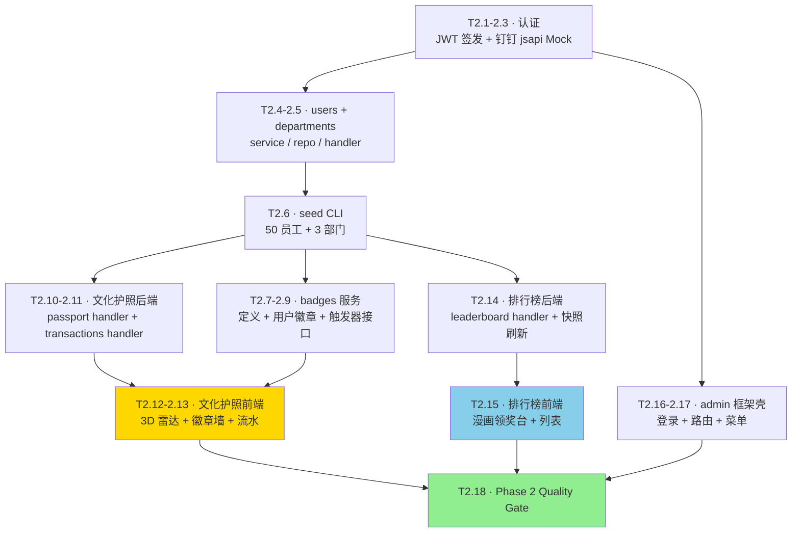

# Phase 2 · 员工 H5 双屏 + admin 框架 实现计划

> **面向 Agent 执行：** 必须使用 `superpowers:subagent-driven-development`（推荐）或 `superpowers:executing-plans` 逐任务执行。
>
> 前置：[Phase 1 · 骨架](2026-05-22-phase-1-骨架.md) 已完成（`phase-1-done` 标签）。
>
> 关联：[设计文档](../specs/2026-05-22-文化官-动漫风钉钉应用-design.md) · [总路线图](2026-05-22-总路线图.md)

**目标：** 交付员工 H5 的两个核心页面——文化护照（3D 雷达图 + 徽章墙 + 积分流水）与文化分排行榜（漫画领奖台 + 多视角切换）——以及 HR 后台框架壳。完成后员工端可登录、查个人画像、看排行；HR 端可登录、走完路由壳。

**架构概述：** 后端补 authn（钉钉 jsapi 免登 mock + JWT 签发）、users / departments / badges / leaderboard 模块。前端 packages/ui 新增 3D 雷达柱与 BadgeWall 等高视觉资产，apps/h5 落地 passport 与 leaderboard 页面。

**技术栈：** React 19 / @react-three/fiber / Framer Motion / GSAP / Lottie / Zustand · Go 1.23 / Gin / GORM / asynq

---

## 一、实现流程



---

## 二、Module A · 认证与基础用户

### Task 2.1 · `auth/dingtalk/login` 后端接口

**Files:**
- Create: `internal/auth/handler.go`
- Modify: `internal/router/router.go`
- Modify: `cmd/server/main.go`

- [ ] **步骤 1：`internal/auth/handler.go`**

```go
package auth

import (
	"time"

	"github.com/gin-gonic/gin"
	"gorm.io/gorm"

	"github.com/standardsoftware/culture_points_mall/internal/config"
	"github.com/standardsoftware/culture_points_mall/internal/platform/dingtalk"
)

type Handler struct {
	DB     *gorm.DB
	Cfg    *config.Config
	Signer *Signer
	Ding   dingtalk.Client
}

func NewHandler(db *gorm.DB, cfg *config.Config, ding dingtalk.Client) *Handler {
	return &Handler{
		DB:     db,
		Cfg:    cfg,
		Signer: &Signer{Secret: []byte(cfg.JWT.Secret), TTL: time.Duration(cfg.JWT.TTLHours) * time.Hour},
		Ding:   ding,
	}
}

func (h *Handler) Register(rg *gin.RouterGroup) {
	rg.POST("/auth/dingtalk/login", h.dingLogin)
	rg.POST("/auth/dev/login", h.devLogin) // 开发用，按 dingUserID 直接登录
}

type dingLoginReq struct {
	Code string `json:"code" binding:"required"`
}

type loginResp struct {
	Token    string `json:"token"`
	UserID   int64  `json:"userId"`
	TenantID int64  `json:"tenantId"`
	Name     string `json:"name"`
}

func (h *Handler) dingLogin(c *gin.Context) {
	var req dingLoginReq
	if err := c.ShouldBindJSON(&req); err != nil {
		c.JSON(400, gin.H{"error": err.Error()})
		return
	}
	user, err := h.Ding.GetUserByCode(c.Request.Context(), req.Code)
	if err != nil {
		c.JSON(401, gin.H{"error": err.Error()})
		return
	}
	tid := h.Cfg.Seed.DefaultTenantID
	userID, name, err := h.upsertUser(c, tid, user)
	if err != nil {
		c.JSON(500, gin.H{"error": err.Error()})
		return
	}
	tok, err := h.Signer.Issue(userID, tid, nil)
	if err != nil {
		c.JSON(500, gin.H{"error": err.Error()})
		return
	}
	c.JSON(200, loginResp{Token: tok, UserID: userID, TenantID: tid, Name: name})
}

type devLoginReq struct {
	UserID int64 `json:"userId" binding:"required"`
}

func (h *Handler) devLogin(c *gin.Context) {
	var req devLoginReq
	if err := c.ShouldBindJSON(&req); err != nil {
		c.JSON(400, gin.H{"error": err.Error()})
		return
	}
	tid := h.Cfg.Seed.DefaultTenantID
	var name string
	if err := h.DB.Raw("SELECT name FROM users WHERE id = ? AND tenant_id = ?", req.UserID, tid).Scan(&name).Error; err != nil {
		c.JSON(404, gin.H{"error": "user not found"})
		return
	}
	tok, _ := h.Signer.Issue(req.UserID, tid, nil)
	c.JSON(200, loginResp{Token: tok, UserID: req.UserID, TenantID: tid, Name: name})
}

func (h *Handler) upsertUser(c *gin.Context, tid int64, du dingtalk.User) (int64, string, error) {
	var existing struct {
		ID   int64
		Name string
	}
	err := h.DB.WithContext(c.Request.Context()).
		Raw("SELECT id, name FROM users WHERE tenant_id = ? AND ding_user_id = ? LIMIT 1", tid, du.DingUserID).
		Scan(&existing).Error
	if err == nil && existing.ID > 0 {
		return existing.ID, existing.Name, nil
	}
	res := h.DB.WithContext(c.Request.Context()).
		Exec("INSERT INTO users (tenant_id, ding_user_id, name, avatar_url) VALUES (?, ?, ?, ?)", tid, du.DingUserID, du.Name, du.AvatarURL)
	if res.Error != nil {
		return 0, "", res.Error
	}
	var id int64
	h.DB.WithContext(c.Request.Context()).
		Raw("SELECT LAST_INSERT_ID()").Scan(&id)
	return id, du.Name, nil
}
```

- [ ] **步骤 2：修改 `router.go` 把 auth handler 挂上**

```go
// internal/router/router.go 增加 deps.Ding 字段，并注册：
//   auth.NewHandler(deps.DB, deps.Cfg, deps.DingClient).Register(open)
```

具体：在 `Deps` 增加 `DingClient dingtalk.Client`；在 `Build` 中调用 `auth.NewHandler(deps.DB, deps.Cfg, deps.DingClient).Register(open)`。

- [ ] **步骤 3：修改 `main.go` 注入 dingtalk.Client**

```go
// 在 main.go 中：
// var ding dingtalk.Client = mock
// 然后传给 router.Deps{..., DingClient: ding}
```

- [ ] **步骤 4：smoke**

```bash
make up && sleep 8 && make migrate && make run &
sleep 2
curl -s -X POST http://localhost:8080/auth/dingtalk/login -d '{"code":"u001"}' -H 'Content-Type: application/json'
# 期望返回 {"token":"...","userId":1,"tenantId":1,"name":"Mock 用户 u001"}
kill %1
```

- [ ] **步骤 5：提交**

```bash
git add internal/auth/handler.go internal/router/router.go cmd/server/main.go
git commit -m "feat:新增钉钉 jsapi 免登与 JWT 签发接口"
```

---

### Task 2.2 · 前端 setupHttp + 钉钉 jsapi 免登（Mock 退化）

**Files:**
- Create: `apps/h5/src/auth/dingtalkLogin.ts`
- Create: `apps/h5/src/auth/AuthGate.tsx`
- Create: `apps/h5/src/store/auth.ts`
- Modify: `apps/h5/src/App.tsx`

- [ ] **步骤 1：`apps/h5/src/store/auth.ts`**

```typescript
import { create } from 'zustand';

interface AuthState {
  token: string | null;
  userId: number | null;
  tenantId: number | null;
  name: string | null;
  setSession: (t: string, uid: number, tid: number, name: string) => void;
  clear: () => void;
}

export const useAuth = create<AuthState>((set) => ({
  token: localStorage.getItem('cpm_jwt'),
  userId: Number(localStorage.getItem('cpm_uid') ?? '') || null,
  tenantId: Number(localStorage.getItem('cpm_tid') ?? '') || null,
  name: localStorage.getItem('cpm_name'),
  setSession(t, uid, tid, name) {
    localStorage.setItem('cpm_jwt', t);
    localStorage.setItem('cpm_uid', String(uid));
    localStorage.setItem('cpm_tid', String(tid));
    localStorage.setItem('cpm_name', name);
    set({ token: t, userId: uid, tenantId: tid, name });
  },
  clear() {
    localStorage.removeItem('cpm_jwt');
    localStorage.removeItem('cpm_uid');
    localStorage.removeItem('cpm_tid');
    localStorage.removeItem('cpm_name');
    set({ token: null, userId: null, tenantId: null, name: null });
  },
}));
```

- [ ] **步骤 2：`apps/h5/src/auth/dingtalkLogin.ts`**

```typescript
import dd from 'dingtalk-jsapi';
import axios from 'axios';

interface LoginResp { token: string; userId: number; tenantId: number; name: string }

export async function dingtalkLogin(): Promise<LoginResp> {
  let code: string;
  if (typeof window !== 'undefined' && (window as any).dd?.runtime) {
    code = await new Promise<string>((resolve, reject) => {
      dd.runtime.permission.requestAuthCode({
        corpId: import.meta.env.VITE_DING_CORP_ID ?? 'mock-corp',
        onSuccess: (info: any) => resolve(info.code),
        onFail: (err: any) => reject(err),
      });
    });
  } else {
    code = `dev-${Date.now()}`; // 浏览器开发模式
  }
  const { data } = await axios.post<LoginResp>('/auth/dingtalk/login', { code });
  return data;
}
```

- [ ] **步骤 3：`apps/h5/src/auth/AuthGate.tsx`**

```tsx
import { useEffect, type ReactNode } from 'react';
import { useAuth } from '../store/auth';
import { dingtalkLogin } from './dingtalkLogin';

export function AuthGate({ children }: { children: ReactNode }) {
  const { token, setSession } = useAuth();
  useEffect(() => {
    if (!token) {
      dingtalkLogin().then((r) => setSession(r.token, r.userId, r.tenantId, r.name)).catch(console.error);
    }
  }, [token, setSession]);

  if (!token) return <div className="p-6 font-kuaile">登录中...</div>;
  return <>{children}</>;
}
```

- [ ] **步骤 4：修改 `apps/h5/src/App.tsx` 包裹 AuthGate**

```tsx
import { AuthGate } from './auth/AuthGate';
import { AppRouter } from './router';

export function App() {
  return (
    <AuthGate>
      <AppRouter />
    </AuthGate>
  );
}
```

- [ ] **步骤 5：smoke**

```bash
cd /Users/standardsoftware/go/culture_points_mall_web
pnpm --filter @cpm/h5 dev
# 打开 http://localhost:5173，几秒后应能登录成功（浏览器开发模式走 dev 路径）
# 控制台无报错，localStorage 应有 cpm_jwt
```

- [ ] **步骤 6：提交**

```bash
git add apps/h5/src
git commit -m "feat:H5 接入钉钉 jsapi 免登与 JWT 持久化"
```

---

### Task 2.3 · admin 后台开发登录页

**Files:**
- Create: `apps/admin/src/auth/AdminLoginPage.tsx`
- Create: `apps/admin/src/auth/AdminAuthGate.tsx`
- Create: `apps/admin/src/store/auth.ts`
- Modify: `apps/admin/src/router.tsx`
- Modify: `apps/admin/src/App.tsx`

> admin 暂用「输入 userId 直接登录」的开发模式（调用 `/auth/dev/login`）。

- [ ] **步骤 1：`apps/admin/src/store/auth.ts`**（复用 H5 同款）

```typescript
import { create } from 'zustand';

interface AuthState {
  token: string | null;
  userId: number | null;
  tenantId: number | null;
  name: string | null;
  setSession: (t: string, uid: number, tid: number, name: string) => void;
  clear: () => void;
}

export const useAuth = create<AuthState>((set) => ({
  token: localStorage.getItem('cpm_admin_jwt'),
  userId: Number(localStorage.getItem('cpm_admin_uid') ?? '') || null,
  tenantId: Number(localStorage.getItem('cpm_admin_tid') ?? '') || null,
  name: localStorage.getItem('cpm_admin_name'),
  setSession(t, uid, tid, name) {
    localStorage.setItem('cpm_admin_jwt', t);
    localStorage.setItem('cpm_admin_uid', String(uid));
    localStorage.setItem('cpm_admin_tid', String(tid));
    localStorage.setItem('cpm_admin_name', name);
    set({ token: t, userId: uid, tenantId: tid, name });
  },
  clear() {
    ['cpm_admin_jwt', 'cpm_admin_uid', 'cpm_admin_tid', 'cpm_admin_name'].forEach((k) => localStorage.removeItem(k));
    set({ token: null, userId: null, tenantId: null, name: null });
  },
}));
```

- [ ] **步骤 2：`AdminLoginPage.tsx`**

```tsx
import { useState } from 'react';
import axios from 'axios';
import { Panel, ComicButton } from '@cpm/ui';
import { useAuth } from '../store/auth';

export function AdminLoginPage() {
  const [userId, setUserId] = useState('1');
  const [err, setErr] = useState<string | null>(null);
  const { setSession } = useAuth();

  const submit = async () => {
    try {
      const { data } = await axios.post<{ token: string; userId: number; tenantId: number; name: string }>(
        '/auth/dev/login',
        { userId: Number(userId) },
      );
      setSession(data.token, data.userId, data.tenantId, data.name);
      window.location.href = '/';
    } catch (e: any) {
      setErr(e?.response?.data?.error ?? String(e));
    }
  };

  return (
    <main className="min-h-screen bg-paper p-10 font-kuaile">
      <Panel shadow="yellow" style={{ maxWidth: 420, margin: '40px auto' }}>
        <h1 className="text-3xl font-qingke mb-4">HR 管理后台 · 开发登录</h1>
        <label className="block mb-3">
          User ID
          <input
            value={userId}
            onChange={(e) => setUserId(e.target.value)}
            className="block w-full mt-1 p-2 border-3 border-ink rounded-md"
          />
        </label>
        {err && <div className="text-cRed mb-2">{err}</div>}
        <ComicButton onClick={submit}>登录</ComicButton>
      </Panel>
    </main>
  );
}
```

- [ ] **步骤 3：`AdminAuthGate.tsx`**

```tsx
import type { ReactNode } from 'react';
import { Navigate, useLocation } from 'react-router-dom';
import { useAuth } from '../store/auth';

export function AdminAuthGate({ children }: { children: ReactNode }) {
  const { token } = useAuth();
  const loc = useLocation();
  if (!token && loc.pathname !== '/login') {
    return <Navigate to="/login" replace />;
  }
  return <>{children}</>;
}
```

- [ ] **步骤 4：修改 `router.tsx`**

```tsx
import { Routes, Route, Navigate } from 'react-router-dom';
import { AdminHomePage } from './pages/home/AdminHomePage';
import { AdminLoginPage } from './auth/AdminLoginPage';

export function AdminRouter() {
  return (
    <Routes>
      <Route path="/login" element={<AdminLoginPage />} />
      <Route path="/" element={<AdminHomePage />} />
      <Route path="/chat" element={<div>chat · Phase 3 实现</div>} />
      <Route path="/values" element={<div>values · 下个 Phase 实现</div>} />
      <Route path="/activities" element={<div>activities · Phase 3 实现</div>} />
      <Route path="/insights" element={<div>insights · 占位</div>} />
      <Route path="/mall" element={<div>mall · Phase 4 实现</div>} />
      <Route path="/dingtalk/mock-outbox" element={<div>钉钉模拟推送面板 · Phase 3 实现</div>} />
      <Route path="*" element={<Navigate to="/" replace />} />
    </Routes>
  );
}
```

- [ ] **步骤 5：修改 `App.tsx` 包 AdminAuthGate**

- [ ] **步骤 6：smoke + 提交**

```bash
pnpm --filter @cpm/admin dev   # 5174，未登录跳 /login
git add apps/admin/src
git commit -m "feat:admin 后台新增开发模式登录与守卫"
```

---

## 三、Module B · users / departments

### Task 2.4 · `users` 模块（最小读取）

**Files:**
- Create: `internal/modules/users/domain/user.go`
- Create: `internal/modules/users/repository/gorm_repo.go`
- Create: `internal/modules/users/service/service.go`
- Create: `internal/modules/users/handler/handler.go`

- [ ] **步骤 1：`domain/user.go`**

```go
package domain

import "time"

type User struct {
	ID         int64     `gorm:"primaryKey"`
	TenantID   int64     `gorm:"column:tenant_id"`
	DingUserID string    `gorm:"column:ding_user_id"`
	Name       string    `gorm:"column:name"`
	AvatarURL  string    `gorm:"column:avatar_url"`
	DeptID     *int64    `gorm:"column:dept_id"`
	CreatedAt  time.Time `gorm:"column:created_at"`
}

func (User) TableName() string { return "users" }

type Repository interface {
	GetByID(ctx interface{ TenantID() int64 }, id int64) (*User, error)
}
```

- [ ] **步骤 2：`repository/gorm_repo.go` 与 `service/service.go`**

```go
// repository
package repository

import (
	"context"

	"gorm.io/gorm"

	"github.com/standardsoftware/culture_points_mall/internal/modules/users/domain"
)

type GormRepo struct{ DB *gorm.DB }

func New(db *gorm.DB) *GormRepo { return &GormRepo{DB: db} }

func (r *GormRepo) GetByID(ctx context.Context, tenantID, id int64) (*domain.User, error) {
	var u domain.User
	if err := r.DB.WithContext(ctx).Where("tenant_id = ? AND id = ?", tenantID, id).First(&u).Error; err != nil {
		return nil, err
	}
	return &u, nil
}

func (r *GormRepo) ListByDept(ctx context.Context, tenantID int64, deptID int64) ([]domain.User, error) {
	var rows []domain.User
	err := r.DB.WithContext(ctx).Where("tenant_id = ? AND dept_id = ?", tenantID, deptID).Find(&rows).Error
	return rows, err
}
```

```go
// service
package service

import (
	"context"

	"github.com/standardsoftware/culture_points_mall/internal/modules/users/domain"
	"github.com/standardsoftware/culture_points_mall/internal/modules/users/repository"
)

type Service struct{ Repo *repository.GormRepo }

func New(r *repository.GormRepo) *Service { return &Service{Repo: r} }

func (s *Service) GetByID(ctx context.Context, tenantID, id int64) (*domain.User, error) {
	return s.Repo.GetByID(ctx, tenantID, id)
}
```

> 注：上面 `domain.Repository` 接口的写法简化，实际应该用 `context.Context` + `tenantID, id` 入参；我直接在 repository 上定义具体方法。

- [ ] **步骤 3：handler**

```go
package handler

import (
	"github.com/gin-gonic/gin"

	"github.com/standardsoftware/culture_points_mall/internal/modules/users/service"
	cpmctx "github.com/standardsoftware/culture_points_mall/internal/shared/ctx"
)

type Handler struct{ Svc *service.Service }

func New(svc *service.Service) *Handler { return &Handler{Svc: svc} }

func (h *Handler) Register(rg *gin.RouterGroup) {
	rg.GET("/api/v1/me", h.me)
}

func (h *Handler) me(c *gin.Context) {
	tid := cpmctx.TenantID(c.Request.Context())
	uid := cpmctx.UserID(c.Request.Context())
	u, err := h.Svc.GetByID(c.Request.Context(), tid, uid)
	if err != nil {
		c.JSON(404, gin.H{"error": err.Error()})
		return
	}
	c.JSON(200, gin.H{
		"id": u.ID, "name": u.Name, "avatarUrl": u.AvatarURL, "deptId": u.DeptID,
	})
}
```

- [ ] **步骤 4：router 注册（带 JWT 中间件）+ 提交**

```bash
# 修改 internal/router/router.go：
# usersh.New(usersvc.New(usersrepo.New(deps.DB))).Register(authed)
git add internal/modules/users/ internal/router/router.go
git commit -m "feat:users 模块新增最小查询服务"
```

---

### Task 2.5 · `departments` 模块（最小读取）

参考 Task 2.4 模式实现。

**Files:**
- Create: `internal/modules/departments/domain/department.go`
- Create: `internal/modules/departments/repository/gorm_repo.go`
- Create: `internal/modules/departments/service/service.go`

最小方法集：`List(ctx, tenantID)` / `GetByID(ctx, tenantID, id)`。

无 handler（仅服务于内部模块）。

- [ ] **步骤 1：定义 Department 实体**（与 users 模块对齐）

```go
package domain

type Department struct {
	ID       int64  `gorm:"primaryKey"`
	TenantID int64  `gorm:"column:tenant_id"`
	Name     string `gorm:"column:name"`
}

func (Department) TableName() string { return "departments" }
```

- [ ] **步骤 2-3：repository / service**（按 users 模式镜像）

- [ ] **步骤 4：提交**

```bash
git add internal/modules/departments/
git commit -m "feat:departments 模块新增基础查询服务"
```

---

### Task 2.6 · seed CLI 完整化（50 员工 + 3 部门 + 维度徽章）

**Files:**
- Modify: `cmd/migrate/main.go`
- Create: `internal/migrate/seed.go`

- [ ] **步骤 1：`internal/migrate/seed.go`**

```go
package migrate

import (
	"context"
	"fmt"

	"gorm.io/gorm"
)

type Seeder struct {
	DB              *gorm.DB
	DefaultTenantID int64
	DimensionsFile  string
}

func (s *Seeder) Run(ctx context.Context) error {
	if err := s.seedTenant(); err != nil {
		return err
	}
	if err := s.seedDepartments(); err != nil {
		return err
	}
	if err := s.seedUsers(); err != nil {
		return err
	}
	if err := s.seedBadges(); err != nil {
		return err
	}
	if err := s.seedMallItems(); err != nil {
		return err
	}
	if err := s.seedBlindboxPool(); err != nil {
		return err
	}
	return nil
}

func (s *Seeder) seedTenant() error {
	return s.DB.Exec(`INSERT IGNORE INTO tenants (id, name) VALUES (?, ?)`, s.DefaultTenantID, "示范企业").Error
}

func (s *Seeder) seedDepartments() error {
	if cnt := s.count("departments", s.DefaultTenantID); cnt >= 3 {
		return nil
	}
	names := []string{"销售部", "研发部", "客服部"}
	for _, n := range names {
		if err := s.DB.Exec(`INSERT INTO departments (tenant_id, name) VALUES (?, ?)`, s.DefaultTenantID, n).Error; err != nil {
			return err
		}
	}
	return nil
}

func (s *Seeder) seedUsers() error {
	if cnt := s.count("users", s.DefaultTenantID); cnt >= 50 {
		return nil
	}
	for i := 1; i <= 50; i++ {
		dept := ((i - 1) % 3) + 1
		err := s.DB.Exec(
			`INSERT INTO users (tenant_id, ding_user_id, name, avatar_url, dept_id) VALUES (?, ?, ?, ?, ?)`,
			s.DefaultTenantID,
			fmt.Sprintf("u%03d", i),
			fmt.Sprintf("员工%02d", i),
			fmt.Sprintf("https://api.dicebear.com/9.x/notionists/svg?seed=user-%03d", i),
			dept,
		).Error
		if err != nil {
			return err
		}
	}
	return nil
}

func (s *Seeder) seedBadges() error {
	if cnt := s.count("badges", s.DefaultTenantID); cnt > 0 {
		return nil
	}
	type pair struct {
		code   string
		name   string
		rarity string
		thresh int
	}
	codes := []string{"customer_first", "team_collab", "innovation", "integrity", "craftsmanship", "growth"}
	tiers := []pair{
		{"", "微光", "common", 10},
		{"", "进阶", "rare", 50},
		{"", "卓越", "epic", 150},
		{"", "传奇", "legendary", 300},
	}
	for _, code := range codes {
		var dimID int64
		s.DB.Raw(`SELECT id FROM value_dimensions WHERE tenant_id = ? AND code = ?`, s.DefaultTenantID, code).Scan(&dimID)
		if dimID == 0 {
			continue
		}
		for _, t := range tiers {
			rule := fmt.Sprintf(`{"type":"accumulated","dimension":"%s","threshold":%d}`, code, t.thresh)
			err := s.DB.Exec(
				`INSERT INTO badges (tenant_id, dimension_id, name, rarity, rule_json, icon_url) VALUES (?, ?, ?, ?, ?, ?)`,
				s.DefaultTenantID, dimID,
				fmt.Sprintf("%s · %s", code, t.name),
				t.rarity, rule,
				fmt.Sprintf("https://api.dicebear.com/9.x/shapes/svg?seed=badge-%s-%s", code, t.rarity),
			).Error
			if err != nil {
				return err
			}
		}
	}
	return nil
}

func (s *Seeder) seedMallItems() error {
	if cnt := s.count("mall_items", s.DefaultTenantID); cnt > 0 {
		return nil
	}
	rows := []struct {
		typ  string
		name string
		cost int
		stock *int
	}{
		{"item", "周边帆布袋", 50, intPtr(100)},
		{"item", "公司定制 T 恤", 120, intPtr(50)},
		{"item", "咖啡券", 30, intPtr(200)},
		{"blindbox", "AI 文化盲盒 · 普通", 80, nil},
		{"blindbox", "AI 文化盲盒 · 闪光", 200, nil},
	}
	for _, r := range rows {
		stock := any(nil)
		if r.stock != nil {
			stock = *r.stock
		}
		err := s.DB.Exec(
			`INSERT INTO mall_items (tenant_id, type, name, cost, stock, image_url) VALUES (?, ?, ?, ?, ?, ?)`,
			s.DefaultTenantID, r.typ, r.name, r.cost, stock,
			fmt.Sprintf("https://api.dicebear.com/9.x/shapes/svg?seed=item-%s", r.name),
		).Error
		if err != nil {
			return err
		}
	}
	return nil
}

func (s *Seeder) seedBlindboxPool() error {
	var boxIDs []int64
	s.DB.Raw(`SELECT id FROM mall_items WHERE tenant_id = ? AND type = 'blindbox'`, s.DefaultTenantID).Scan(&boxIDs)
	for _, boxID := range boxIDs {
		var cnt int64
		s.DB.Raw(`SELECT COUNT(*) FROM mall_blindbox_pool WHERE box_item_id = ?`, boxID).Scan(&cnt)
		if cnt > 0 {
			continue
		}
		prizes := []struct {
			name   string
			weight int
		}{
			{"无中奖（鼓励气泡）", 60},
			{"咖啡券", 25},
			{"帆布袋", 10},
			{"公司定制 T 恤", 5},
		}
		for _, p := range prizes {
			err := s.DB.Exec(
				`INSERT INTO mall_blindbox_pool (box_item_id, prize_name, prize_image, weight) VALUES (?, ?, ?, ?)`,
				boxID, p.name, fmt.Sprintf("https://api.dicebear.com/9.x/shapes/svg?seed=prize-%s", p.name), p.weight,
			).Error
			if err != nil {
				return err
			}
		}
	}
	return nil
}

func (s *Seeder) count(table string, tenantID int64) int64 {
	var c int64
	s.DB.Raw(fmt.Sprintf("SELECT COUNT(*) FROM %s WHERE tenant_id = ?", table), tenantID).Scan(&c)
	return c
}

func intPtr(v int) *int { return &v }
```

- [ ] **步骤 2：修改 `cmd/migrate/main.go` 接入 seeder**

```go
// 在 main() 中 case "seed":
seeder := &migrate.Seeder{DB: db, DefaultTenantID: cfg.Seed.DefaultTenantID}
if err := seeder.Run(context.Background()); err != nil {
	log.Fatalf("seed: %v", err)
}
log.Println("seed done")
```

并 import `context` 与 seeder。

- [ ] **步骤 3：执行 seed**

```bash
make migrate
go run ./cmd/migrate -action=seed
docker exec cpm-mysql mysql -uroot -proot -D cpm -e "SELECT COUNT(*) FROM users"   # 期望 50
docker exec cpm-mysql mysql -uroot -proot -D cpm -e "SELECT COUNT(*) FROM badges"  # 期望 24（6 维度 × 4 阶）
```

- [ ] **步骤 4：提交**

```bash
git add internal/migrate/seed.go cmd/migrate/main.go
git commit -m "feat:补全 seed CLI，灌入 50 员工/3 部门/徽章池/商品池/盲盒池"
```

---

## 四、Module C · 徽章服务

### Task 2.7 · `achievements/domain` 实体与触发器接口

**Files:**
- Create: `internal/modules/achievements/domain/badge.go`
- Create: `internal/modules/achievements/domain/repository.go`

- [ ] **步骤 1：`badge.go`**

```go
package domain

import "encoding/json"

type Rarity string

const (
	RarityCommon    Rarity = "common"
	RarityRare      Rarity = "rare"
	RarityEpic      Rarity = "epic"
	RarityLegendary Rarity = "legendary"
)

type Badge struct {
	ID          int64           `gorm:"primaryKey"`
	TenantID    int64           `gorm:"column:tenant_id"`
	DimensionID int64           `gorm:"column:dimension_id"`
	Name        string          `gorm:"column:name"`
	Rarity      Rarity          `gorm:"column:rarity"`
	RuleJSON    json.RawMessage `gorm:"column:rule_json"`
	IconURL     string          `gorm:"column:icon_url"`
}

func (Badge) TableName() string { return "badges" }

type UserBadge struct {
	UserID   int64 `gorm:"primaryKey;column:user_id"`
	BadgeID  int64 `gorm:"primaryKey;column:badge_id"`
	EarnedAt string `gorm:"column:earned_at"`
}

func (UserBadge) TableName() string { return "user_badges" }

type Rule struct {
	Type      string `json:"type"`      // accumulated | first_time | streak
	Dimension string `json:"dimension"` // dimension code
	Threshold int    `json:"threshold"`
}
```

- [ ] **步骤 2：`repository.go`**

```go
package domain

import "context"

type Repository interface {
	ListBadges(ctx context.Context, tenantID int64) ([]Badge, error)
	ListUserBadgeIDs(ctx context.Context, userID int64) ([]int64, error)
	AwardBadge(ctx context.Context, userID, badgeID int64) error
}
```

- [ ] **步骤 3：提交**

```bash
git add internal/modules/achievements/domain/
git commit -m "feat:achievements 模块新增徽章实体与触发规则结构"
```

---

### Task 2.8 · `achievements/repository` + `service`

**Files:**
- Create: `internal/modules/achievements/repository/gorm_repo.go`
- Create: `internal/modules/achievements/service/service.go`

- [ ] **步骤 1：`gorm_repo.go`**

```go
package repository

import (
	"context"

	"gorm.io/gorm"

	"github.com/standardsoftware/culture_points_mall/internal/modules/achievements/domain"
)

type GormRepo struct{ DB *gorm.DB }

func New(db *gorm.DB) *GormRepo { return &GormRepo{DB: db} }

func (r *GormRepo) ListBadges(ctx context.Context, tenantID int64) ([]domain.Badge, error) {
	var rows []domain.Badge
	err := r.DB.WithContext(ctx).Where("tenant_id = ?", tenantID).Find(&rows).Error
	return rows, err
}

func (r *GormRepo) ListUserBadgeIDs(ctx context.Context, userID int64) ([]int64, error) {
	var ids []int64
	err := r.DB.WithContext(ctx).
		Table("user_badges").Select("badge_id").
		Where("user_id = ?", userID).Scan(&ids).Error
	return ids, err
}

func (r *GormRepo) AwardBadge(ctx context.Context, userID, badgeID int64) error {
	return r.DB.WithContext(ctx).Exec(
		`INSERT IGNORE INTO user_badges (user_id, badge_id) VALUES (?, ?)`,
		userID, badgeID,
	).Error
}
```

- [ ] **步骤 2：`service.go`**

```go
package service

import (
	"context"
	"encoding/json"

	"github.com/standardsoftware/culture_points_mall/internal/modules/achievements/domain"
	pointssvc "github.com/standardsoftware/culture_points_mall/internal/modules/points/service"
	valuessvc "github.com/standardsoftware/culture_points_mall/internal/modules/values/service"
)

type Service struct {
	Repo   *Wrap
	Points *pointssvc.Service
	Values *valuessvc.Service
}

type Wrap struct{ Inner interface {
	ListBadges(ctx context.Context, tenantID int64) ([]domain.Badge, error)
	ListUserBadgeIDs(ctx context.Context, userID int64) ([]int64, error)
	AwardBadge(ctx context.Context, userID, badgeID int64) error
} }

func New(repo *Wrap, points *pointssvc.Service, values *valuessvc.Service) *Service {
	return &Service{Repo: repo, Points: points, Values: values}
}

// CheckTriggers: 在 points 入账后被调用，检查是否有新徽章可颁。返回新颁徽章 IDs。
func (s *Service) CheckTriggers(ctx context.Context, tenantID, userID, dimensionID int64) ([]int64, error) {
	badges, err := s.Repo.Inner.ListBadges(ctx, tenantID)
	if err != nil {
		return nil, err
	}
	owned, err := s.Repo.Inner.ListUserBadgeIDs(ctx, userID)
	if err != nil {
		return nil, err
	}
	ownedSet := make(map[int64]bool, len(owned))
	for _, id := range owned {
		ownedSet[id] = true
	}

	scores, _, _, err := s.Points.GetUserScores(ctx, tenantID, userID)
	if err != nil {
		return nil, err
	}
	scoreByDim := make(map[int64]int, len(scores))
	for _, sc := range scores {
		scoreByDim[sc.DimensionID] = sc.TotalScore
	}

	var newly []int64
	for _, b := range badges {
		if ownedSet[b.ID] {
			continue
		}
		if b.DimensionID != dimensionID {
			continue
		}
		var rule domain.Rule
		if err := json.Unmarshal(b.RuleJSON, &rule); err != nil {
			continue
		}
		if rule.Type == "accumulated" && scoreByDim[b.DimensionID] >= rule.Threshold {
			if err := s.Repo.Inner.AwardBadge(ctx, userID, b.ID); err != nil {
				return nil, err
			}
			newly = append(newly, b.ID)
		}
	}
	return newly, nil
}

func (s *Service) ListMyBadges(ctx context.Context, tenantID, userID int64) ([]domain.Badge, map[int64]bool, error) {
	all, err := s.Repo.Inner.ListBadges(ctx, tenantID)
	if err != nil {
		return nil, nil, err
	}
	ids, err := s.Repo.Inner.ListUserBadgeIDs(ctx, userID)
	if err != nil {
		return nil, nil, err
	}
	owned := make(map[int64]bool, len(ids))
	for _, id := range ids {
		owned[id] = true
	}
	return all, owned, nil
}
```

> 注：Wrap 包装是为了避免 service 直接依赖 repository 子包导致循环 import。简化版可以直接传 repo 实例。

- [ ] **步骤 3：提交**

```bash
git add internal/modules/achievements/repository/ internal/modules/achievements/service/
git commit -m "feat:achievements 模块新增 service 与触发检查"
```

---

### Task 2.9 · `achievements/handler` GET /api/v1/me/badges

**Files:**
- Create: `internal/modules/achievements/handler/handler.go`

- [ ] **步骤 1：`handler.go`**

```go
package handler

import (
	"github.com/gin-gonic/gin"

	"github.com/standardsoftware/culture_points_mall/internal/modules/achievements/service"
	cpmctx "github.com/standardsoftware/culture_points_mall/internal/shared/ctx"
)

type Handler struct{ Svc *service.Service }

func New(s *service.Service) *Handler { return &Handler{Svc: s} }

func (h *Handler) Register(rg *gin.RouterGroup) {
	rg.GET("/api/v1/me/badges", h.list)
}

type badgeItem struct {
	ID          int64  `json:"id"`
	DimensionID int64  `json:"dimensionId"`
	Name        string `json:"name"`
	Rarity      string `json:"rarity"`
	IconURL     string `json:"iconUrl"`
	Earned      bool   `json:"earned"`
}

func (h *Handler) list(c *gin.Context) {
	tid := cpmctx.TenantID(c.Request.Context())
	uid := cpmctx.UserID(c.Request.Context())
	badges, owned, err := h.Svc.ListMyBadges(c.Request.Context(), tid, uid)
	if err != nil {
		c.JSON(500, gin.H{"error": err.Error()})
		return
	}
	out := make([]badgeItem, 0, len(badges))
	for _, b := range badges {
		out = append(out, badgeItem{
			ID: b.ID, DimensionID: b.DimensionID, Name: b.Name,
			Rarity: string(b.Rarity), IconURL: b.IconURL, Earned: owned[b.ID],
		})
	}
	c.JSON(200, gin.H{"items": out})
}
```

- [ ] **步骤 2：router 注册 + 提交**

```bash
# router.go 中：achvh.New(achvsvc).Register(authed)
git add internal/modules/achievements/handler/ internal/router/router.go
git commit -m "feat:achievements 新增徽章查询 HTTP handler"
```

---

## 五、Module D · 文化护照后端

### Task 2.10 · `passport` 聚合 handler

> Passport 复用已有 points / values / achievements 服务，仅在 router 层增加聚合 handler。

**Files:**
- Create: `internal/modules/passport/handler/handler.go`

- [ ] **步骤 1：`handler.go`**

```go
package handler

import (
	"github.com/gin-gonic/gin"

	pointssvc "github.com/standardsoftware/culture_points_mall/internal/modules/points/service"
	achvsvc "github.com/standardsoftware/culture_points_mall/internal/modules/achievements/service"
	cpmctx "github.com/standardsoftware/culture_points_mall/internal/shared/ctx"
)

type Handler struct {
	Points *pointssvc.Service
	Achv   *achvsvc.Service
}

func New(p *pointssvc.Service, a *achvsvc.Service) *Handler { return &Handler{Points: p, Achv: a} }

func (h *Handler) Register(rg *gin.RouterGroup) {
	rg.GET("/api/v1/me/passport", h.summary)
}

func (h *Handler) summary(c *gin.Context) {
	tid := cpmctx.TenantID(c.Request.Context())
	uid := cpmctx.UserID(c.Request.Context())

	scores, dims, total, err := h.Points.GetUserScores(c.Request.Context(), tid, uid)
	if err != nil {
		c.JSON(500, gin.H{"error": err.Error()})
		return
	}
	badges, owned, err := h.Achv.ListMyBadges(c.Request.Context(), tid, uid)
	if err != nil {
		c.JSON(500, gin.H{"error": err.Error()})
		return
	}
	badgeCount := 0
	for _, b := range badges {
		if owned[b.ID] {
			badgeCount++
		}
	}

	type dimResp struct {
		DimensionID   int64  `json:"dimensionId"`
		DimensionCode string `json:"dimensionCode"`
		DimensionName string `json:"dimensionName"`
		TotalScore    int    `json:"totalScore"`
		QuarterScore  int    `json:"quarterScore"`
		YearScore     int    `json:"yearScore"`
	}
	dimByID := make(map[int64]struct {
		Code, Name string
	}, len(dims))
	for _, d := range dims {
		dimByID[d.ID] = struct{ Code, Name string }{d.Code, d.Name}
	}
	out := make([]dimResp, 0, len(dims))
	for _, d := range dims {
		var ds dimResp
		ds.DimensionID = d.ID
		ds.DimensionCode = d.Code
		ds.DimensionName = d.Name
		for _, s := range scores {
			if s.DimensionID == d.ID {
				ds.TotalScore = s.TotalScore
				ds.QuarterScore = s.QuarterScore
				ds.YearScore = s.YearScore
				break
			}
		}
		out = append(out, ds)
	}
	c.JSON(200, gin.H{
		"totalScore":         total,
		"scoresByDimension":  out,
		"badgeCount":         badgeCount,
		"dimensions":         dims,
	})
}
```

- [ ] **步骤 2：router 注册**

```go
// internal/router/router.go 加：
// passporth.New(pointsSvc, achvSvc).Register(authed)
```

- [ ] **步骤 3：smoke**

```bash
make run &
sleep 2
# 先登录拿 token
TOKEN=$(curl -s -X POST http://localhost:8080/auth/dev/login -d '{"userId":1}' -H 'Content-Type: application/json' | python3 -c 'import sys,json;print(json.load(sys.stdin)["token"])')
# 给员工 1 加点分让数据非空
mysql_cmd() { docker exec cpm-mysql mysql -uroot -proot -D cpm "$@"; }
# 用 API 调用 add_points 还没暴露，先直接 SQL 灌入测试数据
mysql_cmd -e "INSERT INTO point_transactions (tenant_id, user_id, dimension_id, amount, reason) VALUES (1, 1, 1, 12, '客户走访');"
mysql_cmd -e "INSERT INTO user_dimension_scores (user_id, tenant_id, dimension_id, total_score, quarter_score, year_score) VALUES (1, 1, 1, 12, 12, 12) ON DUPLICATE KEY UPDATE total_score = 12;"
curl -s -H "Authorization: Bearer $TOKEN" http://localhost:8080/api/v1/me/passport | python3 -m json.tool
kill %1
```

期望返回 totalScore: 12 与 scoresByDimension 列表。

- [ ] **步骤 4：提交**

```bash
git add internal/modules/passport/ internal/router/router.go
git commit -m "feat:新增文化护照聚合接口"
```

---

### Task 2.11 · `points/handler` 流水接口完整化

> Task 1.23 已建空骨架，本任务补全字段（含 dimensionCode）。

- [ ] **步骤 1：修改 `internal/modules/points/handler/handler.go`** 添加 dimensionCode 字段

```go
// 在 listMyTx 中 join values_dimensions 查 code，或先一次性 load 维度 map：
// dims, _ := h.Values.GetDimensions(ctx, tid)
// dimCodeByID := map[int64]string{...}
// 输出 item.DimensionCode = dimCodeByID[r.DimensionID]
```

具体修改要点：
- handler 持有 `Values *valuessvc.Service`
- 输出结构增加 `DimensionCode string \`json:"dimensionCode"\``

- [ ] **步骤 2：smoke + 提交**

```bash
curl -s -H "Authorization: Bearer $TOKEN" "http://localhost:8080/api/v1/me/transactions?limit=10" | python3 -m json.tool
git add internal/modules/points/handler/
git commit -m "feat:积分流水接口补充 dimensionCode 字段"
```

---

## 六、Module E · 文化护照前端

### Task 2.12 · `RadarChart3D` 6 棱水晶柱组件

**Files:**
- Create: `packages/ui/src/components/RadarChart3D.tsx`
- Create: `packages/ui/src/components/RadarChart2D.tsx`
- Create: `packages/ui/src/components/RadarChart3D.stories.tsx`

- [ ] **步骤 1：`RadarChart3D.tsx`**

```tsx
import { Canvas, useFrame } from '@react-three/fiber';
import { MeshTransmissionMaterial, OrbitControls } from '@react-three/drei';
import { useMemo, useRef } from 'react';
import type { Mesh } from 'three';
import * as THREE from 'three';

export interface RadarDimension {
  code: string;
  name: string;
  score: number;
  max: number;
  color: string;
}

export interface RadarChart3DProps {
  data: RadarDimension[];
  size?: number;
}

function Crystal({ dim, idx, total }: { dim: RadarDimension; idx: number; total: number }) {
  const ref = useRef<Mesh>(null);
  const angle = (idx / total) * Math.PI * 2;
  const radius = 1.3;
  const x = Math.cos(angle) * radius;
  const z = Math.sin(angle) * radius;
  const height = Math.max(0.4, Math.min(dim.score / dim.max, 1) * 2.2);

  useFrame((_, dt) => {
    if (ref.current) ref.current.rotation.y += dt * 0.4;
  });

  return (
    <group position={[x, height / 2 - 1, z]}>
      <mesh ref={ref}>
        <cylinderGeometry args={[0.22, 0.28, height, 6]} />
        <MeshTransmissionMaterial color={dim.color} thickness={0.8} ior={1.4} roughness={0.05} transmission={0.95} />
      </mesh>
    </group>
  );
}

function Center({ total }: { total: number }) {
  const intensity = Math.min(total / 600, 1) * 1.5 + 0.4;
  return (
    <pointLight position={[0, 0.5, 0]} intensity={intensity} color="#ffd93d" distance={6} />
  );
}

export function RadarChart3D({ data, size = 320 }: RadarChart3DProps) {
  const totalScore = useMemo(() => data.reduce((s, d) => s + d.score, 0), [data]);
  return (
    <div style={{ width: size, height: size }}>
      <Canvas camera={{ position: [0, 1.8, 4], fov: 50 }}>
        <ambientLight intensity={0.7} />
        <Center total={totalScore} />
        {data.map((d, i) => (
          <Crystal key={d.code} dim={d} idx={i} total={data.length} />
        ))}
        <mesh rotation={[-Math.PI / 2, 0, 0]} position={[0, -1, 0]}>
          <circleGeometry args={[2.0, 32]} />
          <meshStandardMaterial color="#fffef8" opacity={0.4} transparent />
        </mesh>
        <OrbitControls enableZoom={false} enablePan={false} autoRotate autoRotateSpeed={0.4} />
      </Canvas>
    </div>
  );
}

const _t = THREE; // 显式使用避免 import 修剪
```

- [ ] **步骤 2：`RadarChart2D.tsx`** 降级实现

```tsx
import { motion } from 'framer-motion';

export interface RadarChart2DProps {
  data: { code: string; name: string; score: number; max: number; color: string }[];
  size?: number;
}

export function RadarChart2D({ data, size = 320 }: RadarChart2DProps) {
  const cx = size / 2;
  const cy = size / 2;
  const r = size * 0.4;
  const n = data.length;
  const points = data.map((d, i) => {
    const angle = (-Math.PI / 2) + (i / n) * Math.PI * 2;
    const ratio = Math.min(d.score / d.max, 1);
    return {
      x: cx + Math.cos(angle) * r * ratio,
      y: cy + Math.sin(angle) * r * ratio,
      ax: cx + Math.cos(angle) * r,
      ay: cy + Math.sin(angle) * r,
      color: d.color,
      name: d.name,
    };
  });
  const path = points.map((p, i) => `${i === 0 ? 'M' : 'L'} ${p.x},${p.y}`).join(' ') + ' Z';

  return (
    <svg width={size} height={size}>
      {[0.25, 0.5, 0.75, 1].map((ratio) => (
        <polygon
          key={ratio}
          points={points.map((p) => `${cx + (p.ax - cx) * ratio},${cy + (p.ay - cy) * ratio}`).join(' ')}
          fill="none"
          stroke="rgba(0,0,0,0.1)"
          strokeWidth={2}
        />
      ))}
      {points.map((p) => (
        <line key={p.name} x1={cx} y1={cy} x2={p.ax} y2={p.ay} stroke="rgba(0,0,0,0.2)" />
      ))}
      <motion.path
        d={path}
        fill="rgba(255,217,61,0.35)"
        stroke="#ffd93d"
        strokeWidth={3}
        initial={{ opacity: 0 }}
        animate={{ opacity: 1 }}
        transition={{ duration: 0.6 }}
      />
      {points.map((p) => (
        <g key={p.name + 'l'}>
          <circle cx={p.x} cy={p.y} r={5} fill={p.color} stroke="#1a1a1a" strokeWidth={2} />
          <text x={p.ax} y={p.ay} fontSize={12} textAnchor="middle" dominantBaseline="middle" fontFamily="ZCOOL KuaiLe">
            {p.name}
          </text>
        </g>
      ))}
    </svg>
  );
}
```

- [ ] **步骤 3：story 文件**

```tsx
import type { Meta, StoryObj } from '@storybook/react';
import { RadarChart3D } from './RadarChart3D';

const data = [
  { code: 'customer_first', name: '客户至上', score: 80, max: 200, color: '#ff9f43' },
  { code: 'team_collab', name: '团队协作', score: 120, max: 200, color: '#4facfe' },
  { code: 'innovation', name: '创新求变', score: 60, max: 200, color: '#ff7eb3' },
  { code: 'integrity', name: '诚信务实', score: 150, max: 200, color: '#6dd5a3' },
  { code: 'craftsmanship', name: '极致专注', score: 95, max: 200, color: '#a55eea' },
  { code: 'growth', name: '学习成长', score: 175, max: 200, color: '#ffd93d' },
];

const meta: Meta<typeof RadarChart3D> = { title: 'Components/RadarChart3D', component: RadarChart3D };
export default meta;
type Story = StoryObj<typeof RadarChart3D>;

export const Demo: Story = { render: () => <RadarChart3D data={data} /> };
```

- [ ] **步骤 4：导出 + Storybook 验证**

```typescript
// packages/ui/src/components/index.ts
export * from './ComicButton';
export * from './DimChip';
export * from './RadarChart3D';
export * from './RadarChart2D';
```

```bash
pnpm --filter @cpm/ui storybook
# http://localhost:6006 应能看到 3D 雷达
```

- [ ] **步骤 5：提交**

```bash
git add packages/ui/src/components/
git commit -m "feat:UI 系统新增 3D 雷达水晶柱与 2D 降级实现"
```

---

### Task 2.13 · `BadgeWall` + `PassportPage`

**Files:**
- Create: `packages/ui/src/components/BadgeWall.tsx`
- Create: `apps/h5/src/pages/passport/PassportPage.tsx`
- Create: `apps/h5/src/pages/passport/PassportRadar.tsx`
- Create: `apps/h5/src/pages/passport/PassportTransactions.tsx`
- Modify: `apps/h5/src/router.tsx`

- [ ] **步骤 1：`BadgeWall.tsx`**

```tsx
import { motion } from 'framer-motion';

export interface BadgeItem {
  id: number;
  name: string;
  rarity: 'common' | 'rare' | 'epic' | 'legendary';
  iconUrl: string;
  earned: boolean;
}

const rarityGlow: Record<BadgeItem['rarity'], string> = {
  common: 'shadow-[2px_2px_0_var(--cpm-ink)]',
  rare: 'shadow-[3px_3px_0_var(--cpm-blue)]',
  epic: 'shadow-[4px_4px_0_var(--cpm-purple)]',
  legendary: 'shadow-[5px_5px_0_var(--cpm-yellow)]',
};

export function BadgeWall({ items }: { items: BadgeItem[] }) {
  return (
    <div className="grid grid-cols-4 gap-3 p-2">
      {items.map((b, i) => (
        <motion.div
          key={b.id}
          initial={{ rotateY: 180, opacity: 0 }}
          animate={{ rotateY: 0, opacity: 1 }}
          transition={{ delay: i * 0.04, type: 'spring', stiffness: 120 }}
          className={`rounded-xl border-3 border-ink bg-paper p-2 flex flex-col items-center text-center ${rarityGlow[b.rarity]}`}
          style={{ filter: b.earned ? 'none' : 'grayscale(1) opacity(0.5)' }}
        >
          
          <div className="text-xs font-kuaile mt-1">{b.name}</div>
        </motion.div>
      ))}
    </div>
  );
}
```

- [ ] **步骤 2：`PassportRadar.tsx`**

```tsx
import { RadarChart3D, RadarChart2D } from '@cpm/ui';
import { useMemo } from 'react';

export interface PassportRadarProps {
  scoresByDimension: { dimensionId: number; dimensionCode: string; dimensionName: string; totalScore: number }[];
}

const isLowEndDevice = () => {
  const mem = (navigator as any).deviceMemory ?? 8;
  return mem <= 4;
};

const colorByCode: Record<string, string> = {
  customer_first: '#ff9f43',
  team_collab: '#4facfe',
  innovation: '#ff7eb3',
  integrity: '#6dd5a3',
  craftsmanship: '#a55eea',
  growth: '#ffd93d',
};

export function PassportRadar({ scoresByDimension }: PassportRadarProps) {
  const data = useMemo(
    () => scoresByDimension.map((s) => ({
      code: s.dimensionCode,
      name: s.dimensionName,
      score: s.totalScore,
      max: 200,
      color: colorByCode[s.dimensionCode] ?? '#1a1a1a',
    })),
    [scoresByDimension],
  );
  const low = isLowEndDevice();
  return low ? <RadarChart2D data={data} /> : <RadarChart3D data={data} />;
}
```

- [ ] **步骤 3：`PassportTransactions.tsx`**

```tsx
import { useMyTransactions } from '@cpm/api-client';
import { motion } from 'framer-motion';

const colorByDim: Record<string, string> = {
  customer_first: '#ff9f43',
  team_collab: '#4facfe',
  innovation: '#ff7eb3',
  integrity: '#6dd5a3',
  craftsmanship: '#a55eea',
  growth: '#ffd93d',
};

export function PassportTransactions() {
  const q = useMyTransactions(20);
  const items = (q.data?.pages ?? []).flatMap((p) => p.items);
  return (
    <div className="space-y-2 p-2">
      {items.map((t, i) => (
        <motion.div
          key={t.id}
          initial={{ x: 80, opacity: 0 }}
          animate={{ x: 0, opacity: 1 }}
          transition={{ delay: Math.min(i, 10) * 0.04 }}
          className="flex items-center gap-3 border-3 border-ink rounded-xl bg-paper p-3 shadow-[4px_4px_0_var(--cpm-ink)]"
        >
          <span
            className="inline-block w-3 h-12 rounded"
            style={{ background: colorByDim[(t as any).dimensionCode] ?? '#1a1a1a' }}
          />
          <div className="flex-1">
            <div className="font-kuaile text-base">{t.reason || '加分'}</div>
            <div className="text-xs text-ink/60">{t.createdAt}</div>
          </div>
          <div
            className="font-bangers text-2xl"
            style={{ color: t.amount > 0 ? 'var(--cpm-green)' : 'var(--cpm-red)' }}
          >
            {t.amount > 0 ? `+${t.amount}` : t.amount}
          </div>
        </motion.div>
      ))}
      {items.length === 0 && <div className="text-center text-ink/50 py-10 font-kuaile">还没有积分流水</div>}
    </div>
  );
}
```

- [ ] **步骤 4：`PassportPage.tsx`**

```tsx
import { useState } from 'react';
import { usePassport, useMyBadges } from '@cpm/api-client';
import { Panel, Shout, Halftone, ComicButton } from '@cpm/ui';
import { PassportRadar } from './PassportRadar';
import { PassportTransactions } from './PassportTransactions';
import { BadgeWall } from '@cpm/ui';

type View = 'radar' | 'badges' | 'tx';

export function PassportPage() {
  const [view, setView] = useState<View>('radar');
  const p = usePassport();
  const b = useMyBadges();

  if (p.isLoading) return <div className="p-6 font-kuaile">加载中...</div>;
  if (p.error) return <div className="p-6 font-kuaile text-cRed">{String(p.error)}</div>;

  return (
    <Halftone className="min-h-screen pb-20">
      <div className="p-4">
        <Panel shadow="yellow">
          <Shout tone="red" rotation={-2}>我的文化护照</Shout>
          <div className="flex items-baseline gap-3 mt-3">
            <div className="text-5xl font-bangers text-cRed" style={{ WebkitTextStroke: '2px var(--cpm-ink)' }}>
              {p.data?.totalScore ?? 0}
            </div>
            <div className="font-kuaile">总积分 · 获得 {p.data?.badgeCount ?? 0} 枚徽章</div>
          </div>
        </Panel>

        <div className="flex gap-2 mt-4">
          <ComicButton tone={view === 'radar' ? 'red' : 'yellow'} size="sm" onClick={() => setView('radar')}>
            雷达
          </ComicButton>
          <ComicButton tone={view === 'badges' ? 'red' : 'yellow'} size="sm" onClick={() => setView('badges')}>
            徽章墙
          </ComicButton>
          <ComicButton tone={view === 'tx' ? 'red' : 'yellow'} size="sm" onClick={() => setView('tx')}>
            积分流水
          </ComicButton>
        </div>

        <div className="mt-4">
          {view === 'radar' && p.data && (
            <Panel><PassportRadar scoresByDimension={p.data.scoresByDimension} /></Panel>
          )}
          {view === 'badges' && b.data && <Panel shadow="pink"><BadgeWall items={b.data.items} /></Panel>}
          {view === 'tx' && <PassportTransactions />}
        </div>
      </div>
    </Halftone>
  );
}
```

- [ ] **步骤 5：注册路由**

```tsx
// apps/h5/src/router.tsx 把 /passport 路由换成 <PassportPage />
```

- [ ] **步骤 6：smoke**

```bash
make run &
pnpm --filter @cpm/h5 dev
# 浏览器打开 http://localhost:5173/passport
# 三个 Tab 切换应可看到雷达 / 徽章墙 / 流水
```

- [ ] **步骤 7：提交**

```bash
git add packages/ui/src/components/BadgeWall.tsx apps/h5/src/pages/passport
git commit -m "feat:H5 文化护照页面（雷达图+徽章墙+流水）落地"
```

---

## 七、Module F · 排行榜后端 + 前端

### Task 2.14 · `leaderboard` 模块

**Files:**
- Create: `internal/modules/leaderboard/service/service.go`
- Create: `internal/modules/leaderboard/handler/handler.go`

- [ ] **步骤 1：`service.go`**

```go
package service

import (
	"context"

	"gorm.io/gorm"
)

type Service struct{ DB *gorm.DB }

func New(db *gorm.DB) *Service { return &Service{DB: db} }

type Entry struct {
	Rank     int    `json:"rank"`
	UserID   int64  `json:"userId"`
	Name     string `json:"name"`
	AvatarURL string `json:"avatarUrl"`
	DeptName string `json:"deptName"`
	Score    int    `json:"score"`
}

type ListParams struct {
	TenantID    int64
	Scope       string // total | dim | dept
	DimensionID int64
	Limit       int
}

func (s *Service) List(ctx context.Context, p ListParams) ([]Entry, error) {
	if p.Limit <= 0 || p.Limit > 200 {
		p.Limit = 50
	}
	var rows []Entry
	if p.Scope == "dim" && p.DimensionID > 0 {
		err := s.DB.WithContext(ctx).Raw(`
			SELECT u.id AS user_id, u.name, u.avatar_url, COALESCE(d.name,'') AS dept_name, s.total_score AS score
			FROM user_dimension_scores s
			JOIN users u ON u.id = s.user_id AND u.tenant_id = s.tenant_id
			LEFT JOIN departments d ON d.id = u.dept_id AND d.tenant_id = u.tenant_id
			WHERE s.tenant_id = ? AND s.dimension_id = ?
			ORDER BY s.total_score DESC, u.id ASC
			LIMIT ?
		`, p.TenantID, p.DimensionID, p.Limit).Scan(&rows).Error
		if err != nil {
			return nil, err
		}
	} else if p.Scope == "dept" {
		err := s.DB.WithContext(ctx).Raw(`
			SELECT
				ROW_NUMBER() OVER (ORDER BY SUM(s.total_score) DESC) AS rank,
				d.id AS user_id, d.name AS name, '' AS avatar_url, '' AS dept_name,
				COALESCE(SUM(s.total_score), 0) AS score
			FROM departments d
			LEFT JOIN users u ON u.dept_id = d.id AND u.tenant_id = d.tenant_id
			LEFT JOIN user_dimension_scores s ON s.user_id = u.id
			WHERE d.tenant_id = ?
			GROUP BY d.id, d.name
			ORDER BY score DESC
			LIMIT ?
		`, p.TenantID, p.Limit).Scan(&rows).Error
		if err != nil {
			return nil, err
		}
	} else {
		err := s.DB.WithContext(ctx).Raw(`
			SELECT u.id AS user_id, u.name, u.avatar_url, COALESCE(d.name,'') AS dept_name,
				COALESCE(SUM(s.total_score), 0) AS score
			FROM users u
			LEFT JOIN user_dimension_scores s ON s.user_id = u.id
			LEFT JOIN departments d ON d.id = u.dept_id AND d.tenant_id = u.tenant_id
			WHERE u.tenant_id = ?
			GROUP BY u.id, u.name, u.avatar_url, d.name
			ORDER BY score DESC, u.id ASC
			LIMIT ?
		`, p.TenantID, p.Limit).Scan(&rows).Error
		if err != nil {
			return nil, err
		}
	}
	for i := range rows {
		if rows[i].Rank == 0 {
			rows[i].Rank = i + 1
		}
	}
	return rows, nil
}
```

- [ ] **步骤 2：`handler.go`**

```go
package handler

import (
	"strconv"

	"github.com/gin-gonic/gin"

	"github.com/standardsoftware/culture_points_mall/internal/modules/leaderboard/service"
	cpmctx "github.com/standardsoftware/culture_points_mall/internal/shared/ctx"
)

type Handler struct{ Svc *service.Service }

func New(s *service.Service) *Handler { return &Handler{Svc: s} }

func (h *Handler) Register(rg *gin.RouterGroup) {
	rg.GET("/api/v1/leaderboard", h.list)
}

func (h *Handler) list(c *gin.Context) {
	tid := cpmctx.TenantID(c.Request.Context())
	if tid == 0 {
		tid = 1
	}
	dimID, _ := strconv.ParseInt(c.Query("dimension_id"), 10, 64)
	rows, err := h.Svc.List(c.Request.Context(), service.ListParams{
		TenantID: tid, Scope: c.DefaultQuery("scope", "total"), DimensionID: dimID, Limit: 50,
	})
	if err != nil {
		c.JSON(500, gin.H{"error": err.Error()})
		return
	}
	c.JSON(200, gin.H{
		"scope":       c.DefaultQuery("scope", "total"),
		"window":      c.DefaultQuery("window", "year"),
		"dimensionId": dimID,
		"entries":     rows,
		"total":       len(rows),
	})
}
```

- [ ] **步骤 3：router 注册（authed 组） + smoke**

```bash
# 给随机 10 个员工灌入分数让榜单非空
for i in 1 2 3 4 5 6 7 8 9 10; do
  amt=$(( RANDOM % 200 + 10 ))
  dim=$(( i % 6 + 1 ))
  docker exec cpm-mysql mysql -uroot -proot -D cpm -e "INSERT INTO user_dimension_scores (user_id, tenant_id, dimension_id, total_score, quarter_score, year_score) VALUES ($i, 1, $dim, $amt, $amt, $amt) ON DUPLICATE KEY UPDATE total_score = $amt;"
done

curl -s -H "Authorization: Bearer $TOKEN" "http://localhost:8080/api/v1/leaderboard?scope=total&window=year" | python3 -m json.tool | head -30
```

- [ ] **步骤 4：提交**

```bash
git add internal/modules/leaderboard/ internal/router/router.go
git commit -m "feat:leaderboard 模块新增 总榜/维度榜/部门榜 接口"
```

---

### Task 2.15 · 排行榜前端：漫画领奖台 + 列表

**Files:**
- Create: `apps/h5/src/pages/leaderboard/LeaderboardPage.tsx`
- Create: `apps/h5/src/pages/leaderboard/TopThree.tsx`
- Modify: `apps/h5/src/router.tsx`

- [ ] **步骤 1：`TopThree.tsx`** GSAP 入场领奖台

```tsx
import { useEffect, useRef } from 'react';
import gsap from 'gsap';
import { Shout, Panel } from '@cpm/ui';

interface Entry { rank: number; name: string; avatarUrl: string; score: number }

export function TopThree({ entries }: { entries: Entry[] }) {
  const ref = useRef<HTMLDivElement>(null);
  useEffect(() => {
    if (!ref.current) return;
    const ctx = gsap.context(() => {
      gsap.from('.podium-item', {
        y: 80, opacity: 0, duration: 0.6, ease: 'back.out(2)', stagger: 0.15,
      });
    }, ref);
    return () => ctx.revert();
  }, [entries]);

  const [first, second, third] = [entries[0], entries[1], entries[2]];
  const item = (e: Entry | undefined, color: 'yellow' | 'pink' | 'green', h: number) =>
    e ? (
      <div className="podium-item flex flex-col items-center" style={{ flex: 1 }}>
        
        <div className="font-kuaile mt-2">{e.name}</div>
        <Shout tone={color} rotation={0}>{e.score} 分</Shout>
        <div
          className="w-full mt-2 border-3 border-ink rounded-t-lg flex items-center justify-center font-bangers text-3xl"
          style={{ height: h, background: `var(--cpm-${color === 'yellow' ? 'yellow' : color === 'pink' ? 'pink' : 'green'})` }}
        >
          #{e.rank}
        </div>
      </div>
    ) : (
      <div className="podium-item" style={{ flex: 1 }} />
    );

  return (
    <Panel shadow="yellow" className="overflow-hidden">
      <div ref={ref} className="flex items-end gap-3 h-72">
        {item(second, 'pink', 120)}
        {item(first, 'yellow', 180)}
        {item(third, 'green', 90)}
      </div>
    </Panel>
  );
}
```

- [ ] **步骤 2：`LeaderboardPage.tsx`**

```tsx
import { useState } from 'react';
import { useLeaderboard, useDimensions } from '@cpm/api-client';
import { Panel, ComicButton, DimChip, Halftone } from '@cpm/ui';
import { TopThree } from './TopThree';
import { motion } from 'framer-motion';

type Scope = 'total' | 'dim' | 'dept';
type Win = 'week' | 'month' | 'quarter' | 'year';

export function LeaderboardPage() {
  const [scope, setScope] = useState<Scope>('total');
  const [win, setWin] = useState<Win>('year');
  const [dimId, setDimId] = useState<number | undefined>();
  const dims = useDimensions();
  const q = useLeaderboard({ scope, window: win, dimensionId: dimId });

  return (
    <Halftone className="min-h-screen pb-20">
      <div className="p-4 space-y-4">
        <Panel shadow="red">
          <div className="flex gap-2 flex-wrap">
            {(['total', 'dim', 'dept'] as Scope[]).map((s) => (
              <ComicButton key={s} size="sm" tone={scope === s ? 'red' : 'yellow'} onClick={() => setScope(s)}>
                {s === 'total' ? '总榜' : s === 'dim' ? '维度榜' : '部门榜'}
              </ComicButton>
            ))}
          </div>
          <div className="flex gap-2 flex-wrap mt-2">
            {(['week', 'month', 'quarter', 'year'] as Win[]).map((w) => (
              <ComicButton key={w} size="sm" tone={win === w ? 'blue' : 'yellow'} onClick={() => setWin(w)}>
                {w === 'week' ? '本周' : w === 'month' ? '本月' : w === 'quarter' ? '本季' : '本年'}
              </ComicButton>
            ))}
          </div>
          {scope === 'dim' && dims.data && (
            <div className="flex gap-2 flex-wrap mt-2">
              {dims.data.map((d) => (
                <DimChip key={d.id} code={d.code} name={d.name} active={d.id === dimId} onClick={() => setDimId(d.id)} />
              ))}
            </div>
          )}
        </Panel>

        {q.isLoading && <div className="font-kuaile">加载中...</div>}
        {q.data && q.data.entries.length >= 3 && <TopThree entries={q.data.entries.slice(0, 3) as any} />}

        <div className="space-y-2">
          {q.data?.entries.slice(3).map((e, i) => (
            <motion.div
              key={e.userId}
              layout
              initial={{ x: -60, opacity: 0 }}
              animate={{ x: 0, opacity: 1 }}
              transition={{ delay: i * 0.03 }}
              className="flex items-center gap-3 border-3 border-ink rounded-xl bg-paper p-2 shadow-[3px_3px_0_var(--cpm-ink)]"
            >
              <span className="font-bangers text-2xl w-8 text-center">#{e.rank}</span>
              {e.avatarUrl && }
              <div className="flex-1">
                <div className="font-kuaile">{e.name}</div>
                <div className="text-xs text-ink/60">{e.deptName}</div>
              </div>
              <div className="font-bangers text-xl text-cRed">{e.score}</div>
            </motion.div>
          ))}
        </div>
      </div>
    </Halftone>
  );
}
```

- [ ] **步骤 3：注册路由 + smoke**

```bash
pnpm --filter @cpm/h5 dev
# /leaderboard 应能看到 Top3 领奖台与剩余列表，切换维度榜应有数据变化
```

- [ ] **步骤 4：提交**

```bash
git add apps/h5/src/pages/leaderboard apps/h5/src/router.tsx
git commit -m "feat:H5 文化分排行榜（漫画领奖台+列表）落地"
```

---

## 八、Module G · admin 首页框架

### Task 2.16 · admin Sidebar + 顶部导航

**Files:**
- Create: `apps/admin/src/layout/AdminLayout.tsx`
- Create: `apps/admin/src/layout/Sidebar.tsx`
- Modify: `apps/admin/src/router.tsx`
- Modify: `apps/admin/src/pages/home/AdminHomePage.tsx`

- [ ] **步骤 1：`Sidebar.tsx`**

```tsx
import { NavLink } from 'react-router-dom';

const items = [
  { to: '/', label: '首页', n: 'HOME' },
  { to: '/chat', label: 'HR-Agent', n: 'AI' },
  { to: '/values', label: '价值观维度', n: 'VAL' },
  { to: '/activities', label: '活动管理', n: 'ACT' },
  { to: '/mall', label: '商城/盲盒', n: 'MAL' },
  { to: '/insights', label: '数据洞察', n: 'BI' },
  { to: '/dingtalk/mock-outbox', label: '钉钉推送', n: 'DD' },
];

export function Sidebar() {
  return (
    <aside className="w-56 border-r-3 border-ink bg-paper p-4 font-kuaile">
      <h2 className="font-qingke text-2xl mb-6">CPM 后台</h2>
      <nav className="space-y-2">
        {items.map((it) => (
          <NavLink
            key={it.to}
            to={it.to}
            className={({ isActive }) =>
              `block p-2 rounded-lg border-2 border-ink ${isActive ? 'bg-cYellow' : 'bg-paper hover:bg-cYellow/40'}`
            }
            end={it.to === '/'}
          >
            <span className="font-bangers text-cRed mr-2">{it.n}</span>
            {it.label}
          </NavLink>
        ))}
      </nav>
    </aside>
  );
}
```

- [ ] **步骤 2：`AdminLayout.tsx`**

```tsx
import type { ReactNode } from 'react';
import { Sidebar } from './Sidebar';
import { useAuth } from '../store/auth';

export function AdminLayout({ children }: { children: ReactNode }) {
  const { name, clear } = useAuth();
  return (
    <div className="flex min-h-screen bg-paper">
      <Sidebar />
      <div className="flex-1 flex flex-col">
        <header className="border-b-3 border-ink p-3 flex justify-between font-kuaile">
          <span>欢迎，{name}</span>
          <button onClick={clear} className="underline">退出</button>
        </header>
        <main className="flex-1 p-6">{children}</main>
      </div>
    </div>
  );
}
```

- [ ] **步骤 3：修改 `router.tsx`** 把所有非登录页面包在 AdminLayout 内

```tsx
import { Routes, Route, Navigate } from 'react-router-dom';
import { AdminHomePage } from './pages/home/AdminHomePage';
import { AdminLoginPage } from './auth/AdminLoginPage';
import { AdminLayout } from './layout/AdminLayout';

const wrap = (el: React.ReactNode) => <AdminLayout>{el}</AdminLayout>;

export function AdminRouter() {
  return (
    <Routes>
      <Route path="/login" element={<AdminLoginPage />} />
      <Route path="/" element={wrap(<AdminHomePage />)} />
      <Route path="/chat" element={wrap(<div>chat · Phase 3 实现</div>)} />
      <Route path="/values" element={wrap(<div>values · TODO</div>)} />
      <Route path="/activities" element={wrap(<div>activities · Phase 3 实现</div>)} />
      <Route path="/mall" element={wrap(<div>mall · Phase 4 实现</div>)} />
      <Route path="/insights" element={wrap(<div>insights · 占位</div>)} />
      <Route path="/dingtalk/mock-outbox" element={wrap(<div>钉钉模拟推送面板 · Phase 3 实现</div>)} />
      <Route path="*" element={<Navigate to="/" replace />} />
    </Routes>
  );
}
```

- [ ] **步骤 4：`AdminHomePage.tsx`**

```tsx
import { Panel, Shout } from '@cpm/ui';

export function AdminHomePage() {
  return (
    <div className="space-y-4">
      <Panel shadow="yellow">
        <Shout>欢迎回到 CPM 后台</Shout>
        <p className="mt-4 font-kuaile">
          骨架 + 双屏已就绪。下个 Phase 上线 HR-Agent 与 MCP；再下一个 Phase 上线签到与盲盒。
        </p>
      </Panel>
    </div>
  );
}
```

- [ ] **步骤 5：smoke + 提交**

```bash
pnpm --filter @cpm/admin dev    # 检查布局与导航
git add apps/admin/src
git commit -m "feat:admin 后台框架（Sidebar + Layout + 首页）"
```

---

### Task 2.17 · admin 价值观维度配置页（最小）

**Files:**
- Create: `apps/admin/src/pages/values/ValuesPage.tsx`
- Modify: `apps/admin/src/router.tsx`

- [ ] **步骤 1：`ValuesPage.tsx`**

```tsx
import { useDimensions } from '@cpm/api-client';
import { Panel, DimChip } from '@cpm/ui';

export function ValuesPage() {
  const q = useDimensions();
  return (
    <Panel>
      <h1 className="font-qingke text-2xl mb-4">价值观维度</h1>
      {q.isLoading && <div>加载中...</div>}
      <div className="flex flex-wrap gap-2">
        {q.data?.map((d) => <DimChip key={d.id} code={d.code} name={d.name} active />)}
      </div>
      <p className="mt-4 text-sm text-ink/60">完整增删改在后续 Phase 上线。</p>
    </Panel>
  );
}
```

- [ ] **步骤 2：路由替换 + 提交**

```bash
git add apps/admin/src/pages/values apps/admin/src/router.tsx
git commit -m "feat:admin 价值观维度只读列表落地"
```

---

## 九、Phase 2 Quality Gate

### Task 2.18 · Phase 2 收口

**Files:**
- Create: `docs/superpowers/notes/2026-05-22-phase-2-总结.md`

- [ ] **步骤 1：跑所有测试与构建**

```bash
cd /Users/standardsoftware/go/culture_points_mall
go vet ./...
go test -race ./...
make test-int

cd /Users/standardsoftware/go/culture_points_mall_web
pnpm -r typecheck
pnpm -r lint
pnpm -r build
```

- [ ] **步骤 2：联调走一遍**

```bash
# 后端
make up && make migrate && go run ./cmd/migrate -action=seed && make run &

# H5
pnpm --filter @cpm/h5 dev    # 5173 浏览器开发模式登录 → 看 /passport /leaderboard
# admin
pnpm --filter @cpm/admin dev # 5174 userId=1 登录 → 看首页 / 价值观维度
```

- [ ] **步骤 3：总结**

```markdown
# Phase 2 总结（2026-05-22）

## 已交付
- 钉钉 jsapi 免登（Mock 退化）+ JWT 签发
- users / departments 最小服务
- seed CLI 完整化（50 员工 / 3 部门 / 6 维度 × 4 阶徽章 / 商品 / 盲盒池）
- 徽章模块（rule_json 触发器 + 用户徽章列表）
- 文化护照后端聚合接口
- 文化护照前端（3D 雷达 + 徽章墙翻牌 + 流水 BANG 气泡）
- 排行榜后端 + 前端（漫画领奖台 + 维度/部门/总榜切换）
- admin 后台框架（Sidebar + Layout + 登录守卫 + 维度只读）

## 未在本期但已留位
- 排行榜「我的位置」卡片（top10 之外）→ Phase 4 收尾时补
- 徽章触发动画（颁发时通知）→ Phase 4 在签到链路上联动
- admin 维度新增/禁用 UI → 后续

## Phase 3 起步前需补
- 活动模块 service
- agent 工具集与 SSE 编排
- MCP Server 协议运行时
```

- [ ] **步骤 4：提交 + tag**

```bash
git add docs/superpowers/notes/
git commit -m "docs:Phase 2 总结"
git tag phase-2-done
cd ../culture_points_mall_web
git tag phase-2-done
```

---

## 十、下一步

进入 [Phase 3 · HR-Agent + MCP](2026-05-22-phase-3-HR-Agent-MCP.md)。

> Phase 2 plan 文档结束。
