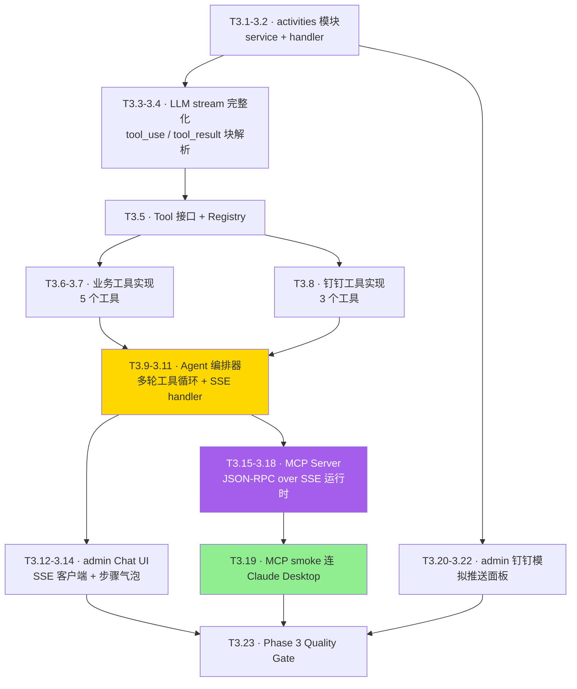

# Phase 3 · HR-Agent + MCP 实现计划

> **面向 Agent 执行：** 必须使用 `superpowers:subagent-driven-development`（推荐）或 `superpowers:executing-plans` 逐任务执行。
>
> 前置：[Phase 2 · 员工 H5 双屏](2026-05-22-phase-2-员工H5双屏.md) 已完成（`phase-2-done`）。

**目标：** 交付 HR-Agent 自然语言运营（聊天框 → LLM 函数调用 → 多步骤工具链）+ MCP Server 对外开放，让 Claude Desktop / Cursor 等 MCP 客户端能直接调用业务工具。

**架构概述：** 活动模块（activities）补完；LLM Stream 支持 `tool_use` / `tool_result` 块流转；Tool 接口 + Registry 抽象成「同一份工具，两种协议出口」——内部 HR-Agent 用 Function Calling，外部 MCP Server 用 JSON-RPC over SSE。前端 admin/pages/chat 用 EventSource 接收 SSE，把每一步 tool_use 渲染成漫画步骤气泡。

**技术栈：** Go SSE / JSON-RPC 2.0 / EventSource API / React 19 / Framer Motion / Zustand

---

## 一、实现流程



---

## 二、Module A · activities 模块

### Task 3.1 · `activities/domain` + `repository`

**Files:**
- Create: `internal/modules/activities/domain/activity.go`
- Create: `internal/modules/activities/repository/gorm_repo.go`

- [ ] **步骤 1：`domain/activity.go`**

```go
package domain

import "time"

type Status string

const (
	StatusDraft     Status = "draft"
	StatusPublished Status = "published"
	StatusRunning   Status = "running"
	StatusClosed    Status = "closed"
)

type Activity struct {
	ID            int64     `gorm:"primaryKey"`
	TenantID      int64     `gorm:"column:tenant_id"`
	DimensionID   int64     `gorm:"column:dimension_id"`
	Title         string    `gorm:"column:title"`
	Status        Status    `gorm:"column:status"`
	Capacity      *int      `gorm:"column:capacity"`
	StartAt       *time.Time `gorm:"column:start_at"`
	EndAt         *time.Time `gorm:"column:end_at"`
	LocationLat   *float64  `gorm:"column:location_lat"`
	LocationLng   *float64  `gorm:"column:location_lng"`
	RadiusM       *int      `gorm:"column:radius_m"`
	PointsReward  int       `gorm:"column:points_reward"`
	CreatedAt     time.Time `gorm:"column:created_at"`
}

func (Activity) TableName() string { return "activities" }
```

- [ ] **步骤 2：`repository/gorm_repo.go`**

```go
package repository

import (
	"context"

	"gorm.io/gorm"

	"github.com/standardsoftware/culture_points_mall/internal/modules/activities/domain"
)

type GormRepo struct{ DB *gorm.DB }

func New(db *gorm.DB) *GormRepo { return &GormRepo{DB: db} }

func (r *GormRepo) Create(ctx context.Context, a *domain.Activity) error {
	return r.DB.WithContext(ctx).Create(a).Error
}

func (r *GormRepo) GetByID(ctx context.Context, tenantID, id int64) (*domain.Activity, error) {
	var a domain.Activity
	if err := r.DB.WithContext(ctx).Where("tenant_id = ? AND id = ?", tenantID, id).First(&a).Error; err != nil {
		return nil, err
	}
	return &a, nil
}

func (r *GormRepo) ListByTenant(ctx context.Context, tenantID int64, status domain.Status, limit int) ([]domain.Activity, error) {
	if limit <= 0 || limit > 200 {
		limit = 50
	}
	q := r.DB.WithContext(ctx).Where("tenant_id = ?", tenantID).Order("start_at DESC NULLS LAST, id DESC").Limit(limit)
	if status != "" {
		q = q.Where("status = ?", status)
	}
	var rows []domain.Activity
	err := q.Find(&rows).Error
	return rows, err
}

func (r *GormRepo) UpdateStatus(ctx context.Context, id int64, status domain.Status) error {
	return r.DB.WithContext(ctx).Model(&domain.Activity{}).Where("id = ?", id).Update("status", status).Error
}
```

> 注：MySQL 没有 `NULLS LAST` 语法，可改 `ORDER BY start_at IS NULL, start_at DESC, id DESC`。

- [ ] **步骤 3：提交**

```bash
git add internal/modules/activities/
git commit -m "feat:activities 模块新增实体与 GORM 仓储"
```

---

### Task 3.2 · `activities/service` + `handler`

**Files:**
- Create: `internal/modules/activities/service/service.go`
- Create: `internal/modules/activities/handler/handler.go`

- [ ] **步骤 1：`service.go`**

```go
package service

import (
	"context"
	"time"

	"github.com/standardsoftware/culture_points_mall/internal/modules/activities/domain"
	"github.com/standardsoftware/culture_points_mall/internal/modules/activities/repository"
	valuessvc "github.com/standardsoftware/culture_points_mall/internal/modules/values/service"
)

type Service struct {
	Repo   *repository.GormRepo
	Values *valuessvc.Service
}

func New(r *repository.GormRepo, v *valuessvc.Service) *Service { return &Service{Repo: r, Values: v} }

type CreateCmd struct {
	TenantID      int64
	DimensionCode string
	Title         string
	StartAt       *time.Time
	EndAt         *time.Time
	Capacity      *int
	LocationLat   *float64
	LocationLng   *float64
	RadiusM       *int
	PointsReward  int
}

func (s *Service) Create(ctx context.Context, cmd CreateCmd) (*domain.Activity, error) {
	dims, err := s.Values.GetDimensions(ctx, cmd.TenantID)
	if err != nil {
		return nil, err
	}
	var dimID int64
	for _, d := range dims {
		if d.Code == cmd.DimensionCode {
			dimID = d.ID
			break
		}
	}
	if dimID == 0 {
		return nil, errInvalidDim
	}
	a := &domain.Activity{
		TenantID:     cmd.TenantID,
		DimensionID:  dimID,
		Title:        cmd.Title,
		Status:       domain.StatusPublished,
		Capacity:     cmd.Capacity,
		StartAt:      cmd.StartAt,
		EndAt:        cmd.EndAt,
		LocationLat:  cmd.LocationLat,
		LocationLng:  cmd.LocationLng,
		RadiusM:      cmd.RadiusM,
		PointsReward: cmd.PointsReward,
	}
	if err := s.Repo.Create(ctx, a); err != nil {
		return nil, err
	}
	return a, nil
}

func (s *Service) List(ctx context.Context, tenantID int64, status domain.Status) ([]domain.Activity, error) {
	return s.Repo.ListByTenant(ctx, tenantID, status, 50)
}

var errInvalidDim = newErr("dimension code not found")

type stringErr string

func (e stringErr) Error() string { return string(e) }
func newErr(s string) error       { return stringErr(s) }
```

- [ ] **步骤 2：`handler.go`** 最小 CRUD

```go
package handler

import (
	"time"

	"github.com/gin-gonic/gin"

	"github.com/standardsoftware/culture_points_mall/internal/modules/activities/domain"
	"github.com/standardsoftware/culture_points_mall/internal/modules/activities/service"
	cpmctx "github.com/standardsoftware/culture_points_mall/internal/shared/ctx"
)

type Handler struct{ Svc *service.Service }

func New(s *service.Service) *Handler { return &Handler{Svc: s} }

func (h *Handler) Register(rg *gin.RouterGroup) {
	rg.POST("/admin/activities", h.create)
	rg.GET("/api/v1/activities", h.list)
}

type createReq struct {
	DimensionCode string     `json:"dimensionCode" binding:"required"`
	Title         string     `json:"title" binding:"required"`
	StartAt       *time.Time `json:"startAt"`
	EndAt         *time.Time `json:"endAt"`
	Capacity      *int       `json:"capacity"`
	LocationLat   *float64   `json:"locationLat"`
	LocationLng   *float64   `json:"locationLng"`
	RadiusM       *int       `json:"radiusM"`
	PointsReward  int        `json:"pointsReward"`
}

func (h *Handler) create(c *gin.Context) {
	tid := cpmctx.TenantID(c.Request.Context())
	if tid == 0 {
		tid = 1
	}
	var req createReq
	if err := c.ShouldBindJSON(&req); err != nil {
		c.JSON(400, gin.H{"error": err.Error()})
		return
	}
	a, err := h.Svc.Create(c.Request.Context(), service.CreateCmd{
		TenantID: tid, DimensionCode: req.DimensionCode, Title: req.Title,
		StartAt: req.StartAt, EndAt: req.EndAt, Capacity: req.Capacity,
		LocationLat: req.LocationLat, LocationLng: req.LocationLng, RadiusM: req.RadiusM,
		PointsReward: req.PointsReward,
	})
	if err != nil {
		c.JSON(400, gin.H{"error": err.Error()})
		return
	}
	c.JSON(200, gin.H{"id": a.ID, "title": a.Title, "status": a.Status, "dimensionId": a.DimensionID})
}

func (h *Handler) list(c *gin.Context) {
	tid := cpmctx.TenantID(c.Request.Context())
	if tid == 0 {
		tid = 1
	}
	rows, err := h.Svc.List(c.Request.Context(), tid, domain.Status(c.Query("status")))
	if err != nil {
		c.JSON(500, gin.H{"error": err.Error()})
		return
	}
	c.JSON(200, gin.H{"items": rows})
}
```

- [ ] **步骤 3：router 注册 + smoke**

```bash
TOKEN=$(curl -s -X POST http://localhost:8080/auth/dev/login -d '{"userId":1}' -H 'Content-Type: application/json' | python3 -c 'import sys,json;print(json.load(sys.stdin)["token"])')
curl -s -X POST http://localhost:8080/admin/activities \
  -H "Authorization: Bearer $TOKEN" -H 'Content-Type: application/json' \
  -d '{"dimensionCode":"team_collab","title":"测试月底冲刺","pointsReward":50}'
# 期望返回 {"id":..., "title":"测试月底冲刺", "status":"published", ...}
```

- [ ] **步骤 4：提交**

```bash
git add internal/modules/activities/service/ internal/modules/activities/handler/ internal/router/router.go
git commit -m "feat:activities 模块新增 service 与 HTTP handler"
```

---

## 三、Module B · LLM Stream 完整化

### Task 3.3 · LLM types 扩展 + Anthropic 流式块解析

**Files:**
- Modify: `internal/platform/llm/types.go`
- Modify: `internal/platform/llm/claude.go`

> Phase 1 Task 1.28 已实现基础 text 流。本任务补全 tool_use / tool_result 块。

- [ ] **步骤 1：扩展 `types.go`**

```go
// 在 StreamEvent 中增加：
type StreamEvent struct {
	Type       string     `json:"type"`
	Delta      string     `json:"delta,omitempty"`
	ToolUse    *ToolUse   `json:"tool_use,omitempty"`
	BlockIndex int        `json:"block_index,omitempty"`
	StopReason StopReason `json:"stop_reason,omitempty"`
	Err        error      `json:"-"`
}
```

- [ ] **步骤 2：修改 `claude.go` 的 `decodeSSE`**

```go
case "content_block_start":
	var d struct {
		Index int `json:"index"`
		ContentBlock struct {
			Type  string         `json:"type"`
			ID    string         `json:"id,omitempty"`
			Name  string         `json:"name,omitempty"`
			Input map[string]any `json:"input,omitempty"`
		} `json:"content_block"`
	}
	_ = json.Unmarshal([]byte(data), &d)
	if d.ContentBlock.Type == "tool_use" {
		return StreamEvent{
			Type:       "content_block_start",
			BlockIndex: d.Index,
			ToolUse:    &ToolUse{ID: d.ContentBlock.ID, Name: d.ContentBlock.Name, Input: d.ContentBlock.Input},
		}
	}
	return StreamEvent{Type: "content_block_start", BlockIndex: d.Index}

case "content_block_delta":
	var d struct {
		Index int `json:"index"`
		Delta struct {
			Type        string `json:"type"`
			Text        string `json:"text"`
			PartialJSON string `json:"partial_json"`
		} `json:"delta"`
	}
	_ = json.Unmarshal([]byte(data), &d)
	if d.Delta.Type == "input_json_delta" {
		return StreamEvent{Type: "content_block_delta", BlockIndex: d.Index, Delta: d.Delta.PartialJSON}
	}
	return StreamEvent{Type: "content_block_delta", BlockIndex: d.Index, Delta: d.Delta.Text}
```

> 重要：`tool_use` 块的 `input` 通过 `content_block_start` 给出空对象，再通过若干 `input_json_delta` 增量拼接 JSON。Agent 编排器在 `content_block_stop` 时把整段 partial_json 合并解析。

- [ ] **步骤 3：补单元测试 `claude_stream_test.go`**

```go
package llm

import (
	"context"
	"net/http"
	"net/http/httptest"
	"testing"
	"time"

	"github.com/stretchr/testify/require"
)

func TestClaudeStream_TextDeltas(t *testing.T) {
	srv := httptest.NewServer(http.HandlerFunc(func(w http.ResponseWriter, _ *http.Request) {
		w.Header().Set("Content-Type", "text/event-stream")
		w.WriteHeader(200)
		fl := w.(http.Flusher)
		write := func(event, data string) {
			_, _ = w.Write([]byte("event: " + event + "\n"))
			_, _ = w.Write([]byte("data: " + data + "\n\n"))
			fl.Flush()
		}
		write("message_start", `{}`)
		write("content_block_start", `{"index":0,"content_block":{"type":"text"}}`)
		write("content_block_delta", `{"index":0,"delta":{"type":"text_delta","text":"你好"}}`)
		write("content_block_delta", `{"index":0,"delta":{"type":"text_delta","text":"世界"}}`)
		write("content_block_stop", `{"index":0}`)
		write("message_delta", `{"delta":{"stop_reason":"end_turn"}}`)
		write("message_stop", `{}`)
	}))
	defer srv.Close()

	c := NewClaude("k", srv.URL, "claude-sonnet-4-7")
	ctx, cancel := context.WithTimeout(context.Background(), 5*time.Second)
	defer cancel()
	ch, err := c.MessagesStream(ctx, MessagesRequest{Messages: []Message{{Role: RoleUser, Content: []Block{{Type: "text", Text: "ping"}}}}})
	require.NoError(t, err)
	var got string
	var stop StopReason
	for ev := range ch {
		if ev.Delta != "" {
			got += ev.Delta
		}
		if ev.StopReason != "" {
			stop = ev.StopReason
		}
	}
	require.Equal(t, "你好世界", got)
	require.Equal(t, StopEnd, stop)
}
```

- [ ] **步骤 4：跑测试 + 提交**

```bash
go test ./internal/platform/llm/...
git add internal/platform/llm/
git commit -m "feat:LLM stream 完整支持 tool_use 块与 input JSON 增量解析"
```

---

### Task 3.4 · LLM client OpenAI / DeepSeek stub（接口齐备）

**Files:**
- Create: `internal/platform/llm/openai.go`
- Create: `internal/platform/llm/factory.go`

> 本任务实现 Factory 路由 + OpenAI stub（仅 panic 提示未实现）。具体 OpenAI 实现非本期范围，spec 第 9 节已声明。

- [ ] **步骤 1：`openai.go`**

```go
package llm

import (
	"context"
	"errors"
)

type OpenAIClient struct {
	APIKey  string
	BaseURL string
	Model   string
}

var ErrNotImplemented = errors.New("provider implementation not in this Phase")

func (c *OpenAIClient) Messages(_ context.Context, _ MessagesRequest) (MessagesResponse, error) {
	return MessagesResponse{}, ErrNotImplemented
}
func (c *OpenAIClient) MessagesStream(_ context.Context, _ MessagesRequest) (<-chan StreamEvent, error) {
	return nil, ErrNotImplemented
}
```

- [ ] **步骤 2：`factory.go`**

```go
package llm

import (
	"fmt"

	"github.com/standardsoftware/culture_points_mall/internal/config"
)

func NewFromConfig(cfg *config.Config) (Client, error) {
	switch cfg.LLM.Provider {
	case "claude":
		return NewClaude(cfg.LLM.Claude.APIKey, cfg.LLM.Claude.BaseURL, cfg.LLM.Claude.Model), nil
	case "openai":
		return &OpenAIClient{APIKey: cfg.LLM.OpenAI.APIKey, BaseURL: cfg.LLM.OpenAI.BaseURL, Model: cfg.LLM.OpenAI.Model}, nil
	default:
		return nil, fmt.Errorf("llm provider %q not configured", cfg.LLM.Provider)
	}
}
```

- [ ] **步骤 3：在 router/main 注入 LLM Client**

```go
// cmd/server/main.go 增加：
// llmClient, _ := llm.NewFromConfig(cfg)
// 传入 router.Deps
```

- [ ] **步骤 4：提交**

```bash
git add internal/platform/llm/openai.go internal/platform/llm/factory.go cmd/server/main.go internal/router/router.go
git commit -m "feat:llm Factory 支持 provider 切换，OpenAI 留 stub"
```

---

## 四、Module C · Agent 工具集

### Task 3.5 · Tool 接口与 Registry

**Files:**
- Create: `internal/modules/agent/tools/tool.go`
- Create: `internal/modules/agent/tools/registry.go`
- Create: `internal/modules/agent/tools/registry_test.go`

- [ ] **步骤 1：`tool.go`**

```go
package tools

import "context"

type Tool interface {
	Name() string
	Description() string
	InputSchema() map[string]any // JSON Schema
	Execute(ctx context.Context, input map[string]any) (output map[string]any, err error)
}

type Result struct {
	Output  map[string]any
	IsError bool
	Message string
}
```

- [ ] **步骤 2：`registry.go`**

```go
package tools

import (
	"context"
	"errors"
	"fmt"
	"sync"
)

type Registry struct {
	mu    sync.RWMutex
	tools map[string]Tool
}

func NewRegistry() *Registry { return &Registry{tools: make(map[string]Tool)} }

func (r *Registry) Register(t Tool) error {
	r.mu.Lock()
	defer r.mu.Unlock()
	if _, exists := r.tools[t.Name()]; exists {
		return fmt.Errorf("tool already registered: %s", t.Name())
	}
	r.tools[t.Name()] = t
	return nil
}

func (r *Registry) MustRegister(t Tool) {
	if err := r.Register(t); err != nil {
		panic(err)
	}
}

func (r *Registry) Get(name string) (Tool, bool) {
	r.mu.RLock()
	defer r.mu.RUnlock()
	t, ok := r.tools[name]
	return t, ok
}

func (r *Registry) List() []Tool {
	r.mu.RLock()
	defer r.mu.RUnlock()
	out := make([]Tool, 0, len(r.tools))
	for _, t := range r.tools {
		out = append(out, t)
	}
	return out
}

func (r *Registry) Call(ctx context.Context, name string, input map[string]any) Result {
	t, ok := r.Get(name)
	if !ok {
		return Result{IsError: true, Message: fmt.Sprintf("tool not found: %s", name)}
	}
	out, err := t.Execute(ctx, input)
	if err != nil {
		return Result{IsError: true, Message: err.Error()}
	}
	return Result{Output: out}
}

var ErrToolNotFound = errors.New("tool not found")
```

- [ ] **步骤 3：测试**

```go
package tools

import (
	"context"
	"testing"

	"github.com/stretchr/testify/require"
)

type fakeTool struct{}

func (fakeTool) Name() string                 { return "echo" }
func (fakeTool) Description() string          { return "echo back" }
func (fakeTool) InputSchema() map[string]any  { return map[string]any{"type": "object"} }
func (fakeTool) Execute(_ context.Context, in map[string]any) (map[string]any, error) {
	return in, nil
}

func TestRegistry_Call(t *testing.T) {
	r := NewRegistry()
	r.MustRegister(fakeTool{})
	res := r.Call(context.Background(), "echo", map[string]any{"msg": "hi"})
	require.False(t, res.IsError)
	require.Equal(t, "hi", res.Output["msg"])
}
```

- [ ] **步骤 4：提交**

```bash
go test ./internal/modules/agent/tools/...
git add internal/modules/agent/tools/
git commit -m "feat:agent 模块新增 Tool 接口与 Registry"
```

---

### Task 3.6 · 业务工具实现 · activities / points / leaderboard / badges

**Files:**
- Create: `internal/modules/agent/tools/business.go`

- [ ] **步骤 1：`business.go`**（一次性把 5 个业务工具放一个文件，简化跨包依赖）

```go
package tools

import (
	"context"
	"fmt"
	"time"

	activitiesdomain "github.com/standardsoftware/culture_points_mall/internal/modules/activities/domain"
	activitiessvc "github.com/standardsoftware/culture_points_mall/internal/modules/activities/service"
	achvsvc "github.com/standardsoftware/culture_points_mall/internal/modules/achievements/service"
	lbsvc "github.com/standardsoftware/culture_points_mall/internal/modules/leaderboard/service"
	pointssvc "github.com/standardsoftware/culture_points_mall/internal/modules/points/service"
	cpmctx "github.com/standardsoftware/culture_points_mall/internal/shared/ctx"
)

type BusinessDeps struct {
	Activities *activitiessvc.Service
	Points     *pointssvc.Service
	Leaderboard *lbsvc.Service
	Achievements *achvsvc.Service
}

// ---- create_activity ----

type CreateActivityTool struct{ Deps BusinessDeps }

func (CreateActivityTool) Name() string        { return "create_activity" }
func (CreateActivityTool) Description() string { return "创建一个文化运营活动，必须绑定一个价值观维度。" }
func (CreateActivityTool) InputSchema() map[string]any {
	return map[string]any{
		"type": "object",
		"properties": map[string]any{
			"dimension_code": map[string]any{"type": "string", "description": "价值观维度代码，例如 team_collab"},
			"title":          map[string]any{"type": "string"},
			"start_at":       map[string]any{"type": "string", "description": "RFC3339 时间"},
			"end_at":         map[string]any{"type": "string"},
			"capacity":       map[string]any{"type": "integer"},
			"points_reward":  map[string]any{"type": "integer"},
		},
		"required": []string{"dimension_code", "title"},
	}
}

func (t CreateActivityTool) Execute(ctx context.Context, in map[string]any) (map[string]any, error) {
	tid := cpmctx.TenantID(ctx)
	if tid == 0 {
		tid = 1
	}
	cmd := activitiessvc.CreateCmd{
		TenantID:      tid,
		DimensionCode: anyString(in["dimension_code"]),
		Title:         anyString(in["title"]),
		PointsReward:  anyInt(in["points_reward"]),
	}
	if s := anyString(in["start_at"]); s != "" {
		if ts, err := time.Parse(time.RFC3339, s); err == nil {
			cmd.StartAt = &ts
		}
	}
	if s := anyString(in["end_at"]); s != "" {
		if ts, err := time.Parse(time.RFC3339, s); err == nil {
			cmd.EndAt = &ts
		}
	}
	if cap := anyInt(in["capacity"]); cap > 0 {
		cmd.Capacity = &cap
	}
	a, err := t.Deps.Activities.Create(ctx, cmd)
	if err != nil {
		return nil, err
	}
	return map[string]any{"activity_id": a.ID, "title": a.Title, "status": string(a.Status), "dimension_id": a.DimensionID}, nil
}

// ---- list_activities ----

type ListActivitiesTool struct{ Deps BusinessDeps }

func (ListActivitiesTool) Name() string        { return "list_activities" }
func (ListActivitiesTool) Description() string { return "列出当前租户的活动，支持按 status 过滤" }
func (ListActivitiesTool) InputSchema() map[string]any {
	return map[string]any{
		"type": "object",
		"properties": map[string]any{
			"status": map[string]any{"type": "string", "enum": []string{"", "draft", "published", "running", "closed"}},
		},
	}
}

func (t ListActivitiesTool) Execute(ctx context.Context, in map[string]any) (map[string]any, error) {
	tid := cpmctx.TenantID(ctx)
	if tid == 0 {
		tid = 1
	}
	rows, err := t.Deps.Activities.List(ctx, tid, activitiesdomain.Status(anyString(in["status"])))
	if err != nil {
		return nil, err
	}
	out := make([]map[string]any, 0, len(rows))
	for _, r := range rows {
		out = append(out, map[string]any{
			"id": r.ID, "title": r.Title, "status": string(r.Status), "dimension_id": r.DimensionID,
		})
	}
	return map[string]any{"items": out, "total": len(out)}, nil
}

// ---- get_user_points ----

type GetUserPointsTool struct{ Deps BusinessDeps }

func (GetUserPointsTool) Name() string        { return "get_user_points" }
func (GetUserPointsTool) Description() string { return "查询某员工的总积分与按维度的分值" }
func (GetUserPointsTool) InputSchema() map[string]any {
	return map[string]any{
		"type": "object",
		"properties": map[string]any{"user_id": map[string]any{"type": "integer"}},
		"required":   []string{"user_id"},
	}
}

func (t GetUserPointsTool) Execute(ctx context.Context, in map[string]any) (map[string]any, error) {
	tid := cpmctx.TenantID(ctx)
	if tid == 0 {
		tid = 1
	}
	uid := int64(anyInt(in["user_id"]))
	scores, _, total, err := t.Deps.Points.GetUserScores(ctx, tid, uid)
	if err != nil {
		return nil, err
	}
	return map[string]any{"user_id": uid, "total": total, "scores": scores}, nil
}

// ---- add_points ----

type AddPointsTool struct{ Deps BusinessDeps }

func (AddPointsTool) Name() string        { return "add_points" }
func (AddPointsTool) Description() string { return "为某员工加分（必须指定维度）" }
func (AddPointsTool) InputSchema() map[string]any {
	return map[string]any{
		"type": "object",
		"properties": map[string]any{
			"user_id":        map[string]any{"type": "integer"},
			"amount":         map[string]any{"type": "integer", "description": "正数加分，负数扣分"},
			"dimension_code": map[string]any{"type": "string"},
			"reason":         map[string]any{"type": "string"},
		},
		"required": []string{"user_id", "amount", "dimension_code"},
	}
}

func (t AddPointsTool) Execute(ctx context.Context, in map[string]any) (map[string]any, error) {
	tid := cpmctx.TenantID(ctx)
	if tid == 0 {
		tid = 1
	}
	tx, err := t.Deps.Points.AddPoints(ctx, pointssvc.AddPointsCmd{
		TenantID: tid, UserID: int64(anyInt(in["user_id"])), Amount: anyInt(in["amount"]),
		DimCode: anyString(in["dimension_code"]), Reason: anyString(in["reason"]),
	})
	if err != nil {
		return nil, err
	}
	// 触发徽章
	newBadges, _ := t.Deps.Achievements.CheckTriggers(ctx, tid, tx.UserID, tx.DimensionID)
	return map[string]any{"transaction_id": tx.ID, "new_badges": newBadges}, nil
}

// ---- get_leaderboard ----

type GetLeaderboardTool struct{ Deps BusinessDeps }

func (GetLeaderboardTool) Name() string        { return "get_leaderboard" }
func (GetLeaderboardTool) Description() string { return "查询排行榜：scope=total/dim/dept" }
func (GetLeaderboardTool) InputSchema() map[string]any {
	return map[string]any{
		"type": "object",
		"properties": map[string]any{
			"scope":        map[string]any{"type": "string", "enum": []string{"total", "dim", "dept"}},
			"dimension_id": map[string]any{"type": "integer"},
			"limit":        map[string]any{"type": "integer"},
		},
		"required": []string{"scope"},
	}
}

func (t GetLeaderboardTool) Execute(ctx context.Context, in map[string]any) (map[string]any, error) {
	tid := cpmctx.TenantID(ctx)
	if tid == 0 {
		tid = 1
	}
	rows, err := t.Deps.Leaderboard.List(ctx, lbsvc.ListParams{
		TenantID: tid, Scope: anyString(in["scope"]),
		DimensionID: int64(anyInt(in["dimension_id"])),
		Limit:       anyInt(in["limit"]),
	})
	if err != nil {
		return nil, err
	}
	return map[string]any{"entries": rows}, nil
}

// ---- AwardBadgeTool ----

type AwardBadgeTool struct{ Deps BusinessDeps }

func (AwardBadgeTool) Name() string        { return "award_badge" }
func (AwardBadgeTool) Description() string { return "直接为员工颁发指定徽章" }
func (AwardBadgeTool) InputSchema() map[string]any {
	return map[string]any{
		"type": "object",
		"properties": map[string]any{
			"user_id":  map[string]any{"type": "integer"},
			"badge_id": map[string]any{"type": "integer"},
		},
		"required": []string{"user_id", "badge_id"},
	}
}

func (t AwardBadgeTool) Execute(ctx context.Context, in map[string]any) (map[string]any, error) {
	uid := int64(anyInt(in["user_id"]))
	bid := int64(anyInt(in["badge_id"]))
	if err := t.Deps.Achievements.Repo.Inner.AwardBadge(ctx, uid, bid); err != nil {
		return nil, err
	}
	return map[string]any{"ok": true}, nil
}

// 工具集注册帮助
func RegisterBusiness(r *Registry, deps BusinessDeps) {
	r.MustRegister(CreateActivityTool{deps})
	r.MustRegister(ListActivitiesTool{deps})
	r.MustRegister(GetUserPointsTool{deps})
	r.MustRegister(AddPointsTool{deps})
	r.MustRegister(GetLeaderboardTool{deps})
	r.MustRegister(AwardBadgeTool{deps})
}

// 辅助
func anyString(v any) string {
	s, _ := v.(string)
	return s
}

func anyInt(v any) int {
	switch x := v.(type) {
	case int:
		return x
	case int64:
		return int(x)
	case float64:
		return int(x)
	default:
		return 0
	}
}

var _ = fmt.Sprintf // 保留 fmt 引用
```

- [ ] **步骤 2：测试 + 提交**

```bash
go vet ./...
git add internal/modules/agent/tools/business.go
git commit -m "feat:agent 工具集新增 6 个业务工具（活动/积分/排行/徽章）"
```

---

### Task 3.7 · 钉钉工具实现

**Files:**
- Create: `internal/modules/agent/tools/dingtalk.go`

- [ ] **步骤 1：`dingtalk.go`**

```go
package tools

import (
	"context"
	"fmt"
	"time"

	"github.com/standardsoftware/culture_points_mall/internal/platform/dingtalk"
)

type DingDeps struct {
	Client dingtalk.Client
}

// ---- send_dingtalk_card ----

type SendDingtalkCardTool struct{ Deps DingDeps }

func (SendDingtalkCardTool) Name() string        { return "send_dingtalk_card" }
func (SendDingtalkCardTool) Description() string { return "向某用户发送互动卡片" }
func (SendDingtalkCardTool) InputSchema() map[string]any {
	return map[string]any{
		"type": "object",
		"properties": map[string]any{
			"target":   map[string]any{"type": "string", "description": "钉钉 userId"},
			"title":    map[string]any{"type": "string"},
			"detail":   map[string]any{"type": "string"},
		},
		"required": []string{"target", "title"},
	}
}

func (t SendDingtalkCardTool) Execute(ctx context.Context, in map[string]any) (map[string]any, error) {
	inst, err := t.Deps.Client.SendInteractiveCard(ctx,
		anyString(in["target"]), "default",
		map[string]any{"title": anyString(in["title"]), "detail": anyString(in["detail"])})
	if err != nil {
		return nil, err
	}
	return map[string]any{"card_instance_id": inst.InstanceID}, nil
}

// ---- bot_broadcast ----

type BotBroadcastTool struct{ Deps DingDeps }

func (BotBroadcastTool) Name() string        { return "dingtalk_bot_broadcast" }
func (BotBroadcastTool) Description() string { return "用群机器人在指定群播报消息" }
func (BotBroadcastTool) InputSchema() map[string]any {
	return map[string]any{
		"type": "object",
		"properties": map[string]any{
			"group_id": map[string]any{"type": "string"},
			"title":    map[string]any{"type": "string"},
			"detail":   map[string]any{"type": "string"},
		},
		"required": []string{"group_id", "title"},
	}
}

func (t BotBroadcastTool) Execute(ctx context.Context, in map[string]any) (map[string]any, error) {
	if err := t.Deps.Client.BotBroadcast(ctx, anyString(in["group_id"]),
		dingtalk.Card{Title: anyString(in["title"]), Detail: anyString(in["detail"])}); err != nil {
		return nil, err
	}
	return map[string]any{"ok": true}, nil
}

// ---- create_dingtalk_calendar ----

type CreateDingtalkCalendarTool struct{ Deps DingDeps }

func (CreateDingtalkCalendarTool) Name() string        { return "create_dingtalk_calendar" }
func (CreateDingtalkCalendarTool) Description() string { return "为目标员工创建钉钉日程（接受=报名）" }
func (CreateDingtalkCalendarTool) InputSchema() map[string]any {
	return map[string]any{
		"type": "object",
		"properties": map[string]any{
			"title":     map[string]any{"type": "string"},
			"start_at":  map[string]any{"type": "string", "description": "RFC3339"},
			"end_at":    map[string]any{"type": "string"},
			"user_ids":  map[string]any{"type": "array", "items": map[string]any{"type": "string"}},
			"location":  map[string]any{"type": "string"},
			"detail":    map[string]any{"type": "string"},
		},
		"required": []string{"title", "start_at", "end_at", "user_ids"},
	}
}

func (t CreateDingtalkCalendarTool) Execute(ctx context.Context, in map[string]any) (map[string]any, error) {
	startStr := anyString(in["start_at"])
	endStr := anyString(in["end_at"])
	start, err := time.Parse(time.RFC3339, startStr)
	if err != nil {
		return nil, fmt.Errorf("start_at parse: %w", err)
	}
	end, err := time.Parse(time.RFC3339, endStr)
	if err != nil {
		return nil, fmt.Errorf("end_at parse: %w", err)
	}
	var userIDs []string
	if arr, ok := in["user_ids"].([]any); ok {
		for _, v := range arr {
			userIDs = append(userIDs, anyString(v))
		}
	}
	id, err := t.Deps.Client.CreateCalendarEvent(ctx, dingtalk.CalendarRequest{
		Title: anyString(in["title"]), StartAt: start, EndAt: end, UserIDs: userIDs,
		Location: anyString(in["location"]), Detail: anyString(in["detail"]),
	})
	if err != nil {
		return nil, err
	}
	return map[string]any{"event_id": id}, nil
}

func RegisterDingtalk(r *Registry, deps DingDeps) {
	r.MustRegister(SendDingtalkCardTool{deps})
	r.MustRegister(BotBroadcastTool{deps})
	r.MustRegister(CreateDingtalkCalendarTool{deps})
}
```

- [ ] **步骤 2：提交**

```bash
go vet ./...
git add internal/modules/agent/tools/dingtalk.go
git commit -m "feat:agent 工具集新增 3 个钉钉工具"
```

---

### Task 3.8 · 工具集装配函数 + ToolsAsLLMDef helper

**Files:**
- Create: `internal/modules/agent/tools/llm_adapter.go`

- [ ] **步骤 1：`llm_adapter.go`**

```go
package tools

import "github.com/standardsoftware/culture_points_mall/internal/platform/llm"

func AsLLMDefs(r *Registry) []llm.ToolDef {
	tools := r.List()
	out := make([]llm.ToolDef, 0, len(tools))
	for _, t := range tools {
		out = append(out, llm.ToolDef{
			Name:        t.Name(),
			Description: t.Description(),
			InputSchema: t.InputSchema(),
		})
	}
	return out
}
```

- [ ] **步骤 2：提交**

```bash
git add internal/modules/agent/tools/llm_adapter.go
git commit -m "feat:agent 工具集新增 LLM ToolDef 适配"
```

---

## 五、Module D · Agent 编排器

### Task 3.9 · 编排器与多轮工具循环

**Files:**
- Create: `internal/modules/agent/service/orchestrator.go`

- [ ] **步骤 1：`orchestrator.go`**

```go
package service

import (
	"context"
	"encoding/json"
	"fmt"

	"github.com/standardsoftware/culture_points_mall/internal/modules/agent/tools"
	valuessvc "github.com/standardsoftware/culture_points_mall/internal/modules/values/service"
	"github.com/standardsoftware/culture_points_mall/internal/platform/llm"
	cpmctx "github.com/standardsoftware/culture_points_mall/internal/shared/ctx"
)

type Orchestrator struct {
	LLM    llm.Client
	Tools  *tools.Registry
	Values *valuessvc.Service
	MaxLoops int // 安全阈值，默认 8
}

func NewOrchestrator(l llm.Client, t *tools.Registry, v *valuessvc.Service) *Orchestrator {
	return &Orchestrator{LLM: l, Tools: t, Values: v, MaxLoops: 8}
}

type StepKind string

const (
	StepLLMText     StepKind = "llm_text"
	StepToolUse     StepKind = "tool_use"
	StepToolResult  StepKind = "tool_result"
	StepError       StepKind = "error"
	StepDone        StepKind = "done"
)

type Step struct {
	Kind     StepKind       `json:"kind"`
	Text     string         `json:"text,omitempty"`
	ToolName string         `json:"toolName,omitempty"`
	ToolID   string         `json:"toolId,omitempty"`
	Input    map[string]any `json:"input,omitempty"`
	Output   map[string]any `json:"output,omitempty"`
	Error    string         `json:"error,omitempty"`
}

func (o *Orchestrator) Run(ctx context.Context, history []llm.Message, userText string) (<-chan Step, error) {
	out := make(chan Step, 16)
	go func() {
		defer close(out)
		tid := cpmctx.TenantID(ctx)
		if tid == 0 {
			tid = 1
		}
		dims, _ := o.Values.GetDimensions(ctx, tid)
		systemPrompt := buildSystemPrompt(dims)

		messages := append([]llm.Message{}, history...)
		messages = append(messages, llm.Message{Role: llm.RoleUser, Content: []llm.Block{{Type: "text", Text: userText}}})

		for i := 0; i < o.MaxLoops; i++ {
			resp, err := o.LLM.Messages(ctx, llm.MessagesRequest{
				System: systemPrompt, Messages: messages,
				Tools: tools.AsLLMDefs(o.Tools), MaxTokens: 4096,
			})
			if err != nil {
				out <- Step{Kind: StepError, Error: err.Error()}
				return
			}

			var toolBlocks []llm.Block
			for _, b := range resp.Content {
				switch b.Type {
				case "text":
					if b.Text != "" {
						out <- Step{Kind: StepLLMText, Text: b.Text}
					}
				case "tool_use":
					if b.ToolUse == nil {
						continue
					}
					out <- Step{Kind: StepToolUse, ToolID: b.ToolUse.ID, ToolName: b.ToolUse.Name, Input: b.ToolUse.Input}
					res := o.Tools.Call(ctx, b.ToolUse.Name, b.ToolUse.Input)
					var content string
					if res.IsError {
						content = res.Message
						out <- Step{Kind: StepToolResult, ToolID: b.ToolUse.ID, ToolName: b.ToolUse.Name, Error: res.Message}
					} else {
						raw, _ := json.Marshal(res.Output)
						content = string(raw)
						out <- Step{Kind: StepToolResult, ToolID: b.ToolUse.ID, ToolName: b.ToolUse.Name, Output: res.Output}
					}
					toolBlocks = append(toolBlocks, llm.Block{
						Type: "tool_result",
						ToolRes: &llm.ToolResult{ToolUseID: b.ToolUse.ID, Content: content, IsError: res.IsError},
					})
				}
			}

			// 将 assistant 的输出追加到对话
			messages = append(messages, llm.Message{Role: llm.RoleAssistant, Content: resp.Content})

			if len(toolBlocks) == 0 || resp.StopReason == llm.StopEnd {
				out <- Step{Kind: StepDone}
				return
			}
			// 追加 tool_result 作为下一轮 user 输入
			messages = append(messages, llm.Message{Role: llm.RoleUser, Content: toolBlocks})
		}
		out <- Step{Kind: StepError, Error: fmt.Sprintf("超过最大循环次数 %d", o.MaxLoops)}
	}()
	return out, nil
}

func buildSystemPrompt(dims []struct {
	ID        int64
	TenantID  int64
	Code      string
	Name      string
	Keywords  string
	Weight    float64
	SortOrder int
	Enabled   bool
}) string {
	// 注：实际签名应使用 values/domain.Dimension。此处简化伪结构示意。
	prompt := `你是文化积分商城的 HR 运营 AI 助理。可调用提供的工具完成「发布活动、加分、查询排行榜、颁发徽章、推送钉钉通知」等操作。

公司当前的价值观维度：
`
	for _, d := range dims {
		prompt += fmt.Sprintf("- %s（code=%s, 关键词: %s）\n", d.Name, d.Code, d.Keywords)
	}
	prompt += `
执行规则：
1. 任何创建活动、加分操作必须明确指定一个 dimension_code
2. 不要凭空生成 user_id，先用 get_leaderboard 等工具查询真实 ID
3. 调用工具完毕后用一段中文给 HR 汇报本次操作的结果摘要
`
	return prompt
}
```

> 注：`buildSystemPrompt` 的参数应是 `valuesdomain.Dimension` 切片。上方简化为伪结构提示。实际 import 时改为正确类型。

- [ ] **步骤 2：修正类型** 把 buildSystemPrompt 改为接受 `valuesdomain.Dimension`

```go
import valuesdomain "github.com/standardsoftware/culture_points_mall/internal/modules/values/domain"

func buildSystemPrompt(dims []valuesdomain.Dimension) string { ... }
```

并把 `o.Values.GetDimensions(ctx, tid)` 的返回直接传入。

- [ ] **步骤 3：提交**

```bash
go vet ./...
git add internal/modules/agent/service/
git commit -m "feat:agent 编排器实现多轮工具调用循环与价值观语境注入"
```

---

### Task 3.10 · Agent SSE handler + 会话存储

**Files:**
- Create: `internal/modules/agent/repository/gorm_repo.go`
- Create: `internal/modules/agent/handler/handler.go`

- [ ] **步骤 1：`repository/gorm_repo.go`** session/message 存储

```go
package repository

import (
	"context"
	"encoding/json"
	"time"

	"gorm.io/gorm"
)

type Session struct {
	ID        int64     `gorm:"primaryKey"`
	TenantID  int64     `gorm:"column:tenant_id"`
	OperatorID int64    `gorm:"column:operator_id"`
	Title     string    `gorm:"column:title"`
	CreatedAt time.Time `gorm:"column:created_at"`
}

func (Session) TableName() string { return "agent_sessions" }

type Message struct {
	ID        int64           `gorm:"primaryKey"`
	SessionID int64           `gorm:"column:session_id"`
	Role      string          `gorm:"column:role"`
	Content   json.RawMessage `gorm:"column:content"`
	CreatedAt time.Time       `gorm:"column:created_at"`
}

func (Message) TableName() string { return "agent_messages" }

type Repo struct{ DB *gorm.DB }

func New(db *gorm.DB) *Repo { return &Repo{DB: db} }

func (r *Repo) CreateSession(ctx context.Context, s *Session) error {
	return r.DB.WithContext(ctx).Create(s).Error
}

func (r *Repo) AppendMessage(ctx context.Context, m *Message) error {
	return r.DB.WithContext(ctx).Create(m).Error
}

func (r *Repo) ListSessions(ctx context.Context, tenantID, operatorID int64, limit int) ([]Session, error) {
	if limit <= 0 || limit > 100 {
		limit = 20
	}
	var rows []Session
	err := r.DB.WithContext(ctx).
		Where("tenant_id = ? AND operator_id = ?", tenantID, operatorID).
		Order("id DESC").Limit(limit).Find(&rows).Error
	return rows, err
}

func (r *Repo) ListMessages(ctx context.Context, sessionID int64) ([]Message, error) {
	var rows []Message
	err := r.DB.WithContext(ctx).Where("session_id = ?", sessionID).Order("id ASC").Find(&rows).Error
	return rows, err
}
```

- [ ] **步骤 2：`handler/handler.go`** SSE 实现

```go
package handler

import (
	"encoding/json"
	"strconv"

	"github.com/gin-gonic/gin"

	"github.com/standardsoftware/culture_points_mall/internal/modules/agent/repository"
	"github.com/standardsoftware/culture_points_mall/internal/modules/agent/service"
	"github.com/standardsoftware/culture_points_mall/internal/platform/llm"
	cpmctx "github.com/standardsoftware/culture_points_mall/internal/shared/ctx"
)

type Handler struct {
	Orchestrator *service.Orchestrator
	Sessions     *repository.Repo
}

func New(o *service.Orchestrator, s *repository.Repo) *Handler {
	return &Handler{Orchestrator: o, Sessions: s}
}

func (h *Handler) Register(rg *gin.RouterGroup) {
	rg.POST("/admin/agent/chat", h.chat)
	rg.GET("/admin/agent/sessions", h.listSessions)
}

type chatReq struct {
	SessionID int64  `json:"sessionId"`
	Text      string `json:"text" binding:"required"`
}

func (h *Handler) chat(c *gin.Context) {
	var req chatReq
	if err := c.ShouldBindJSON(&req); err != nil {
		c.JSON(400, gin.H{"error": err.Error()})
		return
	}
	tid := cpmctx.TenantID(c.Request.Context())
	uid := cpmctx.UserID(c.Request.Context())

	// 装载历史
	var history []llm.Message
	if req.SessionID > 0 {
		msgs, err := h.Sessions.ListMessages(c.Request.Context(), req.SessionID)
		if err == nil {
			for _, m := range msgs {
				var blocks []llm.Block
				_ = json.Unmarshal(m.Content, &blocks)
				history = append(history, llm.Message{Role: llm.Role(m.Role), Content: blocks})
			}
		}
	} else {
		s := &repository.Session{TenantID: tid, OperatorID: uid, Title: truncate(req.Text, 50)}
		if err := h.Sessions.CreateSession(c.Request.Context(), s); err == nil {
			req.SessionID = s.ID
		}
	}

	c.Header("Content-Type", "text/event-stream")
	c.Header("Cache-Control", "no-cache")
	c.Header("Connection", "keep-alive")
	c.Writer.Flush()

	// 持久化用户 turn
	if req.SessionID > 0 {
		userBlocks := []llm.Block{{Type: "text", Text: req.Text}}
		raw, _ := json.Marshal(userBlocks)
		_ = h.Sessions.AppendMessage(c.Request.Context(), &repository.Message{
			SessionID: req.SessionID, Role: string(llm.RoleUser), Content: raw,
		})
	}

	// 推送 sessionId
	_, _ = c.Writer.Write([]byte("event: session\ndata: " + jsonStr(map[string]any{"sessionId": req.SessionID}) + "\n\n"))
	c.Writer.Flush()

	steps, _ := h.Orchestrator.Run(c.Request.Context(), history, req.Text)
	for step := range steps {
		raw, _ := json.Marshal(step)
		_, _ = c.Writer.Write([]byte("event: step\ndata: "))
		_, _ = c.Writer.Write(raw)
		_, _ = c.Writer.Write([]byte("\n\n"))
		c.Writer.Flush()

		if req.SessionID > 0 && (step.Kind == service.StepLLMText || step.Kind == service.StepToolUse || step.Kind == service.StepToolResult) {
			msgRaw, _ := json.Marshal([]any{step})
			role := llm.RoleAssistant
			if step.Kind == service.StepToolResult {
				role = llm.RoleTool
			}
			_ = h.Sessions.AppendMessage(c.Request.Context(), &repository.Message{
				SessionID: req.SessionID, Role: string(role), Content: msgRaw,
			})
		}
	}
}

func (h *Handler) listSessions(c *gin.Context) {
	tid := cpmctx.TenantID(c.Request.Context())
	uid := cpmctx.UserID(c.Request.Context())
	limit, _ := strconv.Atoi(c.Query("limit"))
	rows, err := h.Sessions.ListSessions(c.Request.Context(), tid, uid, limit)
	if err != nil {
		c.JSON(500, gin.H{"error": err.Error()})
		return
	}
	c.JSON(200, gin.H{"items": rows})
}

func truncate(s string, n int) string {
	if len(s) <= n {
		return s
	}
	return s[:n]
}

func jsonStr(v any) string {
	raw, _ := json.Marshal(v)
	return string(raw)
}
```

- [ ] **步骤 3：router 注册 + 提交**

```bash
git add internal/modules/agent/handler internal/modules/agent/repository internal/router/router.go
git commit -m "feat:agent SSE handler 与会话持久化"
```

---

### Task 3.11 · 集线器：把所有工具与编排器在 main 中注入

**Files:**
- Modify: `cmd/server/main.go`
- Modify: `internal/router/router.go`

- [ ] **步骤 1：在 main 装配**

```go
// cmd/server/main.go:
llmClient, err := llm.NewFromConfig(cfg)
if err != nil { log.Fatal(err) }

toolReg := tools.NewRegistry()
tools.RegisterBusiness(toolReg, tools.BusinessDeps{
    Activities:   activitiesSvc,
    Points:       pointsSvc,
    Leaderboard:  lbSvc,
    Achievements: achvSvc,
})
tools.RegisterDingtalk(toolReg, tools.DingDeps{Client: ding})

orchestrator := agentsvc.NewOrchestrator(llmClient, toolReg, valuesSvc)
agentRepo := agentrepo.New(db)
```

- [ ] **步骤 2：router.go 增加 deps + 注册 agent handler**

```go
// agenth.New(deps.Orchestrator, deps.AgentRepo).Register(authed)
```

- [ ] **步骤 3：smoke**

```bash
# 设置 Anthropic API Key（必需）
export ANTHROPIC_API_KEY="sk-ant-..."
make run &
sleep 2

TOKEN=$(curl -s -X POST http://localhost:8080/auth/dev/login -d '{"userId":1}' -H 'Content-Type: application/json' | python3 -c 'import sys,json;print(json.load(sys.stdin)["token"])')

curl -N -X POST "http://localhost:8080/admin/agent/chat" \
  -H "Authorization: Bearer $TOKEN" -H 'Content-Type: application/json' \
  -d '{"text":"给销售部发一场月底冲刺活动，下周三 18:00，主推团队协作维度，奖励 50 分，限 30 人。"}'
# 期望逐步收到 SSE 事件：session / step (tool_use, tool_result, llm_text, done)
```

- [ ] **步骤 4：提交**

```bash
git add cmd/server/main.go internal/router/router.go
git commit -m "feat:Agent 编排器与工具集装配到主进程"
```

---

## 六、Module E · admin Chat UI

### Task 3.12 · SSE 客户端 hook + 类型

**Files:**
- Create: `apps/admin/src/pages/chat/types.ts`
- Create: `apps/admin/src/pages/chat/useAgentChat.ts`

- [ ] **步骤 1：`types.ts`**

```typescript
export type StepKind = 'llm_text' | 'tool_use' | 'tool_result' | 'error' | 'done';

export interface Step {
  kind: StepKind;
  text?: string;
  toolName?: string;
  toolId?: string;
  input?: Record<string, unknown>;
  output?: Record<string, unknown>;
  error?: string;
}

export interface ChatTurn {
  sessionId: number | null;
  userText: string;
  steps: Step[];
  done: boolean;
}
```

- [ ] **步骤 2：`useAgentChat.ts`**

```typescript
import { useCallback, useState } from 'react';
import type { ChatTurn, Step } from './types';

export function useAgentChat() {
  const [turns, setTurns] = useState<ChatTurn[]>([]);
  const [sessionId, setSessionId] = useState<number | null>(null);
  const [busy, setBusy] = useState(false);

  const send = useCallback(async (text: string) => {
    const turn: ChatTurn = { sessionId, userText: text, steps: [], done: false };
    setTurns((prev) => [...prev, turn]);
    setBusy(true);

    const token = localStorage.getItem('cpm_admin_jwt');
    const resp = await fetch('/admin/agent/chat', {
      method: 'POST',
      headers: { 'Content-Type': 'application/json', Authorization: `Bearer ${token}` },
      body: JSON.stringify({ sessionId, text }),
    });
    if (!resp.ok || !resp.body) {
      setBusy(false);
      return;
    }
    const reader = resp.body.getReader();
    const dec = new TextDecoder();
    let buf = '';
    for (;;) {
      const { value, done } = await reader.read();
      if (done) break;
      buf += dec.decode(value, { stream: true });
      const events = buf.split('\n\n');
      buf = events.pop() ?? '';
      for (const raw of events) {
        const lines = raw.split('\n');
        let event = '';
        let data = '';
        for (const l of lines) {
          if (l.startsWith('event:')) event = l.slice(6).trim();
          if (l.startsWith('data:')) data = l.slice(5).trim();
        }
        if (!event || !data) continue;
        if (event === 'session') {
          const obj = JSON.parse(data) as { sessionId: number };
          setSessionId(obj.sessionId);
        } else if (event === 'step') {
          const step = JSON.parse(data) as Step;
          setTurns((prev) => {
            const next = [...prev];
            const last = next[next.length - 1];
            if (last) {
              last.steps = [...last.steps, step];
              if (step.kind === 'done' || step.kind === 'error') last.done = true;
            }
            return next;
          });
        }
      }
    }
    setBusy(false);
  }, [sessionId]);

  return { turns, busy, send };
}
```

- [ ] **步骤 3：提交**

```bash
git add apps/admin/src/pages/chat/
git commit -m "feat:admin Chat 接入 SSE 客户端"
```

---

### Task 3.13 · Chat 页面（输入 + 步骤气泡 + 历史列表）

**Files:**
- Create: `apps/admin/src/pages/chat/ChatPage.tsx`
- Create: `apps/admin/src/pages/chat/StepBubble.tsx`
- Modify: `apps/admin/src/router.tsx`

- [ ] **步骤 1：`StepBubble.tsx`**

```tsx
import { Panel, Stamp, Shout } from '@cpm/ui';
import { motion } from 'framer-motion';
import type { Step } from './types';

export function StepBubble({ step }: { step: Step }) {
  if (step.kind === 'llm_text') {
    return (
      <motion.div initial={{ opacity: 0, y: 8 }} animate={{ opacity: 1, y: 0 }} className="my-2">
        <Panel shadow="yellow"><div className="whitespace-pre-wrap font-kuaile">{step.text}</div></Panel>
      </motion.div>
    );
  }
  if (step.kind === 'tool_use') {
    return (
      <motion.div initial={{ scale: 0.95, opacity: 0 }} animate={{ scale: 1, opacity: 1 }} className="my-2 ml-6">
        <Panel shadow="blue">
          <div className="flex items-center gap-2 mb-1">
            <Shout tone="blue" rotation={-2}>调用 {step.toolName}</Shout>
          </div>
          <pre className="text-xs bg-paper border border-ink p-2 rounded">{JSON.stringify(step.input, null, 2)}</pre>
        </Panel>
      </motion.div>
    );
  }
  if (step.kind === 'tool_result') {
    return (
      <motion.div initial={{ opacity: 0 }} animate={{ opacity: 1 }} className="my-2 ml-6">
        <Panel shadow={step.error ? 'red' : 'green'}>
          <div className="flex items-center gap-2 mb-1">
            <Stamp text={step.error ? 'FAIL' : 'DONE'} color={step.error ? 'red' : 'green'} rotation={-8} />
            <span className="font-kuaile">{step.toolName}</span>
          </div>
          {step.error ? (
            <div className="text-cRed text-sm">{step.error}</div>
          ) : (
            <pre className="text-xs bg-paper border border-ink p-2 rounded">{JSON.stringify(step.output, null, 2)}</pre>
          )}
        </Panel>
      </motion.div>
    );
  }
  if (step.kind === 'error') {
    return (
      <div className="my-2"><Panel shadow="red"><div className="text-cRed">{step.error}</div></Panel></div>
    );
  }
  if (step.kind === 'done') {
    return <div className="text-center text-xs text-ink/50">— 本轮结束 —</div>;
  }
  return null;
}
```

- [ ] **步骤 2：`ChatPage.tsx`**

```tsx
import { useState, useRef, useEffect } from 'react';
import { Panel, ComicButton } from '@cpm/ui';
import { useAgentChat } from './useAgentChat';
import { StepBubble } from './StepBubble';

export function ChatPage() {
  const { turns, busy, send } = useAgentChat();
  const [text, setText] = useState('');
  const scrollRef = useRef<HTMLDivElement>(null);

  useEffect(() => { scrollRef.current?.scrollTo({ top: 1e6, behavior: 'smooth' }); }, [turns]);

  const submit = () => {
    if (!text.trim() || busy) return;
    void send(text.trim());
    setText('');
  };

  return (
    <div className="flex flex-col h-full">
      <div ref={scrollRef} className="flex-1 overflow-auto px-4 py-2 space-y-4">
        {turns.map((t, i) => (
          <div key={i}>
            <div className="text-right mb-2">
              <Panel shadow="pink" style={{ display: 'inline-block', maxWidth: '70%' }}>
                <div className="font-kuaile">{t.userText}</div>
              </Panel>
            </div>
            {t.steps.map((s, j) => <StepBubble key={j} step={s} />)}
          </div>
        ))}
      </div>
      <div className="border-t-3 border-ink p-3 flex gap-2">
        <textarea
          value={text}
          onChange={(e) => setText(e.target.value)}
          onKeyDown={(e) => { if (e.key === 'Enter' && (e.metaKey || e.ctrlKey)) submit(); }}
          placeholder="对 HR-Agent 说点什么...（Cmd/Ctrl+Enter 发送）"
          className="flex-1 border-3 border-ink rounded p-2 font-kuaile"
          rows={2}
        />
        <ComicButton onClick={submit} tone="red">{busy ? '思考中…' : '发送'}</ComicButton>
      </div>
    </div>
  );
}
```

- [ ] **步骤 3：路由替换 + smoke**

```bash
# 在 router.tsx 替换 /chat 路由为 <ChatPage />
pnpm --filter @cpm/admin dev
# 5174 /chat 输入「列出活动」回车，应能看到 tool_use(list_activities)、tool_result、llm_text、done 一连串气泡
```

- [ ] **步骤 4：提交**

```bash
git add apps/admin/src
git commit -m "feat:admin Chat 页面（步骤气泡+输入+历史）落地"
```

---

### Task 3.14 · Chat 历史会话侧栏

**Files:**
- Create: `apps/admin/src/pages/chat/SessionsSidebar.tsx`
- Modify: `apps/admin/src/pages/chat/ChatPage.tsx`

- [ ] **步骤 1：`SessionsSidebar.tsx`**

```tsx
import { useEffect, useState } from 'react';
import axios from 'axios';

interface Sess { id: number; title: string; createdAt: string }

export function SessionsSidebar({ onPick }: { onPick: (id: number) => void }) {
  const [rows, setRows] = useState<Sess[]>([]);
  useEffect(() => {
    const token = localStorage.getItem('cpm_admin_jwt');
    axios.get<{ items: Sess[] }>('/admin/agent/sessions', { headers: { Authorization: `Bearer ${token}` } })
      .then((r) => setRows(r.data.items)).catch(() => {});
  }, []);
  return (
    <aside className="w-56 border-r-3 border-ink p-2 overflow-auto">
      <h3 className="font-qingke text-lg mb-2">历史会话</h3>
      <ul className="space-y-1">
        {rows.map((s) => (
          <li key={s.id}>
            <button onClick={() => onPick(s.id)} className="block w-full text-left p-2 border-2 border-ink rounded">
              <div className="text-xs">{s.createdAt.slice(0, 10)}</div>
              <div className="font-kuaile">{s.title || '未命名'}</div>
            </button>
          </li>
        ))}
      </ul>
    </aside>
  );
}
```

- [ ] **步骤 2：修改 `ChatPage.tsx`** 包入 SessionsSidebar

- [ ] **步骤 3：提交**

```bash
git add apps/admin/src/pages/chat
git commit -m "feat:admin Chat 历史会话侧栏"
```

---

## 七、Module F · MCP Server

### Task 3.15 · MCP 协议运行时（JSON-RPC over SSE）

**Files:**
- Create: `internal/platform/mcp/types.go`
- Create: `internal/platform/mcp/server.go`

- [ ] **步骤 1：`types.go`**

```go
package mcp

import "encoding/json"

type RequestID json.RawMessage

type Request struct {
	JSONRPC string          `json:"jsonrpc"`
	ID      *RequestID      `json:"id,omitempty"`
	Method  string          `json:"method"`
	Params  json.RawMessage `json:"params,omitempty"`
}

type Response struct {
	JSONRPC string      `json:"jsonrpc"`
	ID      *RequestID  `json:"id,omitempty"`
	Result  any         `json:"result,omitempty"`
	Error   *Error      `json:"error,omitempty"`
}

type Error struct {
	Code    int    `json:"code"`
	Message string `json:"message"`
	Data    any    `json:"data,omitempty"`
}

type ToolDescriptor struct {
	Name        string         `json:"name"`
	Description string         `json:"description"`
	InputSchema map[string]any `json:"inputSchema"`
}

type CallParams struct {
	Name      string         `json:"name"`
	Arguments map[string]any `json:"arguments"`
}

type CallResult struct {
	Content []ContentBlock `json:"content"`
	IsError bool           `json:"isError,omitempty"`
}

type ContentBlock struct {
	Type string `json:"type"`
	Text string `json:"text,omitempty"`
}
```

- [ ] **步骤 2：`server.go`**

```go
package mcp

import (
	"context"
	"encoding/json"
	"net/http"
	"sync"
	"time"

	"github.com/gin-gonic/gin"

	"github.com/standardsoftware/culture_points_mall/internal/modules/agent/tools"
	cpmctx "github.com/standardsoftware/culture_points_mall/internal/shared/ctx"
)

type Server struct {
	Registry *tools.Registry
	Auth     func(token string) (tenantID int64, ok bool) // 简易 token → tenant 映射

	mu     sync.Mutex
	queues map[string]chan Response
}

func NewServer(reg *tools.Registry, auth func(string) (int64, bool)) *Server {
	return &Server{Registry: reg, Auth: auth, queues: make(map[string]chan Response)}
}

func (s *Server) Register(r *gin.Engine) {
	r.GET("/mcp/sse", s.sse)
	r.POST("/mcp/messages", s.message)
}

func (s *Server) auth(c *gin.Context) (int64, bool) {
	token := c.GetHeader("Authorization")
	if len(token) > 7 && token[:7] == "Bearer " {
		token = token[7:]
	}
	return s.Auth(token)
}

func (s *Server) sse(c *gin.Context) {
	tid, ok := s.auth(c)
	if !ok {
		c.AbortWithStatusJSON(401, gin.H{"error": "unauthorized"})
		return
	}
	c.Header("Content-Type", "text/event-stream")
	c.Header("Cache-Control", "no-cache")
	c.Header("Connection", "keep-alive")

	sessionID := c.Query("session")
	if sessionID == "" {
		c.AbortWithStatusJSON(400, gin.H{"error": "session required"})
		return
	}
	s.mu.Lock()
	q, exists := s.queues[sessionID]
	if !exists {
		q = make(chan Response, 16)
		s.queues[sessionID] = q
	}
	s.mu.Unlock()

	notify := c.Writer.CloseNotify()
	for {
		select {
		case resp := <-q:
			raw, _ := json.Marshal(resp)
			_, _ = c.Writer.Write([]byte("event: message\ndata: "))
			_, _ = c.Writer.Write(raw)
			_, _ = c.Writer.Write([]byte("\n\n"))
			c.Writer.Flush()
		case <-notify:
			s.mu.Lock()
			delete(s.queues, sessionID)
			s.mu.Unlock()
			return
		case <-time.After(30 * time.Second):
			_, _ = c.Writer.Write([]byte(": keepalive\n\n"))
			c.Writer.Flush()
		}
		_ = tid
	}
}

func (s *Server) message(c *gin.Context) {
	tid, ok := s.auth(c)
	if !ok {
		c.AbortWithStatusJSON(401, gin.H{"error": "unauthorized"})
		return
	}
	sessionID := c.Query("session")
	if sessionID == "" {
		c.AbortWithStatusJSON(400, gin.H{"error": "session required"})
		return
	}
	var req Request
	if err := c.ShouldBindJSON(&req); err != nil {
		c.AbortWithStatusJSON(400, gin.H{"error": err.Error()})
		return
	}

	ctx := cpmctx.WithTenant(c.Request.Context(), tid)
	resp := s.dispatch(ctx, req)

	s.mu.Lock()
	q := s.queues[sessionID]
	s.mu.Unlock()
	if q != nil {
		q <- resp
	}
	c.Status(http.StatusAccepted)
}

func (s *Server) dispatch(ctx context.Context, req Request) Response {
	switch req.Method {
	case "initialize":
		return Response{JSONRPC: "2.0", ID: req.ID, Result: map[string]any{
			"protocolVersion": "2025-06-18",
			"serverInfo":      map[string]any{"name": "culture-points-mall", "version": "0.0.1"},
			"capabilities":    map[string]any{"tools": map[string]any{}},
		}}
	case "tools/list":
		list := s.Registry.List()
		descs := make([]ToolDescriptor, 0, len(list))
		for _, t := range list {
			descs = append(descs, ToolDescriptor{Name: t.Name(), Description: t.Description(), InputSchema: t.InputSchema()})
		}
		return Response{JSONRPC: "2.0", ID: req.ID, Result: map[string]any{"tools": descs}}
	case "tools/call":
		var p CallParams
		_ = json.Unmarshal(req.Params, &p)
		res := s.Registry.Call(ctx, p.Name, p.Arguments)
		if res.IsError {
			return Response{JSONRPC: "2.0", ID: req.ID, Result: CallResult{
				Content: []ContentBlock{{Type: "text", Text: res.Message}},
				IsError: true,
			}}
		}
		raw, _ := json.Marshal(res.Output)
		return Response{JSONRPC: "2.0", ID: req.ID, Result: CallResult{
			Content: []ContentBlock{{Type: "text", Text: string(raw)}},
		}}
	default:
		return Response{JSONRPC: "2.0", ID: req.ID, Error: &Error{Code: -32601, Message: "method not found"}}
	}
}
```

> 注：协议版本号示意。实际部署需对齐当时 MCP 协议规范。

- [ ] **步骤 2：提交**

```bash
git add internal/platform/mcp/
git commit -m "feat:MCP Server 协议运行时（JSON-RPC over SSE 简化版）"
```

---

### Task 3.16 · `cmd/mcp/main.go` 完整启动

**Files:**
- Modify: `culture_points_mall/cmd/mcp/main.go`

- [ ] **步骤 1：写完整 main**

```go
package main

import (
	"context"
	"fmt"
	"log"

	"github.com/gin-gonic/gin"

	"github.com/standardsoftware/culture_points_mall/internal/config"
	"github.com/standardsoftware/culture_points_mall/internal/platform/dingtalk"
	"github.com/standardsoftware/culture_points_mall/internal/platform/mcp"
	"github.com/standardsoftware/culture_points_mall/internal/platform/storage"

	"github.com/standardsoftware/culture_points_mall/internal/modules/agent/tools"

	activitiesrepo "github.com/standardsoftware/culture_points_mall/internal/modules/activities/repository"
	activitiessvc "github.com/standardsoftware/culture_points_mall/internal/modules/activities/service"
	achvrepo "github.com/standardsoftware/culture_points_mall/internal/modules/achievements/repository"
	achvsvc "github.com/standardsoftware/culture_points_mall/internal/modules/achievements/service"
	lbsvc "github.com/standardsoftware/culture_points_mall/internal/modules/leaderboard/service"
	pointsrepo "github.com/standardsoftware/culture_points_mall/internal/modules/points/repository"
	pointssvc "github.com/standardsoftware/culture_points_mall/internal/modules/points/service"
	valuesrepo "github.com/standardsoftware/culture_points_mall/internal/modules/values/repository"
	valuessvc "github.com/standardsoftware/culture_points_mall/internal/modules/values/service"
)

func main() {
	cfg, err := config.Load("./configs")
	if err != nil {
		log.Fatal(err)
	}
	db, err := storage.NewMySQL(cfg.MySQL)
	if err != nil {
		log.Fatal(err)
	}
	bus := dingtalk.NewBus()
	mockDing := dingtalk.NewMock(db, bus)

	valuesS := valuessvc.New(valuesrepo.New(db))
	pointsS := pointssvc.New(db, pointsrepo.New(db), valuesS)
	lbS := lbsvc.New(db)
	actS := activitiessvc.New(activitiesrepo.New(db), valuesS)
	achvWrap := &achvsvc.Wrap{Inner: achvrepo.New(db)}
	achvS := achvsvc.New(achvWrap, pointsS, valuesS)

	reg := tools.NewRegistry()
	tools.RegisterBusiness(reg, tools.BusinessDeps{Activities: actS, Points: pointsS, Leaderboard: lbS, Achievements: achvS})
	tools.RegisterDingtalk(reg, tools.DingDeps{Client: mockDing})

	_ = context.Background()

	r := gin.Default()
	mcp.NewServer(reg, simpleAuth(cfg)).Register(r)

	addr := fmt.Sprintf(":%d", cfg.MCP.Port)
	log.Printf("mcp server starting on %s", addr)
	if err := r.Run(addr); err != nil {
		log.Fatal(err)
	}
}

func simpleAuth(cfg *config.Config) func(string) (int64, bool) {
	return func(token string) (int64, bool) {
		if token == "" {
			return 0, false
		}
		// demo: 任意非空 token 视为 default tenant
		return cfg.Seed.DefaultTenantID, true
	}
}
```

- [ ] **步骤 2：启动 smoke**

```bash
go run ./cmd/mcp &
sleep 1
# 用 curl 模拟 initialize
curl -s -X POST "http://localhost:8090/mcp/messages?session=test1" \
  -H "Authorization: Bearer demo" -H "Content-Type: application/json" \
  -d '{"jsonrpc":"2.0","id":"1","method":"initialize"}'
# 期望 202 Accepted（响应在 SSE 端）

# 另起终端
curl -N -H "Authorization: Bearer demo" "http://localhost:8090/mcp/sse?session=test1"
# 应收到 event: message data: {jsonrpc, id, result:{protocolVersion, serverInfo, capabilities}}
```

- [ ] **步骤 3：提交**

```bash
git add cmd/mcp/main.go
git commit -m "feat:MCP Server 主入口装配工具集与协议"
```

---

### Task 3.17 · MCP 协议测试客户端

**Files:**
- Create: `internal/platform/mcp/mcp_integration_test.go`

- [ ] **步骤 1：测试**

```go
//go:build integration

package mcp

import (
	"bufio"
	"bytes"
	"context"
	"encoding/json"
	"net/http"
	"net/http/httptest"
	"strings"
	"sync"
	"testing"
	"time"

	"github.com/gin-gonic/gin"
	"github.com/stretchr/testify/require"

	"github.com/standardsoftware/culture_points_mall/internal/modules/agent/tools"
)

type echoTool struct{}

func (echoTool) Name() string                { return "echo" }
func (echoTool) Description() string         { return "echo back input" }
func (echoTool) InputSchema() map[string]any { return map[string]any{"type": "object"} }
func (echoTool) Execute(_ context.Context, in map[string]any) (map[string]any, error) {
	return in, nil
}

func TestMCP_ListAndCall_Integration(t *testing.T) {
	gin.SetMode(gin.TestMode)
	reg := tools.NewRegistry()
	reg.MustRegister(echoTool{})
	srv := NewServer(reg, func(string) (int64, bool) { return 1, true })

	r := gin.New()
	srv.Register(r)
	ts := httptest.NewServer(r)
	defer ts.Close()

	// SSE
	var wg sync.WaitGroup
	wg.Add(1)
	go func() {
		defer wg.Done()
		req, _ := http.NewRequest("GET", ts.URL+"/mcp/sse?session=s1", nil)
		req.Header.Set("Authorization", "Bearer x")
		resp, err := http.DefaultClient.Do(req)
		require.NoError(t, err)
		defer resp.Body.Close()
		ctx, cancel := context.WithTimeout(context.Background(), 5*time.Second)
		defer cancel()
		scanner := bufio.NewScanner(resp.Body)
		got := 0
		for scanner.Scan() {
			line := scanner.Text()
			if strings.HasPrefix(line, "data:") {
				got++
				if got >= 2 {
					return
				}
			}
			select {
			case <-ctx.Done():
				return
			default:
			}
		}
	}()

	// initialize
	body := []byte(`{"jsonrpc":"2.0","id":"1","method":"initialize"}`)
	req, _ := http.NewRequest("POST", ts.URL+"/mcp/messages?session=s1", bytes.NewReader(body))
	req.Header.Set("Authorization", "Bearer x")
	req.Header.Set("Content-Type", "application/json")
	resp, err := http.DefaultClient.Do(req)
	require.NoError(t, err)
	require.Equal(t, 202, resp.StatusCode)

	// tools/call echo
	body = []byte(`{"jsonrpc":"2.0","id":"2","method":"tools/call","params":{"name":"echo","arguments":{"hi":1}}}`)
	req, _ = http.NewRequest("POST", ts.URL+"/mcp/messages?session=s1", bytes.NewReader(body))
	req.Header.Set("Authorization", "Bearer x")
	req.Header.Set("Content-Type", "application/json")
	resp, err = http.DefaultClient.Do(req)
	require.NoError(t, err)
	require.Equal(t, 202, resp.StatusCode)

	wg.Wait()
	_ = json.NewDecoder // silence unused import
}
```

- [ ] **步骤 2：跑测试 + 提交**

```bash
go test -tags=integration -timeout 30s ./internal/platform/mcp/...
git add internal/platform/mcp/mcp_integration_test.go
git commit -m "test:MCP 协议端到端集成测试"
```

---

### Task 3.18 · MCP 客户端配置 README

**Files:**
- Create: `docs/superpowers/notes/mcp-client-setup.md`

- [ ] **步骤 1：文档**

```markdown
# 接入文化积分商城 MCP Server

启动后端 MCP：

```bash
make run               # 启动 HTTP 8080
go run ./cmd/mcp       # 启动 MCP 8090
```

在 Claude Desktop 的 `~/Library/Application Support/Claude/claude_desktop_config.json`：

```json
{
  "mcpServers": {
    "culture-points-mall": {
      "url": "http://localhost:8090/mcp/sse?session=cli-1",
      "transport": "sse",
      "headers": {
        "Authorization": "Bearer demo"
      }
    }
  }
}
```

> 注：当前 demo 接受任意非空 token。生产部署需把 `simpleAuth` 替换为正式 API Key 表查询。

调用示例（在 Claude Desktop 内）：

> 「列出当前所有 published 活动」→ 触发 tools/call list_activities。
```

- [ ] **步骤 2：提交**

```bash
git add docs/superpowers/notes/mcp-client-setup.md
git commit -m "docs:MCP 客户端接入说明"
```

---

### Task 3.19 · admin 钉钉模拟推送面板

**Files:**
- Create: `apps/admin/src/pages/dingtalk/MockOutboxPage.tsx`
- Modify: `apps/admin/src/router.tsx`

- [ ] **步骤 1：`MockOutboxPage.tsx`**

```tsx
import { useEffect, useState } from 'react';
import axios from 'axios';
import { Panel, Shout } from '@cpm/ui';
import { motion } from 'framer-motion';

interface Outbox { id: number; api: string; target: string; payload: any; createdAt: string }

const apiTitle: Record<string, string> = {
  create_calendar: '创建钉钉日程',
  send_work_notice: '推送工作通知',
  send_interactive_card: '发送互动卡片',
  bot_broadcast: '群机器人播报',
  start_oa_process: 'OA 审批',
};

export function MockOutboxPage() {
  const [rows, setRows] = useState<Outbox[]>([]);
  useEffect(() => {
    const token = localStorage.getItem('cpm_admin_jwt');
    const refresh = () => axios.get<{ items: Outbox[] }>(
      '/admin/dingtalk/mock-outbox',
      { headers: { Authorization: `Bearer ${token}` } },
    ).then((r) => setRows(r.data.items)).catch(() => {});
    refresh();
    const es = new EventSource('/admin/dingtalk/mock-outbox/stream');
    es.onmessage = () => refresh();
    return () => es.close();
  }, []);

  return (
    <div>
      <Shout tone="green">钉钉模拟推送 · 演示用</Shout>
      <p className="my-3 font-kuaile text-ink/70">
        以下条目展示「如果接真钉钉，系统会发什么」，便于 demo 时可视化讲解。
      </p>
      <div className="space-y-3">
        {rows.map((r, i) => (
          <motion.div key={r.id} initial={{ x: 40, opacity: 0 }} animate={{ x: 0, opacity: 1 }} transition={{ delay: i * 0.02 }}>
            <Panel shadow="green">
              <div className="flex items-center justify-between">
                <span className="font-kuaile">{apiTitle[r.api] ?? r.api}</span>
                <span className="text-xs text-ink/50">{r.createdAt.slice(0, 19)}</span>
              </div>
              <div className="text-sm mt-2">→ 目标：<span className="font-mono">{r.target || '（无）'}</span></div>
              <pre className="text-xs bg-paper border border-ink rounded p-2 mt-2 overflow-auto">{JSON.stringify(r.payload, null, 2)}</pre>
            </Panel>
          </motion.div>
        ))}
      </div>
    </div>
  );
}
```

- [ ] **步骤 2：路由替换 + 提交**

```bash
# router.tsx /dingtalk/mock-outbox 路由替换为 <MockOutboxPage />
git add apps/admin/src/pages/dingtalk apps/admin/src/router.tsx
git commit -m "feat:admin 钉钉模拟推送面板（含 SSE 实时刷新）"
```

---

## 八、Phase 3 Quality Gate

### Task 3.20 · 全链路 smoke

- [ ] **步骤 1：跑测试**

```bash
cd /Users/standardsoftware/go/culture_points_mall
go vet ./...
go test -race ./...
make test-int
```

- [ ] **步骤 2：联调真 Claude（需要 ANTHROPIC_API_KEY）**

```bash
export ANTHROPIC_API_KEY="sk-ant-..."
make run &
go run ./cmd/mcp &

# 前端
cd ../culture_points_mall_web
pnpm --filter @cpm/admin dev

# 浏览器打开 http://localhost:5174/chat
# 输入：「给销售部发一场月底冲刺活动，下周三 18:00，主推团队协作维度，奖励 50 分，限 30 人」
# 期望：
# - tool_use create_activity → DONE
# - tool_use create_dingtalk_calendar → DONE
# - tool_use send_dingtalk_card → DONE
# - llm_text 总结
# - 切换到 /dingtalk/mock-outbox 应看到对应推送
```

- [ ] **步骤 3：MCP 联调**

```bash
# 按 mcp-client-setup.md 配置 Claude Desktop
# 重启 Claude Desktop
# 提问：「调用 culture-points-mall MCP 查询所有活动」
# 期望：调用 tools/call list_activities 并返回 JSON 结果
```

- [ ] **步骤 4：总结**

```markdown
# Phase 3 总结（2026-05-22）

## 已交付
- activities 模块（CRUD service + handler）
- LLM stream 完整化（tool_use / input_json_delta 解析）
- LLM Factory（Claude/OpenAI/DeepSeek provider 切换）
- Agent 工具集（6 业务 + 3 钉钉，共 9 个）
- Tool 接口 + Registry
- Agent 编排器（多轮工具循环 + 价值观语境注入）
- /admin/agent/chat SSE + 会话持久化
- admin Chat UI（步骤气泡 + Stamp + 历史侧栏）
- MCP Server JSON-RPC over SSE
- MCP 协议集成测试
- admin 钉钉模拟推送面板

## 未在本期但已留位
- OpenAI/DeepSeek 实际实现（stub return ErrNotImplemented）
- MCP Server 真鉴权（demo: 任意非空 token）
- Activity 报名表 / 状态机
- AI 数据洞察 Dashboard
- 反作弊检测 Agent

## Phase 4 起步前需补
- 签到 HMAC 二维码
- 盲盒 TCC 全链路
- 抽奖 3D 转盘
- Playwright E2E 框架
```

- [ ] **步骤 5：提交 + tag**

```bash
git add docs/superpowers/notes/2026-05-22-phase-3-总结.md
git commit -m "docs:Phase 3 总结"
git tag phase-3-done
cd ../culture_points_mall_web
git tag phase-3-done
```

---

## 九、下一步

进入 [Phase 4 · 签到 + 盲盒 + 收尾](2026-05-22-phase-4-签到盲盒收尾.md)。

> Phase 3 plan 文档结束。
