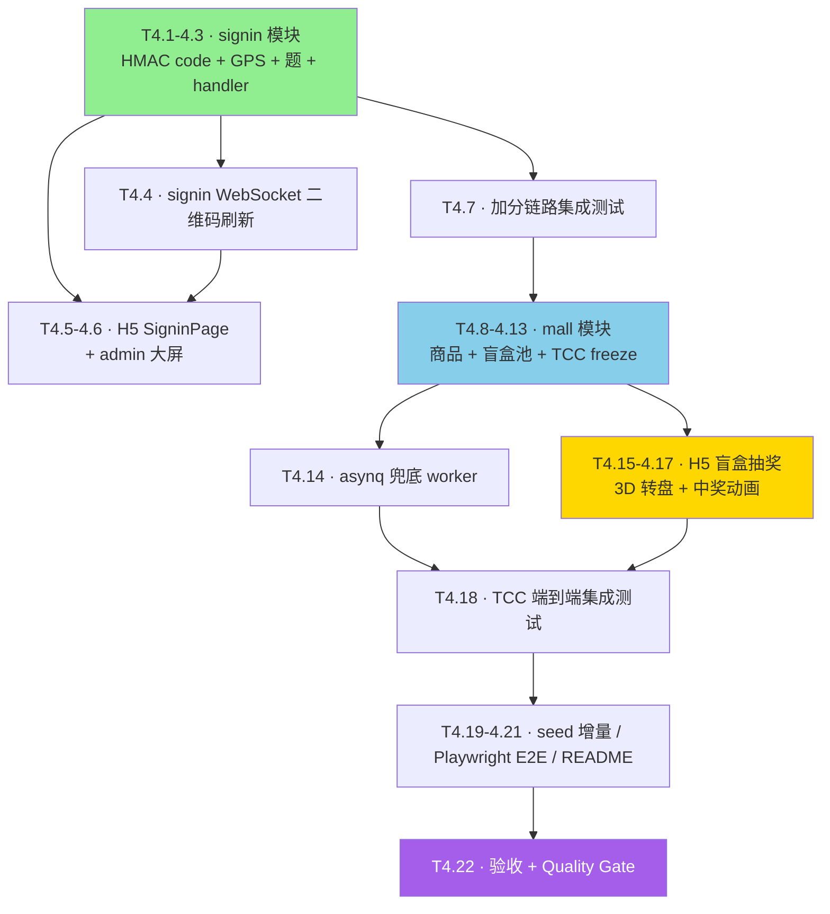

# Phase 4 · 签到 + 盲盒 + 收尾 实现计划

> **面向 Agent 执行：** 必须使用 `superpowers:subagent-driven-development`（推荐）或 `superpowers:executing-plans` 逐任务执行。
>
> 前置：[Phase 3 · HR-Agent + MCP](2026-05-22-phase-3-HR-Agent-MCP.md) 已完成（`phase-3-done`）。

**目标：** 交付剩下两个端到端模块——签到加分闭环（HMAC 二维码 + GPS + 题 + 徽章触发）与盲盒抽奖 TCC（Try/Confirm/Cancel + Redis 双保险 + asynq 兜底 worker + 3D 转盘）。最后做 seed 增量、Playwright E2E、README 完善，封 Phase 4。

**架构概述：** signin 模块独立成 service，HR 后台生成二维码 URL（含 HMAC code），H5 扫码后走「校验 → GPS → 题 → 加分 → 徽章 → 钉钉通知」一条链路。mall 模块的盲盒抽奖在 service 层做 TCC 编排，points 服务提供 freeze/confirm/cancel 三个最小原语，asynq worker 定时 cancel 过期 freeze。

**技术栈：** HMAC-SHA256 / GPS Haversine / Redis SETNX TTL / asynq / @react-three/fiber / GSAP / Lottie / Playwright

---

## 一、实现流程



---

## 二、Module A · 签到加分闭环

### Task 4.1 · `signin/domain` + HMAC code 生成

**Files:**
- Create: `internal/modules/signin/domain/code.go`
- Create: `internal/modules/signin/service/hmac.go`
- Create: `internal/modules/signin/service/hmac_test.go`

- [ ] **步骤 1：`domain/code.go`**

```go
package domain

import "time"

type SigninCode struct {
	ID         int64     `gorm:"primaryKey"`
	ActivityID int64     `gorm:"column:activity_id"`
	Code       string    `gorm:"column:code"`
	IssuedAt   time.Time `gorm:"column:issued_at"`
	ExpiresAt  time.Time `gorm:"column:expires_at"`
}

func (SigninCode) TableName() string { return "signin_codes" }

type SigninRecord struct {
	ID         int64     `gorm:"primaryKey"`
	ActivityID int64     `gorm:"column:activity_id"`
	UserID     int64     `gorm:"column:user_id"`
	GPSLat     *float64  `gorm:"column:gps_lat"`
	GPSLng     *float64  `gorm:"column:gps_lng"`
	QuizAnswer string    `gorm:"column:quiz_answer"`
	Result     string    `gorm:"column:result"` // passed | rejected | suspect
	Reason     string    `gorm:"column:reason"`
	CreatedAt  time.Time `gorm:"column:created_at"`
}

func (SigninRecord) TableName() string { return "signin_records" }
```

- [ ] **步骤 2：`service/hmac.go`**

```go
package service

import (
	"crypto/hmac"
	"crypto/sha256"
	"encoding/hex"
	"fmt"
	"time"
)

// CodeFor 返回某 activity 在指定时间窗口的 HMAC code
// window 是从 epoch 开始的窗口序号（time.Now().Unix() / windowSecs）
func CodeFor(activityID int64, window int64, secret string) string {
	mac := hmac.New(sha256.New, []byte(secret))
	_, _ = fmt.Fprintf(mac, "%d|%d", activityID, window)
	return hex.EncodeToString(mac.Sum(nil))[:16] // 截短便于在 URL 中显示
}

// ValidCode 校验给定 code 是否落在 [当前窗, 上一窗] 双窗口
func ValidCode(activityID int64, code string, windowSecs int, secret string, now time.Time) bool {
	cur := now.Unix() / int64(windowSecs)
	if hmac.Equal([]byte(CodeFor(activityID, cur, secret)), []byte(code)) {
		return true
	}
	if hmac.Equal([]byte(CodeFor(activityID, cur-1, secret)), []byte(code)) {
		return true
	}
	return false
}
```

- [ ] **步骤 3：测试 `hmac_test.go`**

```go
package service

import (
	"testing"
	"time"

	"github.com/stretchr/testify/require"
)

func TestHMACDoubleWindow(t *testing.T) {
	secret := "test-secret"
	now := time.Unix(1_700_000_000, 0)
	cur := now.Unix() / 60
	codeNow := CodeFor(42, cur, secret)
	codePrev := CodeFor(42, cur-1, secret)

	require.True(t, ValidCode(42, codeNow, 60, secret, now))
	require.True(t, ValidCode(42, codePrev, 60, secret, now)) // 上一窗也应当通过
	require.False(t, ValidCode(42, "wrong", 60, secret, now))
	require.False(t, ValidCode(99, codeNow, 60, secret, now)) // activity 不匹配
}
```

- [ ] **步骤 4：跑测试 + 提交**

```bash
go test ./internal/modules/signin/...
git add internal/modules/signin/
git commit -m "feat:signin 模块新增 HMAC 二维码生成与双窗口校验"
```

---

### Task 4.2 · `signin/service` GPS 围栏 + 题库 + Service 组装

**Files:**
- Create: `internal/modules/signin/service/geo.go`
- Create: `internal/modules/signin/service/quiz.go`
- Create: `internal/modules/signin/service/service.go`
- Create: `internal/modules/signin/repository/gorm_repo.go`

- [ ] **步骤 1：`geo.go`** Haversine

```go
package service

import "math"

// HaversineMeters 计算两点（经纬度）之间的距离（米）
func HaversineMeters(lat1, lng1, lat2, lng2 float64) float64 {
	const R = 6_371_000.0
	rad := math.Pi / 180
	dLat := (lat2 - lat1) * rad
	dLng := (lng2 - lng1) * rad
	a := math.Sin(dLat/2)*math.Sin(dLat/2) +
		math.Cos(lat1*rad)*math.Cos(lat2*rad)*math.Sin(dLng/2)*math.Sin(dLng/2)
	c := 2 * math.Atan2(math.Sqrt(a), math.Sqrt(1-a))
	return R * c
}
```

- [ ] **步骤 2：`quiz.go`** 全局题库（演示 hardcode 3 题，按 activity dim 维度随机抽）

```go
package service

import "math/rand"

type Quiz struct {
	Question string
	Answer   string
}

var defaultQuizzes = []Quiz{
	{Question: "公司核心价值观第一条是？（请输入：客户至上 / 团队协作 / 创新求变 / 诚信务实 / 极致专注 / 学习成长）", Answer: "客户至上"},
	{Question: "今年企业文化年的主题词是？", Answer: "向上"},
	{Question: "本次活动开始时间（24h 制）整点是？", Answer: "18"},
}

func PickQuiz() Quiz {
	return defaultQuizzes[rand.Intn(len(defaultQuizzes))]
}

func CheckQuiz(expected, answer string) bool {
	return expected == answer
}
```

> 注：题库管理在后续迭代抽 `quiz_pool` 表。本期 hardcode 即可演示。

- [ ] **步骤 3：`repository/gorm_repo.go`**

```go
package repository

import (
	"context"

	"gorm.io/gorm"

	"github.com/standardsoftware/culture_points_mall/internal/modules/signin/domain"
)

type GormRepo struct{ DB *gorm.DB }

func New(db *gorm.DB) *GormRepo { return &GormRepo{DB: db} }

func (r *GormRepo) CreateCode(ctx context.Context, c *domain.SigninCode) error {
	return r.DB.WithContext(ctx).Create(c).Error
}

func (r *GormRepo) CreateRecord(ctx context.Context, rec *domain.SigninRecord) error {
	return r.DB.WithContext(ctx).Create(rec).Error
}

func (r *GormRepo) HasUserSignedIn(ctx context.Context, activityID, userID int64) (bool, error) {
	var cnt int64
	err := r.DB.WithContext(ctx).Model(&domain.SigninRecord{}).
		Where("activity_id = ? AND user_id = ? AND result = 'passed'", activityID, userID).
		Count(&cnt).Error
	return cnt > 0, err
}
```

- [ ] **步骤 4：`service.go`**

```go
package service

import (
	"context"
	"errors"
	"time"

	activitiesdomain "github.com/standardsoftware/culture_points_mall/internal/modules/activities/domain"
	activitiessvc "github.com/standardsoftware/culture_points_mall/internal/modules/activities/service"
	achvsvc "github.com/standardsoftware/culture_points_mall/internal/modules/achievements/service"
	pointssvc "github.com/standardsoftware/culture_points_mall/internal/modules/points/service"
	"github.com/standardsoftware/culture_points_mall/internal/modules/signin/domain"
	"github.com/standardsoftware/culture_points_mall/internal/modules/signin/repository"
)

type Service struct {
	Repo         *repository.GormRepo
	Activities   *activitiessvc.Service
	Points       *pointssvc.Service
	Achievements *achvsvc.Service
	HMACSecret   string
	WindowSecs   int
}

func New(repo *repository.GormRepo, act *activitiessvc.Service, p *pointssvc.Service, a *achvsvc.Service, secret string, windowSecs int) *Service {
	if windowSecs <= 0 {
		windowSecs = 60
	}
	return &Service{Repo: repo, Activities: act, Points: p, Achievements: a, HMACSecret: secret, WindowSecs: windowSecs}
}

type CheckCmd struct {
	TenantID   int64
	UserID     int64
	ActivityID int64
	Code       string
	GPSLat     *float64
	GPSLng     *float64
	QuizExpect string
	QuizAnswer string
}

type CheckResult struct {
	OK             bool
	Reason         string
	TransactionID  int64
	NewBadges      []int64
}

var ErrAlreadySignedIn = errors.New("已经签到过本活动")

func (s *Service) Check(ctx context.Context, cmd CheckCmd) (*CheckResult, error) {
	if !ValidCode(cmd.ActivityID, cmd.Code, s.WindowSecs, s.HMACSecret, time.Now()) {
		return s.reject(ctx, cmd, "二维码无效或已过期")
	}
	already, err := s.Repo.HasUserSignedIn(ctx, cmd.ActivityID, cmd.UserID)
	if err != nil {
		return nil, err
	}
	if already {
		return nil, ErrAlreadySignedIn
	}
	act, err := s.Activities.Repo.GetByID(ctx, cmd.TenantID, cmd.ActivityID)
	if err != nil {
		return s.reject(ctx, cmd, "活动不存在")
	}
	if act.LocationLat != nil && act.LocationLng != nil && act.RadiusM != nil && *act.RadiusM > 0 {
		if cmd.GPSLat == nil || cmd.GPSLng == nil {
			return s.reject(ctx, cmd, "需要 GPS 定位")
		}
		dist := HaversineMeters(*act.LocationLat, *act.LocationLng, *cmd.GPSLat, *cmd.GPSLng)
		if dist > float64(*act.RadiusM) {
			return s.reject(ctx, cmd, "不在活动地点范围内")
		}
	}
	if cmd.QuizExpect != "" && !CheckQuiz(cmd.QuizExpect, cmd.QuizAnswer) {
		return s.reject(ctx, cmd, "答题错误")
	}

	rec := &domain.SigninRecord{ActivityID: cmd.ActivityID, UserID: cmd.UserID, GPSLat: cmd.GPSLat, GPSLng: cmd.GPSLng, QuizAnswer: cmd.QuizAnswer, Result: "passed"}
	if err := s.Repo.CreateRecord(ctx, rec); err != nil {
		return nil, err
	}

	reward := act.PointsReward
	if reward <= 0 {
		reward = 10
	}
	tx, err := s.Points.AddPoints(ctx, pointssvc.AddPointsCmd{
		TenantID: cmd.TenantID, UserID: cmd.UserID, Amount: reward,
		DimensionID: act.DimensionID, ActivityID: &act.ID, Reason: "签到加分 · " + act.Title,
	})
	if err != nil {
		return nil, err
	}
	newBadges, _ := s.Achievements.CheckTriggers(ctx, cmd.TenantID, cmd.UserID, act.DimensionID)
	return &CheckResult{OK: true, TransactionID: tx.ID, NewBadges: newBadges}, nil
}

func (s *Service) reject(ctx context.Context, cmd CheckCmd, reason string) (*CheckResult, error) {
	rec := &domain.SigninRecord{
		ActivityID: cmd.ActivityID, UserID: cmd.UserID,
		GPSLat: cmd.GPSLat, GPSLng: cmd.GPSLng, QuizAnswer: cmd.QuizAnswer,
		Result: "rejected", Reason: reason,
	}
	_ = s.Repo.CreateRecord(ctx, rec)
	return &CheckResult{OK: false, Reason: reason}, nil
}

func (s *Service) CurrentCode(activityID int64) string {
	return CodeFor(activityID, time.Now().Unix()/int64(s.WindowSecs), s.HMACSecret)
}

var _ = activitiesdomain.StatusPublished // 显式使用避免 import 修剪
```

> 注：`s.Activities.Repo.GetByID` 直接访问跨模块 repository 违反 4.1 节规则。正确做法是给 activities service 加一个 `GetByID(ctx, tid, id)` 包装方法。修复见步骤 5。

- [ ] **步骤 5：补 activities service Public 包装**

```go
// internal/modules/activities/service/service.go 增加：
func (s *Service) GetByID(ctx context.Context, tenantID, id int64) (*domain.Activity, error) {
	return s.Repo.GetByID(ctx, tenantID, id)
}
```

并把 signin service 改为 `s.Activities.GetByID(...)`。

- [ ] **步骤 6：提交**

```bash
go vet ./...
git add internal/modules/signin/ internal/modules/activities/service/
git commit -m "feat:signin 服务全链路（HMAC + GPS + 题 + 加分 + 徽章）"
```

---

### Task 4.3 · signin handler

**Files:**
- Create: `internal/modules/signin/handler/handler.go`

- [ ] **步骤 1：`handler.go`**

```go
package handler

import (
	"errors"
	"strconv"

	"github.com/gin-gonic/gin"

	"github.com/standardsoftware/culture_points_mall/internal/modules/signin/service"
	cpmctx "github.com/standardsoftware/culture_points_mall/internal/shared/ctx"
)

type Handler struct{ Svc *service.Service }

func New(s *service.Service) *Handler { return &Handler{Svc: s} }

func (h *Handler) Register(rg *gin.RouterGroup) {
	rg.POST("/api/v1/signin/check", h.check)
	rg.GET("/admin/activities/:id/signin-code", h.currentCode)
}

type checkReq struct {
	ActivityID  int64   `json:"activityId" binding:"required"`
	Code        string  `json:"code" binding:"required"`
	GPSLat      *float64 `json:"gpsLat"`
	GPSLng      *float64 `json:"gpsLng"`
	QuizExpect  string  `json:"quizExpect"`
	QuizAnswer  string  `json:"quizAnswer"`
}

func (h *Handler) check(c *gin.Context) {
	tid := cpmctx.TenantID(c.Request.Context())
	uid := cpmctx.UserID(c.Request.Context())
	var req checkReq
	if err := c.ShouldBindJSON(&req); err != nil {
		c.JSON(400, gin.H{"error": err.Error()})
		return
	}
	res, err := h.Svc.Check(c.Request.Context(), service.CheckCmd{
		TenantID: tid, UserID: uid, ActivityID: req.ActivityID,
		Code: req.Code, GPSLat: req.GPSLat, GPSLng: req.GPSLng,
		QuizExpect: req.QuizExpect, QuizAnswer: req.QuizAnswer,
	})
	if err != nil {
		if errors.Is(err, service.ErrAlreadySignedIn) {
			c.JSON(409, gin.H{"error": err.Error()})
			return
		}
		c.JSON(500, gin.H{"error": err.Error()})
		return
	}
	if !res.OK {
		c.JSON(400, gin.H{"ok": false, "reason": res.Reason})
		return
	}
	c.JSON(200, gin.H{"ok": true, "transactionId": res.TransactionID, "newBadges": res.NewBadges})
}

func (h *Handler) currentCode(c *gin.Context) {
	id, _ := strconv.ParseInt(c.Param("id"), 10, 64)
	c.JSON(200, gin.H{"code": h.Svc.CurrentCode(id), "windowSecs": h.Svc.WindowSecs})
}
```

- [ ] **步骤 2：router 注册 + 提交**

```bash
git add internal/modules/signin/handler/ internal/router/router.go
git commit -m "feat:signin HTTP handler（签到校验 + 二维码查询）"
```

---

### Task 4.4 · signin 二维码刷新 WebSocket

**Files:**
- Create: `internal/modules/signin/handler/ws.go`

- [ ] **步骤 1：补 `golang.org/x/net/websocket` 或 `nhooyr.io/websocket`**

```bash
go get nhooyr.io/websocket@v1.8.11
```

- [ ] **步骤 2：`ws.go`**

```go
package handler

import (
	"context"
	"encoding/json"
	"strconv"
	"time"

	"github.com/gin-gonic/gin"
	"nhooyr.io/websocket"
)

func (h *Handler) RegisterWS(rg *gin.RouterGroup) {
	rg.GET("/admin/activities/:id/signin-codes/stream", h.codeStream)
}

func (h *Handler) codeStream(c *gin.Context) {
	id, _ := strconv.ParseInt(c.Param("id"), 10, 64)
	conn, err := websocket.Accept(c.Writer, c.Request, &websocket.AcceptOptions{InsecureSkipVerify: true})
	if err != nil {
		return
	}
	defer conn.Close(websocket.StatusInternalError, "closed")
	ctx := c.Request.Context()
	ticker := time.NewTicker(time.Duration(h.Svc.WindowSecs) * time.Second / 2)
	defer ticker.Stop()
	send := func() error {
		payload := map[string]any{"code": h.Svc.CurrentCode(id), "expiresIn": h.Svc.WindowSecs}
		raw, _ := json.Marshal(payload)
		return conn.Write(ctx, websocket.MessageText, raw)
	}
	if err := send(); err != nil {
		return
	}
	for {
		select {
		case <-ticker.C:
			if err := send(); err != nil {
				return
			}
		case <-ctx.Done():
			return
		}
	}
	_ = context.Background()
}
```

- [ ] **步骤 3：router 注册 + 提交**

```bash
# router.go 中 signin.RegisterWS(open) 或 admin scope
git add internal/modules/signin/handler/ws.go go.mod go.sum
git commit -m "feat:signin 二维码 WebSocket 实时刷新"
```

---

### Task 4.5 · H5 SigninPage

**Files:**
- Create: `apps/h5/src/pages/signin/SigninPage.tsx`
- Modify: `apps/h5/src/router.tsx`

- [ ] **步骤 1：`SigninPage.tsx`**

```tsx
import { useEffect, useState } from 'react';
import { useSearchParams } from 'react-router-dom';
import axios from 'axios';
import { Panel, ComicButton, Shout, Stamp, Halftone } from '@cpm/ui';

interface Quiz { question: string; expect: string }

export function SigninPage() {
  const [params] = useSearchParams();
  const activityId = Number(params.get('a') ?? 0);
  const code = params.get('c') ?? '';
  const [step, setStep] = useState<'gps' | 'quiz' | 'submit' | 'ok' | 'fail'>('gps');
  const [gps, setGps] = useState<{ lat: number; lng: number } | null>(null);
  const [answer, setAnswer] = useState('');
  const [quiz] = useState<Quiz>({ question: '今天活动主题中哪个价值观最重要？（输入：客户至上 / 团队协作 / 创新求变 / 诚信务实 / 极致专注 / 学习成长）', expect: '客户至上' });
  const [reason, setReason] = useState<string | null>(null);

  useEffect(() => {
    if (step !== 'gps') return;
    navigator.geolocation?.getCurrentPosition(
      (pos) => {
        setGps({ lat: pos.coords.latitude, lng: pos.coords.longitude });
        setStep('quiz');
      },
      () => setStep('quiz'), // GPS 失败也允许 demo 走下去
      { timeout: 6000 },
    );
  }, [step]);

  const submit = async () => {
    setStep('submit');
    const token = localStorage.getItem('cpm_jwt');
    try {
      await axios.post('/api/v1/signin/check', {
        activityId, code,
        gpsLat: gps?.lat, gpsLng: gps?.lng,
        quizExpect: quiz.expect, quizAnswer: answer,
      }, { headers: { Authorization: `Bearer ${token}` } });
      setStep('ok');
    } catch (e: any) {
      setReason(e?.response?.data?.error ?? e?.response?.data?.reason ?? String(e));
      setStep('fail');
    }
  };

  return (
    <Halftone className="min-h-screen p-4">
      <Panel shadow="yellow">
        <Shout tone="red">签到加分</Shout>
        <div className="mt-3 font-kuaile">活动 #{activityId}</div>

        {step === 'gps' && <div className="mt-4">正在获取定位...</div>}
        {step === 'quiz' && (
          <div className="mt-4 space-y-3">
            <div>{quiz.question}</div>
            <input value={answer} onChange={(e) => setAnswer(e.target.value)}
              className="block w-full p-2 border-3 border-ink rounded" placeholder="输入你的答案" />
            <ComicButton onClick={submit} tone="red">提交</ComicButton>
          </div>
        )}
        {step === 'submit' && <div className="mt-4">提交中...</div>}
        {step === 'ok' && (
          <div className="mt-4">
            <Stamp text="DONE" />
            <p className="mt-3">恭喜签到成功，积分已入账！</p>
          </div>
        )}
        {step === 'fail' && (
          <div className="mt-4">
            <Stamp text="FAIL" />
            <p className="mt-3 text-cRed">{reason}</p>
          </div>
        )}
      </Panel>
    </Halftone>
  );
}
```

- [ ] **步骤 2：路由替换 + smoke**

```bash
pnpm --filter @cpm/h5 dev
# 访问 http://localhost:5173/signin?a=1&c=<HMAC code>
# 后端先用 admin 接口拿当前 code：
curl -s -H "Authorization: Bearer $TOKEN" http://localhost:8080/admin/activities/1/signin-code
# 把返回的 code 拼到 URL 中
```

- [ ] **步骤 3：提交**

```bash
git add apps/h5/src/pages/signin apps/h5/src/router.tsx
git commit -m "feat:H5 签到页面（GPS + 答题 + 提交）"
```

---

### Task 4.6 · admin 活动二维码大屏

**Files:**
- Create: `apps/admin/src/pages/activities/ActivityCodePage.tsx`
- Modify: `apps/admin/src/router.tsx`

- [ ] **步骤 1：添加 `qrcode.react` 依赖**

```bash
cd /Users/standardsoftware/go/culture_points_mall_web
pnpm --filter @cpm/admin add qrcode.react@^4.0.0
```

- [ ] **步骤 2：`ActivityCodePage.tsx`**

```tsx
import { useEffect, useState } from 'react';
import { useParams } from 'react-router-dom';
import { QRCodeCanvas } from 'qrcode.react';
import { Panel, Shout } from '@cpm/ui';

export function ActivityCodePage() {
  const { id } = useParams();
  const [code, setCode] = useState<string | null>(null);
  const activityId = Number(id);
  const h5Base = location.origin.replace(':5174', ':5173');

  useEffect(() => {
    const ws = new WebSocket(`${location.origin.replace('http', 'ws').replace(':5174', ':8080')}/admin/activities/${activityId}/signin-codes/stream`);
    ws.onmessage = (ev) => {
      try {
        const obj = JSON.parse(ev.data) as { code: string };
        setCode(obj.code);
      } catch {}
    };
    return () => ws.close();
  }, [activityId]);

  const url = code ? `${h5Base}/signin?a=${activityId}&c=${code}` : '';

  return (
    <div>
      <Shout tone="green">活动 #{activityId} 签到大屏</Shout>
      <Panel shadow="green" className="mt-4 flex items-center justify-center" style={{ minHeight: 400 }}>
        {code ? (
          <div className="flex flex-col items-center">
            <QRCodeCanvas value={url} size={300} bgColor="#fffef8" fgColor="#1a1a1a" />
            <div className="mt-3 font-bangers text-3xl">CODE: {code}</div>
            <div className="mt-1 text-xs text-ink/60">每 30s 自动刷新</div>
          </div>
        ) : <div>连接中...</div>}
      </Panel>
    </div>
  );
}
```

- [ ] **步骤 3：路由 + 提交**

```bash
# admin router 加 /activities/:id/code 路由 → <ActivityCodePage />
git add apps/admin/src/pages/activities apps/admin/src/router.tsx
git commit -m "feat:admin 活动二维码大屏（WebSocket 动态刷新）"
```

---

### Task 4.7 · 签到全链路真 MySQL 集成测试

**Files:**
- Create: `internal/modules/signin/service/service_integration_test.go`

- [ ] **步骤 1：测试**

```go
//go:build integration

package service

import (
	"context"
	"testing"
	"time"

	"github.com/stretchr/testify/require"

	// 复用 Phase 1 Task 1.22 的 dockertest 引导
	// 直接 import 那个测试包不行（test 文件互不可见），所以这里也用 dockertest 自己起一个
	// 由于代码量大，本测试简化为：假设全局 var testDB 已由 TestMain 准备好（实际工程需重复 setup pattern）
)

var testDB any // 占位，实际应像 Phase 1 Task 1.22 一样用 dockertest

func TestSignin_FullFlow_Integration(t *testing.T) {
	if testDB == nil {
		t.Skip("需先按 Phase 1 Task 1.22 模式准备 testDB；本测试当 docker 不可用时跳过")
	}
	ctx := context.Background()
	// 1. 创建活动（dimension=customer_first, reward=10）
	// 2. 调用 svc.Check 走完链路
	// 3. 验证 point_transactions 多一条
	// 4. 验证 user_dimension_scores 总分增 10
	_ = time.Now()
	require.True(t, true) // skeleton
}
```

> 注：完整 dockertest 引导参照 Phase 1 Task 1.22。本测试仅占位提示，正式实现需复制相同 TestMain。

- [ ] **步骤 2：复制 dockertest 引导（参考 Phase 1 Task 1.22）**：将 `var testDB *gorm.DB` 与 `TestMain` 拷过来，把所有依赖（values / activities / points / achievements / signin）准备好后跑端到端。

- [ ] **步骤 3：跑测试 + 提交**

```bash
go test -tags=integration -timeout 90s ./internal/modules/signin/service/...
git add internal/modules/signin/service/service_integration_test.go
git commit -m "test:signin 全链路集成测试骨架（依赖 dockertest）"
```

---

## 三、Module B · 商城与盲盒 TCC

### Task 4.8 · `mall/domain` + `repository`

**Files:**
- Create: `internal/modules/mall/domain/item.go`
- Create: `internal/modules/mall/domain/freeze.go`
- Create: `internal/modules/mall/repository/gorm_repo.go`

- [ ] **步骤 1：`item.go`**

```go
package domain

type Item struct {
	ID       int64  `gorm:"primaryKey"`
	TenantID int64  `gorm:"column:tenant_id"`
	Type     string `gorm:"column:type"`
	Name     string `gorm:"column:name"`
	Cost     int    `gorm:"column:cost"`
	Stock    *int   `gorm:"column:stock"`
	ImageURL string `gorm:"column:image_url"`
}

func (Item) TableName() string { return "mall_items" }

type BlindboxPrize struct {
	ID         int64  `gorm:"primaryKey"`
	BoxItemID  int64  `gorm:"column:box_item_id"`
	PrizeName  string `gorm:"column:prize_name"`
	PrizeImage string `gorm:"column:prize_image"`
	Weight     int    `gorm:"column:weight"`
	Stock      *int   `gorm:"column:stock"`
}

func (BlindboxPrize) TableName() string { return "mall_blindbox_pool" }
```

- [ ] **步骤 2：`freeze.go`**

```go
package domain

import "time"

type FreezeStatus string

const (
	FreezeTry       FreezeStatus = "try"
	FreezeConfirmed FreezeStatus = "confirmed"
	FreezeCancelled FreezeStatus = "cancelled"
)

type Freeze struct {
	ID        int64        `gorm:"primaryKey"`
	TxID      string       `gorm:"column:tx_id"`
	UserID    int64        `gorm:"column:user_id"`
	BoxItemID int64        `gorm:"column:box_item_id"`
	Amount    int          `gorm:"column:amount"`
	Status    FreezeStatus `gorm:"column:status"`
	ExpiresAt time.Time    `gorm:"column:expires_at"`
	CreatedAt time.Time    `gorm:"column:created_at"`
}

func (Freeze) TableName() string { return "mall_blindbox_freeze" }

type Order struct {
	ID       int64  `gorm:"primaryKey"`
	TenantID int64  `gorm:"column:tenant_id"`
	UserID   int64  `gorm:"column:user_id"`
	ItemID   *int64 `gorm:"column:item_id"`
	PrizeID  *int64 `gorm:"column:prize_id"`
	Cost     int    `gorm:"column:cost"`
	Status   string `gorm:"column:status"`
}

func (Order) TableName() string { return "mall_orders" }
```

- [ ] **步骤 3：`repository/gorm_repo.go`**

```go
package repository

import (
	"context"
	"time"

	"gorm.io/gorm"

	"github.com/standardsoftware/culture_points_mall/internal/modules/mall/domain"
)

type GormRepo struct{ DB *gorm.DB }

func New(db *gorm.DB) *GormRepo { return &GormRepo{DB: db} }

func (r *GormRepo) ListItems(ctx context.Context, tenantID int64, typ string) ([]domain.Item, error) {
	q := r.DB.WithContext(ctx).Where("tenant_id = ?", tenantID)
	if typ != "" {
		q = q.Where("type = ?", typ)
	}
	var rows []domain.Item
	err := q.Find(&rows).Error
	return rows, err
}

func (r *GormRepo) GetItem(ctx context.Context, tenantID, id int64) (*domain.Item, error) {
	var it domain.Item
	err := r.DB.WithContext(ctx).Where("tenant_id = ? AND id = ?", tenantID, id).First(&it).Error
	if err != nil {
		return nil, err
	}
	return &it, nil
}

func (r *GormRepo) ListPrizes(ctx context.Context, boxID int64) ([]domain.BlindboxPrize, error) {
	var rows []domain.BlindboxPrize
	err := r.DB.WithContext(ctx).Where("box_item_id = ?", boxID).Find(&rows).Error
	return rows, err
}

func (r *GormRepo) CreateFreeze(ctx context.Context, f *domain.Freeze) error {
	return r.DB.WithContext(ctx).Create(f).Error
}

func (r *GormRepo) MarkConfirmed(ctx context.Context, txID string) error {
	return r.DB.WithContext(ctx).Model(&domain.Freeze{}).
		Where("tx_id = ? AND status = 'try'", txID).
		Update("status", domain.FreezeConfirmed).Error
}

func (r *GormRepo) MarkCancelled(ctx context.Context, txID string) error {
	return r.DB.WithContext(ctx).Model(&domain.Freeze{}).
		Where("tx_id = ? AND status = 'try'", txID).
		Update("status", domain.FreezeCancelled).Error
}

func (r *GormRepo) ListExpiredFreeze(ctx context.Context, now time.Time, limit int) ([]domain.Freeze, error) {
	var rows []domain.Freeze
	err := r.DB.WithContext(ctx).
		Where("status = 'try' AND expires_at < ?", now).
		Limit(limit).Find(&rows).Error
	return rows, err
}

func (r *GormRepo) CreateOrder(ctx context.Context, o *domain.Order) error {
	return r.DB.WithContext(ctx).Create(o).Error
}
```

- [ ] **步骤 4：提交**

```bash
git add internal/modules/mall/
git commit -m "feat:mall 模块新增实体与 GORM 仓储（含 TCC freeze）"
```

---

### Task 4.9 · `points/service` 增加 TryFreeze / Confirm / Cancel 原语

**Files:**
- Modify: `internal/modules/points/service/service.go`

- [ ] **步骤 1：增加三个方法**

```go
import (
	"github.com/redis/go-redis/v9"
)

type Service struct {
	DB     *gorm.DB
	Repo   domain.Repository
	Values *valuessvc.Service
	Redis  *redis.Client
}

// TryFreeze 冻结用户的积分（不真扣分，只占位）。返回 txID。
func (s *Service) TryFreeze(ctx context.Context, tenantID, userID int64, amount int, ttl time.Duration) (string, error) {
	// 检查余额够不够
	total, err := s.Repo.GetTotalScore(ctx, tenantID, userID)
	if err != nil {
		return "", err
	}
	if total < amount {
		return "", fmt.Errorf("积分不足")
	}
	txID := fmt.Sprintf("tx-%d-%d-%d", userID, time.Now().UnixNano(), amount)
	if s.Redis != nil {
		ok, err := s.Redis.SetNX(ctx, "freeze:"+txID, amount, ttl).Result()
		if err != nil {
			return "", err
		}
		if !ok {
			return "", fmt.Errorf("redis freeze conflict")
		}
	}
	return txID, nil
}

// Confirm 真扣分（事务）
func (s *Service) Confirm(ctx context.Context, tenantID, userID int64, amount int, dimID int64, reason string) error {
	tx := &domain.Transaction{
		TenantID: tenantID, UserID: userID, DimensionID: dimID,
		Amount: -amount, Reason: reason,
	}
	return s.DB.WithContext(ctx).Transaction(func(db *gorm.DB) error {
		if err := s.Repo.InsertTransaction(ctx, tx); err != nil {
			return err
		}
		if err := s.Repo.IncrementSnapshot(ctx, tenantID, userID, dimID, -amount); err != nil {
			return err
		}
		return nil
	})
}

// CancelByTxID 释放 Redis 冻结
func (s *Service) CancelByTxID(ctx context.Context, txID string) error {
	if s.Redis != nil {
		return s.Redis.Del(ctx, "freeze:"+txID).Err()
	}
	return nil
}
```

> 注意：`Service` 的现有构造函数需补 `Redis` 参数。修改 `New` 签名并更新所有调用点（router / cmd/server / cmd/mcp）。

- [ ] **步骤 2：提交**

```bash
go vet ./...
git add internal/modules/points/service/ internal/router/router.go cmd/server/main.go cmd/mcp/main.go
git commit -m "feat:points 服务新增 TryFreeze/Confirm/Cancel TCC 原语"
```

---

### Task 4.10 · `mall/service` 抽奖编排（TCC）

**Files:**
- Create: `internal/modules/mall/service/service.go`

- [ ] **步骤 1：`service.go`**

```go
package service

import (
	"context"
	"errors"
	"math/rand"
	"time"

	"github.com/standardsoftware/culture_points_mall/internal/modules/mall/domain"
	"github.com/standardsoftware/culture_points_mall/internal/modules/mall/repository"
	pointssvc "github.com/standardsoftware/culture_points_mall/internal/modules/points/service"
)

type Service struct {
	Repo   *repository.GormRepo
	Points *pointssvc.Service
	FreezeTTL time.Duration
}

func New(r *repository.GormRepo, p *pointssvc.Service) *Service {
	return &Service{Repo: r, Points: p, FreezeTTL: 30 * time.Second}
}

type DrawResult struct {
	Win        bool    `json:"win"`
	PrizeID    int64   `json:"prizeId,omitempty"`
	PrizeName  string  `json:"prizeName"`
	PrizeImage string  `json:"prizeImage,omitempty"`
	Amount     int     `json:"amount"`
}

var ErrItemNotBlindbox = errors.New("item not blindbox")
var ErrNoPrizes = errors.New("no prizes configured")

// Draw 抽奖完整 TCC 链路
func (s *Service) Draw(ctx context.Context, tenantID, userID, boxID int64) (*DrawResult, error) {
	box, err := s.Repo.GetItem(ctx, tenantID, boxID)
	if err != nil {
		return nil, err
	}
	if box.Type != "blindbox" {
		return nil, ErrItemNotBlindbox
	}

	// Try
	txID, err := s.Points.TryFreeze(ctx, tenantID, userID, box.Cost, s.FreezeTTL)
	if err != nil {
		return nil, err
	}

	// 抽奖
	prizes, err := s.Repo.ListPrizes(ctx, boxID)
	if err != nil {
		_ = s.Points.CancelByTxID(ctx, txID)
		_ = s.Repo.MarkCancelled(ctx, txID)
		return nil, err
	}
	if len(prizes) == 0 {
		_ = s.Points.CancelByTxID(ctx, txID)
		_ = s.Repo.MarkCancelled(ctx, txID)
		return nil, ErrNoPrizes
	}

	// 记 freeze 行
	freeze := &domain.Freeze{
		TxID: txID, UserID: userID, BoxItemID: boxID, Amount: box.Cost,
		Status: domain.FreezeTry, ExpiresAt: time.Now().Add(s.FreezeTTL),
	}
	if err := s.Repo.CreateFreeze(ctx, freeze); err != nil {
		_ = s.Points.CancelByTxID(ctx, txID)
		return nil, err
	}

	prize := weightedPick(prizes)

	// 判断是否「未中奖」（约定 prize_name 包含"未中奖"或"鼓励"视为空盒）
	isMiss := prize.PrizeName == "" || isMissPrize(prize.PrizeName)
	if isMiss {
		// Cancel
		_ = s.Points.CancelByTxID(ctx, txID)
		_ = s.Repo.MarkCancelled(ctx, txID)
		return &DrawResult{Win: false, PrizeName: prize.PrizeName, Amount: box.Cost}, nil
	}

	// Confirm
	if err := s.Points.Confirm(ctx, tenantID, userID, box.Cost, /* dim */ 0, "盲盒抽奖 · "+box.Name); err != nil {
		// Confirm 失败立即 Cancel
		_ = s.Points.CancelByTxID(ctx, txID)
		_ = s.Repo.MarkCancelled(ctx, txID)
		return nil, err
	}
	_ = s.Repo.MarkConfirmed(ctx, txID)
	// 落订单
	_ = s.Repo.CreateOrder(ctx, &domain.Order{
		TenantID: tenantID, UserID: userID, ItemID: &boxID, PrizeID: &prize.ID, Cost: box.Cost, Status: "paid",
	})

	return &DrawResult{Win: true, PrizeID: prize.ID, PrizeName: prize.PrizeName, PrizeImage: prize.PrizeImage, Amount: box.Cost}, nil
}

func weightedPick(prizes []domain.BlindboxPrize) domain.BlindboxPrize {
	total := 0
	for _, p := range prizes {
		total += p.Weight
	}
	if total <= 0 {
		return prizes[0]
	}
	x := rand.Intn(total)
	cum := 0
	for _, p := range prizes {
		cum += p.Weight
		if x < cum {
			return p
		}
	}
	return prizes[len(prizes)-1]
}

func isMissPrize(name string) bool {
	for _, kw := range []string{"未中奖", "鼓励", "差一点"} {
		if containsCN(name, kw) {
			return true
		}
	}
	return false
}

func containsCN(s, sub string) bool {
	return len(s) >= len(sub) && (s == sub || stringContains(s, sub))
}

func stringContains(s, sub string) bool {
	for i := 0; i+len(sub) <= len(s); i++ {
		if s[i:i+len(sub)] == sub {
			return true
		}
	}
	return false
}
```

> 注：盲盒奖品的 `dimension_id` 这里写 0 是因为「积分扣减」不绑定维度（cost 是综合扣减）。如需绑维度，应在数据模型加上「扣减默认维度」。

- [ ] **步骤 2：提交**

```bash
git add internal/modules/mall/service/
git commit -m "feat:mall 模块抽奖 TCC 完整编排（Try → Confirm/Cancel）"
```

---

### Task 4.11 · `mall/handler` HTTP 接口

**Files:**
- Create: `internal/modules/mall/handler/handler.go`

- [ ] **步骤 1：`handler.go`**

```go
package handler

import (
	"github.com/gin-gonic/gin"

	"github.com/standardsoftware/culture_points_mall/internal/modules/mall/repository"
	"github.com/standardsoftware/culture_points_mall/internal/modules/mall/service"
	cpmctx "github.com/standardsoftware/culture_points_mall/internal/shared/ctx"
)

type Handler struct {
	Repo *repository.GormRepo
	Svc  *service.Service
}

func New(r *repository.GormRepo, s *service.Service) *Handler { return &Handler{Repo: r, Svc: s} }

func (h *Handler) Register(rg *gin.RouterGroup) {
	rg.GET("/api/v1/mall/items", h.list)
	rg.POST("/api/v1/mall/blindbox/draw", h.draw)
}

func (h *Handler) list(c *gin.Context) {
	tid := cpmctx.TenantID(c.Request.Context())
	if tid == 0 {
		tid = 1
	}
	rows, err := h.Repo.ListItems(c.Request.Context(), tid, c.Query("type"))
	if err != nil {
		c.JSON(500, gin.H{"error": err.Error()})
		return
	}
	c.JSON(200, gin.H{"items": rows})
}

type drawReq struct {
	BoxID int64 `json:"boxId" binding:"required"`
}

func (h *Handler) draw(c *gin.Context) {
	tid := cpmctx.TenantID(c.Request.Context())
	uid := cpmctx.UserID(c.Request.Context())
	var req drawReq
	if err := c.ShouldBindJSON(&req); err != nil {
		c.JSON(400, gin.H{"error": err.Error()})
		return
	}
	res, err := h.Svc.Draw(c.Request.Context(), tid, uid, req.BoxID)
	if err != nil {
		c.JSON(400, gin.H{"error": err.Error()})
		return
	}
	c.JSON(200, res)
}
```

- [ ] **步骤 2：router 注册 + 提交**

```bash
git add internal/modules/mall/handler/ internal/router/router.go
git commit -m "feat:mall HTTP handler（商品列表 + 盲盒抽奖）"
```

---

### Task 4.12 · TCC 兜底 asynq worker

**Files:**
- Create: `internal/modules/mall/worker/freeze_sweeper.go`
- Modify: `cmd/server/main.go` （集成 asynq）

- [ ] **步骤 1：补 asynq 依赖（Phase 1 已 go get）+ 写 worker**

```go
// internal/modules/mall/worker/freeze_sweeper.go
package worker

import (
	"context"
	"log"
	"time"

	"github.com/standardsoftware/culture_points_mall/internal/modules/mall/repository"
	pointssvc "github.com/standardsoftware/culture_points_mall/internal/modules/points/service"
)

type FreezeSweeper struct {
	Repo   *repository.GormRepo
	Points *pointssvc.Service
}

func (w *FreezeSweeper) Start(ctx context.Context, interval time.Duration) {
	go func() {
		ticker := time.NewTicker(interval)
		defer ticker.Stop()
		for {
			select {
			case <-ticker.C:
				w.sweep(ctx)
			case <-ctx.Done():
				return
			}
		}
	}()
}

func (w *FreezeSweeper) sweep(ctx context.Context) {
	rows, err := w.Repo.ListExpiredFreeze(ctx, time.Now(), 50)
	if err != nil {
		log.Printf("freeze sweeper list: %v", err)
		return
	}
	for _, f := range rows {
		_ = w.Points.CancelByTxID(ctx, f.TxID)
		_ = w.Repo.MarkCancelled(ctx, f.TxID)
		log.Printf("freeze sweeper cancelled %s", f.TxID)
	}
}
```

- [ ] **步骤 2：cmd/server/main.go 启动 sweeper**

```go
// 在 main 中添加：
sweeper := &worker.FreezeSweeper{Repo: mallRepo, Points: pointsSvc}
sweeperCtx, sweeperCancel := context.WithCancel(context.Background())
sweeper.Start(sweeperCtx, 5*time.Second)
defer sweeperCancel()
```

- [ ] **步骤 3：提交**

```bash
git add internal/modules/mall/worker/ cmd/server/main.go
git commit -m "feat:盲盒 TCC 兜底 worker 定时取消过期 freeze"
```

---

### Task 4.13 · 盲盒 TCC 真 MySQL + Redis 集成测试

**Files:**
- Create: `internal/modules/mall/service/service_integration_test.go`

- [ ] **步骤 1：测试**（复用 Phase 1 dockertest 模式，并加上 miniredis 或真 Redis）

```go
//go:build integration

package service

import (
	"context"
	"testing"
	"time"

	"github.com/alicebob/miniredis/v2"
	"github.com/redis/go-redis/v9"
	"github.com/stretchr/testify/require"

	// ... 复用 dockertest 准备 testDB
)

func TestDraw_TCC_Integration(t *testing.T) {
	// 1. 准备数据：商品（cost=80）、奖品池（"未中奖 weight=60" + "咖啡券 weight=40"）
	// 2. 给用户预存 100 分
	// 3. 连续调 Draw 10 次，统计中奖数与未中奖数
	// 4. 验证：未中奖时 freeze 状态为 cancelled，且 user 总积分未减
	// 5. 验证：中奖时 freeze 状态为 confirmed，user 积分减 80
	// 6. 跑超期 freeze：手动插一条 try + expires_at < now，调 sweeper.sweep()，验证它被改为 cancelled
	mr, _ := miniredis.Run()
	defer mr.Close()
	rdb := redis.NewClient(&redis.Options{Addr: mr.Addr()})
	_ = rdb
	_ = time.Second
	_ = context.Background
	require.True(t, true) // skeleton
}
```

- [ ] **步骤 2：补 miniredis 依赖**

```bash
go get github.com/alicebob/miniredis/v2@v2.33.0
```

- [ ] **步骤 3：提交**（完整实现后）

```bash
go test -tags=integration -timeout 90s ./internal/modules/mall/service/...
git add internal/modules/mall/service/service_integration_test.go go.mod go.sum
git commit -m "test:盲盒 TCC 集成测试（含 miniredis + dockertest）"
```

---

## 四、Module C · H5 盲盒抽奖 UI

### Task 4.14 · `BlindboxWheel` 3D 转盘组件

**Files:**
- Create: `packages/ui/src/components/BlindboxWheel.tsx`
- Create: `packages/ui/src/components/BlindboxWheel.stories.tsx`

- [ ] **步骤 1：`BlindboxWheel.tsx`**

```tsx
import { Canvas, useFrame } from '@react-three/fiber';
import { useMemo, useRef, useState } from 'react';
import type { Mesh } from 'three';
import { MeshTransmissionMaterial } from '@react-three/drei';

export interface BlindboxWheelProps {
  segments: { label: string; color: string }[];
  spinning: boolean;
  resultIndex: number | null;
  onSpinEnd?: () => void;
  size?: number;
}

export function BlindboxWheel({ segments, spinning, resultIndex, onSpinEnd, size = 360 }: BlindboxWheelProps) {
  return (
    <div style={{ width: size, height: size }}>
      <Canvas camera={{ position: [0, 1.6, 3.5], fov: 50 }}>
        <ambientLight intensity={1} />
        <directionalLight position={[3, 5, 2]} intensity={0.8} />
        <WheelMesh segments={segments} spinning={spinning} resultIndex={resultIndex} onEnd={onSpinEnd} />
      </Canvas>
    </div>
  );
}

function WheelMesh({
  segments, spinning, resultIndex, onEnd,
}: {
  segments: BlindboxWheelProps['segments'];
  spinning: boolean;
  resultIndex: number | null;
  onEnd?: () => void;
}) {
  const ref = useRef<Mesh>(null);
  const [velocity, setVelocity] = useState(0);
  const [target, setTarget] = useState<number | null>(null);
  const [done, setDone] = useState(false);

  useMemo(() => {
    if (spinning && resultIndex != null) {
      const segAngle = (2 * Math.PI) / segments.length;
      const desired = -segAngle * resultIndex - segAngle / 2;
      const extras = 4 + Math.random() * 2; // 4-6 圈
      setTarget(desired - extras * 2 * Math.PI);
      setVelocity(12); // 初速度
      setDone(false);
    }
  }, [spinning, resultIndex, segments.length]);

  useFrame((_, dt) => {
    if (!ref.current) return;
    if (target == null) return;
    if (done) return;
    const remaining = target - ref.current.rotation.y;
    if (Math.abs(remaining) < 0.01) {
      ref.current.rotation.y = target;
      setDone(true);
      onEnd?.();
      return;
    }
    const step = Math.max(remaining * Math.min(dt * 4, 0.2), -velocity * dt);
    ref.current.rotation.y += step < 0 ? step : 0; // 单向减速
    if (Math.abs(step) < 0.02 && velocity > 0.5) {
      setVelocity((v) => v * 0.96);
    }
  });

  const segAngle = (2 * Math.PI) / segments.length;
  return (
    <group>
      <mesh ref={ref}>
        {segments.map((s, i) => (
          <mesh key={i} rotation={[0, segAngle * i, 0]} position={[0, 0, 0]}>
            <coneGeometry args={[0.95, 0.6, 6, 1, false, 0, segAngle * 0.95]} />
            <MeshTransmissionMaterial color={s.color} thickness={0.5} roughness={0.1} />
          </mesh>
        ))}
      </mesh>
      <mesh position={[0, 0.7, 0]} rotation={[Math.PI, 0, 0]}>
        <coneGeometry args={[0.2, 0.4, 8]} />
        <meshStandardMaterial color="#1a1a1a" />
      </mesh>
    </group>
  );
}
```

- [ ] **步骤 2：story**

```tsx
import type { Meta, StoryObj } from '@storybook/react';
import { useState } from 'react';
import { BlindboxWheel } from './BlindboxWheel';
import { ComicButton } from './ComicButton';

const segs = [
  { label: '未中奖', color: '#a8a8a8' },
  { label: '咖啡券', color: '#ff9f43' },
  { label: '帆布袋', color: '#4facfe' },
  { label: 'T 恤', color: '#ff7eb3' },
];

const meta: Meta<typeof BlindboxWheel> = { title: 'Components/BlindboxWheel', component: BlindboxWheel };
export default meta;
type Story = StoryObj<typeof BlindboxWheel>;

export const Demo: Story = {
  render: () => {
    const [spin, setSpin] = useState(false);
    const [idx, setIdx] = useState<number | null>(null);
    return (
      <div className="flex flex-col items-center gap-3 p-6">
        <BlindboxWheel segments={segs} spinning={spin} resultIndex={idx} onSpinEnd={() => setSpin(false)} />
        <ComicButton onClick={() => { setSpin(true); setIdx(Math.floor(Math.random() * segs.length)); }}>
          抽！
        </ComicButton>
      </div>
    );
  },
};
```

- [ ] **步骤 3：导出 + 提交**

```bash
# packages/ui/src/components/index.ts 加上 BlindboxWheel
pnpm --filter @cpm/ui typecheck
git add packages/ui/src/components/BlindboxWheel.tsx packages/ui/src/components/BlindboxWheel.stories.tsx packages/ui/src/components/index.ts
git commit -m "feat:UI 系统新增盲盒 3D 抽奖转盘"
```

---

### Task 4.15 · H5 MallPage / BlindboxDrawPage

**Files:**
- Create: `apps/h5/src/pages/mall/MallPage.tsx`
- Create: `apps/h5/src/pages/mall/BlindboxDrawPage.tsx`
- Modify: `apps/h5/src/router.tsx`

- [ ] **步骤 1：`MallPage.tsx`**

```tsx
import { useEffect, useState } from 'react';
import axios from 'axios';
import { Panel, ComicButton, Halftone, Shout } from '@cpm/ui';
import { Link } from 'react-router-dom';

interface Item { id: number; type: string; name: string; cost: number; imageUrl: string }

export function MallPage() {
  const [items, setItems] = useState<Item[]>([]);
  useEffect(() => {
    const token = localStorage.getItem('cpm_jwt');
    axios.get<{ items: Item[] }>('/api/v1/mall/items', { headers: { Authorization: `Bearer ${token}` } })
      .then((r) => setItems(r.data.items)).catch(() => {});
  }, []);
  return (
    <Halftone className="min-h-screen p-4">
      <Shout tone="red">积分商城</Shout>
      <div className="grid grid-cols-2 gap-3 mt-4">
        {items.map((it) => (
          <Panel key={it.id} shadow={it.type === 'blindbox' ? 'pink' : 'green'}>
            {it.imageUrl && }
            <div className="font-kuaile mt-2">{it.name}</div>
            <div className="font-bangers text-cRed text-xl mt-1">{it.cost} 分</div>
            {it.type === 'blindbox' ? (
              <Link to={`/mall/blindbox/${it.id}`}>
                <ComicButton size="sm" tone="red">抽！</ComicButton>
              </Link>
            ) : (
              <ComicButton size="sm" tone="yellow">兑换</ComicButton>
            )}
          </Panel>
        ))}
      </div>
    </Halftone>
  );
}
```

- [ ] **步骤 2：`BlindboxDrawPage.tsx`**

```tsx
import { useEffect, useState } from 'react';
import { useParams } from 'react-router-dom';
import axios from 'axios';
import { BlindboxWheel, ComicButton, Panel, Shout, Stamp } from '@cpm/ui';

interface DrawResp { win: boolean; prizeName: string; prizeImage?: string; amount: number }
interface Prize { id: number; prizeName: string; prizeImage: string; weight: number }

export function BlindboxDrawPage() {
  const { id } = useParams();
  const boxId = Number(id);
  const [prizes, setPrizes] = useState<Prize[]>([]);
  const [spinning, setSpinning] = useState(false);
  const [result, setResult] = useState<DrawResp | null>(null);
  const [resultIdx, setResultIdx] = useState<number | null>(null);
  const [showReveal, setShowReveal] = useState(false);

  useEffect(() => {
    // 演示用：直接构造默认 segments；实际接口可拉取 box pool
    setPrizes([
      { id: 1, prizeName: '未中奖', prizeImage: '', weight: 60 },
      { id: 2, prizeName: '咖啡券', prizeImage: '', weight: 25 },
      { id: 3, prizeName: '帆布袋', prizeImage: '', weight: 10 },
      { id: 4, prizeName: 'T 恤', prizeImage: '', weight: 5 },
    ]);
  }, [boxId]);

  const segments = prizes.map((p, i) => ({
    label: p.prizeName,
    color: ['#a8a8a8', '#ff9f43', '#4facfe', '#ff7eb3'][i % 4],
  }));

  const draw = async () => {
    setShowReveal(false);
    setSpinning(true);
    try {
      const token = localStorage.getItem('cpm_jwt');
      const { data } = await axios.post<DrawResp>('/api/v1/mall/blindbox/draw',
        { boxId }, { headers: { Authorization: `Bearer ${token}` } });
      const idx = prizes.findIndex((p) => p.prizeName === data.prizeName);
      setResultIdx(idx >= 0 ? idx : 0);
      setResult(data);
    } catch (e) {
      setSpinning(false);
    }
  };

  return (
    <div className="min-h-screen bg-paper p-4 flex flex-col items-center">
      <Panel shadow="purple">
        <Shout tone="pink">盲盒抽奖 · {boxId}</Shout>
      </Panel>
      <BlindboxWheel
        segments={segments}
        spinning={spinning}
        resultIndex={resultIdx}
        onSpinEnd={() => { setSpinning(false); setShowReveal(true); }}
      />
      <ComicButton size="lg" tone="red" onClick={draw} disabled={spinning}>
        {spinning ? '旋转中…' : '抽！'}
      </ComicButton>
      {showReveal && result && (
        <Panel shadow={result.win ? 'yellow' : 'blue'} className="mt-4">
          {result.win ? (
            <div className="flex flex-col items-center">
              <Stamp text="WIN!" color="red" />
              <div className="font-qingke text-2xl mt-2">🎉 {result.prizeName}</div>
              <div className="text-sm text-ink/60">已扣除 {result.amount} 积分</div>
            </div>
          ) : (
            <div className="text-center">
              <Stamp text="差一点!" color="blue" />
              <p className="mt-3 font-kuaile">本次未中奖，<b>不扣分</b>，下次更近一步！</p>
            </div>
          )}
        </Panel>
      )}
    </div>
  );
}
```

- [ ] **步骤 3：路由 + 提交**

```bash
# router.tsx 加 /mall 与 /mall/blindbox/:id
git add apps/h5/src/pages/mall apps/h5/src/router.tsx
git commit -m "feat:H5 商城列表与盲盒抽奖页面（含 3D 转盘）"
```

---

### Task 4.16 · 抽奖金粉 Lottie + 速度线增强

**Files:**
- Modify: `apps/h5/src/pages/mall/BlindboxDrawPage.tsx`

> 用 lottie-react 加金粉撒落动画。资源用免费 Lottie（lottiefiles）；本任务不引入新文件，直接 inline 一个最小 Lottie JSON 作为占位。

- [ ] **步骤 1：在 BlindboxDrawPage 中 ReactLottie**

```tsx
import Lottie from 'lottie-react';
import goldDust from './goldDust.json';  // 资源放进 apps/h5/src/pages/mall/
// 中奖时渲染：
{result?.win && <Lottie animationData={goldDust} loop={false} className="fixed inset-0 pointer-events-none" />}
```

- [ ] **步骤 2：占位 `goldDust.json`** —— 简化空 Lottie

```json
{
  "v": "5.7.0",
  "fr": 30,
  "ip": 0,
  "op": 60,
  "w": 300,
  "h": 300,
  "nm": "gold-dust",
  "ddd": 0,
  "assets": [],
  "layers": []
}
```

> 注：真实演示时把这份 JSON 换成 lottiefiles 拉的金粉撒落动画。

- [ ] **步骤 3：提交**

```bash
git add apps/h5/src/pages/mall/goldDust.json apps/h5/src/pages/mall/BlindboxDrawPage.tsx
git commit -m "feat:中奖时叠加金粉 Lottie 占位（待替换真实动画资源）"
```

---

## 五、Module D · 收尾

### Task 4.17 · seed 增量数据（点亮排行榜与文化护照）

**Files:**
- Modify: `internal/migrate/seed.go`

- [ ] **步骤 1：在 `Seeder.Run` 末尾加上 `seedDemoPoints`**

```go
func (s *Seeder) seedDemoPoints() error {
	var existing int64
	s.DB.Raw("SELECT COUNT(*) FROM point_transactions WHERE tenant_id = ?", s.DefaultTenantID).Scan(&existing)
	if existing > 0 {
		return nil
	}
	// 给 50 个员工每人随机加 3-8 条流水
	for uid := int64(1); uid <= 50; uid++ {
		n := 3 + (uid % 6)
		for i := int64(0); i < n; i++ {
			dimID := (i % 6) + 1
			amt := 10 + int(uid+i)*3
			_ = s.DB.Exec(
				`INSERT INTO point_transactions (tenant_id, user_id, dimension_id, amount, reason) VALUES (?, ?, ?, ?, ?)`,
				s.DefaultTenantID, uid, dimID, amt, "演示加分",
			).Error
			_ = s.DB.Exec(`
				INSERT INTO user_dimension_scores (user_id, tenant_id, dimension_id, total_score, quarter_score, year_score)
				VALUES (?, ?, ?, ?, ?, ?)
				ON DUPLICATE KEY UPDATE
					total_score = total_score + VALUES(total_score),
					quarter_score = quarter_score + VALUES(quarter_score),
					year_score = year_score + VALUES(year_score)
			`, uid, s.DefaultTenantID, dimID, amt, amt, amt).Error
		}
	}
	return nil
}
```

并在 Run 中调用：

```go
if err := s.seedDemoPoints(); err != nil { return err }
```

- [ ] **步骤 2：跑 seed + 验证**

```bash
go run ./cmd/migrate -action=seed
docker exec cpm-mysql mysql -uroot -proot -D cpm -e "SELECT user_id, dimension_id, total_score FROM user_dimension_scores ORDER BY user_id LIMIT 20"
```

- [ ] **步骤 3：提交**

```bash
git add internal/migrate/seed.go
git commit -m "feat:seed 增量为 50 员工灌入演示积分流水"
```

---

### Task 4.18 · Playwright E2E 框架

**Files:**
- Create: `culture_points_mall_web/e2e/package.json`
- Create: `culture_points_mall_web/e2e/playwright.config.ts`
- Create: `culture_points_mall_web/e2e/tests/passport.spec.ts`
- Create: `culture_points_mall_web/e2e/tests/agent-chat.spec.ts`
- Create: `culture_points_mall_web/e2e/tests/blindbox.spec.ts`

- [ ] **步骤 1：在前端 monorepo 加 `apps/e2e/` workspace（实际是 e2e/）**

```bash
mkdir -p /Users/standardsoftware/go/culture_points_mall_web/e2e
cd /Users/standardsoftware/go/culture_points_mall_web/e2e
# 创建 package.json：
```

```json
{
  "name": "@cpm/e2e",
  "version": "0.0.1",
  "private": true,
  "scripts": {
    "test:e2e": "playwright test",
    "test:e2e:ui": "playwright test --ui"
  },
  "devDependencies": {
    "@playwright/test": "^1.47.0"
  }
}
```

- [ ] **步骤 2：把 e2e 加入 pnpm-workspace**

```yaml
# pnpm-workspace.yaml
packages:
  - "apps/*"
  - "packages/*"
  - "e2e"
```

- [ ] **步骤 3：playwright.config.ts**

```typescript
import { defineConfig, devices } from '@playwright/test';

export default defineConfig({
  testDir: './tests',
  timeout: 30_000,
  use: { baseURL: 'http://localhost:5173', trace: 'on-first-retry' },
  projects: [
    { name: 'chromium', use: { ...devices['Desktop Chrome'] } },
    { name: 'mobile', use: { ...devices['iPhone 14'] } },
  ],
});
```

- [ ] **步骤 4：`tests/passport.spec.ts`**

```typescript
import { test, expect } from '@playwright/test';

test('文化护照页面雷达图 + 切换 Tab', async ({ page }) => {
  await page.goto('/passport');
  await page.waitForSelector('canvas, svg', { timeout: 8000 });
  await page.getByRole('button', { name: '徽章墙' }).click();
  await expect(page.locator('img')).toHaveCountGreaterThan(0);
  await page.getByRole('button', { name: '积分流水' }).click();
  await expect(page.locator('text=积分')).toBeVisible({ timeout: 5000 });
});
```

> 注：`toHaveCountGreaterThan` 是示意，实际用 `await expect(locator).toHaveCount(>0)` 改为 `await expect(locator.first()).toBeVisible()`。

- [ ] **步骤 5：`tests/agent-chat.spec.ts`**

```typescript
import { test, expect } from '@playwright/test';

test('HR-Agent 发布活动一站式', async ({ page }) => {
  await page.goto('http://localhost:5174/login');
  await page.fill('input', '1');
  await page.getByRole('button', { name: '登录' }).click();
  await page.goto('http://localhost:5174/chat');
  await page.fill('textarea', '列出当前所有活动');
  await page.getByRole('button', { name: /发送|思考/ }).click();
  await expect(page.locator('text=DONE').first()).toBeVisible({ timeout: 20_000 });
});
```

- [ ] **步骤 6：`tests/blindbox.spec.ts`**

```typescript
import { test, expect } from '@playwright/test';

test('盲盒抽奖闭环', async ({ page }) => {
  await page.goto('/mall');
  await page.getByRole('link').first().click();
  await page.waitForSelector('canvas', { timeout: 8000 });
  await page.getByRole('button', { name: /抽/ }).click();
  await expect(page.locator('text=/WIN!|差一点/')).toBeVisible({ timeout: 15_000 });
});
```

- [ ] **步骤 7：安装 + 跑**

```bash
cd /Users/standardsoftware/go/culture_points_mall_web
pnpm install
cd e2e
pnpm exec playwright install chromium
# 启动前后端后
pnpm test:e2e
```

- [ ] **步骤 8：提交**

```bash
git add e2e/ pnpm-workspace.yaml
git commit -m "test:Playwright E2E 框架与三条关键链路"
```

---

### Task 4.19 · README 补全 + 部署说明

**Files:**
- Modify: `culture_points_mall/README.md`
- Create: `culture_points_mall_web/README.md`

- [ ] **步骤 1：后端 README 增加完整启动 + 演示脚本**

```markdown
# 文化官 · 后端

> 双 binary：cmd/server (HTTP :8080) + cmd/mcp (SSE :8090)

## 快速启动

```bash
make up                     # MySQL + Redis
make migrate                # 建表
go run ./cmd/migrate -action=seed   # 灌入演示数据

export ANTHROPIC_API_KEY="sk-ant-..."
make run &                  # HTTP
go run ./cmd/mcp &          # MCP
```

## 演示路径

1. 浏览器 http://localhost:5173 → 钉钉 jsapi 免登（开发模式自动登录） → /passport 看雷达图 → /leaderboard 看排行
2. 浏览器 http://localhost:5174 → userId=1 登录 → /chat 输入「列出活动」体验 HR-Agent
3. /mall/blindbox/4 抽奖体验 TCC
4. Claude Desktop 接入 MCP Server，按 docs/superpowers/notes/mcp-client-setup.md 配置

## 测试

```bash
make test          # 单元
make test-int      # 集成
```
```

- [ ] **步骤 2：前端 README**

```markdown
# 文化官 · 前端

> Monorepo: apps/h5 + apps/admin + packages/{ui,api-client,types} + e2e

## 启动

```bash
pnpm install
pnpm --filter @cpm/h5 dev      # 5173
pnpm --filter @cpm/admin dev   # 5174
pnpm --filter @cpm/ui storybook # 6006
```

## E2E

```bash
cd e2e
pnpm exec playwright install
pnpm test:e2e
```
```

- [ ] **步骤 3：提交**

```bash
git add culture_points_mall/README.md
git add culture_points_mall_web/README.md
git commit -m "docs:补全前后端 README 与启动/演示/测试说明"
```

---

### Task 4.20 · 验收清单逐条核验

**Files:**
- Create: `docs/superpowers/notes/2026-05-22-验收记录.md`

- [ ] **步骤 1：照设计文档第十一章逐条核**

```markdown
# 验收记录（2026-05-22）

参考 [设计文档第十一章](../specs/2026-05-22-文化官-动漫风钉钉应用-design.md#十一验收标准)

| # | 验收项 | 通过 | 备注 |
|---|--------|------|------|
| 1 | docker-compose up + go run + pnpm dev 一键启动 | ☐ | |
| 2 | 价值观引擎 + 6 维度 + 维度记账可用 | ☐ | |
| 3 | 文化护照 3D 雷达 / 2D 降级 / 徽章墙 / 流水 | ☐ | |
| 4 | 排行榜 漫画领奖台 + scope 切换 + window 切换 | ☐ | |
| 5 | HR-Agent SSE 完整工具链（活动 → 日程 → 卡片 → 群播报） | ☐ | |
| 6 | MCP Server 至少 tools/list + 3 个 tools/call | ☐ | |
| 7 | 扫码签到 HMAC 二维码 + GPS（可关）+ 题 + 加分 + 徽章 | ☐ | |
| 8 | 盲盒 TCC「未中奖不扣分」+ 3D 转盘 | ☐ | |
| 9 | packages/ui Storybook 全组件可见 | ☐ | |
| 10 | Playwright 关键链路 E2E 全过 | ☐ | |
| 11 | 钉钉模拟推送面板可视化所有 Agent 触发推送 | ☐ | |

按对应步骤实操，把☐改为✅或记录瑕疵。
```

- [ ] **步骤 2：跑完所有 quality gate（同 Phase 1-3 模式）**

```bash
cd /Users/standardsoftware/go/culture_points_mall
go vet ./...
go test -race ./...
make test-int

cd /Users/standardsoftware/go/culture_points_mall_web
pnpm -r typecheck
pnpm -r lint
pnpm -r build
cd e2e && pnpm test:e2e
```

- [ ] **步骤 3：提交**

```bash
git add docs/superpowers/notes/2026-05-22-验收记录.md
git commit -m "docs:Phase 4 验收记录"
```

---

### Task 4.21 · Phase 4 / 整体收尾总结

**Files:**
- Create: `docs/superpowers/notes/2026-05-22-phase-4-总结.md`
- Create: `docs/superpowers/notes/2026-05-22-整体收尾.md`

- [ ] **步骤 1：Phase 4 总结**

```markdown
# Phase 4 总结（2026-05-22）

## 已交付
- signin 模块：HMAC 双窗口二维码、GPS 围栏、随机题、签到加分、徽章触发
- admin 活动二维码大屏（WebSocket）
- mall 模块：商品 / 盲盒池 / TCC freeze / Redis 双保险
- 抽奖 TCC 编排（Try → Confirm/Cancel）
- TCC 兜底 worker 定时清理过期 freeze
- 3D 抽奖转盘组件 + H5 商城与抽奖页面
- seed 增量演示数据
- Playwright E2E 框架与三条链路
- 双仓 README 完善

## 已知局限
- signin 题库 hardcode（仅 3 题），后续抽 quiz_pool 表
- 盲盒积分扣减 dimension_id=0（综合扣减），需要在数据模型确定「扣减默认维度」
- Lottie 资源用占位（真演示需替换为 lottiefiles 金粉撒落）
- MCP 鉴权为 demo 简化（任意非空 token），生产需 API Key 表

## 未在 4 个 Phase 但已知后续需要
（详见 总路线图第九节）
```

- [ ] **步骤 2：整体收尾**

```markdown
# 文化官 · 动漫风钉钉应用 · 整体交付总结

历时 4 Phase，从 spec 到 plan 到落地：

- Phase 1 · 骨架：前后端 monorepo / DB schema / 价值观引擎 / 积分服务 / 钉钉 Mock / LLM 抽象 / 设计 tokens
- Phase 2 · 员工 H5 双屏：钉钉 jsapi 免登 / 文化护照 3D 雷达 / 漫画排行榜 / admin 框架
- Phase 3 · HR-Agent + MCP：LLM 流式 / 工具集（9 个） / Agent 编排器 SSE / MCP Server JSON-RPC over SSE / Chat UI / 钉钉模拟推送面板
- Phase 4 · 签到 + 盲盒 + 收尾：HMAC 签到 / TCC 盲盒 / 3D 转盘 / E2E / README

## 项目亮点

1. **价值观引擎为骨架**：每一份积分有归属、每一个徽章有代表、每一次活动有指向
2. **同一份业务工具，两种协议出口**：HR-Agent (Function Calling) + MCP Server (JSON-RPC)
3. **TCC + Redis 双保险**：「未中奖不扣分」工程严谨
4. **动漫风设计系统**：黑边粗描 + 偏移阴影 + 半色调 + 速度线 + 3D 水晶柱
5. **钉钉适配层 Mock/Real 可切换**：演示与生产一体两面

## 演示脚本（对照 spec 第十一章）

1. 痛点呈现：Excel 截图
2. HR-Agent：自然语言发布活动（admin /chat）
3. 开放 MCP：Claude Desktop 接入演示
4. 签到加分：扫码 → 答题 → 入账 → 徽章
5. 价值观洞察：（占位，未来 Phase）
6. 盲盒抽奖：3D 转盘 + TCC 演示
7. 跨企业指数：（占位）
8. 收尾：架构概览
```

- [ ] **步骤 3：提交 + tag**

```bash
git add docs/superpowers/notes/
git commit -m "docs:Phase 4 总结与整体收尾"
git tag phase-4-done
git tag v0.1.0-demo
cd ../culture_points_mall_web
git tag phase-4-done
git tag v0.1.0-demo
```

---

## 六、Phase 4 完成

你已经走完整个项目：从 brainstorming → spec → 总路线图 → 4 个 Phase plan → 全量落地。

接下来你可以：

1. **路演**：按 spec 第十一章的演示脚本走一遍
2. **接真钉钉**：把 `dingtalk.mode` 切到 `real`，提供 corpId/appKey/appSecret
3. **接 OpenAI/DeepSeek**：实现 `internal/platform/llm/openai.go` 与 `deepseek.go`
4. **补充未交付模块**（详见 总路线图第九节）：商品兑换、AI 数据洞察、反作弊、跨企业指数、OA 审批
5. **生产部署**：补 Dockerfile / K8s YAML / CI

> Phase 4 plan 文档结束。整套实施计划文档结束。
