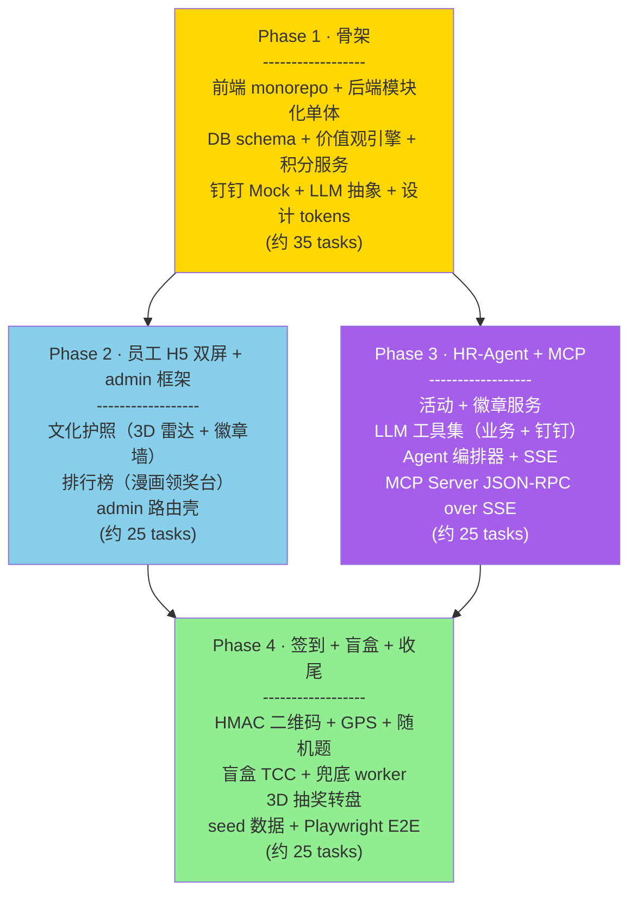

# 文化积分商城·动漫风钉钉应用 总路线图

> **面向 Agent 执行：** 必须使用 `superpowers:subagent-driven-development`（推荐）或 `superpowers:executing-plans` 逐任务执行。各 Phase plan 内步骤使用 checkbox（`- [ ]`）追踪。
>
> 关联文档：
> - 设计文档：[`2026-05-22-文化积分商城-动漫风钉钉应用-design.md`](../specs/2026-05-22-文化积分商城-动漫风钉钉应用-design.md)
> - 业务方案：[`文化积分商城方案-v5.md`](../../specs/文化积分商城方案-v5.md)

**目标：** 在 `culture_points_mall/`（Go 后端）与新建 `culture_points_mall_web/`（前端 Monorepo）中实现项目骨架 + 4 个端到端模块（员工 H5 双屏、HR-Agent + 工具链、签到加分闭环、MCP Server + 盲盒抽奖 TCC），其他模块留接口/页面占位。

**架构概述：** 后端走 Go + Gin + 模块化单体（DDD 风格） + 双 binary（`cmd/server` HTTP + `cmd/mcp` SSE）共享 module service。前端 React 19 + Vite + UnoCSS + Monorepo（apps/h5 + apps/admin + packages/ui 动漫风设计系统）。LLM 抽象为接口，默认 Claude 4.7 Sonnet，可切 OpenAI/DeepSeek/Qwen。钉钉适配层 Mock/Real 可切换，演示走 Mock。

**技术栈：** Go 1.23 / Gin / GORM / asynq / MySQL 8 / Redis 7 / React 19 / Vite 5 / TypeScript 5 / UnoCSS / shadcn/ui / Framer Motion / GSAP / Lottie / @react-three/fiber / Zustand / TanStack Query / pnpm workspace / Turborepo

---

## 一、Phase 依赖图



**关键依赖说明：**

- Phase 1 是所有后续 Phase 的前置（DB 表 / 价值观引擎 / 积分服务 / 钉钉 Mock / 设计 tokens 都在此交付）
- Phase 2 与 Phase 3 在 Phase 1 完成后**理论上可并行**，但实际推进时建议**串行**——避免后端模块冲突（activities 模块在 Phase 3 创建，被 Phase 4 签到 + Agent 工具集使用）
- Phase 4 依赖 Phase 2（前端 UI 系统已稳定）+ Phase 3（agent 工具集 + activities 模块已建）

---

## 二、Phase 与 Plan 文件索引

| Phase | Plan 文档 | 主要交付 | Task 数 |
|-------|-----------|---------|--------|
| 1 · 骨架 | [`2026-05-22-phase-1-骨架.md`](2026-05-22-phase-1-骨架.md) | 前后端 monorepo / 后端模块化单体 / DB schema / 价值观引擎 / 积分服务 / 钉钉 Mock / LLM 抽象 / 设计 tokens & primitives | ~35 |
| 2 · 员工 H5 双屏 | [`2026-05-22-phase-2-员工H5双屏.md`](2026-05-22-phase-2-员工H5双屏.md) | 文化护照（3D 雷达 + 徽章墙 + 流水）/ 排行榜（漫画领奖台）/ admin 框架壳 / 认证 | ~25 |
| 3 · HR-Agent + MCP | [`2026-05-22-phase-3-HR-Agent-MCP.md`](2026-05-22-phase-3-HR-Agent-MCP.md) | 活动 + 徽章服务 / LLM 工具集 / Agent 编排器 + SSE / MCP Server / admin Chat UI / 模拟推送面板 | ~25 |
| 4 · 签到 + 盲盒 + 收尾 | [`2026-05-22-phase-4-签到盲盒收尾.md`](2026-05-22-phase-4-签到盲盒收尾.md) | HMAC 签到 / 盲盒 TCC / 3D 转盘 / seed / Playwright E2E / README | ~25 |

---

## 三、Spec → Phase 任务映射

| Spec 章节 | 关键产出 | 对应 Phase |
|-----------|---------|-----------|
| 5.1 价值观引擎与数据模型 | 6 维度配置 / 维度记账 / 快照表 | Phase 1 |
| 5.2 员工 H5·文化护照 | 3D 雷达 + 徽章墙 + 流水 | Phase 2 |
| 5.3 员工 H5·文化分排行榜 | 总榜/维度榜/部门榜 + 领奖台 | Phase 2 |
| 5.4 HR-Agent + 工具链 + MCP Server | 流式 SSE / 工具集 / MCP 协议 | Phase 3 |
| 5.5 签到加分闭环 | HMAC + GPS + 题 + 徽章触发 | Phase 4 |
| 5.6 盲盒抽奖 TCC | TCC + 兜底 + 3D 转盘 | Phase 4 |
| 5.7 钉钉适配层 | Mock/Real 可切换 + 模拟推送面板 | Phase 1（Mock） + Phase 3（面板 UI） |
| 5.8 LLM Client | 抽象接口 + 多 provider | Phase 1（接口 + Claude） + Phase 3（stream 完整化） |
| 5.9 认证与多租户 | JWT + 钉钉 jsapi | Phase 2 |
| 5.10 前端设计系统 | tokens + primitives + components | Phase 1（tokens + primitives） + Phase 2-4（各 component） |
| 第六章 测试策略 | 单元 + 集成 + E2E | 各 Phase 持续 + Phase 4 集中 E2E |
| 第七章 部署 | docker-compose + nginx | Phase 1（compose） + Phase 4（README） |
| 第十一章 验收标准 | 11 条 | Phase 4 集中验收 |

---

## 四、全局约定（所有 Phase 都遵守）

### 4.1 后端模块化纪律

- **module 之间只能通过 service 接口互调**，禁止跨模块直接 import `repository`、`domain` 内部类型；公共类型放 `internal/shared/types`。
- 例：`points` 需要 `values.GetDimensions`，应在启动时通过依赖注入拿到 `values.Service`，而不是直接 `import .../modules/values/repository`。
- module 内部分四层：`domain` → `repository` → `service` → `handler`，handler 只做参数校验和调用 service。

### 4.2 前端 import 边界

- `apps/*` 可 import `packages/*`，反之不行。
- `packages/ui` 不 import `apps/*` 或其他 `packages/api-client` 等业务包，保持纯视觉。
- `packages/api-client` 只依赖 `packages/types`。

### 4.3 测试与 Mock 边界（呼应 CLAUDE.md）

- 只 mock 外部 IO：钉钉、Claude API、OpenAI API、OSS、Kafka 等。
- **不 mock**：项目自有 module / repository / service / trait / helper。
- 涉及 ORM/序列化的新组件，**必须至少 1 条真实 Repository + 真实 MySQL 的集成测试**（dockertest 或本地 docker-compose 启的 MySQL）。
- 测试目录与被测代码并列：`internal/modules/points/service/transaction_service_test.go`。

### 4.4 Git Commit Message 规范（呼应 CLAUDE.md）

格式：`英文类型:中文描述`（英文半角冒号，无空格）。

| 类型 | 用途示例 |
|------|---------|
| `feat` | `feat:新增积分维度记账服务` |
| `fix` | `fix:修复盲盒 TCC 兜底 worker 死循环` |
| `chore` | `chore:升级 GORM 到 v1.25.10` |
| `refactor` | `refactor:抽离 LLMClient 接口` |
| `test` | `test:补充签到服务真实 MySQL 集成测试` |
| `docs` | `docs:补充 MCP Server 接入指引` |
| `style` | `style:统一 handler 命名` |
| `perf` | `perf:优化排行榜快照刷新查询` |

### 4.5 PHP 版本约束

本项目是 Go + React 全新项目，**不涉及** CLAUDE.md 中 PHP 7.2/7.4 的语法约束。

### 4.6 文档语言

所有由本流程产出的 spec、plan、阶段总结**全部中文撰写**（呼应 CLAUDE.md）。提交日志亦同。代码注释保持英文（与开源生态一致），但模块级文档（包级 README.md / 接口说明）中文。

---

## 五、推进策略

### 5.1 推荐：subagent-driven-development

每 Phase 内的 task 用 **subagent-driven-development** 模式：一个主 agent 分发 task 给若干 fresh subagent（每 task 一个），主 agent 在 task 之间做 quality gate review。

特点：
- subagent 之间无上下文污染
- 每个 task 独立可回滚
- 主 agent 集中审查 commit 与测试

### 5.2 Phase 切换检查点

每个 Phase 结束前需通过下列 checklist：

```
□ 当前 Phase 全部 task 已 commit
□ 当前 Phase 所有新增/修改单元测试本地通过
□ 当前 Phase 关键集成测试通过（真 MySQL + Redis 启动）
□ 当前 Phase 引入的新 module 在 router 已注册，启动无 panic
□ 当前 Phase 引入的新前端页面 dev server 可访问、无控制台报错
□ Storybook 新增组件可见（若有）
□ Phase 结束总结追加到 `docs/superpowers/notes/2026-05-22-phase-{N}-总结.md`（首次创建）
```

### 5.3 范围治理

每 task 严格执行：
- **不做超范围工作**——发现潜在改进，记到 `docs/superpowers/notes/improvements.md`，不在本 task 修。
- **TDD 优先**——先写失败测试，再写最小实现，再 commit。
- **单 task 不超过 30 分钟**——超时拆分，绝不强行塞进一个 commit。

### 5.4 Phase 之间不可见的工作

每 Phase plan 末尾留出「**未在本 Phase 涉及但已知后续需要**」清单，避免遗漏。

---

## 六、初始化前置（开始 Phase 1 之前完成）

由于 `culture_points_mall/` 当前**不是 Git 仓库**，进入 Phase 1 之前需完成下列前置：

```bash
cd /Users/standardsoftware/go/culture_points_mall
git init
git add docs/
git commit -m "docs:加入项目方案 spec 与 plan 文档"
```

前端仓库为新建目录，初始化在 Phase 1 Task 1.1 中处理。

---

## 七、Phase 总览时序

```mermaid
gantt
    title 4 Phase 顺序推进
    dateFormat YYYY-MM-DD
    section Phase 1 骨架
    前端 monorepo 初始化          :p1a, 2026-05-22, 1d
    后端 Go 项目骨架              :p1b, after p1a, 1d
    DB schema + 迁移              :p1c, after p1b, 1d
    价值观引擎 + 积分服务         :p1d, after p1c, 2d
    钉钉 Mock + LLM 抽象          :p1e, after p1d, 1d
    设计 tokens + primitives      :p1f, parallel p1a, 2d

    section Phase 2 员工 H5
    认证与钉钉 jsapi              :p2a, after p1e, 1d
    文化护照后端 + 前端           :p2b, after p2a, 2d
    排行榜后端 + 前端             :p2c, after p2b, 2d
    admin 框架壳子                :p2d, after p1e, 1d

    section Phase 3 HR-Agent + MCP
    Activity + Achievements       :p3a, after p2c, 1d
    LLM stream 完整化             :p3b, after p3a, 1d
    Agent 编排器 + 工具集         :p3c, after p3b, 2d
    MCP Server                    :p3d, after p3c, 1d
    admin Chat UI + 模拟推送面板  :p3e, after p3c, 2d

    section Phase 4 签到 + 盲盒
    签到 HMAC + GPS + 题          :p4a, after p3e, 2d
    盲盒 TCC + 3D 转盘            :p4b, after p4a, 2d
    seed + E2E + README           :p4c, after p4b, 2d
```

排期为参考排序，不强制时间点，实际节奏取决于执行 agent 速度。

---

## 八、Quality Gates

每个 Phase 结束时主 agent 跑下列命令套件，全部通过才能进入下一 Phase：

```bash
# 后端
cd culture_points_mall
go vet ./...
go test -race ./...                                  # 所有单元测试
docker-compose -f docker-compose.test.yml up -d      # 起 test MySQL + Redis
go test -tags=integration -race ./...                # 集成测试
docker-compose -f docker-compose.test.yml down

# 前端
cd ../culture_points_mall_web
pnpm install
pnpm -r lint
pnpm -r typecheck
pnpm -r test                                          # Vitest
pnpm -r build                                         # 构建检查
```

集成测试与 E2E 在 Phase 4 集中跑 Playwright。

---

## 九、未在 4 Phase 范围但已知后续需要

为避免后续遗漏，记录已知但本期不交付的占位项：

| 项目 | 计划 | 占位 |
|------|------|------|
| 商品兑换主流程 | 仅盲盒走 TCC，普通商品兑换留接口 | `mall/service.RedeemItem` 接口 + handler 占位 |
| AI 数据洞察（Text-to-SQL） | 后端 `insights` 模块 + admin 页面 | 路由 + handler 返回 mock |
| AI 内容生成（海报/TTS） | 通义万相 + 火山 TTS | LLM 工具集留 `generate_poster` 占位 |
| 反作弊 Agent | 异常检测 + 工单生成 | 不实现 |
| 跨企业指数榜 | 多租户脱敏聚合 | 不实现 |
| OA 审批积分异议申诉 | 钉钉 OA 流程 | dingtalk Client `StartOAProcess` 接口签名定义，无实现 |
| 真接入钉钉企业版 | 切 RealClient | 接口已抽象，DI 即可切换 |
| OpenAI/DeepSeek/Qwen 实现 | LLM 多 provider | 接口已抽象，只实现 Claude；其他留 stub |
| K8s 镜像 | Dockerfile | Phase 1 写 `docker-compose.yml`；K8s 留 README 提示 |

后续如需补做，按子项目独立 spec → plan → 执行。

---

## 十、下一步

阅读各 Phase plan：

1. [Phase 1 · 骨架](2026-05-22-phase-1-骨架.md)
2. [Phase 2 · 员工 H5 双屏](2026-05-22-phase-2-员工H5双屏.md)
3. [Phase 3 · HR-Agent + MCP](2026-05-22-phase-3-HR-Agent-MCP.md)
4. [Phase 4 · 签到 + 盲盒 + 收尾](2026-05-22-phase-4-签到盲盒收尾.md)

按 4.4 节约定，每完成一个 task 提交一次 commit。每完成一个 Phase 运行 8 节 Quality Gates。

> 路线图文档结束。
