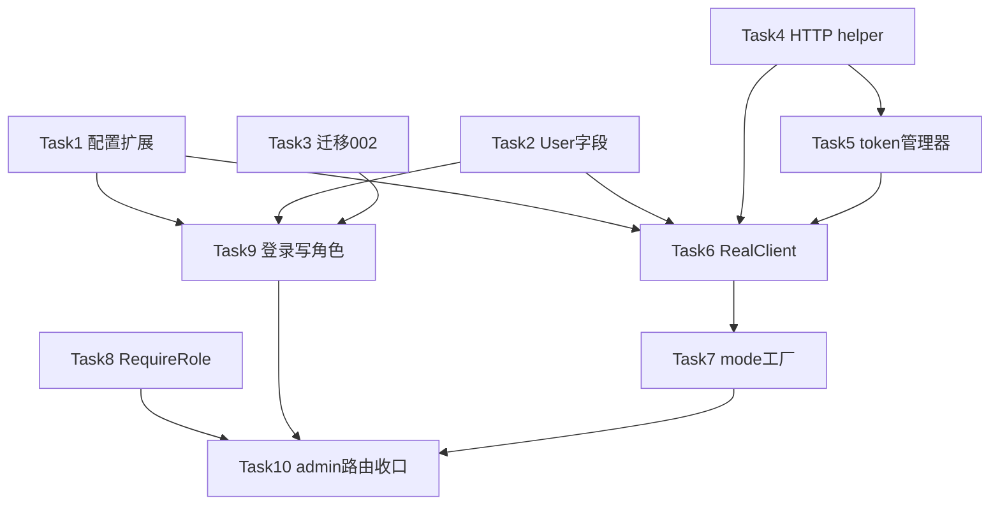

# 钉钉对接 Phase 1 实现计划（公共基础 + H5 免登做实 + 管理员门禁）

> **面向 Agent 执行：** 必须使用 superpowers:subagent-driven-development（推荐）或 superpowers:executing-plans 逐任务执行。步骤用 `- [ ]` 复选框跟踪。

**目标：** 把钉钉 `Client` 从纯 Mock 升级为「按 `mode` 切换 mock/real」，并交付第一项真实能力——员工 H5 免登（`GetUserByCode` 真实实现）+ 管理员角色门禁。

**架构概述：** 新增满足现有 `dingtalk.Client` 接口的 `RealClient`（HTTP 调钉钉 OpenAPI，企业 token 走 Redis 缓存），用工厂按 `cfg.DingTalk.Mode` 选 mock/real，调用方零改动。登录时按钉钉 `sys` 标志或配置白名单写入 `admin` 角色，新增 `RequireRole` 中间件并把 `/admin` 路由收口到带门禁的分组。

**技术栈：** Go 1.24 / Gin / GORM / go-redis v9 / golang-jwt v5 / testify / httptest / miniredis / dockertest。

## 设计约束（来自现有代码审计）

- 接口契约不变：`internal/platform/dingtalk/client.go:5-16`，`RealClient` 必须实现全部 7 个方法；本期只做实 `GetUserByCode`，其余 6 个返回 `errNotImplemented`（Phase 3 填实）。
- `RealClient` 的钉钉域名必须可在测试中替换为 `httptest` 地址——对齐 `internal/platform/llm/claude_test.go:13-35`（`NewClaude(key, srv.URL, model)` 注入 baseURL）。
- 企业 token 缓存用 Redis；单测用 `miniredis`（参考 `internal/modules/mall/service/service_integration_test.go:69-72`）。
- 集成测试用 `dockertest` 起 MySQL + `migrate.Runner{Dir:"../../../../migrations"}.Up()`（参考 `internal/modules/points/service/service_integration_test.go:27-72`），`//go:build integration`，testify `require`。
- 迁移 runner 无版本表、每次跑全部 `*.up.sql`、按 `;\n` 分句、面向**全新库**（`internal/migrate/runner.go`）；`002` 写普通 `ALTER`，与 `001` 风格一致。
- `cpmctx.Roles(ctx)` getter 已存在（`internal/shared/ctx/ctx.go:36`）；roles 已在 `attachContext` 注入（`internal/auth/middleware.go:63`）。

## 文件结构

| 文件 | 职责 | 动作 |
|---|---|---|
| `internal/config/config.go` | `DingTalkCfg` 增字段 + `expandEnv` 覆盖钉钉密钥 | 改 |
| `internal/config/config_test.go` | 验证 expandEnv 展开钉钉密钥 | 改 |
| `configs/config.example.yaml` | 新字段占位（空值） | 改 |
| `internal/platform/dingtalk/types.go` | `User` 增 `UnionID`、`IsAdmin` | 改 |
| `internal/platform/dingtalk/mock.go` | mock 填充新字段 | 改 |
| `internal/platform/dingtalk/mock_test.go` | 断言 mock 返回新字段 | 改 |
| `migrations/002_add_dingtalk_user_fields.{up,down}.sql` | users 加 `union_id`/`is_admin` | 建 |
| `internal/platform/dingtalk/http.go` | `caller`：两套域名 HTTP + 错误信封 | 建 |
| `internal/platform/dingtalk/http_test.go` | caller 单测（httptest） | 建 |
| `internal/platform/dingtalk/token.go` | `tokenManager`：企业 token + Redis 缓存 | 建 |
| `internal/platform/dingtalk/token_test.go` | token 单测（miniredis+httptest） | 建 |
| `internal/platform/dingtalk/real.go` | `RealClient` + `GetUserByCode` 真实实现 | 建 |
| `internal/platform/dingtalk/real_test.go` | GetUserByCode 单测（httptest） | 建 |
| `internal/platform/dingtalk/factory.go` | `New(cfg,rdb,mock)` 工厂 | 建 |
| `internal/platform/dingtalk/factory_test.go` | 工厂选择单测 | 建 |
| `cmd/server/main.go` | 用工厂装配 ding | 改 |
| `internal/auth/middleware.go` | `RequireRole` | 改 |
| `internal/auth/middleware_test.go` | RequireRole 单测 | 建 |
| `internal/auth/handler.go` | 登录写角色 + upsert union_id/is_admin | 改 |
| `internal/auth/handler_integration_test.go` | 登录+门禁集成测试（真实库） | 建 |
| `internal/router/router.go` | admin 分组收口 | 改 |

## 任务依赖



---

### Task 1: 扩展 DingTalkCfg 与 expandEnv

**Files:**
- Modify: `internal/config/config.go:33-39`（结构体）、`:97-102`（expandEnv）
- Modify: `configs/config.example.yaml:13-18`
- Test: `internal/config/config_test.go`

- [ ] **Step 1: 写失败测试**

在 `internal/config/config_test.go` 追加：

```go
func TestExpandEnv_DingTalk(t *testing.T) {
	t.Setenv("DINGTALK_APP_SECRET", "secret-xyz")
	t.Setenv("DINGTALK_ROBOT_SECRET", "robot-abc")
	c := &Config{}
	c.DingTalk.AppKey = "ak-plain"
	c.DingTalk.AppSecret = "${DINGTALK_APP_SECRET}"
	c.DingTalk.Robots = []RobotCfg{{ID: "g1", Webhook: "https://x?access_token=t", Secret: "${DINGTALK_ROBOT_SECRET}"}}
	expandEnv(c)
	require.Equal(t, "ak-plain", c.DingTalk.AppKey)
	require.Equal(t, "secret-xyz", c.DingTalk.AppSecret)
	require.Equal(t, "robot-abc", c.DingTalk.Robots[0].Secret)
}
```

- [ ] **Step 2: 跑测试确认失败**

Run: `go test ./internal/config/ -run TestExpandEnv_DingTalk -v`
Expected: 编译失败（`RobotCfg` 未定义）。

- [ ] **Step 3: 实现**

`internal/config/config.go` 把 `DingTalkCfg` 替换为：

```go
type RobotCfg struct {
	ID      string `mapstructure:"id"`
	Name    string `mapstructure:"name"`
	Webhook string `mapstructure:"webhook"`
	Secret  string `mapstructure:"secret"`
}
type DingTalkCfg struct {
	Mode                     string
	AppKey                   string     `mapstructure:"app_key"`
	AppSecret                string     `mapstructure:"app_secret"`
	CorpID                   string     `mapstructure:"corp_id"`
	AgentID                  int64      `mapstructure:"agent_id"`
	AdminUserIDs             []string   `mapstructure:"admin_user_ids"`
	CalendarOrganizerUnionID string    `mapstructure:"calendar_organizer_unionid"`
	Robots                   []RobotCfg `mapstructure:"robots"`
}
```

在 `expandEnv` 末尾追加：

```go
	c.DingTalk.AppKey = os.ExpandEnv(c.DingTalk.AppKey)
	c.DingTalk.AppSecret = os.ExpandEnv(c.DingTalk.AppSecret)
	for i := range c.DingTalk.Robots {
		c.DingTalk.Robots[i].Webhook = os.ExpandEnv(c.DingTalk.Robots[i].Webhook)
		c.DingTalk.Robots[i].Secret = os.ExpandEnv(c.DingTalk.Robots[i].Secret)
	}
```

`configs/config.example.yaml` 的 `dingtalk:` 段（`:13-18`）替换为：

```yaml
dingtalk:
  mode: "mock"
  app_key: ""
  app_secret: ""
  corp_id: ""
  agent_id: 0
  admin_user_ids: []
  calendar_organizer_unionid: ""
  robots: []
```

- [ ] **Step 4: 跑测试确认通过**

Run: `go test ./internal/config/ -run TestExpandEnv_DingTalk -v`
Expected: PASS。再跑 `go build ./...` 确认全项目编译（新字段不破坏 `cmd/server/main.go` 现有引用）。

- [ ] **Step 5: 提交**

```bash
git add internal/config/config.go internal/config/config_test.go configs/config.example.yaml
git commit -m "feat:钉钉配置扩展支持管理员白名单与群机器人"
```

---

### Task 2: User 结构增 UnionID/IsAdmin 并让 mock 填充

**Files:**
- Modify: `internal/platform/dingtalk/types.go:5-10`
- Modify: `internal/platform/dingtalk/mock.go:53-59`
- Test: `internal/platform/dingtalk/mock_test.go`

- [ ] **Step 1: 写失败测试**

在 `internal/platform/dingtalk/mock_test.go` 追加：

```go
func TestMockGetUserByCode_FillsNewFields(t *testing.T) {
	m := NewMock(nil, NewBus())
	u, err := m.GetUserByCode(context.Background(), "abc")
	require.NoError(t, err)
	require.Equal(t, "mock_abc", u.DingUserID)
	require.NotEmpty(t, u.UnionID)
	require.False(t, u.IsAdmin)
}
```

（若文件未导入 `context`/`require`，补上 import。）

- [ ] **Step 2: 跑测试确认失败**

Run: `go test ./internal/platform/dingtalk/ -run TestMockGetUserByCode_FillsNewFields -v`
Expected: 编译失败（`u.UnionID` 未定义）。

- [ ] **Step 3: 实现**

`internal/platform/dingtalk/types.go` 的 `User` 改为：

```go
type User struct {
	DingUserID string
	Name       string
	AvatarURL  string
	DeptIDs    []int64
	UnionID    string
	IsAdmin    bool
}
```

`internal/platform/dingtalk/mock.go` 的 `GetUserByCode` 改为：

```go
func (m *MockClient) GetUserByCode(_ context.Context, code string) (User, error) {
	return User{
		DingUserID: "mock_" + code,
		Name:       "Mock 用户 " + code,
		AvatarURL:  fmt.Sprintf("https://api.dicebear.com/9.x/notionists/svg?seed=%s", code),
		UnionID:    "mock_union_" + code,
		IsAdmin:    false,
	}, nil
}
```

- [ ] **Step 4: 跑测试确认通过**

Run: `go test ./internal/platform/dingtalk/ -run TestMockGetUserByCode_FillsNewFields -v`
Expected: PASS。

- [ ] **Step 5: 提交**

```bash
git add internal/platform/dingtalk/types.go internal/platform/dingtalk/mock.go internal/platform/dingtalk/mock_test.go
git commit -m "feat:钉钉User增unionId与isAdmin字段"
```

---

### Task 3: 迁移 002 给 users 加 union_id/is_admin

**Files:**
- Create: `migrations/002_add_dingtalk_user_fields.up.sql`
- Create: `migrations/002_add_dingtalk_user_fields.down.sql`

- [ ] **Step 1: 写 up 迁移**

`migrations/002_add_dingtalk_user_fields.up.sql`：

```sql
-- 钉钉用户扩展字段：unionId（日历接口需要）+ 是否管理员（RBAC）
ALTER TABLE users
  ADD COLUMN union_id VARCHAR(128) DEFAULT NULL,
  ADD COLUMN is_admin TINYINT(1) NOT NULL DEFAULT 0,
  ADD UNIQUE KEY uk_tenant_union (tenant_id, union_id);
```

- [ ] **Step 2: 写 down 迁移**

`migrations/002_add_dingtalk_user_fields.down.sql`：

```sql
ALTER TABLE users
  DROP INDEX uk_tenant_union,
  DROP COLUMN union_id,
  DROP COLUMN is_admin;
```

- [ ] **Step 3: 验证迁移是合法 SQL（复用现有集成测试的 TestMain）**

现有集成测试的 `TestMain` 会在全新库上跑全部 `*.up.sql`（含 002）。运行：

Run: `make test-int`
Expected: 现有 values/points/mall 等集成测试全绿——证明 `001+002` 在全新库可顺序应用、002 是合法 SQL。

> 注：runner 面向全新库、无版本表（`internal/migrate/runner.go`）。对已存在的本地/联调库，apply 002 前需确保该库尚未有这两列（与 001 同约定）。

- [ ] **Step 4: 提交**

```bash
git add migrations/002_add_dingtalk_user_fields.up.sql migrations/002_add_dingtalk_user_fields.down.sql
git commit -m "feat:迁移002给users增union_id与is_admin"
```

---

### Task 4: 钉钉 HTTP helper（caller）

**Files:**
- Create: `internal/platform/dingtalk/http.go`
- Test: `internal/platform/dingtalk/http_test.go`

- [ ] **Step 1: 写失败测试**

`internal/platform/dingtalk/http_test.go`：

```go
package dingtalk

import (
	"context"
	"net/http"
	"net/http/httptest"
	"testing"

	"github.com/stretchr/testify/require"
)

func TestCaller_OapiPost_TokenInQueryAndErrcode(t *testing.T) {
	srv := httptest.NewServer(http.HandlerFunc(func(w http.ResponseWriter, r *http.Request) {
		require.Equal(t, "/topapi/demo", r.URL.Path)
		require.Equal(t, "tok123", r.URL.Query().Get("access_token"))
		_, _ = w.Write([]byte(`{"errcode":0,"errmsg":"ok","result":{"v":7}}`))
	}))
	defer srv.Close()

	c := newCaller()
	c.oapiBase = srv.URL
	var out struct {
		Result struct{ V int `json:"v"` } `json:"result"`
	}
	require.NoError(t, c.oapiPost(context.Background(), "/topapi/demo", "tok123", map[string]any{"a": 1}, &out))
	require.Equal(t, 7, out.Result.V)
}

func TestCaller_OapiPost_ErrcodeNonZero(t *testing.T) {
	srv := httptest.NewServer(http.HandlerFunc(func(w http.ResponseWriter, r *http.Request) {
		_, _ = w.Write([]byte(`{"errcode":40001,"errmsg":"invalid token"}`))
	}))
	defer srv.Close()
	c := newCaller()
	c.oapiBase = srv.URL
	err := c.oapiPost(context.Background(), "/topapi/demo", "bad", map[string]any{}, nil)
	require.Error(t, err)
	require.Contains(t, err.Error(), "40001")
}

func TestCaller_ApiPost_HeaderTokenAndStatus(t *testing.T) {
	srv := httptest.NewServer(http.HandlerFunc(func(w http.ResponseWriter, r *http.Request) {
		require.Equal(t, "utok", r.Header.Get("x-acs-dingtalk-access-token"))
		_, _ = w.Write([]byte(`{"accessToken":"AT","expireIn":7200}`))
	}))
	defer srv.Close()
	c := newCaller()
	c.apiBase = srv.URL
	var out struct {
		AccessToken string `json:"accessToken"`
	}
	require.NoError(t, c.apiPost(context.Background(), "/v1.0/x", "utok", map[string]any{}, &out))
	require.Equal(t, "AT", out.AccessToken)
}

func TestCaller_ApiPost_Non2xx(t *testing.T) {
	srv := httptest.NewServer(http.HandlerFunc(func(w http.ResponseWriter, r *http.Request) {
		w.WriteHeader(401)
		_, _ = w.Write([]byte(`{"code":"unauthorized"}`))
	}))
	defer srv.Close()
	c := newCaller()
	c.apiBase = srv.URL
	err := c.apiPost(context.Background(), "/v1.0/x", "", map[string]any{}, nil)
	require.Error(t, err)
	require.Contains(t, err.Error(), "401")
}
```

- [ ] **Step 2: 跑测试确认失败**

Run: `go test ./internal/platform/dingtalk/ -run TestCaller -v`
Expected: 编译失败（`newCaller` 未定义）。

- [ ] **Step 3: 实现**

`internal/platform/dingtalk/http.go`：

```go
package dingtalk

import (
	"bytes"
	"context"
	"encoding/json"
	"fmt"
	"io"
	"net/http"
	"net/url"
	"time"
)

// caller 封装钉钉两套域名的请求风格。
// oapi.dingtalk.com：token 走 ?access_token= 查询，错误读 errcode。
// api.dingtalk.com：token 走 header x-acs-dingtalk-access-token，错误读 HTTP 状态。
type caller struct {
	hc       *http.Client
	oapiBase string
	apiBase  string
}

func newCaller() *caller {
	return &caller{
		hc:       &http.Client{Timeout: 10 * time.Second},
		oapiBase: "https://oapi.dingtalk.com",
		apiBase:  "https://api.dingtalk.com",
	}
}

func (c *caller) oapiPost(ctx context.Context, path, token string, in, out any) error {
	u := c.oapiBase + path + "?access_token=" + url.QueryEscape(token)
	raw, err := c.do(ctx, u, "", in)
	if err != nil {
		return err
	}
	var env struct {
		ErrCode int    `json:"errcode"`
		ErrMsg  string `json:"errmsg"`
	}
	_ = json.Unmarshal(raw, &env)
	if env.ErrCode != 0 {
		return fmt.Errorf("dingtalk oapi %s errcode=%d errmsg=%s", path, env.ErrCode, env.ErrMsg)
	}
	if out != nil {
		return json.Unmarshal(raw, out)
	}
	return nil
}

func (c *caller) apiPost(ctx context.Context, path, token string, in, out any) error {
	raw, err := c.do(ctx, c.apiBase+path, token, in)
	if err != nil {
		return err
	}
	if out != nil {
		return json.Unmarshal(raw, out)
	}
	return nil
}

// do 发 POST，返回响应体；apiPost 用 token!="" 时设钉钉新接口 header，并对非 2xx 报错。
func (c *caller) do(ctx context.Context, fullURL, headerToken string, in any) ([]byte, error) {
	body, err := json.Marshal(in)
	if err != nil {
		return nil, err
	}
	req, err := http.NewRequestWithContext(ctx, http.MethodPost, fullURL, bytes.NewReader(body))
	if err != nil {
		return nil, err
	}
	req.Header.Set("Content-Type", "application/json")
	if headerToken != "" {
		req.Header.Set("x-acs-dingtalk-access-token", headerToken)
	}
	resp, err := c.hc.Do(req)
	if err != nil {
		return nil, err
	}
	defer resp.Body.Close()
	raw, _ := io.ReadAll(resp.Body)
	if resp.StatusCode/100 != 2 {
		return nil, fmt.Errorf("dingtalk %s status=%d body=%s", fullURL, resp.StatusCode, string(raw))
	}
	return raw, nil
}
```

- [ ] **Step 4: 跑测试确认通过**

Run: `go test ./internal/platform/dingtalk/ -run TestCaller -v`
Expected: PASS（4 条）。

- [ ] **Step 5: 提交**

```bash
git add internal/platform/dingtalk/http.go internal/platform/dingtalk/http_test.go
git commit -m "feat:新增钉钉HTTP helper支持两套域名"
```

---

### Task 5: 企业 token 管理器（Redis 缓存）

**Files:**
- Create: `internal/platform/dingtalk/token.go`
- Test: `internal/platform/dingtalk/token_test.go`

- [ ] **Step 1: 写失败测试**

`internal/platform/dingtalk/token_test.go`：

```go
package dingtalk

import (
	"context"
	"net/http"
	"net/http/httptest"
	"sync/atomic"
	"testing"

	"github.com/alicebob/miniredis/v2"
	"github.com/redis/go-redis/v9"
	"github.com/stretchr/testify/require"
)

func TestTokenManager_FetchThenCache(t *testing.T) {
	var hits int32
	srv := httptest.NewServer(http.HandlerFunc(func(w http.ResponseWriter, r *http.Request) {
		require.Equal(t, "/v1.0/oauth2/accessToken", r.URL.Path)
		atomic.AddInt32(&hits, 1)
		_, _ = w.Write([]byte(`{"accessToken":"AT-1","expireIn":7200}`))
	}))
	defer srv.Close()

	mr, err := miniredis.Run()
	require.NoError(t, err)
	defer mr.Close()
	rdb := redis.NewClient(&redis.Options{Addr: mr.Addr()})

	cl := newCaller()
	cl.apiBase = srv.URL
	tm := &tokenManager{api: cl, rdb: rdb, appKey: "ak", appSecret: "as"}

	tok, err := tm.corpToken(context.Background())
	require.NoError(t, err)
	require.Equal(t, "AT-1", tok)

	tok2, err := tm.corpToken(context.Background())
	require.NoError(t, err)
	require.Equal(t, "AT-1", tok2)
	require.Equal(t, int32(1), atomic.LoadInt32(&hits), "第二次应命中缓存不再请求")
}
```

- [ ] **Step 2: 跑测试确认失败**

Run: `go test ./internal/platform/dingtalk/ -run TestTokenManager -v`
Expected: 编译失败（`tokenManager` 未定义）。

- [ ] **Step 3: 实现**

`internal/platform/dingtalk/token.go`：

```go
package dingtalk

import (
	"context"
	"fmt"
	"time"

	"github.com/redis/go-redis/v9"
)

type tokenManager struct {
	api       *caller
	rdb       *redis.Client
	appKey    string
	appSecret string
}

func (t *tokenManager) cacheKey() string { return "dingtalk:corp_token:" + t.appKey }

// corpToken 取企业 access_token，优先 Redis 缓存，miss 则请求钉钉并按 expireIn-300s 回写。
func (t *tokenManager) corpToken(ctx context.Context) (string, error) {
	if v, err := t.rdb.Get(ctx, t.cacheKey()).Result(); err == nil && v != "" {
		return v, nil
	}
	var out struct {
		AccessToken string `json:"accessToken"`
		ExpireIn    int    `json:"expireIn"`
	}
	if err := t.api.apiPost(ctx, "/v1.0/oauth2/accessToken", "", map[string]string{
		"appKey":    t.appKey,
		"appSecret": t.appSecret,
	}, &out); err != nil {
		return "", err
	}
	if out.AccessToken == "" {
		return "", fmt.Errorf("dingtalk: empty accessToken")
	}
	ttl := time.Duration(out.ExpireIn-300) * time.Second
	if ttl < time.Minute {
		ttl = time.Minute
	}
	_ = t.rdb.Set(ctx, t.cacheKey(), out.AccessToken, ttl).Err()
	return out.AccessToken, nil
}
```

- [ ] **Step 4: 跑测试确认通过**

Run: `go test ./internal/platform/dingtalk/ -run TestTokenManager -v`
Expected: PASS。

- [ ] **Step 5: 提交**

```bash
git add internal/platform/dingtalk/token.go internal/platform/dingtalk/token_test.go
git commit -m "feat:新增钉钉企业token管理器带Redis缓存"
```

---

### Task 6: RealClient + GetUserByCode 真实实现

**Files:**
- Create: `internal/platform/dingtalk/real.go`
- Test: `internal/platform/dingtalk/real_test.go`

- [ ] **Step 1: 写失败测试**

`internal/platform/dingtalk/real_test.go`：

```go
package dingtalk

import (
	"context"
	"io"
	"net/http"
	"net/http/httptest"
	"testing"

	"github.com/alicebob/miniredis/v2"
	"github.com/redis/go-redis/v9"
	"github.com/stretchr/testify/require"

	"github.com/standardsoftware/culture_points_mall/internal/config"
)

func TestRealClient_GetUserByCode(t *testing.T) {
	srv := httptest.NewServer(http.HandlerFunc(func(w http.ResponseWriter, r *http.Request) {
		switch r.URL.Path {
		case "/v1.0/oauth2/accessToken":
			_, _ = w.Write([]byte(`{"accessToken":"AT","expireIn":7200}`))
		case "/topapi/v2/user/getuserinfo":
			b, _ := io.ReadAll(r.Body)
			require.Contains(t, string(b), `"code123"`)
			_, _ = w.Write([]byte(`{"errcode":0,"result":{"userid":"u100","unionid":"un100","sys":true}}`))
		case "/topapi/v2/user/get":
			_, _ = w.Write([]byte(`{"errcode":0,"result":{"userid":"u100","unionid":"un100","name":"张三","avatar":"http://a/x.png","dept_id_list":[10,20]}}`))
		default:
			t.Fatalf("unexpected path %s", r.URL.Path)
		}
	}))
	defer srv.Close()

	mr, err := miniredis.Run()
	require.NoError(t, err)
	defer mr.Close()
	rdb := redis.NewClient(&redis.Options{Addr: mr.Addr()})

	c := NewReal(config.DingTalkCfg{AppKey: "ak", AppSecret: "as"}, rdb)
	c.api.oapiBase = srv.URL
	c.api.apiBase = srv.URL

	u, err := c.GetUserByCode(context.Background(), "code123")
	require.NoError(t, err)
	require.Equal(t, "u100", u.DingUserID)
	require.Equal(t, "张三", u.Name)
	require.Equal(t, "http://a/x.png", u.AvatarURL)
	require.Equal(t, []int64{10, 20}, u.DeptIDs)
	require.Equal(t, "un100", u.UnionID)
	require.True(t, u.IsAdmin)
}

func TestRealClient_UnimplementedReturnsErr(t *testing.T) {
	c := NewReal(config.DingTalkCfg{}, nil)
	_, err := c.CreateCalendarEvent(context.Background(), CalendarRequest{})
	require.ErrorIs(t, err, errNotImplemented)
	require.Error(t, c.BotBroadcast(context.Background(), "g", Card{}))
}
```

- [ ] **Step 2: 跑测试确认失败**

Run: `go test ./internal/platform/dingtalk/ -run TestRealClient -v`
Expected: 编译失败（`NewReal` 未定义）。

- [ ] **Step 3: 实现**

`internal/platform/dingtalk/real.go`：

```go
package dingtalk

import (
	"context"
	"errors"

	"github.com/redis/go-redis/v9"

	"github.com/standardsoftware/culture_points_mall/internal/config"
)

var errNotImplemented = errors.New("dingtalk: real client method not implemented in this phase")

// RealClient 调用钉钉真实 OpenAPI。本期只做实 GetUserByCode，其余 Phase 3 填实。
type RealClient struct {
	api    *caller
	tokens *tokenManager
	cfg    config.DingTalkCfg
}

func NewReal(cfg config.DingTalkCfg, rdb *redis.Client) *RealClient {
	api := newCaller()
	return &RealClient{
		api:    api,
		tokens: &tokenManager{api: api, rdb: rdb, appKey: cfg.AppKey, appSecret: cfg.AppSecret},
		cfg:    cfg,
	}
}

func (c *RealClient) GetUserByCode(ctx context.Context, code string) (User, error) {
	tok, err := c.tokens.corpToken(ctx)
	if err != nil {
		return User{}, err
	}
	var gi struct {
		Result struct {
			UserID  string `json:"userid"`
			UnionID string `json:"unionid"`
			Sys     bool   `json:"sys"`
		} `json:"result"`
	}
	if err := c.api.oapiPost(ctx, "/topapi/v2/user/getuserinfo", tok, map[string]any{"code": code}, &gi); err != nil {
		return User{}, err
	}
	if gi.Result.UserID == "" {
		return User{}, errors.New("dingtalk: empty userid from getuserinfo")
	}
	var ug struct {
		Result struct {
			UserID     string  `json:"userid"`
			UnionID    string  `json:"unionid"`
			Name       string  `json:"name"`
			Avatar     string  `json:"avatar"`
			DeptIDList []int64 `json:"dept_id_list"`
		} `json:"result"`
	}
	if err := c.api.oapiPost(ctx, "/topapi/v2/user/get", tok, map[string]any{"userid": gi.Result.UserID, "language": "zh_CN"}, &ug); err != nil {
		return User{}, err
	}
	union := gi.Result.UnionID
	if union == "" {
		union = ug.Result.UnionID
	}
	return User{
		DingUserID: gi.Result.UserID,
		Name:       ug.Result.Name,
		AvatarURL:  ug.Result.Avatar,
		DeptIDs:    ug.Result.DeptIDList,
		UnionID:    union,
		IsAdmin:    gi.Result.Sys,
	}, nil
}

// 以下 Phase 3 填实
func (c *RealClient) CreateCalendarEvent(_ context.Context, _ CalendarRequest) (string, error) {
	return "", errNotImplemented
}
func (c *RealClient) ListCalendarResponses(_ context.Context, _ string) ([]Response, error) {
	return nil, errNotImplemented
}
func (c *RealClient) SendWorkNotice(_ context.Context, _ []string, _ Card) error {
	return errNotImplemented
}
func (c *RealClient) SendInteractiveCard(_ context.Context, _, _ string, _ map[string]any) (CardInstance, error) {
	return CardInstance{}, errNotImplemented
}
func (c *RealClient) BotBroadcast(_ context.Context, _ string, _ Card) error {
	return errNotImplemented
}
func (c *RealClient) StartOAProcess(_ context.Context, _ ApprovalRequest) (string, error) {
	return "", errNotImplemented
}
```

- [ ] **Step 4: 跑测试确认通过**

Run: `go test ./internal/platform/dingtalk/ -run TestRealClient -v`
Expected: PASS（2 条）。再 `go test ./internal/platform/dingtalk/ -v` 全包绿。

- [ ] **Step 5: 提交**

```bash
git add internal/platform/dingtalk/real.go internal/platform/dingtalk/real_test.go
git commit -m "feat:钉钉RealClient做实GetUserByCode免登"
```

---

### Task 7: mode 工厂并接入 main.go

**Files:**
- Create: `internal/platform/dingtalk/factory.go`
- Test: `internal/platform/dingtalk/factory_test.go`
- Modify: `cmd/server/main.go:46-48`

- [ ] **Step 1: 写失败测试**

`internal/platform/dingtalk/factory_test.go`：

```go
package dingtalk

import (
	"testing"

	"github.com/stretchr/testify/require"

	"github.com/standardsoftware/culture_points_mall/internal/config"
)

func TestNew_SelectsByMode(t *testing.T) {
	mock := NewMock(nil, NewBus())

	got := New(config.DingTalkCfg{Mode: "mock"}, nil, mock)
	gotMock, ok := got.(*MockClient)
	require.True(t, ok)
	require.Same(t, mock, gotMock)

	gotDefault := New(config.DingTalkCfg{Mode: ""}, nil, mock)
	dm, ok := gotDefault.(*MockClient)
	require.True(t, ok)
	require.Same(t, mock, dm)

	real := New(config.DingTalkCfg{Mode: "real", AppKey: "ak"}, nil, mock)
	_, ok = real.(*RealClient)
	require.True(t, ok)
}
```

- [ ] **Step 2: 跑测试确认失败**

Run: `go test ./internal/platform/dingtalk/ -run TestNew_SelectsByMode -v`
Expected: 编译失败（`New` 未定义）。

- [ ] **Step 3: 实现**

`internal/platform/dingtalk/factory.go`：

```go
package dingtalk

import (
	"github.com/redis/go-redis/v9"

	"github.com/standardsoftware/culture_points_mall/internal/config"
)

// New 按 mode 选择实现：real 返回 RealClient，其余返回传入的 mock。
func New(cfg config.DingTalkCfg, rdb *redis.Client, mock Client) Client {
	if cfg.Mode == "real" {
		return NewReal(cfg, rdb)
	}
	return mock
}
```

`cmd/server/main.go` 把 `:46-48`：

```go
	bus := dingtalk.NewBus()
	mock := dingtalk.NewMock(db, bus)
	var ding dingtalk.Client = mock
```

改为：

```go
	bus := dingtalk.NewBus()
	mock := dingtalk.NewMock(db, bus)
	ding := dingtalk.New(cfg.DingTalk, redisClient, mock)
```

（`mock` 仍保留：`router.Build` 的 `DingMock` 字段与后台出库页用它。`redisClient` 已在上方初始化。）

- [ ] **Step 4: 跑测试确认通过**

Run: `go test ./internal/platform/dingtalk/ -run TestNew_SelectsByMode -v`
Expected: PASS。再 `go build ./...`、`make test` 全绿。

- [ ] **Step 5: 提交**

```bash
git add internal/platform/dingtalk/factory.go internal/platform/dingtalk/factory_test.go cmd/server/main.go
git commit -m "feat:钉钉按mode工厂切换mock与real"
```

---

### Task 8: RequireRole 中间件

**Files:**
- Modify: `internal/auth/middleware.go`
- Test: `internal/auth/middleware_test.go`

- [ ] **Step 1: 写失败测试**

`internal/auth/middleware_test.go`：

```go
package auth

import (
	"net/http"
	"net/http/httptest"
	"testing"

	"github.com/gin-gonic/gin"
	"github.com/stretchr/testify/require"

	cpmctx "github.com/standardsoftware/culture_points_mall/internal/shared/ctx"
)

func injectRoles(roles []string) gin.HandlerFunc {
	return func(c *gin.Context) {
		c.Request = c.Request.WithContext(cpmctx.WithRoles(c.Request.Context(), roles))
		c.Next()
	}
}

func TestRequireRole(t *testing.T) {
	gin.SetMode(gin.TestMode)
	newSrv := func(roles []string) *httptest.Server {
		r := gin.New()
		r.GET("/admin/x", injectRoles(roles), RequireRole("admin"), func(c *gin.Context) {
			c.JSON(200, gin.H{"ok": true})
		})
		return httptest.NewServer(r)
	}

	srvAdmin := newSrv([]string{"admin"})
	defer srvAdmin.Close()
	resp, err := http.Get(srvAdmin.URL + "/admin/x")
	require.NoError(t, err)
	require.Equal(t, 200, resp.StatusCode)

	srvNone := newSrv(nil)
	defer srvNone.Close()
	resp2, err := http.Get(srvNone.URL + "/admin/x")
	require.NoError(t, err)
	require.Equal(t, 403, resp2.StatusCode)
}
```

- [ ] **Step 2: 跑测试确认失败**

Run: `go test ./internal/auth/ -run TestRequireRole -v`
Expected: 编译失败（`RequireRole` 未定义）。

- [ ] **Step 3: 实现**

`internal/auth/middleware.go` 追加：

```go
// RequireRole 要求 context 中的 roles 含指定角色，否则 403。
// 必须挂在 RequireJWT/RequireJWTWithUser 之后（roles 由 attachContext 注入）。
func RequireRole(role string) gin.HandlerFunc {
	return func(c *gin.Context) {
		for _, r := range cpmctx.Roles(c.Request.Context()) {
			if r == role {
				c.Next()
				return
			}
		}
		c.AbortWithStatusJSON(403, gin.H{"error": "forbidden", "code": "role_required"})
	}
}
```

- [ ] **Step 4: 跑测试确认通过**

Run: `go test ./internal/auth/ -run TestRequireRole -v`
Expected: PASS。

- [ ] **Step 5: 提交**

```bash
git add internal/auth/middleware.go internal/auth/middleware_test.go
git commit -m "feat:新增RequireRole角色门禁中间件"
```

---

### Task 9: 登录写入角色 + upsert 落 union_id/is_admin（含集成测试）

**Files:**
- Modify: `internal/auth/handler.go`
- Test: `internal/auth/handler_integration_test.go`（`//go:build integration`）

- [ ] **Step 1: 写失败集成测试**

`internal/auth/handler_integration_test.go`：

```go
//go:build integration

package auth

import (
	"bytes"
	"context"
	"encoding/json"
	"fmt"
	"log"
	"net/http"
	"net/http/httptest"
	"os"
	"testing"
	"time"

	"github.com/gin-gonic/gin"
	"github.com/ory/dockertest/v3"
	"github.com/stretchr/testify/require"
	"gorm.io/driver/mysql"
	"gorm.io/gorm"

	"github.com/standardsoftware/culture_points_mall/internal/config"
	"github.com/standardsoftware/culture_points_mall/internal/migrate"
	"github.com/standardsoftware/culture_points_mall/internal/platform/dingtalk"
)

var authDB *gorm.DB

func TestMain(m *testing.M) {
	pool, err := dockertest.NewPool("")
	if err != nil {
		log.Fatalf("dockertest pool: %v", err)
	}
	res, err := pool.Run("mysql", "8.4.4", []string{
		"MYSQL_ROOT_PASSWORD=root", "MYSQL_DATABASE=cpm_test",
	})
	if err != nil {
		log.Fatalf("dockertest run: %v", err)
	}
	dsn := fmt.Sprintf("root:root@tcp(localhost:%s)/cpm_test?parseTime=true&charset=utf8mb4", res.GetPort("3306/tcp"))
	if err := pool.Retry(func() error {
		db, err := gorm.Open(mysql.Open(dsn), &gorm.Config{})
		if err != nil {
			return err
		}
		authDB = db
		sqlDB, _ := db.DB()
		return sqlDB.Ping()
	}); err != nil {
		log.Fatalf("db connect: %v", err)
	}
	r := &migrate.Runner{DB: authDB, Dir: "../../migrations"}
	if err := r.Up(); err != nil {
		log.Fatalf("migrate up: %v", err)
	}
	code := m.Run()
	_ = pool.Purge(res)
	os.Exit(code)
}

// fakeDing 仅实现 dingtalk.Client 中本测试用到的方法，其余返回零值。
type fakeDing struct{ user dingtalk.User }

func (f fakeDing) GetUserByCode(context.Context, string) (dingtalk.User, error) { return f.user, nil }
func (f fakeDing) CreateCalendarEvent(context.Context, dingtalk.CalendarRequest) (string, error) {
	return "", nil
}
func (f fakeDing) ListCalendarResponses(context.Context, string) ([]dingtalk.Response, error) {
	return nil, nil
}
func (f fakeDing) SendWorkNotice(context.Context, []string, dingtalk.Card) error { return nil }
func (f fakeDing) SendInteractiveCard(context.Context, string, string, map[string]any) (dingtalk.CardInstance, error) {
	return dingtalk.CardInstance{}, nil
}
func (f fakeDing) BotBroadcast(context.Context, string, dingtalk.Card) error { return nil }
func (f fakeDing) StartOAProcess(context.Context, dingtalk.ApprovalRequest) (string, error) {
	return "", nil
}

func newAuthCfg() *config.Config {
	c := &config.Config{}
	c.JWT.Secret = "test-secret"
	c.JWT.TTLHours = 1
	c.Seed.DefaultTenantID = 1
	return c
}

func TestDingLogin_AdminBySysFlag_PersistsAndIssuesRole(t *testing.T) {
	require.NoError(t, authDB.Exec("TRUNCATE users").Error)
	cfg := newAuthCfg()
	h := NewHandler(authDB, cfg, fakeDing{user: dingtalk.User{
		DingUserID: "u-admin", Name: "管理员", AvatarURL: "http://a/1.png", UnionID: "un-admin", IsAdmin: true,
	}})
	gin.SetMode(gin.TestMode)
	r := gin.New()
	h.Register(r.Group("/"))
	srv := httptest.NewServer(r)
	defer srv.Close()

	body, _ := json.Marshal(map[string]string{"code": "x"})
	resp, err := http.Post(srv.URL+"/auth/dingtalk/login", "application/json", bytes.NewReader(body))
	require.NoError(t, err)
	require.Equal(t, 200, resp.StatusCode)
	var lr loginResp
	require.NoError(t, json.NewDecoder(resp.Body).Decode(&lr))
	require.NotEmpty(t, lr.Token)

	// 落库校验：union_id / is_admin 已写入
	var row struct {
		UnionID string
		IsAdmin int
	}
	require.NoError(t, authDB.Raw("SELECT union_id, is_admin FROM users WHERE ding_user_id=?", "u-admin").Scan(&row).Error)
	require.Equal(t, "un-admin", row.UnionID)
	require.Equal(t, 1, row.IsAdmin)

	// JWT 含 admin 角色
	signer := &Signer{Secret: []byte(cfg.JWT.Secret), TTL: time.Hour}
	claims, err := signer.Parse(lr.Token)
	require.NoError(t, err)
	require.Contains(t, claims.Roles, "admin")
}

func TestDingLogin_NonAdminByAllowlist(t *testing.T) {
	require.NoError(t, authDB.Exec("TRUNCATE users").Error)
	cfg := newAuthCfg()
	cfg.DingTalk.AdminUserIDs = []string{"u-white"}
	h := NewHandler(authDB, cfg, fakeDing{user: dingtalk.User{
		DingUserID: "u-white", Name: "白名单", UnionID: "un-w", IsAdmin: false,
	}})
	gin.SetMode(gin.TestMode)
	r := gin.New()
	h.Register(r.Group("/"))
	srv := httptest.NewServer(r)
	defer srv.Close()

	body, _ := json.Marshal(map[string]string{"code": "x"})
	resp, err := http.Post(srv.URL+"/auth/dingtalk/login", "application/json", bytes.NewReader(body))
	require.NoError(t, err)
	var lr loginResp
	require.NoError(t, json.NewDecoder(resp.Body).Decode(&lr))
	signer := &Signer{Secret: []byte(cfg.JWT.Secret), TTL: time.Hour}
	claims, _ := signer.Parse(lr.Token)
	require.Contains(t, claims.Roles, "admin")
}
```

- [ ] **Step 2: 跑测试确认失败**

Run: `make test-int`（或 `go test -tags=integration ./internal/auth/ -v`）
Expected: 失败——`upsertUser` 尚未写 `union_id/is_admin`，且登录未传 roles（`claims.Roles` 不含 admin / `is_admin` 列为 0）。

- [ ] **Step 3: 实现**

`internal/auth/handler.go` 修改：

(a) 新增角色判定 helper（放文件末尾）：

```go
func (h *Handler) rolesFor(dingUserID string, isAdmin bool) []string {
	if isAdmin {
		return []string{"admin"}
	}
	for _, id := range h.Cfg.DingTalk.AdminUserIDs {
		if id == dingUserID {
			return []string{"admin"}
		}
	}
	return nil
}

// nullable 把空串转 NULL，避免 union_id 空串撞 uk_tenant_union 唯一键。
func nullable(s string) any {
	if s == "" {
		return nil
	}
	return s
}
```

(b) `dingLogin` 的签发改为带角色（`:75` 那行）：

```go
	roles := h.rolesFor(user.DingUserID, user.IsAdmin)
	tok, err := h.Signer.Issue(userID, tid, roles)
```

(c) `upsertUser`（`:103-127`）整体替换为：

```go
func (h *Handler) upsertUser(c *gin.Context, tid int64, du dingtalk.User) (int64, string, error) {
	ctx := c.Request.Context()
	var existing struct {
		ID   int64
		Name string
	}
	err := h.DB.WithContext(ctx).
		Raw("SELECT id, name FROM users WHERE tenant_id = ? AND ding_user_id = ? LIMIT 1", tid, du.DingUserID).
		Scan(&existing).Error
	if err == nil && existing.ID > 0 {
		// 老用户：刷新 union_id / is_admin（角色可能变化）
		h.DB.WithContext(ctx).Exec(
			"UPDATE users SET union_id = ?, is_admin = ? WHERE id = ?",
			nullable(du.UnionID), boolToInt(du.IsAdmin), existing.ID)
		h.maybeGrantWelcome(ctx, tid, existing.ID)
		return existing.ID, existing.Name, nil
	}
	res := h.DB.WithContext(ctx).Exec(
		"INSERT INTO users (tenant_id, ding_user_id, name, avatar_url, union_id, is_admin) VALUES (?, ?, ?, ?, ?, ?)",
		tid, du.DingUserID, du.Name, du.AvatarURL, nullable(du.UnionID), boolToInt(du.IsAdmin))
	if res.Error != nil {
		return 0, "", res.Error
	}
	var id int64
	h.DB.WithContext(ctx).Raw("SELECT LAST_INSERT_ID()").Scan(&id)
	h.maybeGrantWelcome(ctx, tid, id)
	return id, du.Name, nil
}

func boolToInt(b bool) int {
	if b {
		return 1
	}
	return 0
}
```

(d) `devLogin`（`:87-101`）整体替换为（让本地 dev 登录也带角色，便于 Phase 2 前先验门禁）：

```go
func (h *Handler) devLogin(c *gin.Context) {
	var req devLoginReq
	if err := c.ShouldBindJSON(&req); err != nil {
		c.JSON(400, gin.H{"error": err.Error()})
		return
	}
	tid := h.Cfg.Seed.DefaultTenantID
	var row struct {
		ID         int64
		Name       string
		DingUserID string
		IsAdmin    bool
	}
	if err := h.DB.WithContext(c.Request.Context()).
		Raw("SELECT id, name, ding_user_id, is_admin FROM users WHERE id = ? AND tenant_id = ?", req.UserID, tid).
		Scan(&row).Error; err != nil || row.ID == 0 {
		c.JSON(404, gin.H{"error": "user not found"})
		return
	}
	roles := h.rolesFor(row.DingUserID, row.IsAdmin)
	tok, _ := h.Signer.Issue(req.UserID, tid, roles)
	c.JSON(200, loginResp{Token: tok, UserID: req.UserID, TenantID: tid, Name: row.Name})
}
```

> `maybeGrantWelcome` 签名已是 `(ctx, tid, uid)`；上面 `upsertUser` 用 `ctx` 调用与原一致。

- [ ] **Step 4: 跑测试确认通过**

Run: `make test-int`（或 `go test -tags=integration ./internal/auth/ -v`）
Expected: PASS（2 条），并连带证明迁移 002 列可用。再 `make test` 确认单测不回归。

- [ ] **Step 5: 提交**

```bash
git add internal/auth/handler.go internal/auth/handler_integration_test.go
git commit -m "feat:钉钉登录写入管理员角色并落union_id"
```

---

### Task 10: 后台路由收口到 admin 门禁分组

**Files:**
- Modify: `internal/router/router.go:101-125`
- Test: `internal/auth/handler_integration_test.go`（追加分组保护用例）

- [ ] **Step 1: 写失败测试**

在 `internal/auth/handler_integration_test.go` 追加（验证 `admin` 分组组合：非管理员 403、管理员放行）：

```go
func TestAdminGroup_RoleGate(t *testing.T) {
	require.NoError(t, authDB.Exec("TRUNCATE users").Error)
	// 造两个用户：管理员 + 普通
	authDB.Exec("INSERT INTO users (id, tenant_id, ding_user_id, name, is_admin) VALUES (1,1,'a','管理',1),(2,1,'b','普通',0)")
	cfg := newAuthCfg()
	signer := &Signer{Secret: []byte(cfg.JWT.Secret), TTL: time.Hour}
	adminTok, _ := signer.Issue(1, 1, []string{"admin"})
	userTok, _ := signer.Issue(2, 1, nil)

	gin.SetMode(gin.TestMode)
	r := gin.New()
	admin := r.Group("/", RequireJWTWithUser(signer, authDB), RequireRole("admin"))
	admin.GET("/admin/ping", func(c *gin.Context) { c.JSON(200, gin.H{"ok": true}) })
	srv := httptest.NewServer(r)
	defer srv.Close()

	get := func(tok string) int {
		req, _ := http.NewRequest("GET", srv.URL+"/admin/ping", nil)
		req.Header.Set("Authorization", "Bearer "+tok)
		resp, err := http.DefaultClient.Do(req)
		require.NoError(t, err)
		return resp.StatusCode
	}
	require.Equal(t, 200, get(adminTok))
	require.Equal(t, 403, get(userTok))
}
```

- [ ] **Step 2: 跑测试确认通过（验证组合语义）**

Run: `go test -tags=integration ./internal/auth/ -run TestAdminGroup_RoleGate -v`
Expected: PASS（本用例只验证中间件组合，不依赖 router.go 改动，确保语义正确后再改 router）。

- [ ] **Step 3: 实现 router 收口**

`internal/router/router.go` 把 `:101-125` 段调整：

(1) 从 open 组移除后台出库注册（`:104` 那行删掉）：

```go
	// 开放组（仅放鉴权无关的公开接口）
	open := r.Group("/")
	valuesh.New(valuesSvc).Register(open)
	auth.NewHandler(deps.DB, deps.Cfg, deps.DingClient).
		WithGranter(&welcomeGranter{points: pointsSvc, values: valuesSvc}).
		Register(open)
```

(2) 在 `authed` 组定义之后、`return r` 之前，新增 admin 门禁分组，并把后台出库 + Agent 后台接口挂上去：

```go
	// 后台管理组：JWT + 用户存在性 + admin 角色门禁
	admin := r.Group("/", auth.RequireJWTWithUser(signer, deps.DB), auth.RequireRole("admin"))
	dingtalk.NewMockHandler(deps.DB, deps.DingBus).Register(admin)
	if deps.AgentHandler != nil {
		deps.AgentHandler.Register(admin)
	}
```

(3) 删除 `authed` 组里原本的 Agent 注册（`:123-125`），避免重复注册：

```go
	// （已移除：deps.AgentHandler 改挂 admin 组）
```

> 说明：原 `:104` 的出库在无鉴权 open 组、`:123-125` 的 Agent 在 authed 组；现统一收口到 admin。signin 的 WS（`:119` `RegisterWS(open)`）维持公开不动。

- [ ] **Step 4: 跑测试确认通过**

Run: `go build ./...`、`make test`、`go test -tags=integration ./internal/auth/ -v`
Expected: 全绿；`go vet ./...` 无 `AgentHandler` 重复注册类告警（手动确认 router 内只注册一次）。

- [ ] **Step 5: 提交**

```bash
git add internal/router/router.go internal/auth/handler_integration_test.go
git commit -m "refactor:后台路由收口到admin角色门禁分组"
```

---

## 验收（Phase 1 完成标准）

1. `make test` 全绿（单测，跳 integration）。
2. `make test-int` 全绿（含 auth 登录/门禁集成测试 + 迁移 002）。
3. `mode: mock` 行为与改造前一致；`mode: real` 下 `GetUserByCode` 走真实钉钉（需出网 + 出口 IP 加白）。
4. 管理员（钉钉 `sys` 或白名单）登录后 JWT 含 `admin`，`/admin/*` 非管理员 403。

## 联调前置（执行期对接真钉钉时）

- gitignored `configs/config.yaml` 填：`mode: real`、`app_key: dingdpqm5cmyhvrntyfu`、`app_secret`（本地明文或 `${DINGTALK_APP_SECRET}`）、`agent_id: 4608386101`、`corp_id`（**待补**）、`admin_user_ids`。
- 钉钉后台申请：免登/通讯录个人信息读、成员信息读（user/get）权限；服务器出口 IP 加白。
- 本地无法出网时，`mode: mock` 即可跑通除真实钉钉调用外的全部逻辑与测试。

## 后续

- Phase 2：后台扫码登录（`GetUserByOAuthCode` + `/auth/dingtalk/qr-login` + admin 前端扫码）。
- Phase 3：日程模块 + 真实日历 + 自定义机器人群推送 + 工作通知 + 定时发布（填实 RealClient 其余方法）。
