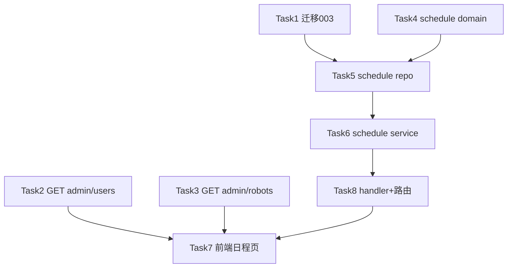

# 钉钉对接 Phase 3 实现计划（日程发布：建日历 + 推群）

> **面向 Agent 执行：** 必须使用 superpowers:subagent-driven-development（推荐）或 superpowers:executing-plans 逐任务执行。步骤用 `- [ ]` 复选框跟踪。

**目标：** 后台运营填一个表单（标题/时间/地点/参与员工/目标群/勾选建日历·推群）点发布，后端一次性**创建真实钉钉日历事件 + 推一张日程卡片到群**，并把这次发布落库可查。

**架构概述：** 新建 `schedule` 模块（domain/repository/service/handler，照搬 activities 模块范式），service 编排已做实的 `dingtalk.Client.CreateCalendarEvent` + `BotBroadcast`。新增两个辅助 admin 接口给前端选项用：`GET /admin/users`（选参与人）、`GET /admin/dingtalk/robots`（选群，只回 id+name）。前端在 admin 加「日程发布」页（照 MallAdminPage 范式）。

**技术栈：** Go 1.24 / Gin / GORM（`serializer:json` 存数组字段）/ testify / dockertest / React 19 + Vite + 直调 axios + `@cpm/ui`。

## 范围与暂不做

| 本期做 | 暂不做（后续） |
|---|---|
| 立即发布 | 定时发布（publish_at + sweeper） |
| 建钉钉日历事件（`CreateCalendarEvent` 已做实） | 工作通知 `SendWorkNotice`（还是 errNotImplemented，需另开「企业会话消息」权限） |
| 推群（`BotBroadcast` 已做实，加签自定义机器人） | 编辑/取消已发布日程 |
| 参与人从 `GET /admin/users` 勾选；群从 `GET /admin/dingtalk/robots` 勾选 | 重试失败通道 |
| 发布结果落库（含部分失败记录） | |

## 复用的现有框架（审计结论）

- 模块范式：`internal/modules/activities/{domain,repository,service,handler}`——repo `GormRepo{DB}` + `New(db)` + `WithContext(ctx).Create/First/Find`；handler `New(svc)` + `Register`(公开) + `RegisterAdmin`(admin 组)。
- admin 门禁组：`internal/router/router.go:137` `admin := r.Group("/", auth.RequireJWTWithUser(signer, deps.DB), auth.RequireRole("admin"))`；各 handler `xxx.RegisterAdmin(admin)` 在其后。
- 钉钉能力：`internal/platform/dingtalk` 的 `Client.CreateCalendarEvent`、`BotBroadcast` 已做实；`Card{Title,Detail}`、`CalendarRequest{Title,StartAt,EndAt,UserIDs,Location,Detail}`。
- DI：service 在 `router.Build()` 内装配（`deps.DB`、`deps.DingClient`、`deps.Cfg` 都可用）。
- users：repo 只有 `GetByID`/`ListByDept`（无列全部）；handler 只有 `Register`(GET /api/v1/me)，无 `RegisterAdmin`。
- 迁移：现有 001/002，runner 按字典序跑 `*.up.sql`；下一个是 003。测试用 dockertest 全新库跑全部迁移。
- 前端 admin 未被 h5 redesign PR 改动；样板 `apps/admin/src/pages/mall/MallAdminPage.tsx`（直调 axios + `localStorage.cpm_admin_jwt`）；`@cpm/ui` 有 `PageHeader`/`Button`/`EmptyState`。

## 文件结构

| 文件 | 职责 | 动作 |
|---|---|---|
| `migrations/003_create_schedules.{up,down}.sql` | schedules 表 | 建 |
| `internal/modules/users/repository/gorm_repo.go` | 加 `ListByTenant` | 改 |
| `internal/modules/users/service/service.go` | 加 `List` | 改 |
| `internal/modules/users/handler/handler.go` | 加 `RegisterAdmin`(GET /admin/users) | 改 |
| `internal/platform/dingtalk/robots_handler.go` | GET /admin/dingtalk/robots（只回 id+name） | 建 |
| `internal/modules/schedule/domain/schedule.go` | Schedule 结构 | 建 |
| `internal/modules/schedule/repository/gorm_repo.go` | Create / ListByTenant | 建 |
| `internal/modules/schedule/repository/main_test.go` | 集成测试 TestMain | 建 |
| `internal/modules/schedule/repository/gorm_repo_test.go` | repo 集成测试 | 建 |
| `internal/modules/schedule/service/service.go` | Create 编排日历+推群 | 建 |
| `internal/modules/schedule/service/service_test.go` | service 单测（fake ding + mem repo） | 建 |
| `internal/modules/schedule/handler/handler.go` | POST/GET /admin/schedules | 建 |
| `internal/router/router.go` | 装配 schedule + users.RegisterAdmin + robots | 改 |
| `apps/admin/src/pages/schedules/SchedulePage.tsx` | 日程发布页 | 建 |
| `apps/admin/src/router.tsx` + `layout/Sidebar.tsx` | 路由 + 菜单 | 改 |

## 任务依赖



---

### Task 1: 迁移 003 创建 schedules 表

**Files:**
- Create: `migrations/003_create_schedules.up.sql`、`migrations/003_create_schedules.down.sql`

- [ ] **Step 1: 写 up 迁移**

`migrations/003_create_schedules.up.sql`：

```sql
-- 日程发布记录（一次发布 = 一行，记录建日历/推群的目标与结果）
CREATE TABLE schedules (
  id BIGINT AUTO_INCREMENT PRIMARY KEY,
  tenant_id BIGINT NOT NULL,
  title VARCHAR(128) NOT NULL,
  start_at TIMESTAMP NOT NULL,
  end_at TIMESTAMP NOT NULL,
  location VARCHAR(255) DEFAULT '',
  detail VARCHAR(1024) DEFAULT '',
  attendee_user_ids JSON,
  group_ids JSON,
  push_calendar TINYINT(1) NOT NULL DEFAULT 0,
  push_group TINYINT(1) NOT NULL DEFAULT 0,
  status ENUM('published','partial','failed') NOT NULL DEFAULT 'published',
  calendar_event_id VARCHAR(128) DEFAULT '',
  result_note VARCHAR(1024) DEFAULT '',
  created_by BIGINT DEFAULT NULL,
  created_at TIMESTAMP DEFAULT CURRENT_TIMESTAMP,
  KEY idx_tenant_time (tenant_id, created_at)
) ENGINE=InnoDB CHARSET=utf8mb4;
```

- [ ] **Step 2: 写 down 迁移**

`migrations/003_create_schedules.down.sql`：

```sql
DROP TABLE IF EXISTS schedules;
```

- [ ] **Step 3: 验证（dockertest 全新库跑全部迁移）**

Run: `make test-int`（或任一现有集成测试的 TestMain 会跑 001+002+003）
Expected: 现有集成测试仍全绿，证明 003 是合法 SQL。
> 本机已存在的 dev 库（持久卷）因 001 无 `IF NOT EXISTS` 会在 re-run 报错——对 dev 库手动应用 003：`docker exec cpm-mysql mysql -uroot -proot cpm < migrations/003_create_schedules.up.sql`。

- [ ] **Step 4: 提交**

```bash
git add migrations/003_create_schedules.up.sql migrations/003_create_schedules.down.sql
git commit -m "feat:迁移003新增schedules日程表"
```

---

### Task 2: GET /admin/users（参与人选择用）

**Files:**
- Modify: `internal/modules/users/repository/gorm_repo.go`
- Modify: `internal/modules/users/service/service.go`
- Modify: `internal/modules/users/handler/handler.go`

- [ ] **Step 1: repo 加 ListByTenant**

在 `internal/modules/users/repository/gorm_repo.go` 末尾追加：

```go
func (r *GormRepo) ListByTenant(ctx context.Context, tenantID int64, limit int) ([]domain.User, error) {
	if limit <= 0 || limit > 500 {
		limit = 200
	}
	var rows []domain.User
	err := r.DB.WithContext(ctx).
		Where("tenant_id = ?", tenantID).
		Order("id DESC").
		Limit(limit).
		Find(&rows).Error
	return rows, err
}
```

- [ ] **Step 2: service 加 List**

先读 `internal/modules/users/service/service.go` 确认 `Service` 结构里持有 repo 的字段名（如 `Repo`）。在其末尾追加（把 `s.Repo` 换成实际字段名）：

```go
func (s *Service) List(ctx context.Context, tenantID int64) ([]domain.User, error) {
	return s.Repo.ListByTenant(ctx, tenantID, 200)
}
```

- [ ] **Step 3: handler 加 RegisterAdmin**

在 `internal/modules/users/handler/handler.go` 追加（保留现有 `Register`）：

```go
func (h *Handler) RegisterAdmin(rg *gin.RouterGroup) {
	rg.GET("/admin/users", h.list)
}

func (h *Handler) list(c *gin.Context) {
	tid := cpmctx.TenantID(c.Request.Context())
	rows, err := h.Svc.List(c.Request.Context(), tid)
	if err != nil {
		c.JSON(500, gin.H{"error": err.Error()})
		return
	}
	out := make([]gin.H, 0, len(rows))
	for _, u := range rows {
		out = append(out, gin.H{"id": u.ID, "dingUserId": u.DingUserID, "name": u.Name})
	}
	c.JSON(200, gin.H{"items": out})
}
```

> `domain.User` 有 `ID/DingUserID/Name`（确认 `internal/modules/users/domain/user.go`）。

- [ ] **Step 4: 编译 + 占位（路由注册在 Task 8 一起做）**

Run: `go build ./...`
Expected: 通过。（GET /admin/users 的 `RegisterAdmin(admin)` 调用在 Task 8 router 里加。）

- [ ] **Step 5: 提交**

```bash
git add internal/modules/users/
git commit -m "feat:新增GET admin/users列出租户成员"
```

---

### Task 3: GET /admin/dingtalk/robots（群选择用，只回 id+name）

**Files:**
- Create: `internal/platform/dingtalk/robots_handler.go`

- [ ] **Step 1: 写 handler**

`internal/platform/dingtalk/robots_handler.go`：

```go
package dingtalk

import (
	"github.com/gin-gonic/gin"

	"github.com/standardsoftware/culture_points_mall/internal/config"
)

// RobotsHandler 暴露已配置的群机器人列表（只回 id+name，绝不回 webhook/secret）。
type RobotsHandler struct{ robots []config.RobotCfg }

func NewRobotsHandler(robots []config.RobotCfg) *RobotsHandler {
	return &RobotsHandler{robots: robots}
}

func (h *RobotsHandler) RegisterAdmin(rg *gin.RouterGroup) {
	rg.GET("/admin/dingtalk/robots", h.list)
}

func (h *RobotsHandler) list(c *gin.Context) {
	out := make([]gin.H, 0, len(h.robots))
	for _, r := range h.robots {
		out = append(out, gin.H{"id": r.ID, "name": r.Name})
	}
	c.JSON(200, gin.H{"items": out})
}
```

- [ ] **Step 2: 编译**

Run: `go build ./...`
Expected: 通过。（注册在 Task 8 router 里加。）

- [ ] **Step 3: 提交**

```bash
git add internal/platform/dingtalk/robots_handler.go
git commit -m "feat:新增GET admin/dingtalk/robots列出群机器人"
```

---

### Task 4: schedule domain

**Files:**
- Create: `internal/modules/schedule/domain/schedule.go`

- [ ] **Step 1: 写 domain**

`internal/modules/schedule/domain/schedule.go`：

```go
package domain

import "time"

type Status string

const (
	StatusPublished Status = "published"
	StatusPartial   Status = "partial"
	StatusFailed    Status = "failed"
)

type Schedule struct {
	ID              int64     `gorm:"primaryKey"`
	TenantID        int64     `gorm:"column:tenant_id"`
	Title           string    `gorm:"column:title"`
	StartAt         time.Time `gorm:"column:start_at"`
	EndAt           time.Time `gorm:"column:end_at"`
	Location        string    `gorm:"column:location"`
	Detail          string    `gorm:"column:detail"`
	AttendeeUserIDs []string  `gorm:"column:attendee_user_ids;serializer:json"`
	GroupIDs        []string  `gorm:"column:group_ids;serializer:json"`
	PushCalendar    bool      `gorm:"column:push_calendar"`
	PushGroup       bool      `gorm:"column:push_group"`
	Status          Status    `gorm:"column:status"`
	CalendarEventID string    `gorm:"column:calendar_event_id"`
	ResultNote      string    `gorm:"column:result_note"`
	CreatedBy       int64     `gorm:"column:created_by"`
	CreatedAt       time.Time `gorm:"column:created_at"`
}

func (Schedule) TableName() string { return "schedules" }
```

- [ ] **Step 2: 编译**

Run: `go build ./internal/modules/schedule/...`
Expected: 通过。

- [ ] **Step 3: 提交**

```bash
git add internal/modules/schedule/domain/schedule.go
git commit -m "feat:schedule领域模型"
```

---

### Task 5: schedule repository（集成测试）

**Files:**
- Create: `internal/modules/schedule/repository/gorm_repo.go`
- Create: `internal/modules/schedule/repository/main_test.go`（`//go:build integration`）
- Create: `internal/modules/schedule/repository/gorm_repo_test.go`（`//go:build integration`）

- [ ] **Step 1: 写失败集成测试**

`internal/modules/schedule/repository/main_test.go`：

```go
//go:build integration

package repository

import (
	"fmt"
	"log"
	"os"
	"testing"

	"github.com/ory/dockertest/v3"
	"gorm.io/driver/mysql"
	"gorm.io/gorm"

	"github.com/standardsoftware/culture_points_mall/internal/migrate"
)

var testDB *gorm.DB

func TestMain(m *testing.M) {
	pool, err := dockertest.NewPool("")
	if err != nil {
		log.Fatalf("pool: %v", err)
	}
	res, err := pool.Run("mysql", "8.4.4", []string{"MYSQL_ROOT_PASSWORD=root", "MYSQL_DATABASE=cpm_test"})
	if err != nil {
		log.Fatalf("run: %v", err)
	}
	dsn := fmt.Sprintf("root:root@tcp(localhost:%s)/cpm_test?parseTime=true&charset=utf8mb4", res.GetPort("3306/tcp"))
	if err := pool.Retry(func() error {
		db, err := gorm.Open(mysql.Open(dsn), &gorm.Config{})
		if err != nil {
			return err
		}
		testDB = db
		sqlDB, _ := db.DB()
		return sqlDB.Ping()
	}); err != nil {
		log.Fatalf("connect: %v", err)
	}
	if err := (&migrate.Runner{DB: testDB, Dir: "../../../../migrations"}).Up(); err != nil {
		log.Fatalf("migrate: %v", err)
	}
	code := m.Run()
	_ = pool.Purge(res)
	os.Exit(code)
}
```

`internal/modules/schedule/repository/gorm_repo_test.go`：

```go
//go:build integration

package repository

import (
	"context"
	"testing"
	"time"

	"github.com/stretchr/testify/require"

	"github.com/standardsoftware/culture_points_mall/internal/modules/schedule/domain"
)

func TestScheduleRepo_CreateAndList(t *testing.T) {
	require.NoError(t, testDB.Exec("TRUNCATE schedules").Error)
	r := New(testDB)
	ctx := context.Background()
	s := &domain.Schedule{
		TenantID: 1, Title: "周会", StartAt: time.Now(), EndAt: time.Now().Add(time.Hour),
		Location: "线上", Detail: "聊聊", AttendeeUserIDs: []string{"u1", "u2"}, GroupIDs: []string{"culture"},
		PushCalendar: true, PushGroup: true, Status: domain.StatusPublished, CalendarEventID: "evt-1",
	}
	require.NoError(t, r.Create(ctx, s))
	require.NotZero(t, s.ID)

	rows, err := r.ListByTenant(ctx, 1, 10)
	require.NoError(t, err)
	require.Len(t, rows, 1)
	require.Equal(t, "周会", rows[0].Title)
	require.Equal(t, []string{"u1", "u2"}, rows[0].AttendeeUserIDs) // serializer:json 往返
	require.Equal(t, "evt-1", rows[0].CalendarEventID)
}
```

- [ ] **Step 2: 跑测试确认失败**

Run: `go vet -tags=integration ./internal/modules/schedule/repository/`
Expected: 编译失败（`New` 未定义）。（若有 Docker：`go test -tags=integration ./internal/modules/schedule/repository/` 同样失败。）

- [ ] **Step 3: 实现 repo**

`internal/modules/schedule/repository/gorm_repo.go`：

```go
package repository

import (
	"context"

	"gorm.io/gorm"

	"github.com/standardsoftware/culture_points_mall/internal/modules/schedule/domain"
)

type GormRepo struct{ DB *gorm.DB }

func New(db *gorm.DB) *GormRepo { return &GormRepo{DB: db} }

func (r *GormRepo) Create(ctx context.Context, s *domain.Schedule) error {
	return r.DB.WithContext(ctx).Create(s).Error
}

func (r *GormRepo) ListByTenant(ctx context.Context, tenantID int64, limit int) ([]domain.Schedule, error) {
	if limit <= 0 || limit > 200 {
		limit = 50
	}
	var rows []domain.Schedule
	err := r.DB.WithContext(ctx).
		Where("tenant_id = ?", tenantID).
		Order("id DESC").
		Limit(limit).
		Find(&rows).Error
	return rows, err
}
```

- [ ] **Step 4: 验证**

Run: `go vet -tags=integration ./internal/modules/schedule/repository/` 通过；有 Docker 则 `go test -tags=integration ./internal/modules/schedule/repository/ -v` PASS（验证 `serializer:json` 往返）。

- [ ] **Step 5: 提交**

```bash
git add internal/modules/schedule/repository/
git commit -m "feat:schedule仓储Create与ListByTenant"
```

---

### Task 6: schedule service（编排建日历 + 推群，单测）

**Files:**
- Create: `internal/modules/schedule/service/service.go`
- Create: `internal/modules/schedule/service/service_test.go`

- [ ] **Step 1: 写失败单测**

`internal/modules/schedule/service/service_test.go`（用 fake ding client + 内存 repo，符合"只 mock 外部 IO"）：

```go
package service

import (
	"context"
	"testing"
	"time"

	"github.com/stretchr/testify/require"

	"github.com/standardsoftware/culture_points_mall/internal/platform/dingtalk"
	"github.com/standardsoftware/culture_points_mall/internal/modules/schedule/domain"
)

type memRepo struct{ saved *domain.Schedule }

func (m *memRepo) Create(_ context.Context, s *domain.Schedule) error { s.ID = 1; m.saved = s; return nil }
func (m *memRepo) ListByTenant(_ context.Context, _ int64, _ int) ([]domain.Schedule, error) {
	if m.saved == nil {
		return nil, nil
	}
	return []domain.Schedule{*m.saved}, nil
}

type fakeDing struct {
	calReq    dingtalk.CalendarRequest
	bcGroups  []string
	calErr    error
	bcErr     error
}

func (f *fakeDing) GetUserByCode(context.Context, string) (dingtalk.User, error) { return dingtalk.User{}, nil }
func (f *fakeDing) CreateCalendarEvent(_ context.Context, r dingtalk.CalendarRequest) (string, error) {
	f.calReq = r
	if f.calErr != nil {
		return "", f.calErr
	}
	return "evt-99", nil
}
func (f *fakeDing) ListCalendarResponses(context.Context, string) ([]dingtalk.Response, error) { return nil, nil }
func (f *fakeDing) SendWorkNotice(context.Context, []string, dingtalk.Card) error             { return nil }
func (f *fakeDing) SendInteractiveCard(context.Context, string, string, map[string]any) (dingtalk.CardInstance, error) {
	return dingtalk.CardInstance{}, nil
}
func (f *fakeDing) BotBroadcast(_ context.Context, groupID string, _ dingtalk.Card) error {
	f.bcGroups = append(f.bcGroups, groupID)
	return f.bcErr
}
func (f *fakeDing) StartOAProcess(context.Context, dingtalk.ApprovalRequest) (string, error) { return "", nil }

func TestService_Create_BothChannels(t *testing.T) {
	repo := &memRepo{}
	ding := &fakeDing{}
	s := New(repo, ding)
	now := time.Now()
	out, err := s.Create(context.Background(), CreateCmd{
		TenantID: 1, Title: "周会", StartAt: now, EndAt: now.Add(time.Hour),
		Location: "线上", Detail: "聊聊", AttendeeUserIDs: []string{"u1", "u2"},
		GroupIDs: []string{"culture"}, PushCalendar: true, PushGroup: true, CreatedBy: 9,
	})
	require.NoError(t, err)
	require.Equal(t, domain.StatusPublished, out.Status)
	require.Equal(t, "evt-99", out.CalendarEventID)
	require.Equal(t, []string{"u1", "u2"}, ding.calReq.UserIDs) // 日历收到参与人
	require.Equal(t, []string{"culture"}, ding.bcGroups)        // 推了 culture 群
	require.NotNil(t, repo.saved)                               // 落库
}

func TestService_Create_PartialOnBotError(t *testing.T) {
	repo := &memRepo{}
	ding := &fakeDing{bcErr: context.DeadlineExceeded}
	s := New(repo, ding)
	now := time.Now()
	out, err := s.Create(context.Background(), CreateCmd{
		TenantID: 1, Title: "x", StartAt: now, EndAt: now.Add(time.Hour),
		GroupIDs: []string{"culture"}, PushGroup: true,
	})
	require.NoError(t, err)                              // 通道失败不让整个请求失败
	require.Equal(t, domain.StatusPartial, out.Status)  // 标记 partial
	require.Contains(t, out.ResultNote, "culture")      // 记录失败
}
```

- [ ] **Step 2: 跑测试确认失败**

Run: `go test ./internal/modules/schedule/service/ -v`
Expected: 编译失败（`New`/`CreateCmd` 未定义）。

- [ ] **Step 3: 实现 service**

`internal/modules/schedule/service/service.go`：

```go
package service

import (
	"context"
	"strings"
	"time"

	"github.com/standardsoftware/culture_points_mall/internal/modules/schedule/domain"
	"github.com/standardsoftware/culture_points_mall/internal/platform/dingtalk"
)

// Repo 抽象出仓储接口，便于单测用内存实现。
type Repo interface {
	Create(ctx context.Context, s *domain.Schedule) error
	ListByTenant(ctx context.Context, tenantID int64, limit int) ([]domain.Schedule, error)
}

type Service struct {
	Repo Repo
	Ding dingtalk.Client
}

func New(repo Repo, ding dingtalk.Client) *Service {
	return &Service{Repo: repo, Ding: ding}
}

type CreateCmd struct {
	TenantID        int64
	Title           string
	StartAt         time.Time
	EndAt           time.Time
	Location        string
	Detail          string
	AttendeeUserIDs []string
	GroupIDs        []string
	PushCalendar    bool
	PushGroup       bool
	CreatedBy       int64
}

func (s *Service) Create(ctx context.Context, cmd CreateCmd) (*domain.Schedule, error) {
	sch := &domain.Schedule{
		TenantID: cmd.TenantID, Title: cmd.Title, StartAt: cmd.StartAt, EndAt: cmd.EndAt,
		Location: cmd.Location, Detail: cmd.Detail, AttendeeUserIDs: cmd.AttendeeUserIDs,
		GroupIDs: cmd.GroupIDs, PushCalendar: cmd.PushCalendar, PushGroup: cmd.PushGroup,
		CreatedBy: cmd.CreatedBy, Status: domain.StatusPublished,
	}
	var notes []string

	if cmd.PushCalendar && len(cmd.AttendeeUserIDs) > 0 {
		eventID, err := s.Ding.CreateCalendarEvent(ctx, dingtalk.CalendarRequest{
			Title: cmd.Title, StartAt: cmd.StartAt, EndAt: cmd.EndAt,
			UserIDs: cmd.AttendeeUserIDs, Location: cmd.Location, Detail: cmd.Detail,
		})
		if err != nil {
			notes = append(notes, "日历失败:"+err.Error())
			sch.Status = domain.StatusPartial
		} else {
			sch.CalendarEventID = eventID
			notes = append(notes, "日历OK:"+eventID)
		}
	}

	if cmd.PushGroup {
		card := dingtalk.Card{Title: cmd.Title, Detail: scheduleMarkdown(cmd)}
		for _, gid := range cmd.GroupIDs {
			if err := s.Ding.BotBroadcast(ctx, gid, card); err != nil {
				notes = append(notes, "群"+gid+"失败:"+err.Error())
				sch.Status = domain.StatusPartial
			} else {
				notes = append(notes, "群"+gid+"OK")
			}
		}
	}

	sch.ResultNote = strings.Join(notes, "; ")
	if err := s.Repo.Create(ctx, sch); err != nil {
		return nil, err
	}
	return sch, nil
}

func (s *Service) List(ctx context.Context, tenantID int64) ([]domain.Schedule, error) {
	return s.Repo.ListByTenant(ctx, tenantID, 50)
}

func scheduleMarkdown(cmd CreateCmd) string {
	var b strings.Builder
	b.WriteString("**时间**：" + cmd.StartAt.Format("2006-01-02 15:04") + " ~ " + cmd.EndAt.Format("15:04") + "\n\n")
	if cmd.Location != "" {
		b.WriteString("**地点**：" + cmd.Location + "\n\n")
	}
	if cmd.Detail != "" {
		b.WriteString(cmd.Detail)
	}
	return b.String()
}
```

> 注意：repo 接口里 `*repository.GormRepo` 满足 `Repo`（方法签名一致），Task 8 装配时直接传它。

- [ ] **Step 4: 跑测试确认通过**

Run: `go test ./internal/modules/schedule/service/ -v`
Expected: 2 条 PASS。

- [ ] **Step 5: 提交**

```bash
git add internal/modules/schedule/service/
git commit -m "feat:schedule服务编排建日历与推群"
```

---

### Task 7: schedule handler + 路由装配

**Files:**
- Create: `internal/modules/schedule/handler/handler.go`
- Modify: `internal/router/router.go`

- [ ] **Step 1: 写 handler**

`internal/modules/schedule/handler/handler.go`：

```go
package handler

import (
	"time"

	"github.com/gin-gonic/gin"

	"github.com/standardsoftware/culture_points_mall/internal/modules/schedule/service"
	cpmctx "github.com/standardsoftware/culture_points_mall/internal/shared/ctx"
)

type Handler struct{ Svc *service.Service }

func New(s *service.Service) *Handler { return &Handler{Svc: s} }

func (h *Handler) RegisterAdmin(rg *gin.RouterGroup) {
	rg.POST("/admin/schedules", h.create)
	rg.GET("/admin/schedules", h.list)
}

type createReq struct {
	Title           string   `json:"title" binding:"required"`
	StartAt         string   `json:"startAt" binding:"required"` // RFC3339
	EndAt           string   `json:"endAt" binding:"required"`
	Location        string   `json:"location"`
	Detail          string   `json:"detail"`
	AttendeeUserIDs []string `json:"attendeeUserIds"`
	GroupIDs        []string `json:"groupIds"`
	PushCalendar    bool     `json:"pushCalendar"`
	PushGroup       bool     `json:"pushGroup"`
}

func (h *Handler) create(c *gin.Context) {
	var req createReq
	if err := c.ShouldBindJSON(&req); err != nil {
		c.JSON(400, gin.H{"error": err.Error()})
		return
	}
	start, err := time.Parse(time.RFC3339, req.StartAt)
	if err != nil {
		c.JSON(400, gin.H{"error": "startAt 非 RFC3339: " + err.Error()})
		return
	}
	end, err := time.Parse(time.RFC3339, req.EndAt)
	if err != nil {
		c.JSON(400, gin.H{"error": "endAt 非 RFC3339: " + err.Error()})
		return
	}
	// 归一到东八区：前端 datetime-local 经 toISOString() 发来的是 UTC，
	// 而 CreateCalendarEvent 用 timeZone=Asia/Shanghai，不归一会差 8 小时。
	if loc, e := time.LoadLocation("Asia/Shanghai"); e == nil {
		start = start.In(loc)
		end = end.In(loc)
	}
	tid := cpmctx.TenantID(c.Request.Context())
	uid := cpmctx.UserID(c.Request.Context())
	sch, err := h.Svc.Create(c.Request.Context(), service.CreateCmd{
		TenantID: tid, Title: req.Title, StartAt: start, EndAt: end,
		Location: req.Location, Detail: req.Detail, AttendeeUserIDs: req.AttendeeUserIDs,
		GroupIDs: req.GroupIDs, PushCalendar: req.PushCalendar, PushGroup: req.PushGroup, CreatedBy: uid,
	})
	if err != nil {
		c.JSON(500, gin.H{"error": err.Error()})
		return
	}
	c.JSON(200, gin.H{
		"id": sch.ID, "status": sch.Status, "calendarEventId": sch.CalendarEventID, "resultNote": sch.ResultNote,
	})
}

func (h *Handler) list(c *gin.Context) {
	tid := cpmctx.TenantID(c.Request.Context())
	rows, err := h.Svc.List(c.Request.Context(), tid)
	if err != nil {
		c.JSON(500, gin.H{"error": err.Error()})
		return
	}
	out := make([]gin.H, 0, len(rows))
	for _, s := range rows {
		out = append(out, gin.H{
			"id": s.ID, "title": s.Title, "startAt": s.StartAt, "endAt": s.EndAt,
			"location": s.Location, "status": s.Status, "calendarEventId": s.CalendarEventID,
			"resultNote": s.ResultNote, "createdAt": s.CreatedAt,
		})
	}
	c.JSON(200, gin.H{"items": out})
}
```

- [ ] **Step 2: 装配进 router**

先读 `internal/router/router.go` 的 import 区与 admin 组（约 137-146 行）。改动：

(a) import 区加：
```go
	schedulerepo "github.com/standardsoftware/culture_points_mall/internal/modules/schedule/repository"
	schedulesvc "github.com/standardsoftware/culture_points_mall/internal/modules/schedule/service"
	scheduleh "github.com/standardsoftware/culture_points_mall/internal/modules/schedule/handler"
```

(b) 把 users handler 改成变量（现状是 `usersh.New(usersvc.New(usersrepo.New(deps.DB))).Register(authed)`），便于也注册 admin：
```go
	usersHandler := usersh.New(usersvc.New(usersrepo.New(deps.DB)))
	usersHandler.Register(authed)
```

(c) 在 admin 组那段（`admin := r.Group(...)` 之后、已有的 RegisterAdmin 调用旁）追加：
```go
	usersHandler.RegisterAdmin(admin)
	dingtalk.NewRobotsHandler(deps.Cfg.DingTalk.Robots).RegisterAdmin(admin)
	scheduleSvc := schedulesvc.New(schedulerepo.New(deps.DB), deps.DingClient)
	scheduleh.New(scheduleSvc).RegisterAdmin(admin)
```

确认 `deps.Cfg`、`deps.DingClient`、`deps.DB` 都已在 `Deps` 里（router.go 的 `Deps` 结构含 `Cfg *config.Config`、`DingClient dingtalk.Client`、`DB *gorm.DB`）。

- [ ] **Step 3: 验证**

Run: `go build ./...`、`go vet ./...`、`make test`
Expected: 全绿（schedule service 单测通过；无重复路由）。

- [ ] **Step 4: 提交**

```bash
git add internal/modules/schedule/handler/ internal/router/router.go
git commit -m "feat:schedule后台接口POST与GET并装配路由"
```

---

### Task 8: 后台「日程发布」页

**Files:**
- Create: `apps/admin/src/pages/schedules/SchedulePage.tsx`
- Modify: `apps/admin/src/router.tsx`、`apps/admin/src/layout/Sidebar.tsx`

- [ ] **Step 1: 写页面**

`apps/admin/src/pages/schedules/SchedulePage.tsx`：

```tsx
import axios from 'axios';
import { useEffect, useState } from 'react';
import { PageHeader, Button, EmptyState } from '@cpm/ui';

const token = () => localStorage.getItem('cpm_admin_jwt');
const headers = () => ({ Authorization: `Bearer ${token()}` });

interface UserItem { id: number; dingUserId: string; name: string }
interface RobotItem { id: string; name: string }
interface ScheduleItem { id: number; title: string; status: string; resultNote: string; createdAt: string }

export function SchedulePage() {
  const [users, setUsers] = useState<UserItem[]>([]);
  const [robots, setRobots] = useState<RobotItem[]>([]);
  const [list, setList] = useState<ScheduleItem[]>([]);
  const [title, setTitle] = useState('');
  const [start, setStart] = useState('');
  const [end, setEnd] = useState('');
  const [location, setLocation] = useState('');
  const [detail, setDetail] = useState('');
  const [attendees, setAttendees] = useState<string[]>([]);
  const [groups, setGroups] = useState<string[]>([]);
  const [pushCalendar, setPushCalendar] = useState(true);
  const [pushGroup, setPushGroup] = useState(true);
  const [busy, setBusy] = useState(false);
  const [msg, setMsg] = useState<string | null>(null);

  const loadList = async () => {
    const { data } = await axios.get<{ items: ScheduleItem[] | null }>('/admin/schedules', { headers: headers() });
    setList(data.items ?? []);
  };
  useEffect(() => {
    (async () => {
      const [u, r] = await Promise.all([
        axios.get<{ items: UserItem[] | null }>('/admin/users', { headers: headers() }),
        axios.get<{ items: RobotItem[] | null }>('/admin/dingtalk/robots', { headers: headers() }),
      ]);
      setUsers(u.data.items ?? []);
      setRobots(r.data.items ?? []);
      await loadList();
    })().catch((e) => setMsg(String(e?.response?.data?.error ?? e)));
  }, []);

  const toggle = (arr: string[], v: string, set: (x: string[]) => void) =>
    set(arr.includes(v) ? arr.filter((x) => x !== v) : [...arr, v]);

  const submit = async () => {
    setBusy(true);
    setMsg(null);
    try {
      const body = {
        title,
        startAt: new Date(start).toISOString(),
        endAt: new Date(end).toISOString(),
        location,
        detail,
        attendeeUserIds: attendees,
        groupIds: groups,
        pushCalendar,
        pushGroup,
      };
      const { data } = await axios.post<{ status: string; resultNote: string }>('/admin/schedules', body, { headers: headers() });
      setMsg(`发布成功（${data.status}）：${data.resultNote}`);
      setTitle('');
      await loadList();
    } catch (e) {
      const err = e as { response?: { data?: { error?: string } } };
      setMsg(`失败：${err?.response?.data?.error ?? String(e)}`);
    } finally {
      setBusy(false);
    }
  };

  const inputStyle = { width: '100%', padding: '9px 12px', borderRadius: 10, border: '1.5px solid var(--cpm-card-border-strong)', background: 'var(--cpm-bg-0)', fontSize: 14, marginBottom: 12, boxSizing: 'border-box' as const };

  return (
    <div style={{ padding: 24 }}>
      <PageHeader title="日程发布" />
      <div style={{ display: 'flex', gap: 24, flexWrap: 'wrap' }}>
        <div style={{ flex: '1 1 420px', background: '#fff', borderRadius: 16, border: '1px solid var(--cpm-card-border)', padding: 20 }}>
          <input style={inputStyle} placeholder="标题" value={title} onChange={(e) => setTitle(e.target.value)} />
          <label style={{ fontSize: 12, color: 'var(--cpm-text-tertiary)' }}>开始</label>
          <input style={inputStyle} type="datetime-local" value={start} onChange={(e) => setStart(e.target.value)} />
          <label style={{ fontSize: 12, color: 'var(--cpm-text-tertiary)' }}>结束</label>
          <input style={inputStyle} type="datetime-local" value={end} onChange={(e) => setEnd(e.target.value)} />
          <input style={inputStyle} placeholder="地点" value={location} onChange={(e) => setLocation(e.target.value)} />
          <textarea style={{ ...inputStyle, minHeight: 60 }} placeholder="详情" value={detail} onChange={(e) => setDetail(e.target.value)} />

          <div style={{ marginBottom: 10 }}>
            <div style={{ fontSize: 13, fontWeight: 600, marginBottom: 6 }}>参与员工</div>
            {users.map((u) => (
              <label key={u.id} style={{ display: 'inline-flex', alignItems: 'center', gap: 4, marginRight: 12, fontSize: 13 }}>
                <input type="checkbox" checked={attendees.includes(u.dingUserId)} onChange={() => toggle(attendees, u.dingUserId, setAttendees)} />
                {u.name}
              </label>
            ))}
          </div>
          <div style={{ marginBottom: 10 }}>
            <div style={{ fontSize: 13, fontWeight: 600, marginBottom: 6 }}>推送群</div>
            {robots.map((r) => (
              <label key={r.id} style={{ display: 'inline-flex', alignItems: 'center', gap: 4, marginRight: 12, fontSize: 13 }}>
                <input type="checkbox" checked={groups.includes(r.id)} onChange={() => toggle(groups, r.id, setGroups)} />
                {r.name}
              </label>
            ))}
          </div>
          <div style={{ marginBottom: 14, fontSize: 13 }}>
            <label style={{ marginRight: 16 }}>
              <input type="checkbox" checked={pushCalendar} onChange={(e) => setPushCalendar(e.target.checked)} /> 建钉钉日历
            </label>
            <label>
              <input type="checkbox" checked={pushGroup} onChange={(e) => setPushGroup(e.target.checked)} /> 推送到群
            </label>
          </div>
          <Button tone="primary" size="md" onClick={submit} disabled={busy}>{busy ? '发布中...' : '发布'}</Button>
          {msg && <div style={{ marginTop: 12, fontSize: 13, color: 'var(--cpm-text-secondary)', wordBreak: 'break-all' }}>{msg}</div>}
        </div>

        <div style={{ flex: '1 1 420px' }}>
          <div style={{ fontSize: 14, fontWeight: 600, marginBottom: 10 }}>已发布</div>
          {list.length === 0 ? (
            <EmptyState icon="📅" title="暂无日程" description="左侧填表单发布第一条" />
          ) : (
            list.map((s) => (
              <div key={s.id} style={{ background: '#fff', borderRadius: 12, border: '1px solid var(--cpm-card-border)', padding: 14, marginBottom: 10 }}>
                <div style={{ fontWeight: 600 }}>{s.title}</div>
                <div style={{ fontSize: 12, color: 'var(--cpm-text-tertiary)', marginTop: 4 }}>状态：{s.status} · {s.resultNote}</div>
              </div>
            ))
          )}
        </div>
      </div>
    </div>
  );
}
```

- [ ] **Step 2: 加路由**

`apps/admin/src/router.tsx`：import 顶部加 `import { SchedulePage } from './pages/schedules/SchedulePage';`，并在 `<Routes>` 里加：
```tsx
      <Route path="/schedules" element={wrap(<SchedulePage />)} />
```

- [ ] **Step 3: 加菜单**

`apps/admin/src/layout/Sidebar.tsx` 的 `items` 数组里加一项（放「钉钉推送」前后均可）：
```tsx
  { to: '/schedules', label: '日程发布', icon: '📅', end: false },
```

- [ ] **Step 4: 验证**

Run: `cd /Users/standardsoftware/go/culture_points_mall_web && pnpm --filter @cpm/admin exec tsc --noEmit`（类型检查通过）
然后人工：admin 后台用管理员登录 → 「日程发布」→ 填表勾员工/群 → 发布 → 看到"发布成功"、群里收到卡片、员工钉钉日历有日程、列表出现记录。
> 后端需 `mode: real` + 已起；config 有 robots；participant 必须是库里真实员工（有 union_id）。

- [ ] **Step 5: 提交**

```bash
cd /Users/standardsoftware/go/culture_points_mall_web
git add apps/admin/src/pages/schedules/SchedulePage.tsx apps/admin/src/router.tsx apps/admin/src/layout/Sidebar.tsx
git commit -m "feat:后台新增日程发布页"
```

---

## 验收（Phase 3 完成标准）

1. `make test` 全绿（schedule service 单测）；`go vet -tags=integration ./...` 编译通过（repo 集成测试）。
2. 后台「日程发布」填表 → 发布：真员工钉钉日历出现该日程 + 目标群收到 markdown 卡片 + `schedules` 表落一行（status/result_note）。
3. 通道部分失败（如某群推送失败）时 status=partial，不让整个请求 500。
4. 非管理员访问 `/admin/schedules` 仍 403（沿用 Phase 1 门禁）。

## 后续（本期暂不做）

- 工作通知 `SendWorkNotice`（做实 + 开「企业会话消息」权限 → 给参与人一对一推）。
- 定时发布（schedules 加 publish_at + `status='scheduled'` + 仿 FreezeSweeper 的 goroutine+ticker 到点发布）。
- 编辑/取消日程（钉钉 calendar update/delete 接口）。
