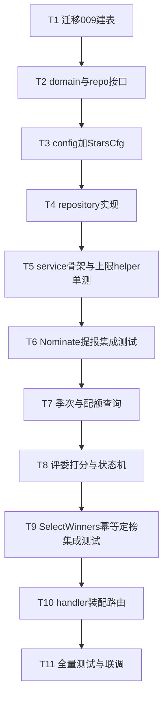

# 文化刊 Plan 1 · 提报评选（stars）后端 实现计划

> **面向 Agent 执行：** 必须使用 superpowers:subagent-driven-development（推荐）或 superpowers:executing-plans 逐任务执行。步骤用 `- [ ]` 勾选跟踪。

**目标：** 交付「文化星标」提报评选后端闭环——员工可提报（带月度积分上限），评委可打分、定榜（自动发评选积分），全部经 API 可测。

**架构概述：** 新增 `internal/modules/stars/` 模块，沿用项目 `domain/repository/service/handler` 四层；复用 `points.Service.AddPoints` 发积分；定榜用「幂等三步」保证 exactly-once（不引跨模块事务、不改 points）。

**技术栈：** Go 1.24 / Gin / GORM / MySQL；测试用 testify + ory/dockertest（真库集成）。

**前置：** 分支 `feat/culture-publication`（已建）；spec 见 `docs/superpowers/specs/2026-06-07-文化刊-design.md`。

## 实现流程



---

### Task 1: 迁移 009 建表

**Files:**
- Create: `migrations/009_create_stars_tables.up.sql`
- Create: `migrations/009_create_stars_tables.down.sql`

- [ ] **Step 1: 写 up 迁移**

`migrations/009_create_stars_tables.up.sql`:
```sql
CREATE TABLE star_seasons (
  id BIGINT AUTO_INCREMENT PRIMARY KEY,
  tenant_id BIGINT NOT NULL,
  name VARCHAR(64) NOT NULL,
  quarter_code VARCHAR(16) NOT NULL,
  status ENUM('nominating','judging','published','closed') NOT NULL DEFAULT 'nominating',
  nominate_start_at TIMESTAMP NULL,
  nominate_end_at TIMESTAMP NULL,
  created_at TIMESTAMP DEFAULT CURRENT_TIMESTAMP,
  updated_at TIMESTAMP DEFAULT CURRENT_TIMESTAMP ON UPDATE CURRENT_TIMESTAMP,
  UNIQUE KEY uk_tenant_quarter (tenant_id, quarter_code),
  KEY idx_tenant_status (tenant_id, status)
) ENGINE=InnoDB CHARSET=utf8mb4;

CREATE TABLE star_nominations (
  id BIGINT AUTO_INCREMENT PRIMARY KEY,
  tenant_id BIGINT NOT NULL,
  season_id BIGINT NOT NULL,
  nominator_id BIGINT NOT NULL,
  nominee_id BIGINT NOT NULL,
  dimension_id BIGINT NOT NULL,
  case_text TEXT NOT NULL,
  case_refined TEXT NULL,
  ai_tags JSON NULL,
  status ENUM('submitted','duplicate','shortlisted','selected','rejected') NOT NULL DEFAULT 'submitted',
  score DECIMAL(4,1) NULL,
  created_at TIMESTAMP DEFAULT CURRENT_TIMESTAMP,
  updated_at TIMESTAMP DEFAULT CURRENT_TIMESTAMP ON UPDATE CURRENT_TIMESTAMP,
  UNIQUE KEY uk_dedup (season_id, nominator_id, nominee_id, dimension_id),
  KEY idx_season_nominee (season_id, nominee_id),
  KEY idx_season_status (season_id, status),
  KEY idx_nominator_month (tenant_id, nominator_id, created_at),
  KEY idx_nominee_month (tenant_id, nominee_id, created_at)
) ENGINE=InnoDB CHARSET=utf8mb4;

CREATE TABLE star_winners (
  id BIGINT AUTO_INCREMENT PRIMARY KEY,
  tenant_id BIGINT NOT NULL,
  season_id BIGINT NOT NULL,
  user_id BIGINT NOT NULL,
  dimension_id BIGINT NOT NULL,
  citation TEXT NULL,
  source_nomination_id BIGINT NULL,
  created_at TIMESTAMP DEFAULT CURRENT_TIMESTAMP,
  UNIQUE KEY uk_season_user_dim (season_id, user_id, dimension_id),
  KEY idx_tenant_season (tenant_id, season_id)
) ENGINE=InnoDB CHARSET=utf8mb4;
```

- [ ] **Step 2: 写 down 迁移**

`migrations/009_create_stars_tables.down.sql`:
```sql
DROP TABLE IF EXISTS star_winners;
DROP TABLE IF EXISTS star_nominations;
DROP TABLE IF EXISTS star_seasons;
```

- [ ] **Step 3: 跑迁移验证建表**

Run: `cd /Users/standardsoftware/go/culture_points_mall && go run ./cmd/migrate -action up -config ./configs`
Expected: 无报错；MySQL 中出现三张表（`SHOW TABLES LIKE 'star_%'` 返回 3 行）。

- [ ] **Step 4: 提交**

```bash
git add migrations/009_create_stars_tables.up.sql migrations/009_create_stars_tables.down.sql
git commit -m "feat:文化星标提报评选三张表迁移009"
```

---

### Task 2: domain 模型与 repository 接口

**Files:**
- Create: `internal/modules/stars/domain/season.go`
- Create: `internal/modules/stars/domain/nomination.go`
- Create: `internal/modules/stars/domain/winner.go`
- Create: `internal/modules/stars/domain/repository.go`

- [ ] **Step 1: 写 season.go**

```go
package domain

import "time"

type SeasonStatus string

const (
	SeasonNominating SeasonStatus = "nominating"
	SeasonJudging    SeasonStatus = "judging"
	SeasonPublished  SeasonStatus = "published"
	SeasonClosed     SeasonStatus = "closed"
)

type Season struct {
	ID              int64        `gorm:"column:id;primaryKey"`
	TenantID        int64        `gorm:"column:tenant_id"`
	Name            string       `gorm:"column:name"`
	QuarterCode     string       `gorm:"column:quarter_code"`
	Status          SeasonStatus `gorm:"column:status"`
	NominateStartAt *time.Time   `gorm:"column:nominate_start_at"`
	NominateEndAt   *time.Time   `gorm:"column:nominate_end_at"`
	CreatedAt       time.Time    `gorm:"column:created_at"`
	UpdatedAt       time.Time    `gorm:"column:updated_at"`
}

func (Season) TableName() string { return "star_seasons" }
```

- [ ] **Step 2: 写 nomination.go**

```go
package domain

import "time"

type NominationStatus string

const (
	NominationSubmitted   NominationStatus = "submitted"
	NominationDuplicate   NominationStatus = "duplicate"
	NominationShortlisted NominationStatus = "shortlisted"
	NominationSelected    NominationStatus = "selected"
	NominationRejected    NominationStatus = "rejected"
)

type Nomination struct {
	ID          int64            `gorm:"column:id;primaryKey"`
	TenantID    int64            `gorm:"column:tenant_id"`
	SeasonID    int64            `gorm:"column:season_id"`
	NominatorID int64            `gorm:"column:nominator_id"`
	NomineeID   int64            `gorm:"column:nominee_id"`
	DimensionID int64            `gorm:"column:dimension_id"`
	CaseText    string           `gorm:"column:case_text"`
	CaseRefined *string          `gorm:"column:case_refined"`
	AITags      *string          `gorm:"column:ai_tags"`
	Status      NominationStatus `gorm:"column:status"`
	Score       *float64         `gorm:"column:score"`
	CreatedAt   time.Time        `gorm:"column:created_at"`
	UpdatedAt   time.Time        `gorm:"column:updated_at"`
}

func (Nomination) TableName() string { return "star_nominations" }
```

- [ ] **Step 3: 写 winner.go**

```go
package domain

import "time"

type Winner struct {
	ID                 int64     `gorm:"column:id;primaryKey"`
	TenantID           int64     `gorm:"column:tenant_id"`
	SeasonID           int64     `gorm:"column:season_id"`
	UserID             int64     `gorm:"column:user_id"`
	DimensionID        int64     `gorm:"column:dimension_id"`
	Citation           *string   `gorm:"column:citation"`
	SourceNominationID *int64    `gorm:"column:source_nomination_id"`
	CreatedAt          time.Time `gorm:"column:created_at"`
}

func (Winner) TableName() string { return "star_winners" }
```

- [ ] **Step 4: 写 repository.go 接口**

```go
package domain

import (
	"context"
	"time"
)

type Repository interface {
	CreateSeason(ctx context.Context, s *Season) error
	GetSeason(ctx context.Context, tenantID, id int64) (*Season, error)
	GetCurrentSeason(ctx context.Context, tenantID int64) (*Season, error)
	UpdateSeasonStatus(ctx context.Context, tenantID, id int64, status SeasonStatus) error
	ListSeasons(ctx context.Context, tenantID int64) ([]Season, error)

	CreateNomination(ctx context.Context, n *Nomination) error
	GetNomination(ctx context.Context, id int64) (*Nomination, error)
	ListNominationsBySeason(ctx context.Context, seasonID int64) ([]Nomination, error)
	ListNominationsByNominator(ctx context.Context, tenantID, userID, seasonID int64) ([]Nomination, error)
	ListNominationsByNominee(ctx context.Context, tenantID, userID, seasonID int64) ([]Nomination, error)
	CountNominationsByNominatorSince(ctx context.Context, tenantID, nominatorID int64, since time.Time) (int64, error)
	CountNominationsByNomineeSince(ctx context.Context, tenantID, nomineeID int64, since time.Time) (int64, error)
	UpdateNominationScore(ctx context.Context, id int64, score float64) error
	UpdateNominationStatus(ctx context.Context, id int64, status NominationStatus) error

	// CreateWinnerIfAbsent 命中 uk_season_user_dim 时不报错，返回是否新建。
	CreateWinnerIfAbsent(ctx context.Context, w *Winner) (created bool, err error)
	ListWinnersBySeason(ctx context.Context, seasonID int64) ([]Winner, error)

	// UserExists 校验被提名人真实存在。
	UserExists(ctx context.Context, tenantID, userID int64) (bool, error)
}
```

- [ ] **Step 5: 编译验证 + 提交**

Run: `go build ./...`
Expected: 通过（接口暂无实现，但 domain 包可独立编译）。
```bash
git add internal/modules/stars/domain/
git commit -m "feat:stars领域模型与仓储接口"
```

---

### Task 3: config 增加 StarsCfg

**Files:**
- Modify: `internal/config/config.go:10-21`（Config struct）+ 末尾加子 struct
- Modify: `configs/config.yaml`、`configs/config.example.yaml`

- [ ] **Step 1: Config 顶层加字段**

在 `internal/config/config.go` 的 `Config` struct 末尾（`Storage StorageCfg` 行后）加：
```go
	Stars StarsCfg `mapstructure:"stars"`
```

- [ ] **Step 2: 定义 StarsCfg 子 struct**

在 `config.go` 的 `StorageCfg` 定义之后加：
```go
// StarsCfg 文化星标提报评选积分规则。零值由 stars.New 兜底为默认。
type StarsCfg struct {
	NominatePoints      int `mapstructure:"nominate_points"`      // 提报每次 +2
	NominatedPoints     int `mapstructure:"nominated_points"`     // 被提名每次 +4
	WinnerPoints        int `mapstructure:"winner_points"`        // 评选上 +8
	NominateMonthlyCap  int `mapstructure:"nominate_monthly_cap"` // 提报积分月上限 6
	NominatedMonthlyCap int `mapstructure:"nominated_monthly_cap"`// 被提名积分月上限 16
}
```

- [ ] **Step 3: 两个 yaml 各加默认值**

在 `configs/config.yaml` 与 `configs/config.example.yaml` 末尾各加：
```yaml
stars:
  nominate_points: 2
  nominated_points: 4
  winner_points: 8
  nominate_monthly_cap: 6
  nominated_monthly_cap: 16
```

- [ ] **Step 4: 编译 + 提交**

Run: `go build ./...`
Expected: 通过。
```bash
git add internal/config/config.go configs/config.yaml configs/config.example.yaml
git commit -m "feat:配置新增stars积分规则"
```

---

### Task 4: repository 实现

**Files:**
- Create: `internal/modules/stars/repository/gorm_repo.go`

- [ ] **Step 1: 写 GormRepo（照 points/activities 范式）**

```go
package repository

import (
	"context"
	"time"

	"gorm.io/gorm"
	"gorm.io/gorm/clause"

	"github.com/standardsoftware/culture_points_mall/internal/modules/stars/domain"
)

type GormRepo struct{ DB *gorm.DB }

func New(db *gorm.DB) *GormRepo { return &GormRepo{DB: db} }

func (r *GormRepo) CreateSeason(ctx context.Context, s *domain.Season) error {
	return r.DB.WithContext(ctx).Create(s).Error
}

func (r *GormRepo) GetSeason(ctx context.Context, tenantID, id int64) (*domain.Season, error) {
	var s domain.Season
	err := r.DB.WithContext(ctx).Where("tenant_id = ? AND id = ?", tenantID, id).First(&s).Error
	if err != nil {
		return nil, err
	}
	return &s, nil
}

func (r *GormRepo) GetCurrentSeason(ctx context.Context, tenantID int64) (*domain.Season, error) {
	var s domain.Season
	err := r.DB.WithContext(ctx).
		Where("tenant_id = ? AND status IN ?", tenantID, []domain.SeasonStatus{domain.SeasonNominating, domain.SeasonJudging}).
		Order("id DESC").First(&s).Error
	if err != nil {
		return nil, err
	}
	return &s, nil
}

func (r *GormRepo) UpdateSeasonStatus(ctx context.Context, tenantID, id int64, status domain.SeasonStatus) error {
	return r.DB.WithContext(ctx).Model(&domain.Season{}).
		Where("tenant_id = ? AND id = ?", tenantID, id).
		Update("status", status).Error
}

func (r *GormRepo) ListSeasons(ctx context.Context, tenantID int64) ([]domain.Season, error) {
	var rows []domain.Season
	err := r.DB.WithContext(ctx).Where("tenant_id = ?", tenantID).Order("id DESC").Find(&rows).Error
	return rows, err
}

func (r *GormRepo) CreateNomination(ctx context.Context, n *domain.Nomination) error {
	return r.DB.WithContext(ctx).Create(n).Error
}

func (r *GormRepo) GetNomination(ctx context.Context, id int64) (*domain.Nomination, error) {
	var n domain.Nomination
	err := r.DB.WithContext(ctx).Where("id = ?", id).First(&n).Error
	if err != nil {
		return nil, err
	}
	return &n, nil
}

func (r *GormRepo) ListNominationsBySeason(ctx context.Context, seasonID int64) ([]domain.Nomination, error) {
	var rows []domain.Nomination
	err := r.DB.WithContext(ctx).Where("season_id = ?", seasonID).Order("id DESC").Find(&rows).Error
	return rows, err
}

func (r *GormRepo) ListNominationsByNominator(ctx context.Context, tenantID, userID, seasonID int64) ([]domain.Nomination, error) {
	var rows []domain.Nomination
	err := r.DB.WithContext(ctx).
		Where("tenant_id = ? AND nominator_id = ? AND season_id = ?", tenantID, userID, seasonID).
		Order("id DESC").Find(&rows).Error
	return rows, err
}

func (r *GormRepo) ListNominationsByNominee(ctx context.Context, tenantID, userID, seasonID int64) ([]domain.Nomination, error) {
	var rows []domain.Nomination
	err := r.DB.WithContext(ctx).
		Where("tenant_id = ? AND nominee_id = ? AND season_id = ?", tenantID, userID, seasonID).
		Order("id DESC").Find(&rows).Error
	return rows, err
}

func (r *GormRepo) CountNominationsByNominatorSince(ctx context.Context, tenantID, nominatorID int64, since time.Time) (int64, error) {
	var cnt int64
	err := r.DB.WithContext(ctx).Model(&domain.Nomination{}).
		Where("tenant_id = ? AND nominator_id = ? AND created_at >= ?", tenantID, nominatorID, since).
		Count(&cnt).Error
	return cnt, err
}

func (r *GormRepo) CountNominationsByNomineeSince(ctx context.Context, tenantID, nomineeID int64, since time.Time) (int64, error) {
	var cnt int64
	err := r.DB.WithContext(ctx).Model(&domain.Nomination{}).
		Where("tenant_id = ? AND nominee_id = ? AND created_at >= ?", tenantID, nomineeID, since).
		Count(&cnt).Error
	return cnt, err
}

func (r *GormRepo) UpdateNominationScore(ctx context.Context, id int64, score float64) error {
	return r.DB.WithContext(ctx).Model(&domain.Nomination{}).
		Where("id = ?", id).Update("score", score).Error
}

func (r *GormRepo) UpdateNominationStatus(ctx context.Context, id int64, status domain.NominationStatus) error {
	return r.DB.WithContext(ctx).Model(&domain.Nomination{}).
		Where("id = ?", id).Update("status", status).Error
}

func (r *GormRepo) CreateWinnerIfAbsent(ctx context.Context, w *domain.Winner) (bool, error) {
	res := r.DB.WithContext(ctx).
		Clauses(clause.OnConflict{
			Columns:   []clause.Column{{Name: "season_id"}, {Name: "user_id"}, {Name: "dimension_id"}},
			DoNothing: true,
		}).Create(w)
	if res.Error != nil {
		return false, res.Error
	}
	return res.RowsAffected == 1, nil
}

func (r *GormRepo) ListWinnersBySeason(ctx context.Context, seasonID int64) ([]domain.Winner, error) {
	var rows []domain.Winner
	err := r.DB.WithContext(ctx).Where("season_id = ?", seasonID).Order("id ASC").Find(&rows).Error
	return rows, err
}

func (r *GormRepo) UserExists(ctx context.Context, tenantID, userID int64) (bool, error) {
	var exists int
	err := r.DB.WithContext(ctx).
		Raw("SELECT 1 FROM users WHERE id = ? AND tenant_id = ? LIMIT 1", userID, tenantID).
		Scan(&exists).Error
	return exists == 1, err
}
```

- [ ] **Step 2: 编译 + 提交**

Run: `go build ./...`
Expected: 通过（`*GormRepo` 满足 `domain.Repository`）。
```bash
git add internal/modules/stars/repository/
git commit -m "feat:stars仓储GormRepo实现"
```

---

### Task 5: service 骨架 + 月度上限 helper（单测）

**Files:**
- Create: `internal/modules/stars/service/service.go`
- Create: `internal/modules/stars/service/service_test.go`

- [ ] **Step 1: 写 service 骨架与默认值兜底**

```go
package service

import (
	"context"
	"errors"

	"gorm.io/gorm"

	"github.com/standardsoftware/culture_points_mall/internal/config"
	"github.com/standardsoftware/culture_points_mall/internal/modules/stars/domain"
	pointssvc "github.com/standardsoftware/culture_points_mall/internal/modules/points/service"
)

type Service struct {
	Repo   domain.Repository
	Points *pointssvc.Service
	Cfg    config.StarsCfg
}

func New(repo domain.Repository, points *pointssvc.Service, cfg config.StarsCfg) *Service {
	if cfg.NominatePoints == 0 {
		cfg.NominatePoints = 2
	}
	if cfg.NominatedPoints == 0 {
		cfg.NominatedPoints = 4
	}
	if cfg.WinnerPoints == 0 {
		cfg.WinnerPoints = 8
	}
	if cfg.NominateMonthlyCap == 0 {
		cfg.NominateMonthlyCap = 6
	}
	if cfg.NominatedMonthlyCap == 0 {
		cfg.NominatedMonthlyCap = 16
	}
	return &Service{Repo: repo, Points: points, Cfg: cfg}
}

var (
	ErrSeasonNotOpen     = errors.New("当前季次未开放提报")
	ErrDuplicateNomination = errors.New("你已提报过该对象的同一价值观")
	ErrNomineeNotFound   = errors.New("被提名人不存在")
	ErrNotJudging        = errors.New("季次不在评审阶段")
)

// awardable 计算本次是否还能发分：当月已发 = count*per，发后不超 cap 才发。
func awardable(monthlyCount int64, per, cap int) bool {
	return int(monthlyCount)*per+per <= cap
}
```

- [ ] **Step 2: 写上限 helper 的单测**

`internal/modules/stars/service/service_test.go`:
```go
package service

import "testing"

func TestAwardable(t *testing.T) {
	cases := []struct {
		count int64
		per   int
		cap   int
		want  bool
	}{
		{0, 2, 6, true},  // 第1次提报 0->2 <=6
		{2, 2, 6, true},  // 第3次 4->6 <=6
		{3, 2, 6, false}, // 第4次 6->8 >6
		{3, 4, 16, true}, // 第4次被提名 12->16 <=16
		{4, 4, 16, false},// 第5次 16->20 >16
	}
	for _, c := range cases {
		if got := awardable(c.count, c.per, c.cap); got != c.want {
			t.Fatalf("awardable(%d,%d,%d)=%v want %v", c.count, c.per, c.cap, got, c.want)
		}
	}
}
```

- [ ] **Step 3: 跑单测验证通过**

Run: `go test ./internal/modules/stars/service/ -run TestAwardable -v`
Expected: PASS。

- [ ] **Step 4: 提交**

```bash
git add internal/modules/stars/service/service.go internal/modules/stars/service/service_test.go
git commit -m "test:stars月度上限helper单测"
```

---

### Task 6: Nominate 提报（集成测试，真库 + 真 points）

> 提报会写 `point_transactions` 并经 points 序列化，按规范必须真库集成测试，不 mock points。

**Files:**
- Modify: `internal/modules/stars/service/service.go`（加 Nominate + Cmd）
- Create: `internal/modules/stars/service/service_integration_test.go`

- [ ] **Step 1: 写 NominateCmd 与 Nominate 实现**

在 service.go 追加（顶部 import 补 `time`、`fmt`、`cpmctx` 不需要；补 `valuesdomain` 不需要）：
```go
import (
	"time"
)

type NominateCmd struct {
	TenantID    int64
	SeasonID    int64
	NominatorID int64
	NomineeID   int64 // 0 表示自荐，落库时置为 NominatorID
	DimensionID int64
	CaseText    string
}

func monthStart(now time.Time) time.Time {
	return time.Date(now.Year(), now.Month(), 1, 0, 0, 0, 0, now.Location())
}

func (s *Service) Nominate(ctx context.Context, cmd NominateCmd) (*domain.Nomination, error) {
	season, err := s.Repo.GetSeason(ctx, cmd.TenantID, cmd.SeasonID)
	if err != nil {
		return nil, err
	}
	if season.Status != domain.SeasonNominating {
		return nil, ErrSeasonNotOpen
	}
	now := time.Now()
	if season.NominateStartAt != nil && now.Before(*season.NominateStartAt) {
		return nil, ErrSeasonNotOpen
	}
	if season.NominateEndAt != nil && now.After(*season.NominateEndAt) {
		return nil, ErrSeasonNotOpen
	}

	nomineeID := cmd.NomineeID
	if nomineeID == 0 {
		nomineeID = cmd.NominatorID
	}
	ok, err := s.Repo.UserExists(ctx, cmd.TenantID, nomineeID)
	if err != nil {
		return nil, err
	}
	if !ok {
		return nil, ErrNomineeNotFound
	}

	n := &domain.Nomination{
		TenantID:    cmd.TenantID,
		SeasonID:    cmd.SeasonID,
		NominatorID: cmd.NominatorID,
		NomineeID:   nomineeID,
		DimensionID: cmd.DimensionID,
		CaseText:    cmd.CaseText,
		Status:      domain.NominationSubmitted,
	}
	if err := s.Repo.CreateNomination(ctx, n); err != nil {
		if errors.Is(err, gorm.ErrDuplicatedKey) {
			return nil, ErrDuplicateNomination
		}
		return nil, err
	}

	since := monthStart(now)
	// 提报人 +2（封顶 6/月）
	if cnt, err := s.Repo.CountNominationsByNominatorSince(ctx, cmd.TenantID, cmd.NominatorID, since); err == nil &&
		awardable(cnt-1, s.Cfg.NominatePoints, s.Cfg.NominateMonthlyCap) {
		_, _ = s.Points.AddPoints(ctx, pointssvc.AddPointsCmd{
			TenantID: cmd.TenantID, UserID: cmd.NominatorID, Amount: s.Cfg.NominatePoints,
			DimensionID: cmd.DimensionID, Reason: "文化提报",
		})
	}
	// 被提名人 +4（封顶 16/月）；自荐不重复发被提名分
	if nomineeID != cmd.NominatorID {
		if cnt, err := s.Repo.CountNominationsByNomineeSince(ctx, cmd.TenantID, nomineeID, since); err == nil &&
			awardable(cnt-1, s.Cfg.NominatedPoints, s.Cfg.NominatedMonthlyCap) {
			_, _ = s.Points.AddPoints(ctx, pointssvc.AddPointsCmd{
				TenantID: cmd.TenantID, UserID: nomineeID, Amount: s.Cfg.NominatedPoints,
				DimensionID: cmd.DimensionID, Reason: "被提名加分",
			})
		}
	}
	return n, nil
}
```

> 说明：`cnt` 含刚插入的本条，故传 `cnt-1`（本月此前已有的条数）给 `awardable`。积分发放失败不回滚提报（与 best-effort 一致），但提报本身已落库。

- [ ] **Step 2: 写集成测试（复制现有 TestMain 范式）**

`internal/modules/stars/service/service_integration_test.go`，首行加构建标签，TestMain **照抄** `internal/modules/points/service/service_integration_test.go` 的容器+迁移启动逻辑（MySQL 8.4.4 + `migrate.Runner{DB, Dir:"../../../../migrations"}.Up()`），仅把被测对象换成 stars。核心用例：
```go
//go:build integration

package service_test

// TestMain: 照抄 points 集成测试（起 docker MySQL + 跑 migrations + 暴露包级 testDB *gorm.DB）。
// 每个用例开头 TRUNCATE star_seasons, star_nominations, star_winners, point_transactions,
// user_dimension_scores, users, value_dimensions。

func TestNominate_AwardsPointsWithMonthlyCap(t *testing.T) {
	// 准备：插入 1 个租户维度 + 提报人 U1 + 被提名人 U2
	// 建季次（status=nominating）
	// 调 Nominate 3 次（U1 提名 U2，不同 dimension 规避 uk_dedup）
	// 断言：U1 提报积分累计 = min(3*2,6)=6；U2 被提名积分 = min(3*4,16)=12
	// 第 4 次提报：U1 不再加分（仍为6），U2 +4=16
}

func TestNominate_DuplicateRejected(t *testing.T) {
	// 同季同提报人同对象同维度第二次 -> 返回 ErrDuplicateNomination
}

func TestNominate_SeasonNotOpen(t *testing.T) {
	// season.status=judging -> ErrSeasonNotOpen
}
```
> 用例体用真实 `stars.New(repo, pointsSvc, cfg)` + 真实 `pointsSvc`（`pointssvc.New(testDB, pointsrepo.New(testDB), valuessvc.New(valuesrepo.New(testDB)), nil)`），断言查 `point_transactions` 真实行。

- [ ] **Step 3: 跑集成测试**

Run: `go test -tags integration ./internal/modules/stars/service/ -v`
Expected: 三个用例 PASS（需本机 docker）。

- [ ] **Step 4: 提交**

```bash
git add internal/modules/stars/service/
git commit -m "feat:stars提报与月度上限并集成测试"
```

---

### Task 7: 季次与「我的配额」查询

**Files:**
- Modify: `internal/modules/stars/service/service.go`

- [ ] **Step 1: 加 CreateSeason / CurrentSeasonWithQuota / MyNominations**

```go
type SeasonQuota struct {
	Season            *domain.Season `json:"season"`
	NominateRemaining int            `json:"nominateRemaining"` // 本月提报还能得多少分
}

func (s *Service) CreateSeason(ctx context.Context, sn *domain.Season) error {
	if sn.Status == "" {
		sn.Status = domain.SeasonNominating
	}
	return s.Repo.CreateSeason(ctx, sn)
}

func (s *Service) CurrentSeasonWithQuota(ctx context.Context, tenantID, userID int64) (*SeasonQuota, error) {
	season, err := s.Repo.GetCurrentSeason(ctx, tenantID)
	if err != nil {
		return nil, err
	}
	cnt, err := s.Repo.CountNominationsByNominatorSince(ctx, tenantID, userID, monthStart(time.Now()))
	if err != nil {
		return nil, err
	}
	earned := int(cnt) * s.Cfg.NominatePoints
	remaining := s.Cfg.NominateMonthlyCap - earned
	if remaining < 0 {
		remaining = 0
	}
	return &SeasonQuota{Season: season, NominateRemaining: remaining}, nil
}

func (s *Service) MyNominations(ctx context.Context, tenantID, userID, seasonID int64) (submitted, received []domain.Nomination, err error) {
	submitted, err = s.Repo.ListNominationsByNominator(ctx, tenantID, userID, seasonID)
	if err != nil {
		return nil, nil, err
	}
	received, err = s.Repo.ListNominationsByNominee(ctx, tenantID, userID, seasonID)
	return submitted, received, err
}
```

- [ ] **Step 2: 编译 + 提交**

Run: `go build ./...`
Expected: 通过。
```bash
git add internal/modules/stars/service/service.go
git commit -m "feat:stars季次与我的配额查询"
```

---

### Task 8: 评委打分与状态机

**Files:**
- Modify: `internal/modules/stars/service/service.go`

- [ ] **Step 1: 加 Score / AdvanceStatus / ListNominations**

```go
func (s *Service) AdvanceStatus(ctx context.Context, tenantID, seasonID int64, status domain.SeasonStatus) error {
	return s.Repo.UpdateSeasonStatus(ctx, tenantID, seasonID, status)
}

func (s *Service) Score(ctx context.Context, tenantID, seasonID, nominationID int64, score float64) error {
	season, err := s.Repo.GetSeason(ctx, tenantID, seasonID)
	if err != nil {
		return err
	}
	if season.Status != domain.SeasonJudging {
		return ErrNotJudging
	}
	return s.Repo.UpdateNominationScore(ctx, nominationID, score)
}

func (s *Service) ListNominations(ctx context.Context, seasonID int64) ([]domain.Nomination, error) {
	return s.Repo.ListNominationsBySeason(ctx, seasonID)
}
```

- [ ] **Step 2: 编译 + 提交**

Run: `go build ./...`
Expected: 通过。
```bash
git add internal/modules/stars/service/service.go
git commit -m "feat:stars评委打分与季次状态机"
```

---

### Task 9: SelectWinners 幂等定榜（集成测试，跑两次验证 exactly-once）

**Files:**
- Modify: `internal/modules/stars/service/service.go`
- Modify: `internal/modules/stars/service/service_integration_test.go`

- [ ] **Step 1: 加 Pick 与 SelectWinners（幂等三步）**

```go
import "fmt"

type Pick struct {
	UserID             int64
	DimensionID        int64
	SourceNominationID *int64
	Citation           string
}

func (s *Service) SelectWinners(ctx context.Context, tenantID, seasonID int64, picks []Pick) error {
	season, err := s.Repo.GetSeason(ctx, tenantID, seasonID)
	if err != nil {
		return err
	}
	if season.Status != domain.SeasonJudging {
		return ErrNotJudging
	}
	for _, p := range picks {
		// 1) 幂等建 winner（uk 命中则 created=false）
		var citation *string
		if p.Citation != "" {
			c := p.Citation
			citation = &c
		}
		created, err := s.Repo.CreateWinnerIfAbsent(ctx, &domain.Winner{
			TenantID: tenantID, SeasonID: seasonID, UserID: p.UserID,
			DimensionID: p.DimensionID, Citation: citation, SourceNominationID: p.SourceNominationID,
		})
		if err != nil {
			return err
		}
		// 2) 幂等置提名 status=selected
		if p.SourceNominationID != nil {
			if err := s.Repo.UpdateNominationStatus(ctx, *p.SourceNominationID, domain.NominationSelected); err != nil {
				return err
			}
		}
		// 3) 幂等发评选积分：仅当本次确为新晋 winner 才发（避免重跑重复发）
		if created {
			_, err := s.Points.AddPoints(ctx, pointssvc.AddPointsCmd{
				TenantID: tenantID, UserID: p.UserID, Amount: s.Cfg.WinnerPoints,
				DimensionID: p.DimensionID,
				Reason:      fmt.Sprintf("评选当选-S%d-D%d", seasonID, p.DimensionID),
			})
			if err != nil {
				return err
			}
		}
	}
	return nil
}
```

> exactly-once 依据：winner 表 `uk_season_user_dim` 是幂等闸门，只有真正新建（`created==true`）才发 +8 分；重跑 select 时 winner 已存在 -> `created==false` -> 不重复发分。

- [ ] **Step 2: 写「跑两次」集成测试**

在集成测试文件加：
```go
func TestSelectWinners_Idempotent(t *testing.T) {
	// 准备：维度 D1、用户 U2；建季次并置 status=judging
	// 第一次 SelectWinners([{U2,D1,citation}]) -> star_winners 1 行；U2 评选积分 = 8
	// 第二次 SelectWinners(同参) -> star_winners 仍 1 行；U2 评选积分仍 = 8（不翻倍）
	// 断言：COUNT(star_winners)=1；U2 在 D1 维度的 total_score 中评选当选流水仅 1 条
}
```

- [ ] **Step 3: 跑集成测试**

Run: `go test -tags integration ./internal/modules/stars/service/ -run TestSelectWinners_Idempotent -v`
Expected: PASS（两次调用后积分不翻倍）。

- [ ] **Step 4: 提交**

```bash
git add internal/modules/stars/service/
git commit -m "feat:stars幂等定榜并集成测试exactly-once"
```

---

### Task 10: handler 与路由装配

**Files:**
- Create: `internal/modules/stars/handler/handler.go`
- Modify: `internal/router/router.go`

- [ ] **Step 1: 写 handler（照 activities/points 范式：Register + RegisterAdmin）**

```go
package handler

import (
	"errors"
	"net/http"
	"strconv"

	"github.com/gin-gonic/gin"

	starssvc "github.com/standardsoftware/culture_points_mall/internal/modules/stars/service"
	"github.com/standardsoftware/culture_points_mall/internal/modules/stars/domain"
	cpmctx "github.com/standardsoftware/culture_points_mall/internal/shared/ctx"
)

type Handler struct{ Svc *starssvc.Service }

func New(s *starssvc.Service) *Handler { return &Handler{Svc: s} }

func (h *Handler) Register(rg *gin.RouterGroup) {
	rg.GET("/api/v1/stars/seasons/current", h.currentSeason)
	rg.POST("/api/v1/stars/nominations", h.nominate)
	rg.GET("/api/v1/stars/nominations/mine", h.myNominations)
}

func (h *Handler) RegisterAdmin(rg *gin.RouterGroup) {
	rg.POST("/admin/stars/seasons", h.createSeason)
	rg.PUT("/admin/stars/seasons/:id/status", h.advanceStatus)
	rg.GET("/admin/stars/seasons/:id/nominations", h.listNominations)
	rg.POST("/admin/stars/nominations/:id/score", h.score)
	rg.POST("/admin/stars/seasons/:id/select", h.selectWinners)
}

func (h *Handler) currentSeason(c *gin.Context) {
	tid := cpmctx.TenantID(c.Request.Context())
	uid := cpmctx.UserID(c.Request.Context())
	if tid == 0 || uid == 0 {
		c.JSON(http.StatusUnauthorized, gin.H{"error": "unauthorized"})
		return
	}
	q, err := h.Svc.CurrentSeasonWithQuota(c.Request.Context(), tid, uid)
	if err != nil {
		c.JSON(http.StatusOK, gin.H{"season": nil})
		return
	}
	c.JSON(http.StatusOK, q)
}

func (h *Handler) nominate(c *gin.Context) {
	tid := cpmctx.TenantID(c.Request.Context())
	uid := cpmctx.UserID(c.Request.Context())
	if tid == 0 || uid == 0 {
		c.JSON(http.StatusUnauthorized, gin.H{"error": "unauthorized"})
		return
	}
	var req struct {
		SeasonID    int64  `json:"seasonId" binding:"required"`
		NomineeID   int64  `json:"nomineeId"`
		DimensionID int64  `json:"dimensionId" binding:"required"`
		CaseText    string `json:"caseText" binding:"required"`
	}
	if err := c.ShouldBindJSON(&req); err != nil {
		c.JSON(http.StatusBadRequest, gin.H{"error": err.Error()})
		return
	}
	n, err := h.Svc.Nominate(c.Request.Context(), starssvc.NominateCmd{
		TenantID: tid, SeasonID: req.SeasonID, NominatorID: uid,
		NomineeID: req.NomineeID, DimensionID: req.DimensionID, CaseText: req.CaseText,
	})
	if err != nil {
		switch {
		case errors.Is(err, starssvc.ErrDuplicateNomination):
			c.JSON(http.StatusConflict, gin.H{"error": err.Error()})
		case errors.Is(err, starssvc.ErrSeasonNotOpen):
			c.JSON(http.StatusConflict, gin.H{"error": err.Error()})
		case errors.Is(err, starssvc.ErrNomineeNotFound):
			c.JSON(http.StatusBadRequest, gin.H{"error": err.Error()})
		default:
			c.JSON(http.StatusInternalServerError, gin.H{"error": err.Error()})
		}
		return
	}
	c.JSON(http.StatusOK, n)
}

func (h *Handler) myNominations(c *gin.Context) {
	tid := cpmctx.TenantID(c.Request.Context())
	uid := cpmctx.UserID(c.Request.Context())
	seasonID, _ := strconv.ParseInt(c.Query("seasonId"), 10, 64)
	submitted, received, err := h.Svc.MyNominations(c.Request.Context(), tid, uid, seasonID)
	if err != nil {
		c.JSON(http.StatusInternalServerError, gin.H{"error": err.Error()})
		return
	}
	c.JSON(http.StatusOK, gin.H{"submitted": submitted, "received": received})
}

func (h *Handler) createSeason(c *gin.Context) {
	tid := cpmctx.TenantID(c.Request.Context())
	var req struct {
		Name        string `json:"name" binding:"required"`
		QuarterCode string `json:"quarterCode" binding:"required"`
	}
	if err := c.ShouldBindJSON(&req); err != nil {
		c.JSON(http.StatusBadRequest, gin.H{"error": err.Error()})
		return
	}
	sn := &domain.Season{TenantID: tid, Name: req.Name, QuarterCode: req.QuarterCode}
	if err := h.Svc.CreateSeason(c.Request.Context(), sn); err != nil {
		c.JSON(http.StatusInternalServerError, gin.H{"error": err.Error()})
		return
	}
	c.JSON(http.StatusOK, sn)
}

func (h *Handler) advanceStatus(c *gin.Context) {
	tid := cpmctx.TenantID(c.Request.Context())
	id, _ := strconv.ParseInt(c.Param("id"), 10, 64)
	var req struct {
		Status string `json:"status" binding:"required"`
	}
	if err := c.ShouldBindJSON(&req); err != nil {
		c.JSON(http.StatusBadRequest, gin.H{"error": err.Error()})
		return
	}
	if err := h.Svc.AdvanceStatus(c.Request.Context(), tid, id, domain.SeasonStatus(req.Status)); err != nil {
		c.JSON(http.StatusInternalServerError, gin.H{"error": err.Error()})
		return
	}
	c.JSON(http.StatusOK, gin.H{"ok": true})
}

func (h *Handler) listNominations(c *gin.Context) {
	id, _ := strconv.ParseInt(c.Param("id"), 10, 64)
	rows, err := h.Svc.ListNominations(c.Request.Context(), id)
	if err != nil {
		c.JSON(http.StatusInternalServerError, gin.H{"error": err.Error()})
		return
	}
	c.JSON(http.StatusOK, gin.H{"items": rows})
}

func (h *Handler) score(c *gin.Context) {
	tid := cpmctx.TenantID(c.Request.Context())
	nominationID, _ := strconv.ParseInt(c.Param("id"), 10, 64)
	var req struct {
		SeasonID int64   `json:"seasonId" binding:"required"`
		Score    float64 `json:"score"`
	}
	if err := c.ShouldBindJSON(&req); err != nil {
		c.JSON(http.StatusBadRequest, gin.H{"error": err.Error()})
		return
	}
	if err := h.Svc.Score(c.Request.Context(), tid, req.SeasonID, nominationID, req.Score); err != nil {
		c.JSON(http.StatusInternalServerError, gin.H{"error": err.Error()})
		return
	}
	c.JSON(http.StatusOK, gin.H{"ok": true})
}

func (h *Handler) selectWinners(c *gin.Context) {
	tid := cpmctx.TenantID(c.Request.Context())
	seasonID, _ := strconv.ParseInt(c.Param("id"), 10, 64)
	var req struct {
		Picks []struct {
			UserID             int64  `json:"userId" binding:"required"`
			DimensionID        int64  `json:"dimensionId" binding:"required"`
			SourceNominationID *int64 `json:"sourceNominationId"`
			Citation           string `json:"citation"`
		} `json:"picks" binding:"required"`
	}
	if err := c.ShouldBindJSON(&req); err != nil {
		c.JSON(http.StatusBadRequest, gin.H{"error": err.Error()})
		return
	}
	picks := make([]starssvc.Pick, 0, len(req.Picks))
	for _, p := range req.Picks {
		picks = append(picks, starssvc.Pick{
			UserID: p.UserID, DimensionID: p.DimensionID,
			SourceNominationID: p.SourceNominationID, Citation: p.Citation,
		})
	}
	if err := h.Svc.SelectWinners(c.Request.Context(), tid, seasonID, picks); err != nil {
		c.JSON(http.StatusInternalServerError, gin.H{"error": err.Error()})
		return
	}
	c.JSON(http.StatusOK, gin.H{"ok": true})
}
```

- [ ] **Step 2: 在 router.go 装配 stars**

在 `internal/router/router.go` 的 import 块加：
```go
	starsh "github.com/standardsoftware/culture_points_mall/internal/modules/stars/handler"
	starsrepo "github.com/standardsoftware/culture_points_mall/internal/modules/stars/repository"
	starssvc "github.com/standardsoftware/culture_points_mall/internal/modules/stars/service"
```
在 `Build()` 内、`pointsSvc` 已就绪之后（约 `:98` 后）加：
```go
	starsSvc := starssvc.New(starsrepo.New(deps.DB), pointsSvc, deps.Cfg.Stars)
	starsHandler := starsh.New(starsSvc)
```
在 authed 组（约 `:123` 附近）加：
```go
	starsHandler.Register(authed)
```
在 admin 组（约 `:146` 附近）加：
```go
	starsHandler.RegisterAdmin(admin)
```

- [ ] **Step 3: 编译验证**

Run: `go build ./...`
Expected: 通过。

- [ ] **Step 4: 提交**

```bash
git add internal/modules/stars/handler/ internal/router/router.go
git commit -m "feat:stars接口handler与路由装配"
```

---

### Task 11: 全量测试与冒烟联调

- [ ] **Step 1: 跑全部单测**

Run: `go test ./...`
Expected: 全绿（不含 integration 标签的用例）。

- [ ] **Step 2: 跑 stars 集成测试**

Run: `go test -tags integration ./internal/modules/stars/... -v`
Expected: Nominate 三例 + SelectWinners 幂等例全 PASS。

- [ ] **Step 3: 起服务冒烟（手动验证一条链路）**

Run: `go run ./cmd/server -config ./configs`
用 dev 登录拿 token，依次：建季次（admin）→ 提报（员工）→ 查 current/mine → 推进 judging → 打分 → 定榜 → 查 winners。确认积分按规则到账。

- [ ] **Step 4: 最终提交**

```bash
git add -A
git commit -m "test:stars后端全量测试通过"
```

---

## 自检（spec 覆盖 / 占位符 / 类型一致）

- **spec 覆盖**：本计划覆盖 spec 的「A 组提报评选」数据模型（009）、提报+月度上限、评委打分、定榜发分、员工/管理端 stars 接口。spec 中 publication（B 组）、6 项 AI、前端在 Plan 2/3。
- **占位符**：集成测试体以「照抄 points TestMain」表述共享 docker 启动样板（可直接复制的现成代码），其余逻辑均为完整代码。执行时 T6/T9 需把 TestMain 从 points 集成测试复制过来。
- **类型一致**：`Nominate/NominateCmd`、`SelectWinners/Pick`、`SeasonStatus`/`NominationStatus` 常量、`awardable`、Repo 接口方法名在各 Task 间一致；handler 调用的 service 方法签名与 Task 5-9 定义一致。

## 偏离与备注

- **定榜原子性**：spec 决策②原写「传事务句柄走真原子」，本计划改为**幂等三步**（winner uk 闸门 + created 判断），更稳且 0 改动 points 共享代码。需同步把 spec 决策②改为此口径。
- **AI②（提报自动提炼）** 在 Nominate 里**暂不接**（`case_refined/ai_tags` 留空），随 Plan 2 的 AI 一起补，避免 Plan 1 引入 LLM 依赖。
