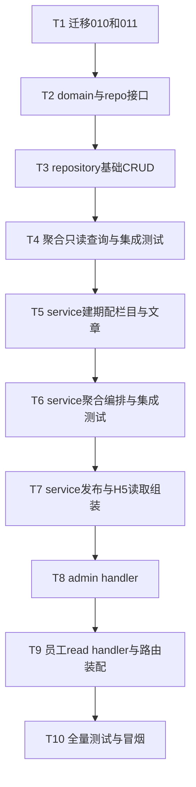

# 文化刊 Plan 2 · 文化刊(publication)核心后端 实现计划

> **面向 Agent 执行：** 必须使用 superpowers:subagent-driven-development（推荐）或 superpowers:executing-plans 逐任务执行。步骤用 `- [ ]` 勾选跟踪。

**目标：** 交付文化刊核心后端——admin 建期/配栏目/聚合当期数据成快照/写文章/发布；H5 读已发布刊物。**不含 AI、不含钉钉推送**（分别在 Plan 3）。

**架构概述：** 新增 `internal/modules/publication/`，沿用 stars/points 的 `domain/repository/service/handler` 四层。聚合器用**只读 SELECT 直查源表**（star_winners/user_dimension_scores/user_badges/mall_orders/activities/value_dimensions）冻成 `publication_snapshots.data_json`，发刊后历史不变。成稿类内容走 `publication_articles`。

**技术栈：** Go 1.24 / Gin / GORM / MySQL；测试 testify + ory/dockertest。

**前置：** 分支 `feat/culture-publication`（Plan 1 已落地）；spec `docs/superpowers/specs/2026-06-07-文化刊-design.md`；源表结构见 `migrations/001_init_schema.up.sql`（+003 badges.description、+008 blindbox_pool.item_id）；stars 的 `star_winners`/`star_nominations` 已在 009。

## 实现流程



---

### Task 1: 迁移 010 + 011

**Files:**
- Create: `migrations/010_create_publication_tables.up.sql` / `.down.sql`
- Create: `migrations/011_add_value_dimension_fields.up.sql` / `.down.sql`

- [ ] **Step 1: 写 010 up**

`migrations/010_create_publication_tables.up.sql`:
```sql
CREATE TABLE publications (
  id BIGINT AUTO_INCREMENT PRIMARY KEY,
  tenant_id BIGINT NOT NULL,
  season_id BIGINT NULL,
  title VARCHAR(128) NOT NULL,
  period_code VARCHAR(16) NOT NULL,
  cover_image_url VARCHAR(255) NULL,
  intro_text TEXT NULL,
  period_start TIMESTAMP NULL,
  period_end TIMESTAMP NULL,
  status ENUM('draft','published','archived') NOT NULL DEFAULT 'draft',
  published_at TIMESTAMP NULL,
  created_at TIMESTAMP DEFAULT CURRENT_TIMESTAMP,
  updated_at TIMESTAMP DEFAULT CURRENT_TIMESTAMP ON UPDATE CURRENT_TIMESTAMP,
  KEY idx_tenant_status (tenant_id, status),
  KEY idx_tenant_period (tenant_id, period_code)
) ENGINE=InnoDB CHARSET=utf8mb4;

CREATE TABLE publication_sections (
  id BIGINT AUTO_INCREMENT PRIMARY KEY,
  publication_id BIGINT NOT NULL,
  type ENUM('editorial','star','values','honors','lottery','activity','leaderboard','innovation','custom') NOT NULL,
  title VARCHAR(64) NOT NULL,
  sort_order INT NOT NULL DEFAULT 0,
  visible TINYINT(1) NOT NULL DEFAULT 1,
  ai_copy TEXT NULL,
  config_json JSON NULL,
  created_at TIMESTAMP DEFAULT CURRENT_TIMESTAMP,
  KEY idx_pub (publication_id, sort_order)
) ENGINE=InnoDB CHARSET=utf8mb4;

CREATE TABLE publication_articles (
  id BIGINT AUTO_INCREMENT PRIMARY KEY,
  tenant_id BIGINT NOT NULL,
  publication_id BIGINT NULL,
  section_id BIGINT NULL,
  title VARCHAR(128) NOT NULL,
  summary VARCHAR(255) NULL,
  content_html TEXT NOT NULL,
  cover_image_url VARCHAR(255) NULL,
  source_type ENUM('manual','from_nomination') NOT NULL DEFAULT 'manual',
  source_id BIGINT NULL,
  value_dimension_id BIGINT NULL,
  author_id BIGINT NULL,
  status ENUM('draft','published') NOT NULL DEFAULT 'draft',
  published_at TIMESTAMP NULL,
  created_at TIMESTAMP DEFAULT CURRENT_TIMESTAMP,
  updated_at TIMESTAMP DEFAULT CURRENT_TIMESTAMP ON UPDATE CURRENT_TIMESTAMP,
  KEY idx_pub_section (publication_id, section_id),
  KEY idx_tenant_status (tenant_id, status)
) ENGINE=InnoDB CHARSET=utf8mb4;

CREATE TABLE publication_snapshots (
  id BIGINT AUTO_INCREMENT PRIMARY KEY,
  publication_id BIGINT NOT NULL,
  section_id BIGINT NOT NULL,
  data_json JSON NOT NULL,
  created_at TIMESTAMP DEFAULT CURRENT_TIMESTAMP,
  UNIQUE KEY uk_pub_section (publication_id, section_id)
) ENGINE=InnoDB CHARSET=utf8mb4;
```

- [ ] **Step 2: 写 010 down**

`migrations/010_create_publication_tables.down.sql`:
```sql
DROP TABLE IF EXISTS publication_snapshots;
DROP TABLE IF EXISTS publication_articles;
DROP TABLE IF EXISTS publication_sections;
DROP TABLE IF EXISTS publications;
```

- [ ] **Step 3: 写 011 up/down**

`migrations/011_add_value_dimension_fields.up.sql`:
```sql
ALTER TABLE value_dimensions
  ADD COLUMN description VARCHAR(255) NOT NULL DEFAULT '' AFTER name,
  ADD COLUMN icon VARCHAR(64) NOT NULL DEFAULT '' AFTER description,
  ADD COLUMN color VARCHAR(16) NOT NULL DEFAULT '' AFTER icon;
```
`migrations/011_add_value_dimension_fields.down.sql`:
```sql
ALTER TABLE value_dimensions DROP COLUMN color, DROP COLUMN icon, DROP COLUMN description;
```

> 说明：value_dimensions 三字段用 `NOT NULL DEFAULT ''`（与 badges.description 同款），避免 GORM 扫 NULL 进 string 报错；publications 的可空字段用 `NULL` + Go 侧指针。

- [ ] **Step 4: 跑迁移 + 提交**

Run: `cd /Users/standardsoftware/go/culture_points_mall && go run ./cmd/migrate -action up -config ./configs`（本机 MySQL 可达则实跑；不可达则核对 SQL 并注明）
Expected: 4 张新表 + value_dimensions 多 3 列。
```bash
git add migrations/010_create_publication_tables.up.sql migrations/010_create_publication_tables.down.sql migrations/011_add_value_dimension_fields.up.sql migrations/011_add_value_dimension_fields.down.sql
git commit -m "feat:文化刊四表迁移010与价值观字段011"
```

---

### Task 2: domain 模型与 repository 接口

**Files:**
- Create: `internal/modules/publication/domain/publication.go`
- Create: `internal/modules/publication/domain/section.go`
- Create: `internal/modules/publication/domain/article.go`
- Create: `internal/modules/publication/domain/snapshot.go`
- Create: `internal/modules/publication/domain/aggregate.go`（聚合行 DTO）
- Create: `internal/modules/publication/domain/repository.go`

- [ ] **Step 1: publication.go**

```go
package domain

import "time"

type PublicationStatus string

const (
	PubDraft     PublicationStatus = "draft"
	PubPublished PublicationStatus = "published"
	PubArchived  PublicationStatus = "archived"
)

type Publication struct {
	ID            int64             `gorm:"column:id;primaryKey" json:"id"`
	TenantID      int64             `gorm:"column:tenant_id" json:"-"`
	SeasonID      *int64            `gorm:"column:season_id" json:"seasonId,omitempty"`
	Title         string            `gorm:"column:title" json:"title"`
	PeriodCode    string            `gorm:"column:period_code" json:"periodCode"`
	CoverImageURL *string           `gorm:"column:cover_image_url" json:"coverImageUrl,omitempty"`
	IntroText     *string           `gorm:"column:intro_text" json:"introText,omitempty"`
	PeriodStart   *time.Time        `gorm:"column:period_start" json:"periodStart,omitempty"`
	PeriodEnd     *time.Time        `gorm:"column:period_end" json:"periodEnd,omitempty"`
	Status        PublicationStatus `gorm:"column:status" json:"status"`
	PublishedAt   *time.Time        `gorm:"column:published_at" json:"publishedAt,omitempty"`
	CreatedAt     time.Time         `gorm:"column:created_at" json:"createdAt"`
	UpdatedAt     time.Time         `gorm:"column:updated_at" json:"-"`
}

func (Publication) TableName() string { return "publications" }
```

- [ ] **Step 2: section.go**

```go
package domain

import "time"

type SectionType string

const (
	SecEditorial   SectionType = "editorial"
	SecStar        SectionType = "star"
	SecValues      SectionType = "values"
	SecHonors      SectionType = "honors"
	SecLottery     SectionType = "lottery"
	SecActivity    SectionType = "activity"
	SecLeaderboard SectionType = "leaderboard"
	SecInnovation  SectionType = "innovation"
	SecCustom      SectionType = "custom"
)

// SnapshotBacked 标记需要聚合快照的栏目类型（其余为成稿/文章类）。
func (t SectionType) SnapshotBacked() bool {
	switch t {
	case SecStar, SecValues, SecHonors, SecLottery, SecActivity, SecLeaderboard:
		return true
	}
	return false
}

type Section struct {
	ID            int64       `gorm:"column:id;primaryKey" json:"id"`
	PublicationID int64       `gorm:"column:publication_id" json:"publicationId"`
	Type          SectionType `gorm:"column:type" json:"type"`
	Title         string      `gorm:"column:title" json:"title"`
	SortOrder     int         `gorm:"column:sort_order" json:"sortOrder"`
	Visible       bool        `gorm:"column:visible" json:"visible"`
	AICopy        *string     `gorm:"column:ai_copy" json:"aiCopy,omitempty"`
	ConfigJSON    *string     `gorm:"column:config_json" json:"-"`
	CreatedAt     time.Time   `gorm:"column:created_at" json:"-"`
}

func (Section) TableName() string { return "publication_sections" }
```

- [ ] **Step 3: article.go**

```go
package domain

import "time"

type ArticleSource string

const (
	ArticleManual         ArticleSource = "manual"
	ArticleFromNomination ArticleSource = "from_nomination"
)

type ArticleStatus string

const (
	ArticleDraft     ArticleStatus = "draft"
	ArticlePublished ArticleStatus = "published"
)

type Article struct {
	ID               int64         `gorm:"column:id;primaryKey" json:"id"`
	TenantID         int64         `gorm:"column:tenant_id" json:"-"`
	PublicationID    *int64        `gorm:"column:publication_id" json:"publicationId,omitempty"`
	SectionID        *int64        `gorm:"column:section_id" json:"sectionId,omitempty"`
	Title            string        `gorm:"column:title" json:"title"`
	Summary          *string       `gorm:"column:summary" json:"summary,omitempty"`
	ContentHTML      string        `gorm:"column:content_html" json:"contentHtml"`
	CoverImageURL    *string       `gorm:"column:cover_image_url" json:"coverImageUrl,omitempty"`
	SourceType       ArticleSource `gorm:"column:source_type" json:"sourceType"`
	SourceID         *int64        `gorm:"column:source_id" json:"sourceId,omitempty"`
	ValueDimensionID *int64        `gorm:"column:value_dimension_id" json:"valueDimensionId,omitempty"`
	AuthorID         *int64        `gorm:"column:author_id" json:"authorId,omitempty"`
	Status           ArticleStatus `gorm:"column:status" json:"status"`
	PublishedAt      *time.Time    `gorm:"column:published_at" json:"publishedAt,omitempty"`
	CreatedAt        time.Time     `gorm:"column:created_at" json:"createdAt"`
	UpdatedAt        time.Time     `gorm:"column:updated_at" json:"-"`
}

func (Article) TableName() string { return "publication_articles" }
```

- [ ] **Step 4: snapshot.go**

```go
package domain

import "time"

type Snapshot struct {
	ID            int64     `gorm:"column:id;primaryKey" json:"-"`
	PublicationID int64     `gorm:"column:publication_id" json:"-"`
	SectionID     int64     `gorm:"column:section_id" json:"sectionId"`
	DataJSON      string    `gorm:"column:data_json" json:"-"`
	CreatedAt     time.Time `gorm:"column:created_at" json:"-"`
}

func (Snapshot) TableName() string { return "publication_snapshots" }
```

- [ ] **Step 5: aggregate.go（聚合行 DTO，序列化进 data_json）**

```go
package domain

// 聚合行：只读查源表得到，marshal 进 snapshot.data_json。

type StarWinnerRow struct {
	UserID    int64  `json:"userId"`
	Name      string `json:"name"`
	AvatarURL string `json:"avatarUrl"`
	Dimension string `json:"dimension"`
	Citation  string `json:"citation"`
}

type ValueRow struct {
	DimensionID    int64  `json:"dimensionId"`
	Name           string `json:"name"`
	Description    string `json:"description"`
	Icon           string `json:"icon"`
	Color          string `json:"color"`
	NominationCount int   `json:"nominationCount"`
}

type HonorRow struct {
	UserID    int64  `json:"userId"`
	Name      string `json:"name"`
	Badge     string `json:"badge"`
	Rarity    string `json:"rarity"`
	IconURL   string `json:"iconUrl"`
	EarnedAt  string `json:"earnedAt"`
}

type LotteryRow struct {
	UserID int64  `json:"userId"`
	Name   string `json:"name"`
	Prize  string `json:"prize"`
	WonAt  string `json:"wonAt"`
}

type ActivityRow struct {
	ID      int64  `json:"id"`
	Title   string `json:"title"`
	StartAt string `json:"startAt"`
}

type LeaderRow struct {
	UserID int64  `json:"userId"`
	Name   string `json:"name"`
	Score  int    `json:"score"`
}
```

- [ ] **Step 6: repository.go 接口**

```go
package domain

import (
	"context"
	"time"
)

type Repository interface {
	// publications
	CreatePublication(ctx context.Context, p *Publication) error
	GetPublication(ctx context.Context, tenantID, id int64) (*Publication, error)
	ListPublished(ctx context.Context, tenantID int64) ([]Publication, error)
	GetCurrentPublished(ctx context.Context, tenantID int64) (*Publication, error)
	UpdatePublicationStatus(ctx context.Context, tenantID, id int64, status PublicationStatus, publishedAt *time.Time) error

	// sections
	ReplaceSections(ctx context.Context, publicationID int64, sections []Section) error
	ListSections(ctx context.Context, publicationID int64) ([]Section, error)

	// articles
	CreateArticle(ctx context.Context, a *Article) error
	UpdateArticle(ctx context.Context, tenantID int64, a *Article) error
	ListArticlesByPublication(ctx context.Context, tenantID, publicationID int64) ([]Article, error)

	// snapshots
	UpsertSnapshot(ctx context.Context, s *Snapshot) error
	ListSnapshots(ctx context.Context, publicationID int64) ([]Snapshot, error)

	// 聚合（只读查源表）
	AggStarWinners(ctx context.Context, tenantID, seasonID int64) ([]StarWinnerRow, error)
	AggValues(ctx context.Context, tenantID, seasonID int64) ([]ValueRow, error)
	AggHonors(ctx context.Context, tenantID int64, start, end *time.Time, limit int) ([]HonorRow, error)
	AggLottery(ctx context.Context, tenantID int64, start, end *time.Time, limit int) ([]LotteryRow, error)
	AggActivities(ctx context.Context, tenantID int64, start, end *time.Time, limit int) ([]ActivityRow, error)
	AggLeaderboard(ctx context.Context, tenantID int64, limit int) ([]LeaderRow, error)
}
```

- [ ] **Step 7: 编译 + 提交**

Run: `go build ./...`
```bash
git add internal/modules/publication/domain/
git commit -m "feat:文化刊领域模型与仓储接口"
```

---

### Task 3: repository 基础 CRUD

**Files:**
- Create: `internal/modules/publication/repository/gorm_repo.go`

- [ ] **Step 1: 写 CRUD 部分（聚合查询在 Task 4 追加同文件）**

```go
package repository

import (
	"context"
	"time"

	"gorm.io/gorm"
	"gorm.io/gorm/clause"

	"github.com/standardsoftware/culture_points_mall/internal/modules/publication/domain"
)

type GormRepo struct{ DB *gorm.DB }

func New(db *gorm.DB) *GormRepo { return &GormRepo{DB: db} }

func (r *GormRepo) CreatePublication(ctx context.Context, p *domain.Publication) error {
	return r.DB.WithContext(ctx).Create(p).Error
}

func (r *GormRepo) GetPublication(ctx context.Context, tenantID, id int64) (*domain.Publication, error) {
	var p domain.Publication
	err := r.DB.WithContext(ctx).Where("tenant_id = ? AND id = ?", tenantID, id).First(&p).Error
	if err != nil {
		return nil, err
	}
	return &p, nil
}

func (r *GormRepo) ListPublished(ctx context.Context, tenantID int64) ([]domain.Publication, error) {
	var rows []domain.Publication
	err := r.DB.WithContext(ctx).
		Where("tenant_id = ? AND status = ?", tenantID, domain.PubPublished).
		Order("published_at DESC").Find(&rows).Error
	return rows, err
}

func (r *GormRepo) GetCurrentPublished(ctx context.Context, tenantID int64) (*domain.Publication, error) {
	var p domain.Publication
	err := r.DB.WithContext(ctx).
		Where("tenant_id = ? AND status = ?", tenantID, domain.PubPublished).
		Order("published_at DESC").First(&p).Error
	if err != nil {
		return nil, err
	}
	return &p, nil
}

func (r *GormRepo) UpdatePublicationStatus(ctx context.Context, tenantID, id int64, status domain.PublicationStatus, publishedAt *time.Time) error {
	updates := map[string]any{"status": status}
	if publishedAt != nil {
		updates["published_at"] = *publishedAt
	}
	return r.DB.WithContext(ctx).Model(&domain.Publication{}).
		Where("tenant_id = ? AND id = ?", tenantID, id).Updates(updates).Error
}

// ReplaceSections 用事务整体替换某刊的栏目集合（先删后插），保证排序/可见性一次定稿。
func (r *GormRepo) ReplaceSections(ctx context.Context, publicationID int64, sections []domain.Section) error {
	return r.DB.WithContext(ctx).Transaction(func(tx *gorm.DB) error {
		if err := tx.Where("publication_id = ?", publicationID).Delete(&domain.Section{}).Error; err != nil {
			return err
		}
		if len(sections) == 0 {
			return nil
		}
		return tx.Create(&sections).Error
	})
}

func (r *GormRepo) ListSections(ctx context.Context, publicationID int64) ([]domain.Section, error) {
	var rows []domain.Section
	err := r.DB.WithContext(ctx).
		Where("publication_id = ?", publicationID).Order("sort_order ASC, id ASC").Find(&rows).Error
	return rows, err
}

func (r *GormRepo) CreateArticle(ctx context.Context, a *domain.Article) error {
	return r.DB.WithContext(ctx).Create(a).Error
}

func (r *GormRepo) UpdateArticle(ctx context.Context, tenantID int64, a *domain.Article) error {
	return r.DB.WithContext(ctx).Model(&domain.Article{}).
		Where("tenant_id = ? AND id = ?", tenantID, a.ID).
		Updates(map[string]any{
			"title": a.Title, "summary": a.Summary, "content_html": a.ContentHTML,
			"cover_image_url": a.CoverImageURL, "value_dimension_id": a.ValueDimensionID,
			"status": a.Status,
		}).Error
}

func (r *GormRepo) ListArticlesByPublication(ctx context.Context, tenantID, publicationID int64) ([]domain.Article, error) {
	var rows []domain.Article
	err := r.DB.WithContext(ctx).
		Where("tenant_id = ? AND publication_id = ?", tenantID, publicationID).
		Order("id ASC").Find(&rows).Error
	return rows, err
}

func (r *GormRepo) UpsertSnapshot(ctx context.Context, s *domain.Snapshot) error {
	return r.DB.WithContext(ctx).
		Clauses(clause.OnConflict{
			Columns:   []clause.Column{{Name: "publication_id"}, {Name: "section_id"}},
			DoUpdates: clause.AssignmentColumns([]string{"data_json", "created_at"}),
		}).Create(s).Error
}

func (r *GormRepo) ListSnapshots(ctx context.Context, publicationID int64) ([]domain.Snapshot, error) {
	var rows []domain.Snapshot
	err := r.DB.WithContext(ctx).Where("publication_id = ?", publicationID).Find(&rows).Error
	return rows, err
}
```

- [ ] **Step 2: 编译 + 提交**

Run: `go build ./...`（此时 repo 未实现聚合方法，`*GormRepo` 还不满足接口——本步只确保语法编译；接口满足在 Task 4 末尾验证）
> 注：若 `go build` 因接口未满足而报错，属预期（聚合方法在 Task 4 补全）。可改用 `go vet ./internal/modules/publication/repository/` 仅检查本文件语法；接口满足留到 Task 4 验证。
```bash
git add internal/modules/publication/repository/gorm_repo.go
git commit -m "feat:文化刊仓储基础CRUD"
```

---

### Task 4: 聚合只读查询 + 集成测试

**Files:**
- Modify: `internal/modules/publication/repository/gorm_repo.go`（追加 6 个 Agg 方法）
- Create: `internal/modules/publication/repository/gorm_repo_integration_test.go`

- [ ] **Step 1: 追加 6 个聚合方法**

在 gorm_repo.go 追加（顶部已 import time）：
```go
// applyWindow 给带 created/earned/start 时间列的聚合加可选时间窗。
func applyWindow(q *gorm.DB, col string, start, end *time.Time) *gorm.DB {
	if start != nil {
		q = q.Where(col+" >= ?", *start)
	}
	if end != nil {
		q = q.Where(col+" <= ?", *end)
	}
	return q
}

func (r *GormRepo) AggStarWinners(ctx context.Context, tenantID, seasonID int64) ([]domain.StarWinnerRow, error) {
	var rows []domain.StarWinnerRow
	err := r.DB.WithContext(ctx).
		Table("star_winners w").
		Select("w.user_id, u.name, u.avatar_url, d.name as dimension, COALESCE(w.citation,'') as citation").
		Joins("JOIN users u ON u.id = w.user_id").
		Joins("JOIN value_dimensions d ON d.id = w.dimension_id").
		Where("w.tenant_id = ? AND w.season_id = ?", tenantID, seasonID).
		Order("w.id ASC").Scan(&rows).Error
	return rows, err
}

func (r *GormRepo) AggValues(ctx context.Context, tenantID, seasonID int64) ([]domain.ValueRow, error) {
	var rows []domain.ValueRow
	err := r.DB.WithContext(ctx).
		Table("value_dimensions d").
		Select(`d.id as dimension_id, d.name, d.description, d.icon, d.color,
			(SELECT COUNT(*) FROM star_nominations n WHERE n.tenant_id = d.tenant_id AND n.season_id = ? AND n.dimension_id = d.id) as nomination_count`, seasonID).
		Where("d.tenant_id = ? AND d.enabled = 1", tenantID).
		Order("d.sort_order ASC, d.id ASC").Scan(&rows).Error
	return rows, err
}

func (r *GormRepo) AggHonors(ctx context.Context, tenantID int64, start, end *time.Time, limit int) ([]domain.HonorRow, error) {
	var rows []domain.HonorRow
	q := r.DB.WithContext(ctx).
		Table("user_badges ub").
		Select("ub.user_id, u.name, b.name as badge, b.rarity, b.icon_url, DATE_FORMAT(ub.earned_at,'%Y-%m-%d') as earned_at").
		Joins("JOIN badges b ON b.id = ub.badge_id").
		Joins("JOIN users u ON u.id = ub.user_id").
		Where("b.tenant_id = ?", tenantID)
	q = applyWindow(q, "ub.earned_at", start, end)
	err := q.Order("ub.earned_at DESC").Limit(limit).Scan(&rows).Error
	return rows, err
}

func (r *GormRepo) AggLottery(ctx context.Context, tenantID int64, start, end *time.Time, limit int) ([]domain.LotteryRow, error) {
	var rows []domain.LotteryRow
	q := r.DB.WithContext(ctx).
		Table("mall_orders o").
		Select("o.user_id, u.name, COALESCE(p.prize_name,'') as prize, DATE_FORMAT(o.created_at,'%Y-%m-%d') as won_at").
		Joins("JOIN users u ON u.id = o.user_id").
		Joins("LEFT JOIN mall_blindbox_pool p ON p.id = o.prize_id").
		Where("o.tenant_id = ? AND o.prize_id IS NOT NULL", tenantID)
	q = applyWindow(q, "o.created_at", start, end)
	err := q.Order("o.created_at DESC").Limit(limit).Scan(&rows).Error
	return rows, err
}

func (r *GormRepo) AggActivities(ctx context.Context, tenantID int64, start, end *time.Time, limit int) ([]domain.ActivityRow, error) {
	var rows []domain.ActivityRow
	q := r.DB.WithContext(ctx).
		Table("activities a").
		Select("a.id, a.title, COALESCE(DATE_FORMAT(a.start_at,'%Y-%m-%d'),'') as start_at").
		Where("a.tenant_id = ?", tenantID)
	q = applyWindow(q, "a.start_at", start, end)
	err := q.Order("a.start_at DESC").Limit(limit).Scan(&rows).Error
	return rows, err
}

func (r *GormRepo) AggLeaderboard(ctx context.Context, tenantID int64, limit int) ([]domain.LeaderRow, error) {
	var rows []domain.LeaderRow
	err := r.DB.WithContext(ctx).
		Table("user_dimension_scores s").
		Select("s.user_id, u.name, SUM(s.quarter_score) as score").
		Joins("JOIN users u ON u.id = s.user_id").
		Where("s.tenant_id = ?", tenantID).
		Group("s.user_id, u.name").
		Order("score DESC").Limit(limit).Scan(&rows).Error
	return rows, err
}
```

- [ ] **Step 2: 写聚合集成测试**

`internal/modules/publication/repository/gorm_repo_integration_test.go`，`//go:build integration`，TestMain 照抄 `internal/modules/stars/service/service_integration_test.go` 的 dockertest 启动逻辑（`migrate.Runner{Dir:"../../../../migrations"}.Up()`，迁移到 011）。用例：
```go
//go:build integration

package repository_test

// TestMain: dockertest MySQL + migrate.Up()（覆盖到 011）。
// 准备：insert users / value_dimensions(带 icon/color) / star_winners / user_badges+badges / mall_orders+mall_blindbox_pool / activities / user_dimension_scores。

func TestAggStarWinners(t *testing.T) {
	// 造 1 个 season 的 2 个 winner -> AggStarWinners 返回 2 行，含 name/dimension/citation
}
func TestAggLottery_WindowAndPrizeName(t *testing.T) {
	// 造 mall_orders(prize_id 指向 pool) -> AggLottery 返回 prize=pool.prize_name；
	// 用 start/end 窗口过滤验证只返回窗内
}
func TestAggLeaderboard_SumQuarter(t *testing.T) {
	// 造 user_dimension_scores 多维度 -> AggLeaderboard 按 SUM(quarter_score) 倒序
}
```
> 至少覆盖 star/lottery/leaderboard 三个聚合（含 join 取名、prize 取名、时间窗、SUM 分组），honors/values/activity 同款可补。

- [ ] **Step 3: 验证**

Run: `go build ./...`（此时 `*GormRepo` 满足接口，应通过）
Run: `go vet -tags integration ./internal/modules/publication/...`
Run（docker 可用）: `go test -tags integration ./internal/modules/publication/repository/ -v`
Expected: 聚合用例 PASS；docker 不可用则确保编译通过并注明。

- [ ] **Step 4: 提交**

```bash
git add internal/modules/publication/repository/
git commit -m "feat:文化刊聚合只读查询并集成测试"
```

---

### Task 5: service 建期/配栏目/文章

**Files:**
- Create: `internal/modules/publication/service/service.go`

- [ ] **Step 1: service 骨架 + 建期/栏目/文章**

```go
package service

import (
	"context"
	"errors"
	"time"

	"github.com/standardsoftware/culture_points_mall/internal/modules/publication/domain"
)

type Service struct {
	Repo domain.Repository
}

func New(repo domain.Repository) *Service { return &Service{Repo: repo} }

var ErrNotDraft = errors.New("刊物已发布，不能再改")

type CreateIssueCmd struct {
	TenantID    int64
	SeasonID    *int64
	Title       string
	PeriodCode  string
	PeriodStart *time.Time
	PeriodEnd   *time.Time
}

func (s *Service) CreateIssue(ctx context.Context, cmd CreateIssueCmd) (*domain.Publication, error) {
	p := &domain.Publication{
		TenantID: cmd.TenantID, SeasonID: cmd.SeasonID, Title: cmd.Title,
		PeriodCode: cmd.PeriodCode, PeriodStart: cmd.PeriodStart, PeriodEnd: cmd.PeriodEnd,
		Status: domain.PubDraft,
	}
	if err := s.Repo.CreatePublication(ctx, p); err != nil {
		return nil, err
	}
	return p, nil
}

// ConfigureSections 整体替换栏目（仅 draft 可改）。
func (s *Service) ConfigureSections(ctx context.Context, tenantID, pubID int64, sections []domain.Section) error {
	pub, err := s.Repo.GetPublication(ctx, tenantID, pubID)
	if err != nil {
		return err
	}
	if pub.Status != domain.PubDraft {
		return ErrNotDraft
	}
	for i := range sections {
		sections[i].PublicationID = pubID
		sections[i].ID = 0
	}
	return s.Repo.ReplaceSections(ctx, pubID, sections)
}

func (s *Service) UpsertArticle(ctx context.Context, tenantID int64, a *domain.Article) error {
	a.TenantID = tenantID
	if a.ID == 0 {
		if a.Status == "" {
			a.Status = domain.ArticleDraft
		}
		if a.SourceType == "" {
			a.SourceType = domain.ArticleManual
		}
		return s.Repo.CreateArticle(ctx, a)
	}
	return s.Repo.UpdateArticle(ctx, tenantID, a)
}
```

- [ ] **Step 2: 编译 + 提交**

Run: `go build ./...`
```bash
git add internal/modules/publication/service/service.go
git commit -m "feat:文化刊建期配栏目与文章service"
```

---

### Task 6: service 聚合编排 + 集成测试

**Files:**
- Modify: `internal/modules/publication/service/service.go`
- Create: `internal/modules/publication/service/service_integration_test.go`

- [ ] **Step 1: 加 Aggregate**

```go
import "encoding/json"

const aggLimit = 50

// Aggregate 遍历可见且需快照的栏目，按类型只读查源表，marshal 进 snapshot。幂等（UpsertSnapshot 覆盖）。
func (s *Service) Aggregate(ctx context.Context, tenantID, pubID int64) error {
	pub, err := s.Repo.GetPublication(ctx, tenantID, pubID)
	if err != nil {
		return err
	}
	sections, err := s.Repo.ListSections(ctx, pubID)
	if err != nil {
		return err
	}
	for _, sec := range sections {
		if !sec.Visible || !sec.Type.SnapshotBacked() {
			continue
		}
		data, err := s.aggregateSection(ctx, tenantID, pub, sec.Type)
		if err != nil {
			return err
		}
		raw, err := json.Marshal(data)
		if err != nil {
			return err
		}
		if err := s.Repo.UpsertSnapshot(ctx, &domain.Snapshot{
			PublicationID: pubID, SectionID: sec.ID, DataJSON: string(raw),
		}); err != nil {
			return err
		}
	}
	return nil
}

func (s *Service) aggregateSection(ctx context.Context, tenantID int64, pub *domain.Publication, t domain.SectionType) (any, error) {
	switch t {
	case domain.SecStar:
		if pub.SeasonID == nil {
			return []domain.StarWinnerRow{}, nil
		}
		return s.Repo.AggStarWinners(ctx, tenantID, *pub.SeasonID)
	case domain.SecValues:
		var seasonID int64
		if pub.SeasonID != nil {
			seasonID = *pub.SeasonID
		}
		return s.Repo.AggValues(ctx, tenantID, seasonID)
	case domain.SecHonors:
		return s.Repo.AggHonors(ctx, tenantID, pub.PeriodStart, pub.PeriodEnd, aggLimit)
	case domain.SecLottery:
		return s.Repo.AggLottery(ctx, tenantID, pub.PeriodStart, pub.PeriodEnd, aggLimit)
	case domain.SecActivity:
		return s.Repo.AggActivities(ctx, tenantID, pub.PeriodStart, pub.PeriodEnd, aggLimit)
	case domain.SecLeaderboard:
		return s.Repo.AggLeaderboard(ctx, tenantID, aggLimit)
	}
	return nil, nil
}
```

- [ ] **Step 2: 集成测试**

`service_integration_test.go`，`//go:build integration`，TestMain 同款 dockertest。用例 `TestAggregate_WritesSnapshots`：建一期(draft, 带 season + period)、配 star+lottery+leaderboard 三个可见栏目 + 造源数据 → `Aggregate` → 断言 `publication_snapshots` 有 3 行、对应 section、data_json 可反序列化出预期行数；再调一次 Aggregate（幂等）→ 仍 3 行。

- [ ] **Step 3: 验证 + 提交**

Run: `go build ./... && go vet -tags integration ./internal/modules/publication/...`
Run（docker）: `go test -tags integration ./internal/modules/publication/service/ -run TestAggregate -v`
```bash
git add internal/modules/publication/service/
git commit -m "feat:文化刊聚合编排并集成测试"
```

---

### Task 7: service 发布 + H5 读取组装

**Files:**
- Modify: `internal/modules/publication/service/service.go`

- [ ] **Step 1: 加 Publish + 读取组装 DTO**

```go
// PublishedView 是 H5 阅读页的组装结果：刊物 + 有序栏目（各带快照数据或文章）。
type PublishedView struct {
	Publication *domain.Publication `json:"publication"`
	Sections    []SectionView       `json:"sections"`
}

type SectionView struct {
	Section  domain.Section    `json:"section"`
	Snapshot json.RawMessage   `json:"snapshot,omitempty"` // 快照类
	Articles []domain.Article  `json:"articles,omitempty"` // 成稿类
}

func (s *Service) Publish(ctx context.Context, tenantID, pubID int64) error {
	now := time.Now()
	return s.Repo.UpdatePublicationStatus(ctx, tenantID, pubID, domain.PubPublished, &now)
}

func (s *Service) ListPublished(ctx context.Context, tenantID int64) ([]domain.Publication, error) {
	return s.Repo.ListPublished(ctx, tenantID)
}

func (s *Service) GetCurrent(ctx context.Context, tenantID int64) (*PublishedView, error) {
	pub, err := s.Repo.GetCurrentPublished(ctx, tenantID)
	if err != nil {
		return nil, err
	}
	return s.assemble(ctx, tenantID, pub)
}

func (s *Service) GetDetail(ctx context.Context, tenantID, pubID int64) (*PublishedView, error) {
	pub, err := s.Repo.GetPublication(ctx, tenantID, pubID)
	if err != nil {
		return nil, err
	}
	return s.assemble(ctx, tenantID, pub)
}

func (s *Service) assemble(ctx context.Context, tenantID int64, pub *domain.Publication) (*PublishedView, error) {
	sections, err := s.Repo.ListSections(ctx, pub.ID)
	if err != nil {
		return nil, err
	}
	snaps, err := s.Repo.ListSnapshots(ctx, pub.ID)
	if err != nil {
		return nil, err
	}
	snapBySection := map[int64]string{}
	for _, sn := range snaps {
		snapBySection[sn.SectionID] = sn.DataJSON
	}
	articles, err := s.Repo.ListArticlesByPublication(ctx, tenantID, pub.ID)
	if err != nil {
		return nil, err
	}
	artBySection := map[int64][]domain.Article{}
	for _, a := range articles {
		if a.SectionID != nil {
			artBySection[*a.SectionID] = append(artBySection[*a.SectionID], a)
		}
	}
	views := make([]SectionView, 0, len(sections))
	for _, sec := range sections {
		if !sec.Visible {
			continue
		}
		sv := SectionView{Section: sec}
		if raw, ok := snapBySection[sec.ID]; ok {
			sv.Snapshot = json.RawMessage(raw)
		}
		if arts, ok := artBySection[sec.ID]; ok {
			sv.Articles = arts
		}
		views = append(views, sv)
	}
	return &PublishedView{Publication: pub, Sections: views}, nil
}
```

- [ ] **Step 2: 编译 + 提交**

Run: `go build ./...`
```bash
git add internal/modules/publication/service/service.go
git commit -m "feat:文化刊发布与H5阅读组装"
```

---

### Task 8: admin handler

**Files:**
- Create: `internal/modules/publication/handler/handler.go`（先写 RegisterAdmin 部分）

- [ ] **Step 1: 写 Handler + RegisterAdmin**

```go
package handler

import (
	"net/http"
	"strconv"

	"github.com/gin-gonic/gin"

	"github.com/standardsoftware/culture_points_mall/internal/modules/publication/domain"
	pubsvc "github.com/standardsoftware/culture_points_mall/internal/modules/publication/service"
	cpmctx "github.com/standardsoftware/culture_points_mall/internal/shared/ctx"
)

type Handler struct{ Svc *pubsvc.Service }

func New(s *pubsvc.Service) *Handler { return &Handler{Svc: s} }

func (h *Handler) RegisterAdmin(rg *gin.RouterGroup) {
	rg.POST("/admin/publications", h.create)
	rg.PUT("/admin/publications/:id/sections", h.configureSections)
	rg.POST("/admin/publications/:id/aggregate", h.aggregate)
	rg.POST("/admin/publications/:id/articles", h.upsertArticle)
	rg.POST("/admin/publications/:id/publish", h.publish)
	rg.GET("/admin/publications/:id", h.adminDetail)
}

func (h *Handler) create(c *gin.Context) {
	tid := cpmctx.TenantID(c.Request.Context())
	var req struct {
		SeasonID    *int64 `json:"seasonId"`
		Title       string `json:"title" binding:"required"`
		PeriodCode  string `json:"periodCode" binding:"required"`
	}
	if err := c.ShouldBindJSON(&req); err != nil {
		c.JSON(http.StatusBadRequest, gin.H{"error": err.Error()})
		return
	}
	p, err := h.Svc.CreateIssue(c.Request.Context(), pubsvc.CreateIssueCmd{
		TenantID: tid, SeasonID: req.SeasonID, Title: req.Title, PeriodCode: req.PeriodCode,
	})
	if err != nil {
		c.JSON(http.StatusInternalServerError, gin.H{"error": err.Error()})
		return
	}
	c.JSON(http.StatusOK, p)
}

func (h *Handler) configureSections(c *gin.Context) {
	tid := cpmctx.TenantID(c.Request.Context())
	pubID, _ := strconv.ParseInt(c.Param("id"), 10, 64)
	var req struct {
		Sections []struct {
			Type      string `json:"type" binding:"required"`
			Title     string `json:"title" binding:"required"`
			SortOrder int    `json:"sortOrder"`
			Visible   bool   `json:"visible"`
		} `json:"sections" binding:"required"`
	}
	if err := c.ShouldBindJSON(&req); err != nil {
		c.JSON(http.StatusBadRequest, gin.H{"error": err.Error()})
		return
	}
	secs := make([]domain.Section, 0, len(req.Sections))
	for _, s := range req.Sections {
		secs = append(secs, domain.Section{
			Type: domain.SectionType(s.Type), Title: s.Title,
			SortOrder: s.SortOrder, Visible: s.Visible,
		})
	}
	if err := h.Svc.ConfigureSections(c.Request.Context(), tid, pubID, secs); err != nil {
		c.JSON(http.StatusInternalServerError, gin.H{"error": err.Error()})
		return
	}
	c.JSON(http.StatusOK, gin.H{"ok": true})
}

func (h *Handler) aggregate(c *gin.Context) {
	tid := cpmctx.TenantID(c.Request.Context())
	pubID, _ := strconv.ParseInt(c.Param("id"), 10, 64)
	if err := h.Svc.Aggregate(c.Request.Context(), tid, pubID); err != nil {
		c.JSON(http.StatusInternalServerError, gin.H{"error": err.Error()})
		return
	}
	c.JSON(http.StatusOK, gin.H{"ok": true})
}

func (h *Handler) upsertArticle(c *gin.Context) {
	tid := cpmctx.TenantID(c.Request.Context())
	pubID, _ := strconv.ParseInt(c.Param("id"), 10, 64)
	var a domain.Article
	if err := c.ShouldBindJSON(&a); err != nil {
		c.JSON(http.StatusBadRequest, gin.H{"error": err.Error()})
		return
	}
	a.PublicationID = &pubID
	if err := h.Svc.UpsertArticle(c.Request.Context(), tid, &a); err != nil {
		c.JSON(http.StatusInternalServerError, gin.H{"error": err.Error()})
		return
	}
	c.JSON(http.StatusOK, a)
}

func (h *Handler) publish(c *gin.Context) {
	tid := cpmctx.TenantID(c.Request.Context())
	pubID, _ := strconv.ParseInt(c.Param("id"), 10, 64)
	if err := h.Svc.Publish(c.Request.Context(), tid, pubID); err != nil {
		c.JSON(http.StatusInternalServerError, gin.H{"error": err.Error()})
		return
	}
	c.JSON(http.StatusOK, gin.H{"ok": true})
}

func (h *Handler) adminDetail(c *gin.Context) {
	tid := cpmctx.TenantID(c.Request.Context())
	pubID, _ := strconv.ParseInt(c.Param("id"), 10, 64)
	v, err := h.Svc.GetDetail(c.Request.Context(), tid, pubID)
	if err != nil {
		c.JSON(http.StatusInternalServerError, gin.H{"error": err.Error()})
		return
	}
	c.JSON(http.StatusOK, v)
}
```

- [ ] **Step 2: 编译 + 提交**

Run: `go build ./...`
```bash
git add internal/modules/publication/handler/handler.go
git commit -m "feat:文化刊admin接口"
```

---

### Task 9: 员工 read handler + 路由装配

**Files:**
- Modify: `internal/modules/publication/handler/handler.go`（加 Register）
- Modify: `internal/router/router.go`

- [ ] **Step 1: 加员工端 Register**

在 handler.go 追加：
```go
func (h *Handler) Register(rg *gin.RouterGroup) {
	rg.GET("/api/v1/publications", h.list)
	rg.GET("/api/v1/publications/current", h.current)
	rg.GET("/api/v1/publications/:id", h.detail)
}

func (h *Handler) list(c *gin.Context) {
	tid := cpmctx.TenantID(c.Request.Context())
	rows, err := h.Svc.ListPublished(c.Request.Context(), tid)
	if err != nil {
		c.JSON(http.StatusInternalServerError, gin.H{"error": err.Error()})
		return
	}
	c.JSON(http.StatusOK, gin.H{"items": rows})
}

func (h *Handler) current(c *gin.Context) {
	tid := cpmctx.TenantID(c.Request.Context())
	v, err := h.Svc.GetCurrent(c.Request.Context(), tid)
	if err != nil {
		c.JSON(http.StatusOK, gin.H{"publication": nil})
		return
	}
	c.JSON(http.StatusOK, v)
}

func (h *Handler) detail(c *gin.Context) {
	tid := cpmctx.TenantID(c.Request.Context())
	pubID, _ := strconv.ParseInt(c.Param("id"), 10, 64)
	v, err := h.Svc.GetDetail(c.Request.Context(), tid, pubID)
	if err != nil {
		c.JSON(http.StatusInternalServerError, gin.H{"error": err.Error()})
		return
	}
	c.JSON(http.StatusOK, v)
}
```

> 注意路由顺序：`/api/v1/publications/current` 必须在 `/api/v1/publications/:id` **之前**注册，否则 gin 会把 `current` 当成 `:id`。上面 Register 已按此序。

- [ ] **Step 2: router.go 装配**

import 加：
```go
	pubh "github.com/standardsoftware/culture_points_mall/internal/modules/publication/handler"
	pubrepo "github.com/standardsoftware/culture_points_mall/internal/modules/publication/repository"
	pubsvc "github.com/standardsoftware/culture_points_mall/internal/modules/publication/service"
```
`Build()` 内（`starsSvc` 之后）：
```go
	pubService := pubsvc.New(pubrepo.New(deps.DB))
	pubHandler := pubh.New(pubService)
```
authed 组加 `pubHandler.Register(authed)`；admin 组加 `pubHandler.RegisterAdmin(admin)`。

- [ ] **Step 3: 编译 + 提交**

Run: `go build ./... && go vet ./...`
```bash
git add internal/modules/publication/handler/handler.go internal/router/router.go
git commit -m "feat:文化刊员工read接口与路由装配"
```

---

### Task 10: 全量测试与冒烟

- [ ] **Step 1: 全量单测 + 集成测试**

Run: `go test ./...`
Run（docker）: `go test -tags integration ./internal/modules/publication/...`
Expected: 全绿。

- [ ] **Step 2: gofmt 检查**

Run: `gofmt -l internal/modules/publication/`
Expected: 无输出。有则 `gofmt -w internal/modules/publication/`。

- [ ] **Step 3: 冒烟（手动）**

起服务，admin：建期 → 配栏目(star+leaderboard+lottery+一个 custom article) → aggregate → 写一篇 custom 文章 → publish；员工：`GET /api/v1/publications/current` 看到组装结果（栏目有序、快照数据在、文章在）。

- [ ] **Step 4: 最终提交**

```bash
git add -A && git commit -m "test:文化刊后端全量测试通过" || echo "nothing to commit"
```

---

## 自检（spec 覆盖 / 占位符 / 类型一致）

- **spec 覆盖**：覆盖 spec「B 组文化刊」的数据模型（010/011）、聚合快照（star/values/honors/lottery/activity/leaderboard 六类只读聚合 + period 窗口）、栏目配置、文章 CRUD、发布、H5 阅读组装（snapshot + article 合并按 sort_order）。**不含**：AI 编排(①②)、钉钉推送 → Plan 3；前端 → Plan 4。
- **占位符**：集成测试体以"照抄 stars TestMain"表述共享 dockertest 样板（可直接复制），其余为完整代码。
- **类型一致**：`Repository` 接口方法签名与 `GormRepo` 实现、与 service 调用、与 `domain` 行 DTO（StarWinnerRow 等）一致；handler 调用的 service 方法（CreateIssue/ConfigureSections/Aggregate/UpsertArticle/Publish/ListPublished/GetCurrent/GetDetail）均在 Task 5-7 定义。

## 偏离与备注

- **新增 publications.period_start/period_end**（spec DDL 未列）：用于 honors/lottery/activity 的时间窗聚合；null 则不限时间只取 LIMIT 50。已在 010 迁移与 domain 体现，需回填 spec。
- **钉钉推送(push-dingtalk)挪到 Plan 3**：与 AI 同属"出站/外部"，且需读 dingtalk Card/robots 内部，集中到 Plan 3 做。
- **AI 字段留空**：publications.intro_text、sections.ai_copy、articles(from_nomination) 本期不填（Plan 3 AI 编排时写入）。
- **value_dimensions 三字段** NOT NULL DEFAULT ''（与 badges.description 同款），admin 价值观管理页回填 icon/color 在 Plan 4 前端。
