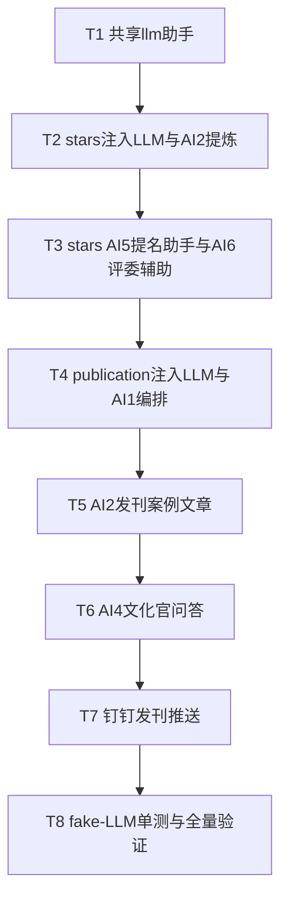

# 文化刊 Plan 3 · 6 项 AI + 钉钉推送 实现计划

> **面向 Agent 执行：** 必须使用 superpowers:subagent-driven-development（推荐）或 superpowers:executing-plans 逐任务执行。步骤用 `- [ ]` 勾选跟踪。

**目标：** 给 stars/publication 接入 6 项 AI（复用已接入的 Claude）+ 文化刊发刊钉钉群推送。全部复用 `insights` 的非流式 + JSON 清洗范式。

**架构概述：** 抽出共享助手 `llm.MessagesJSON/MessagesText`；stars.Service / publication.Service 注入**可空** `llm.Client`（nil 时 AI 端点返 503、主流程不受影响）；publication 另注入 `dingtalk.Client` 做推送。**AI③ 个性化画像直接复用现有 `insights.DNAReport`（/api/v1/me/dna-report），本计划不写后端**，前端在 Plan 4 接入。

**技术栈：** Go 1.24 / Gin / GORM；LLM 走 `internal/platform/llm`（Claude）；测试用 fake `llm.Client`（外部 IO 允许 mock）。

**前置：** 分支 `feat/culture-publication`（Plan 1/2 已落地）；范式见 `internal/modules/insights/service/service.go` 的 `callLLMJSON`；LLM 类型见 `internal/platform/llm/{client,types}.go`；钉钉 `Card{Title,Detail,Extra}` + `BotBroadcast(ctx, groupID, Card)`（groupID = `config.dingtalk.robots[].id`）。

## 6 项 AI 落点回顾

| AI | 位置 | 模块 | 本计划 |
|----|------|------|--------|
| ① 刊首语/栏目导语 | publication Compose | publication | ✅ |
| ② 案例提炼+标签 | A 提报时回写 nomination；B 发刊生成案例文章 | stars + publication | ✅ |
| ③ 个性化画像 | H5 我的文化画像 | insights(复用) | ⏭️ 复用现有 DNA，仅前端接 |
| ④ 文化官问答 | H5 AI 文化官 | publication | ✅ 无状态 v1 |
| ⑤ 提名助手 | H5 提报表单 | stars | ✅ |
| ⑥ 评委辅助 | admin 评审台 | stars | ✅ |

## 实现流程



---

### Task 1: 共享 LLM 助手

**Files:**
- Create: `internal/platform/llm/jsonchat.go`
- Create: `internal/platform/llm/jsonchat_test.go`

- [ ] **Step 1: 写助手**

`internal/platform/llm/jsonchat.go`:
```go
package llm

import (
	"context"
	"errors"
	"strings"
)

// MessagesText 调用 LLM 返回纯文本（拼接所有 text block）。供问答/草稿等非 JSON 场景。
func MessagesText(ctx context.Context, c Client, system, user string, maxTokens int) (string, error) {
	if maxTokens <= 0 {
		maxTokens = 1024
	}
	resp, err := c.Messages(ctx, MessagesRequest{
		System:    system,
		Messages:  []Message{{Role: RoleUser, Content: []Block{{Type: "text", Text: user}}}},
		MaxTokens: maxTokens,
	})
	if err != nil {
		return "", err
	}
	var text string
	for _, b := range resp.Content {
		if b.Type == "text" {
			text += b.Text
		}
	}
	return strings.TrimSpace(text), nil
}

// MessagesJSON 调用 LLM 并清洗出 JSON 字符串：剥 ```json 代码块、截首个 { 到末个 }。
// 与 insights.callLLMJSON 同款，抽出供各模块复用。
func MessagesJSON(ctx context.Context, c Client, system, user string, maxTokens int) (string, error) {
	text, err := MessagesText(ctx, c, system+"\n\n严格输出 JSON，不要包代码块，不要多余文字。", user, maxTokens)
	if err != nil {
		return "", err
	}
	if strings.HasPrefix(text, "```") {
		text = strings.TrimPrefix(text, "```json")
		text = strings.TrimPrefix(text, "```")
		text = strings.TrimSuffix(text, "```")
		text = strings.TrimSpace(text)
	}
	if first := strings.Index(text, "{"); first >= 0 {
		if last := strings.LastIndex(text, "}"); last > first {
			text = text[first : last+1]
		}
	}
	if text == "" {
		return "", errors.New("llm returned empty json")
	}
	return text, nil
}
```

- [ ] **Step 2: 写单测（fake client）**

`internal/platform/llm/jsonchat_test.go`:
```go
package llm

import (
	"context"
	"testing"
)

type fakeClient struct{ reply string }

func (f fakeClient) Messages(_ context.Context, _ MessagesRequest) (MessagesResponse, error) {
	return MessagesResponse{Content: []Block{{Type: "text", Text: f.reply}}}, nil
}
func (f fakeClient) MessagesStream(_ context.Context, _ MessagesRequest) (<-chan StreamEvent, error) {
	return nil, nil
}

func TestMessagesJSON_StripsCodeFence(t *testing.T) {
	c := fakeClient{reply: "```json\n{\"a\":1}\n```"}
	got, err := MessagesJSON(context.Background(), c, "sys", "u", 0)
	if err != nil || got != `{"a":1}` {
		t.Fatalf("got %q err %v", got, err)
	}
}

func TestMessagesJSON_ExtractsBraces(t *testing.T) {
	c := fakeClient{reply: "废话{\"a\":1}尾巴"}
	got, _ := MessagesJSON(context.Background(), c, "sys", "u", 0)
	if got != `{"a":1}` {
		t.Fatalf("got %q", got)
	}
}

func TestMessagesText_Concat(t *testing.T) {
	c := fakeClient{reply: "  hello  "}
	got, _ := MessagesText(context.Background(), c, "sys", "u", 0)
	if got != "hello" {
		t.Fatalf("got %q", got)
	}
}
```

- [ ] **Step 3: 跑测试 + 提交**

Run: `cd /Users/standardsoftware/go/culture_points_mall && go test ./internal/platform/llm/ -run TestMessages -v`
Expected: PASS。
```bash
git add internal/platform/llm/jsonchat.go internal/platform/llm/jsonchat_test.go
git commit -m "feat:抽出llm共享JSON与文本调用助手"
```

---

### Task 2: stars 注入 LLM + AI② 提报提炼

**Files:**
- Modify: `internal/modules/stars/domain/repository.go`（加 UpdateNominationRefined）
- Modify: `internal/modules/stars/repository/gorm_repo.go`
- Modify: `internal/modules/stars/service/service.go`（New 加 LLM、Nominate 末尾 best-effort 提炼）
- Modify: `internal/router/router.go`（stars.New 传 deps.LLM）

- [ ] **Step 1: repo 加 UpdateNominationRefined**

`domain/repository.go` 接口加：
```go
	UpdateNominationRefined(ctx context.Context, tenantID, id int64, refined string, tags string) error
```
`repository/gorm_repo.go` 加实现：
```go
func (r *GormRepo) UpdateNominationRefined(ctx context.Context, tenantID, id int64, refined string, tags string) error {
	return r.DB.WithContext(ctx).Model(&domain.Nomination{}).
		Where("id = ? AND tenant_id = ?", id, tenantID).
		Updates(map[string]interface{}{"case_refined": refined, "ai_tags": tags}).Error
}
```

- [ ] **Step 2: service 注入 LLM + 提炼**

`service/service.go`：
- import 加 `"context"`(已) `"encoding/json"` `"github.com/standardsoftware/culture_points_mall/internal/platform/llm"`。
- `Service` struct 加字段 `LLM llm.Client`。
- `New` 改签名 `func New(repo domain.Repository, points *pointssvc.Service, cfg config.StarsCfg, llmC llm.Client) *Service`，结尾 `return &Service{Repo: repo, Points: points, Cfg: cfg, LLM: llmC}`。
- 加哨兵 `var ErrLLMUnavailable = errors.New("AI 能力未配置")`。
- 在 `Nominate` 成功 return 前（积分发放之后），加 best-effort 提炼：
```go
	// AI② best-effort：提炼案例 + 价值观标签，失败不影响提报
	if s.LLM != nil {
		s.refineNomination(ctx, cmd.TenantID, n)
	}
	return n, nil
```
- 加私有方法：
```go
func (s *Service) refineNomination(ctx context.Context, tenantID int64, n *domain.Nomination) {
	system := `你是企业文化案例编辑，把员工口语化的提名理由提炼成简洁有力的践行小故事，并打价值观标签。`
	user := fmt.Sprintf(`提名理由原文：%s

严格输出 JSON：
{
  "refined": "80-120 字的践行故事，第三人称，具体不空泛",
  "tags": ["2-4 个价值观/行为标签，每个 4 字内"]
}`, n.CaseText)
	raw, err := llm.MessagesJSON(ctx, s.LLM, system, user, 800)
	if err != nil {
		return
	}
	var parsed struct {
		Refined string   `json:"refined"`
		Tags    []string `json:"tags"`
	}
	if json.Unmarshal([]byte(raw), &parsed) != nil || parsed.Refined == "" {
		return
	}
	tagsJSON, _ := json.Marshal(parsed.Tags)
	_ = s.Repo.UpdateNominationRefined(ctx, tenantID, n.ID, parsed.Refined, string(tagsJSON))
}
```
（注意 service.go 顶部需 import `"fmt"`，若已存在则不重复。）

- [ ] **Step 3: router 传 LLM**

`internal/router/router.go`：`starsSvc := starssvc.New(starsrepo.New(deps.DB), pointsSvc, deps.Cfg.Stars, deps.LLM)`（末尾加 `deps.LLM`）。

- [ ] **Step 4: 验证 + 提交**

Run: `go build ./... && go vet ./...`
Expected: 通过（注意所有 stars.New 调用方都已更新——只有 router 一处）。
```bash
git add internal/modules/stars/ internal/router/router.go
git commit -m "feat:stars注入LLM并AI提炼提报案例"
```

---

### Task 3: stars AI⑤ 提名助手 + AI⑥ 评委辅助

**Files:**
- Modify: `internal/modules/stars/service/service.go`
- Modify: `internal/modules/stars/handler/handler.go`

- [ ] **Step 1: service 加 DraftCase + JudgeDigest**

```go
// AI⑤ DraftCase 由关键词/口述生成提名案例草稿（纯文本）。
func (s *Service) DraftCase(ctx context.Context, dimensionName, hint string) (string, error) {
	if s.LLM == nil {
		return "", ErrLLMUnavailable
	}
	system := `你是企业文化提名助手，帮员工把零散的描述写成一段得体、具体的提名理由。`
	user := fmt.Sprintf(`被提名人在「%s」价值观上的表现，员工提供的关键信息：%s

请写一段 80-150 字的提名理由，第三人称、具体、有画面感，直接输出正文不要加标题。`, dimensionName, hint)
	return llm.MessagesText(ctx, s.LLM, system, user, 600)
}

// JudgeDigest AI⑥ 给评委：汇总某季全部提名 + 查重提示。
type Digest struct {
	Summary    string   `json:"summary"`
	Duplicates []string `json:"duplicates"`
	GeneratedAt time.Time `json:"generatedAt"`
}

func (s *Service) JudgeDigest(ctx context.Context, tenantID, seasonID int64) (*Digest, error) {
	if s.LLM == nil {
		return nil, ErrLLMUnavailable
	}
	noms, err := s.Repo.ListNominationsBySeason(ctx, tenantID, seasonID)
	if err != nil {
		return nil, err
	}
	var b strings.Builder
	for _, n := range noms {
		fmt.Fprintf(&b, "- 提名#%d 被提名人ID=%d 维度ID=%d 理由：%s\n", n.ID, n.NomineeID, n.DimensionID, n.CaseText)
	}
	system := `你是文化星标评审助理，帮评委快速把握全部提名：提炼整体亮点、并指出疑似重复/雷同的提名供人工复核。`
	user := fmt.Sprintf(`本季提名清单：
%s
严格输出 JSON：
{
  "summary": "150 字内总体评审参考，覆盖亮点与分布",
  "duplicates": ["疑似重复的描述，如『提名#3 与 #7 疑似同一事迹』，没有则空数组"]
}`, b.String())
	raw, err := llm.MessagesJSON(ctx, s.LLM, system, user, 1200)
	if err != nil {
		return nil, err
	}
	var d Digest
	if err := json.Unmarshal([]byte(raw), &d); err != nil {
		return nil, fmt.Errorf("parse digest: %w (raw: %s)", err, raw)
	}
	d.GeneratedAt = time.Now()
	return &d, nil
}
```
（service.go 顶部确保 import `"strings"`、`"time"`。）

- [ ] **Step 2: handler 加端点**

`handler.go` 的 `Register` 加 `rg.POST("/api/v1/stars/nominations/ai-draft", h.aiDraft)`；`RegisterAdmin` 加 `rg.POST("/admin/stars/seasons/:id/ai-digest", h.aiDigest)`。实现：
```go
func (h *Handler) aiDraft(c *gin.Context) {
	var req struct {
		DimensionName string `json:"dimensionName" binding:"required"`
		Hint          string `json:"hint" binding:"required"`
	}
	if err := c.ShouldBindJSON(&req); err != nil {
		c.JSON(http.StatusBadRequest, gin.H{"error": err.Error()})
		return
	}
	text, err := h.Svc.DraftCase(c.Request.Context(), req.DimensionName, req.Hint)
	if err != nil {
		if errors.Is(err, starssvc.ErrLLMUnavailable) {
			c.JSON(http.StatusServiceUnavailable, gin.H{"error": err.Error()})
			return
		}
		c.JSON(http.StatusInternalServerError, gin.H{"error": err.Error()})
		return
	}
	c.JSON(http.StatusOK, gin.H{"draft": text})
}

func (h *Handler) aiDigest(c *gin.Context) {
	tid := cpmctx.TenantID(c.Request.Context())
	seasonID, _ := strconv.ParseInt(c.Param("id"), 10, 64)
	d, err := h.Svc.JudgeDigest(c.Request.Context(), tid, seasonID)
	if err != nil {
		if errors.Is(err, starssvc.ErrLLMUnavailable) {
			c.JSON(http.StatusServiceUnavailable, gin.H{"error": err.Error()})
			return
		}
		c.JSON(http.StatusInternalServerError, gin.H{"error": err.Error()})
		return
	}
	c.JSON(http.StatusOK, d)
}
```
（handler.go 顶部确保 import `"errors"`。）

- [ ] **Step 3: 验证 + 提交**

Run: `go build ./... && go vet ./...`
```bash
git add internal/modules/stars/
git commit -m "feat:stars AI提名助手与评委辅助"
```

---

### Task 4: publication 注入 LLM + AI① 一键编排

**Files:**
- Modify: `internal/modules/publication/service/service.go`
- Modify: `internal/modules/publication/handler/handler.go`
- Modify: `internal/router/router.go`

- [ ] **Step 1: service 注入 LLM + Compose**

`service.go`：
- import 加 `"fmt"` `"strings"` `"github.com/standardsoftware/culture_points_mall/internal/platform/llm"`。
- `Service` struct 加 `LLM llm.Client`。
- `New` 改 `func New(repo domain.Repository, llmC llm.Client) *Service { return &Service{Repo: repo, LLM: llmC} }`。
- 加 `var ErrLLMUnavailable = errors.New("AI 能力未配置")`。
- 加 Compose：
```go
// Compose AI① 一键编排：基于已聚合快照生成刊首语 + 各栏目导语，写回 publications.intro_text / sections.ai_copy。
func (s *Service) Compose(ctx context.Context, tenantID, pubID int64) error {
	if s.LLM == nil {
		return ErrLLMUnavailable
	}
	pub, err := s.Repo.GetPublication(ctx, tenantID, pubID)
	if err != nil {
		return err
	}
	sections, err := s.Repo.ListSections(ctx, pubID)
	if err != nil {
		return err
	}
	snaps, err := s.Repo.ListSnapshots(ctx, pubID)
	if err != nil {
		return err
	}
	snapBySection := make(map[int64]string, len(snaps))
	for _, sn := range snaps {
		snapBySection[sn.SectionID] = sn.DataJSON
	}
	// 1) 刊首语：喂各栏目标题 + 快照摘要
	var ctxBuf strings.Builder
	for _, sec := range sections {
		if !sec.Visible {
			continue
		}
		fmt.Fprintf(&ctxBuf, "栏目【%s】", sec.Title)
		if raw, ok := snapBySection[sec.ID]; ok {
			snippet := raw
			if len(snippet) > 300 {
				snippet = snippet[:300]
			}
			fmt.Fprintf(&ctxBuf, "数据：%s", snippet)
		}
		ctxBuf.WriteString("\n")
	}
	intro, err := llm.MessagesText(ctx,
		s.LLM,
		`你是企业文化刊的主编，写一段温暖有力的刊首语。`,
		fmt.Sprintf("本期《%s》包含以下栏目与数据：\n%s\n请写 120-180 字刊首语，不要标题，直接正文。", pub.Title, ctxBuf.String()),
		800)
	if err != nil {
		return err
	}
	if err := s.Repo.UpdatePublicationIntro(ctx, tenantID, pubID, intro); err != nil {
		return err
	}
	// 2) 各栏目导语
	for _, sec := range sections {
		if !sec.Visible {
			continue
		}
		data := snapBySection[sec.ID]
		copy, err := llm.MessagesText(ctx,
			s.LLM,
			`你是文化刊编辑，为栏目写一句话导语（30 字内），点题、有感染力。`,
			fmt.Sprintf("栏目标题：%s\n栏目数据：%s\n只输出导语正文。", sec.Title, data),
			200)
		if err != nil {
			continue // 单栏目失败不阻断
		}
		_ = s.Repo.UpdateSectionAICopy(ctx, sec.ID, strings.TrimSpace(copy))
	}
	return nil
}
```

- [ ] **Step 2: repo 加两个 update（domain 接口 + 实现）**

`domain/repository.go` 接口加：
```go
	UpdatePublicationIntro(ctx context.Context, tenantID, id int64, intro string) error
	UpdateSectionAICopy(ctx context.Context, sectionID int64, aiCopy string) error
```
`repository/gorm_repo.go` 加：
```go
func (r *GormRepo) UpdatePublicationIntro(ctx context.Context, tenantID, id int64, intro string) error {
	return r.DB.WithContext(ctx).Model(&domain.Publication{}).
		Where("tenant_id = ? AND id = ?", tenantID, id).Update("intro_text", intro).Error
}

func (r *GormRepo) UpdateSectionAICopy(ctx context.Context, sectionID int64, aiCopy string) error {
	return r.DB.WithContext(ctx).Model(&domain.Section{}).
		Where("id = ?", sectionID).Update("ai_copy", aiCopy).Error
}
```

- [ ] **Step 3: handler 加 ai-compose 端点**

`RegisterAdmin` 加 `rg.POST("/admin/publications/:id/ai-compose", h.aiCompose)`：
```go
func (h *Handler) aiCompose(c *gin.Context) {
	tid := cpmctx.TenantID(c.Request.Context())
	pubID, _ := strconv.ParseInt(c.Param("id"), 10, 64)
	if err := h.Svc.Compose(c.Request.Context(), tid, pubID); err != nil {
		switch {
		case errors.Is(err, pubsvc.ErrLLMUnavailable):
			c.JSON(http.StatusServiceUnavailable, gin.H{"error": err.Error()})
		case errors.Is(err, gorm.ErrRecordNotFound):
			c.JSON(http.StatusNotFound, gin.H{"error": "not found"})
		default:
			c.JSON(http.StatusInternalServerError, gin.H{"error": err.Error()})
		}
		return
	}
	c.JSON(http.StatusOK, gin.H{"ok": true})
}
```

- [ ] **Step 4: router 传 LLM**

`pubService := pubsvc.New(pubrepo.New(deps.DB), deps.LLM)`。

- [ ] **Step 5: 验证 + 提交**

Run: `go build ./... && go vet ./...`
```bash
git add internal/modules/publication/ internal/router/router.go
git commit -m "feat:文化刊注入LLM并AI一键编排"
```

---

### Task 5: AI② 发刊生成案例文章

**Files:**
- Modify: `internal/modules/publication/domain/repository.go` + `aggregate.go`
- Modify: `internal/modules/publication/repository/gorm_repo.go`
- Modify: `internal/modules/publication/service/service.go`
- Modify: `internal/modules/publication/handler/handler.go`

- [ ] **Step 1: repo 读"已入选提名"（只读查 stars 表）**

`domain/aggregate.go` 加：
```go
type SelectedNominationRow struct {
	NominationID int64  `json:"nominationId"`
	NomineeName  string `json:"nomineeName"`
	Dimension    string `json:"dimension"`
	DimensionID  int64  `json:"dimensionId"`
	CaseText     string `json:"caseText"`
	CaseRefined  string `json:"caseRefined"`
}
```
`domain/repository.go` 接口加：
```go
	ListSelectedNominations(ctx context.Context, tenantID, seasonID int64) ([]SelectedNominationRow, error)
	ExistsArticleFromNomination(ctx context.Context, tenantID, publicationID, nominationID int64) (bool, error)
```
`repository/gorm_repo.go` 加：
```go
func (r *GormRepo) ListSelectedNominations(ctx context.Context, tenantID, seasonID int64) ([]domain.SelectedNominationRow, error) {
	var rows []domain.SelectedNominationRow
	err := r.DB.WithContext(ctx).
		Table("star_nominations n").
		Select("n.id as nomination_id, u.name as nominee_name, d.name as dimension, n.dimension_id, n.case_text, COALESCE(n.case_refined,'') as case_refined").
		Joins("JOIN users u ON u.id = n.nominee_id").
		Joins("JOIN value_dimensions d ON d.id = n.dimension_id").
		Where("n.tenant_id = ? AND n.season_id = ? AND n.status = 'selected'", tenantID, seasonID).
		Order("n.id ASC").Scan(&rows).Error
	return rows, err
}

func (r *GormRepo) ExistsArticleFromNomination(ctx context.Context, tenantID, publicationID, nominationID int64) (bool, error) {
	var cnt int64
	err := r.DB.WithContext(ctx).Model(&domain.Article{}).
		Where("tenant_id = ? AND publication_id = ? AND source_type = ? AND source_id = ?",
			tenantID, publicationID, domain.ArticleFromNomination, nominationID).
		Count(&cnt).Error
	return cnt > 0, err
}
```

- [ ] **Step 2: service 加 GenerateCaseArticles**

```go
// GenerateCaseArticles AI② B：把本季已入选提名生成"践行案例"文章（幂等：按 source_id 去重）。
func (s *Service) GenerateCaseArticles(ctx context.Context, tenantID, pubID int64) (int, error) {
	if s.LLM == nil {
		return 0, ErrLLMUnavailable
	}
	pub, err := s.Repo.GetPublication(ctx, tenantID, pubID)
	if err != nil {
		return 0, err
	}
	if pub.SeasonID == nil {
		return 0, nil
	}
	noms, err := s.Repo.ListSelectedNominations(ctx, tenantID, *pub.SeasonID)
	if err != nil {
		return 0, err
	}
	created := 0
	for _, n := range noms {
		exists, err := s.Repo.ExistsArticleFromNomination(ctx, tenantID, pubID, n.NominationID)
		if err != nil {
			return created, err
		}
		if exists {
			continue
		}
		body := n.CaseRefined
		if strings.TrimSpace(body) == "" {
			// 没有提炼过则现炼一段
			t, err := llm.MessagesText(ctx, s.LLM,
				`你是文化刊编辑，把提名理由写成一篇 100-150 字的践行小故事，第三人称、温暖具体。`,
				fmt.Sprintf("被提名人：%s\n价值观：%s\n提名理由：%s\n只输出正文。", n.NomineeName, n.Dimension, n.CaseText), 600)
			if err != nil {
				continue
			}
			body = strings.TrimSpace(t)
		}
		nomID := n.NominationID
		dimID := n.DimensionID
		title := fmt.Sprintf("%s · %s", n.NomineeName, n.Dimension)
		if err := s.Repo.CreateArticle(ctx, &domain.Article{
			TenantID: tenantID, PublicationID: &pubID,
			Title: title, ContentHTML: body,
			SourceType: domain.ArticleFromNomination, SourceID: &nomID,
			ValueDimensionID: &dimID, Status: domain.ArticleDraft,
		}); err != nil {
			return created, err
		}
		created++
	}
	return created, nil
}
```

- [ ] **Step 3: handler 加端点**

`RegisterAdmin` 加 `rg.POST("/admin/publications/:id/ai-cases", h.aiCases)`：
```go
func (h *Handler) aiCases(c *gin.Context) {
	tid := cpmctx.TenantID(c.Request.Context())
	pubID, _ := strconv.ParseInt(c.Param("id"), 10, 64)
	n, err := h.Svc.GenerateCaseArticles(c.Request.Context(), tid, pubID)
	if err != nil {
		if errors.Is(err, pubsvc.ErrLLMUnavailable) {
			c.JSON(http.StatusServiceUnavailable, gin.H{"error": err.Error()})
			return
		}
		c.JSON(http.StatusInternalServerError, gin.H{"error": err.Error()})
		return
	}
	c.JSON(http.StatusOK, gin.H{"created": n})
}
```

- [ ] **Step 4: 验证 + 提交**

Run: `go build ./... && go vet ./...`
```bash
git add internal/modules/publication/
git commit -m "feat:文化刊AI从入选提名生成践行案例文章"
```

---

### Task 6: AI④ 文化官问答

**Files:**
- Modify: `internal/modules/publication/service/service.go`
- Modify: `internal/modules/publication/repository/gorm_repo.go` + `domain/repository.go`
- Modify: `internal/modules/publication/handler/handler.go`

- [ ] **Step 1: repo 加读价值观（喂问答上下文）**

`domain/repository.go` 接口加 `ListValueDimensions(ctx context.Context, tenantID int64) ([]ValueRow, error)`（复用 ValueRow，不带 nomination_count 也可，简单查）。`gorm_repo.go`：
```go
func (r *GormRepo) ListValueDimensions(ctx context.Context, tenantID int64) ([]domain.ValueRow, error) {
	var rows []domain.ValueRow
	err := r.DB.WithContext(ctx).
		Table("value_dimensions").
		Select("id as dimension_id, name, description, icon, color, 0 as nomination_count").
		Where("tenant_id = ? AND enabled = 1", tenantID).
		Order("sort_order ASC, id ASC").Scan(&rows).Error
	return rows, err
}
```

- [ ] **Step 2: service 加 CultureQA（无状态）**

```go
// CultureQA AI④ 文化官问答：无状态，喂公司价值观上下文回答员工提问。
func (s *Service) CultureQA(ctx context.Context, tenantID int64, question string) (string, error) {
	if s.LLM == nil {
		return "", ErrLLMUnavailable
	}
	dims, _ := s.Repo.ListValueDimensions(ctx, tenantID)
	var vb strings.Builder
	for _, d := range dims {
		fmt.Fprintf(&vb, "- %s：%s\n", d.Name, d.Description)
	}
	system := fmt.Sprintf(`你是公司的"AI 文化官"，用亲切口吻解答员工关于企业文化与价值观的问题。
公司核心价值观：
%s
回答简洁（150 字内）、贴合公司语境，不知道就坦诚说不确定。`, vb.String())
	return llm.MessagesText(ctx, s.LLM, system, question, 800)
}
```

- [ ] **Step 3: handler 加员工端端点**

`Register` 加 `rg.POST("/api/v1/culture-qa/ask", h.cultureQA)`：
```go
func (h *Handler) cultureQA(c *gin.Context) {
	tid := cpmctx.TenantID(c.Request.Context())
	var req struct {
		Question string `json:"question" binding:"required"`
	}
	if err := c.ShouldBindJSON(&req); err != nil {
		c.JSON(http.StatusBadRequest, gin.H{"error": err.Error()})
		return
	}
	ans, err := h.Svc.CultureQA(c.Request.Context(), tid, req.Question)
	if err != nil {
		if errors.Is(err, pubsvc.ErrLLMUnavailable) {
			c.JSON(http.StatusServiceUnavailable, gin.H{"error": err.Error()})
			return
		}
		c.JSON(http.StatusInternalServerError, gin.H{"error": err.Error()})
		return
	}
	c.JSON(http.StatusOK, gin.H{"answer": ans})
}
```

- [ ] **Step 4: 验证 + 提交**

Run: `go build ./... && go vet ./...`
```bash
git add internal/modules/publication/
git commit -m "feat:文化刊AI文化官问答"
```

---

### Task 7: 钉钉发刊推送

**Files:**
- Modify: `internal/modules/publication/service/service.go`（注入 dingtalk + PushDingtalk）
- Modify: `internal/modules/publication/handler/handler.go`
- Modify: `internal/router/router.go`

- [ ] **Step 1: service 注入 dingtalk + PushDingtalk**

`service.go`：
- import 加 `"github.com/standardsoftware/culture_points_mall/internal/platform/dingtalk"`。
- `Service` struct 加 `Ding dingtalk.Client`。
- `New` 改 `func New(repo domain.Repository, llmC llm.Client, ding dingtalk.Client) *Service { return &Service{Repo: repo, LLM: llmC, Ding: ding} }`。
- 加：
```go
// PushDingtalk 把已发布刊物的摘要推到指定群机器人（groupID=config.dingtalk.robots[].id）。
func (s *Service) PushDingtalk(ctx context.Context, tenantID, pubID int64, groupID string) error {
	pub, err := s.Repo.GetPublication(ctx, tenantID, pubID)
	if err != nil {
		return err
	}
	intro := ""
	if pub.IntroText != nil {
		intro = *pub.IntroText
	}
	detail := intro
	if detail == "" {
		detail = "本期文化刊已发布，快来 H5 查看星标榜、获奖与价值观专区！"
	}
	return s.Ding.BotBroadcast(ctx, groupID, dingtalk.Card{
		Title:  "📖 " + pub.Title + " 已发布",
		Detail: detail,
		Extra:  map[string]any{"publicationId": pub.ID, "periodCode": pub.PeriodCode},
	})
}
```

- [ ] **Step 2: handler 加端点**

`RegisterAdmin` 加 `rg.POST("/admin/publications/:id/push-dingtalk", h.pushDingtalk)`：
```go
func (h *Handler) pushDingtalk(c *gin.Context) {
	tid := cpmctx.TenantID(c.Request.Context())
	pubID, _ := strconv.ParseInt(c.Param("id"), 10, 64)
	var req struct {
		GroupId string `json:"groupId" binding:"required"`
	}
	if err := c.ShouldBindJSON(&req); err != nil {
		c.JSON(http.StatusBadRequest, gin.H{"error": err.Error()})
		return
	}
	if err := h.Svc.PushDingtalk(c.Request.Context(), tid, pubID, req.GroupId); err != nil {
		if errors.Is(err, gorm.ErrRecordNotFound) {
			c.JSON(http.StatusNotFound, gin.H{"error": "not found"})
			return
		}
		c.JSON(http.StatusInternalServerError, gin.H{"error": err.Error()})
		return
	}
	c.JSON(http.StatusOK, gin.H{"ok": true})
}
```

- [ ] **Step 3: router 传 dingtalk**

`pubService := pubsvc.New(pubrepo.New(deps.DB), deps.LLM, deps.DingClient)`。

- [ ] **Step 4: 验证 + 提交**

Run: `go build ./... && go vet ./...`
```bash
git add internal/modules/publication/ internal/router/router.go
git commit -m "feat:文化刊发刊钉钉群推送"
```

---

### Task 8: fake-LLM 单测 + 全量验证

**Files:**
- Create: `internal/modules/stars/service/ai_test.go`
- Create: `internal/modules/publication/service/ai_test.go`

- [ ] **Step 1: stars AI 单测（fake LLM + 内存 fake repo）**

`internal/modules/stars/service/ai_test.go`（`package service`，非 integration）：用一个实现 `llm.Client` 的 fake（返回固定 JSON/文本）+ 一个实现 `domain.Repository` 的内存 fake（仅需 `ListNominationsBySeason`、`UpdateNominationRefined` 等被调方法有效，其余返回零值）。验证：
- `DraftCase` LLM=nil 返回 `ErrLLMUnavailable`；有 LLM 返回文本。
- `JudgeDigest` 解析 fake JSON 得到 summary/duplicates。
- `refineNomination`：fake LLM 返回 `{"refined":"x","tags":["a"]}` → 断言 fake repo 的 UpdateNominationRefined 被调用且参数正确。

- [ ] **Step 2: publication AI 单测**

`internal/modules/publication/service/ai_test.go`：fake LLM + 内存 fake repo。验证：
- `Compose` LLM=nil → `ErrLLMUnavailable`；有 LLM → 调用 UpdatePublicationIntro/UpdateSectionAICopy。
- `CultureQA` 返回 fake 文本；LLM=nil → ErrLLMUnavailable。
- `GenerateCaseArticles` 幂等：ExistsArticleFromNomination 返 true 的不再建。

> fake repo 只实现单测涉及的方法即可（其余方法返回 nil/零值满足接口）。fake LLM 实现 `Messages` 返回预置 `MessagesResponse`，`MessagesStream` 返回 nil。

- [ ] **Step 3: 全量验证**

Run: `go build ./... && go vet ./...`
Run: `go test ./...`（单测全绿，含新 AI 单测）
Run（docker，逐包）: `go test -tags integration ./internal/modules/stars/... ` 然后 `go test -tags integration ./internal/modules/publication/...`（确认未破坏既有集成测试）
Run: `gofmt -l internal/modules/stars/ internal/modules/publication/ internal/platform/llm/`（无输出）

- [ ] **Step 4: 冒烟（手动，mock 钉钉即可）**

起服务：admin 建期→配栏目→aggregate→`ai-compose`(看 intro/ai_copy 写入)→`ai-cases`→`publish`→`push-dingtalk`(mock 模式查 `dingtalk_mock_outbox` 有 bot_broadcast 记录)；员工 `culture-qa/ask` 得到答复、`stars/nominations/ai-draft` 得到草稿。

- [ ] **Step 5: 最终提交**

```bash
git add -A && git commit -m "test:文化刊与stars AI fake-LLM单测" || echo "nothing to commit"
```

---

## 自检（spec 覆盖 / 占位符 / 类型一致）

- **spec 覆盖**：AI①(Compose)②(refine+案例文章)④(CultureQA)⑤(DraftCase)⑥(JudgeDigest) + 钉钉推送 全覆盖；AI③ 复用 insights DNA（前端 Plan 4 接）。
- **占位符**：Task 8 单测以"fake repo 只实现涉及方法"表述（Go 接口可用嵌入 `domain.Repository` 后只覆写涉及方法，或全量空实现），执行时按此做；其余为完整代码。
- **类型一致**：`llm.MessagesJSON/MessagesText` 签名贯穿各处；stars.New / publication.New 新签名（+LLM，publication +Ding）调用方仅 router 各一处；新 repo 方法（UpdateNominationRefined / UpdatePublicationIntro / UpdateSectionAICopy / ListSelectedNominations / ExistsArticleFromNomination / ListValueDimensions）domain 接口与 GormRepo 实现成对加。

## 偏离与备注

- **AI③ 不写后端**：直接复用 `insights.DNAReport`（已实现 personality/story/highlights/stats，即"文化画像"），Plan 4 前端把"我的文化画像"指向 `/api/v1/me/dna-report`。
- **AI④ 无状态 v1**：不接 agent 会话表、不存历史。如需多轮历史，后续再用 `agent_sessions/messages`。
- **AI 端点不按 LLM 启停整体注册**：handler 全程注册，AI 方法在 `LLM==nil` 时返 503（`ErrLLMUnavailable`），保证 Plan1/2 非 AI 功能不受影响。
- **流式**：本期 AI 全用非流式（与 insights 一致）。问答/草稿若要打字机效果，后续在 provider=claude 时改 SSE。
- **AI 单测 mock LLM**：LLM 是外部 IO，按规范允许 mock；自有 repo 用内存 fake，不 mock 真实业务逻辑。
