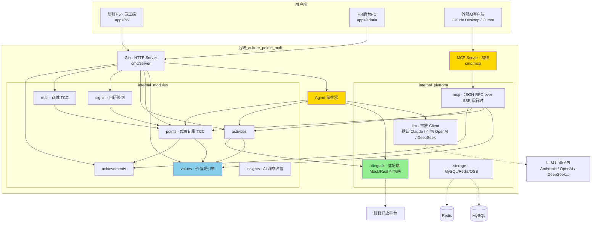
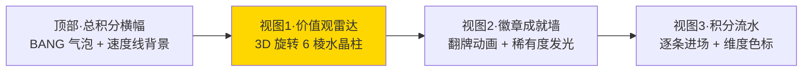
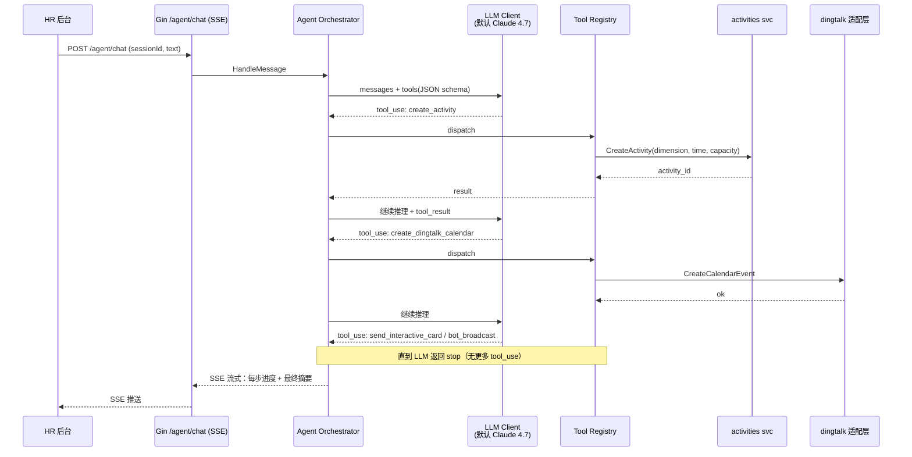
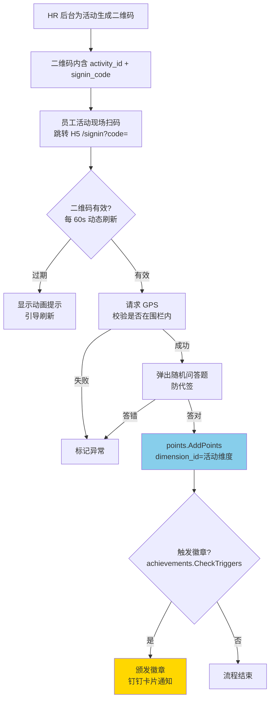
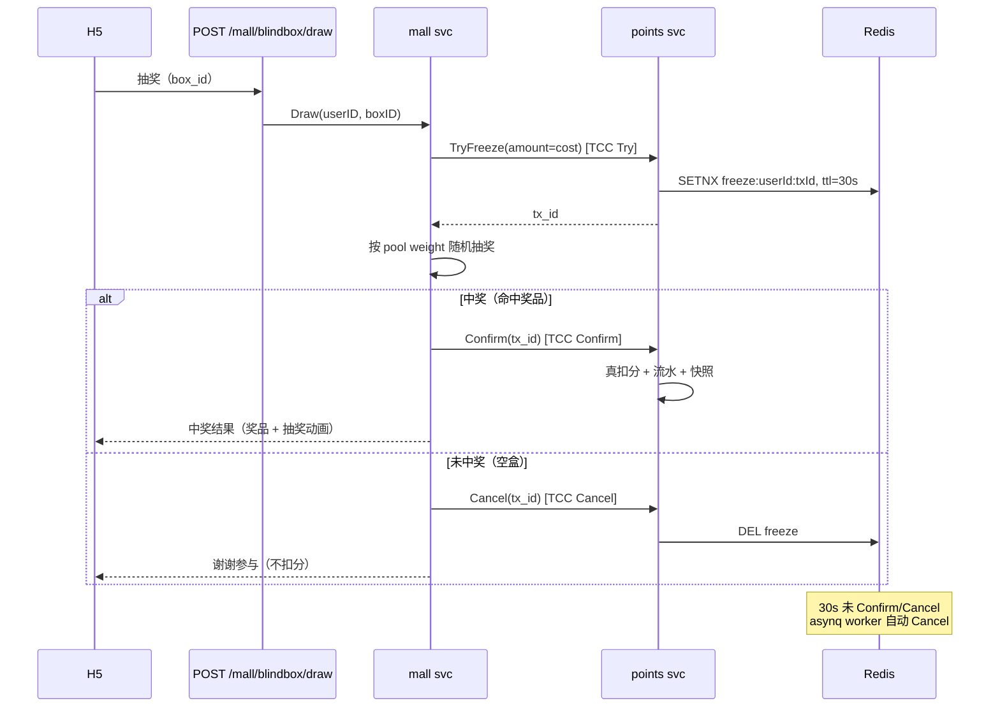
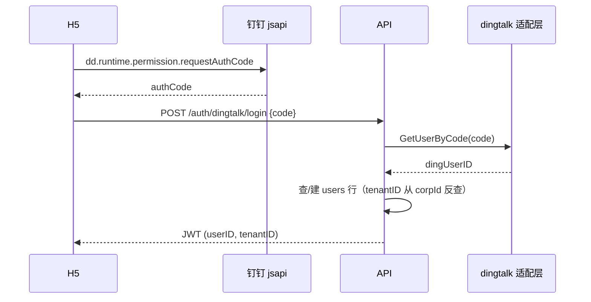
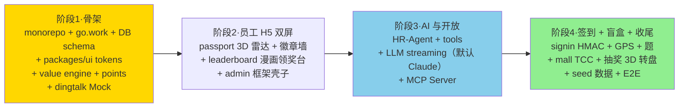

# 文化积分商城 · 动漫风钉钉应用 设计文档

> 关联文档：[文化积分商城方案-v5.md](../../specs/文化积分商城方案-v5.md) · [项目计划方案-v5.html](../../presentations/项目计划方案-v5.html)
>
> 文档日期：2026-05-22
>
> 编辑模式：基于 superpowers:brainstorming 流程产出。

---

## 一、背景与目标

### 1.1 业务背景

`文化积分商城方案-v5.md` 已经完整刻画了「钉钉里的企业文化 AI 运营官 × 开放生态平台」的业务全貌——以核心价值观为骨架、积分为燃料、AI 为大脑、MCP 为开放接口，覆盖「价值观定义 → 行为激励 → 数据沉淀 → 智能洞察 → 持续优化」闭环。

`项目计划方案-v5.html`（漫画风幻灯片）确立了项目对外的视觉语言：ZCOOL / Bangers 卡通字体 + 黑边粗描 + 偏移阴影 + 半色调点 + 速度线 + 黄红蓝粉绿紫七色高饱和点缀。

### 1.2 本次交付目标

本次交付**项目骨架 + 4 个端到端模块**，其余模块在骨架内留接口/页面占位，便于后续团队多人并行扩展。

四个端到端模块（前后端完整链路）：

1. **员工 H5 双屏**：文化护照（雷达图 + 徽章墙 + 流水） + 文化分排行榜
2. **HR-Agent + 活动工具链**：自然语言 → LLM Function Calling → 建活动 / 钉钉日程 / 互动卡片 / 群机器人一站式
3. **签到加分闭环 + 徽章触发**：扫码 → HMAC 二维码动态刷新 + GPS 围栏 + 随机题防代签 → 维度记账 → 触发徽章
4. **MCP Server + 盲盒抽奖（TCC）**：自研 JSON-RPC over SSE 对外开放；盲盒 TCC 事务保证「未中奖不扣分」

### 1.3 非本期范围（接口占位）

- 商品兑换主流程（盲盒以外）
- AI 数据洞察 Dashboard（Text-to-SQL）
- AI 内容生成（海报 / TTS）
- 反作弊 Agent
- 跨企业指数榜
- OA 审批积分异议申诉
- 真接入钉钉企业版（适配层已抽象好，DI 即可切换）

---

## 二、关键决策记录

| 维度 | 决策 |
|------|------|
| 交付形态 | 项目骨架 + 4 个端到端模块 |
| 前端栈 | React 19 + Vite + TypeScript + UnoCSS + shadcn/ui + Framer Motion + GSAP + Lottie + @react-three/fiber + Zustand + TanStack Query |
| 前端组织 | Monorepo（pnpm workspace + Turborepo） |
| 后端栈 | Go + Gin + GORM + asynq + MySQL + Redis |
| 后端架构 | 模块化单体（DDD 风格） + 双 binary（HTTP Server + MCP Server 共享 module service） |
| LLM | 抽象 `LLMClient` 接口 + 多实现可切换。默认 Claude 4.7 Sonnet，支持配置切换到 OpenAI（GPT-5/o3 等）、DeepSeek、Qwen 等。所有 provider 走自封装 HTTP（Anthropic 无官方 Go SDK） |
| 钉钉集成 | 适配层抽象 + Mock/Real 可切换；演示走 Mock |
| 视觉强度 | 2.5D 动漫风 + 点缀 3D（雷达图、盲盒转盘） |
| 多租户 | tenant_id 隔离；演示默认单租户 |
| 仓库 | 前后端拆库。后端 `culture_points_mall/`（已存在）；前端新建 `culture_points_mall_web/` Monorepo |

---

## 三、整体架构



### 3.1 架构要点

- **HTTP Server 与 MCP Server 同代码库、不同 binary**：`cmd/server` 与 `cmd/mcp` 复用 `internal/modules/*` 的 service 层，差别只在协议入口。
- **价值观引擎是横切基座**：积分 / 活动 / 徽章 / 洞察都依赖它做维度归属，对外暴露 `GetDimensions / ResolveAndScore / BalanceReport` 三组能力。
- **HR-Agent 编排器不直接读写 DB**，工具集是 module service 的轻包装；同一份工具集，既给 LLM Function Calling 用，也给 MCP 协议暴露。
- **模块间纪律**：module 之间只通过 service 接口互调，禁止跨模块直接 import repository。

### 3.2 后端目录树

```
culture_points_mall/
├── cmd/
│   ├── server/main.go              # Gin HTTP 入口
│   ├── mcp/main.go                 # MCP Server 入口（独立 binary）
│   └── migrate/main.go             # DB 迁移 + seed
├── configs/
│   ├── config.example.yaml
│   └── value_dimensions.yaml       # 6 大默认价值观维度
├── internal/
│   ├── modules/
│   │   ├── values/                 # 每个 module 内部统一四层
│   │   │   ├── domain/             #   实体 + 仓储接口
│   │   │   ├── repository/         #   GORM 实现
│   │   │   ├── service/            #   业务逻辑
│   │   │   └── handler/            #   Gin handler
│   │   ├── points/
│   │   ├── activities/
│   │   ├── signin/
│   │   ├── mall/
│   │   ├── achievements/
│   │   ├── agent/                  # 含 tools/ 子目录
│   │   └── insights/               # 本期占位
│   ├── platform/
│   │   ├── dingtalk/{client,mock,real}.go
│   │   ├── llm/                    # client.go(接口) + claude.go(默认) + openai.go + deepseek.go + stream.go
│   │   ├── storage/{mysql,redis,oss}.go
│   │   └── mcp/                    # JSON-RPC over SSE 运行时
│   ├── router/router.go            # Gin 路由组装
│   └── auth/                       # JWT + 钉钉免登
├── migrations/*.sql
├── docs/                           # 已存在
├── go.mod
├── go.work                         # 多模块工作空间（保留扩展位）
└── docker-compose.yml              # MySQL + Redis 本地
```

### 3.3 前端目录树

```
culture_points_mall_web/
├── pnpm-workspace.yaml
├── turbo.json
├── package.json
├── apps/
│   ├── h5/                         # 员工钉钉 H5
│   │   └── src/pages/
│   │       ├── home/               # 工作台卡片入口
│   │       ├── passport/           # ★ 文化护照（雷达图 + 徽章墙）
│   │       ├── leaderboard/        # ★ 排行榜
│   │       ├── activities/
│   │       ├── signin/             # ★ 扫码签到
│   │       └── mall/               # ★ 盲盒抽奖
│   └── admin/                      # HR PC 后台
│       └── src/pages/
│           ├── chat/               # ★ HR-Agent 聊天框
│           ├── insights/           # AI 数据洞察占位
│           ├── activities/
│           ├── points/
│           ├── values/
│           └── mall/
├── packages/
│   ├── ui/                         # ★ 动漫风设计系统
│   │   └── src/
│   │       ├── tokens/             # 色板 / 字体 / 阴影变量
│   │       ├── primitives/         # Panel / Card / Stamp / Shout / KW
│   │       ├── components/         # ComicButton / RadarChart3D / BadgeWall / BlindboxWheel
│   │       ├── motion/             # 通用动效封装
│   │       ├── particles/          # 速度线 / 半色调点 / BANG 气泡
│   │       └── icons/              # SVG + Lottie 资产
│   ├── api-client/                 # axios 实例 + TanStack Query hooks
│   ├── types/                      # 与后端 API 契约
│   └── eslint-config/
└── docker-compose.dev.yml          # 反代到后端
```

★ = 本期端到端跑通的页面；其他页面留路由 + 接口占位。

---

## 四、方案对比

### 4.1 后端架构方案

| 方案 | 描述 | 优点 | 缺点 |
|------|------|------|------|
| A · Gin 扁平 | handler / service / repo 三层平铺 | 起步快 | 4 模块后易混乱、模块边界模糊 |
| **B · 模块化单体（推荐）** | DDD 风格 module 内部分层 + 模块间只能通过 service 互调 + 双 binary 共享 module | 边界清晰、多人并行不冲突、MCP 与 HTTP 共享业务逻辑、后续拆微服务有天然边界 | 起步略慢，但收益快速兑现 |
| C · 微服务 | 每个 module 独立项目 + gRPC | 真正独立部署 | 演示项目过度设计、运维成本飙升 |

**推荐方案 B**，理由：
- 与 spec v5 第八章「整体架构」的服务划分天然对得上
- MCP Server 不必独立服务化，复用 module service 即可（一份业务、两个对外协议）
- 多人协作时按 module 切片任务，互不阻塞

### 4.2 前端项目组织方案

| 方案 | 描述 | 优点 | 缺点 |
|------|------|------|------|
| **单仓 Monorepo（推荐）** | apps/h5 + apps/admin + packages/ui 等 | 设计系统共享、避免双端风格漂移、类型 / api-client 复用 | 学习成本略高（pnpm workspace + Turborepo） |
| 双仓独立 | 两个独立项目 | 部署独立 | 设计系统需 npm 发包、维护成本高、风格易漂移 |

**推荐 Monorepo**，理由：动漫风设计系统是项目最大视觉资产，必须严格统一双端表现；类型契约也希望单源管理。

### 4.3 前端技术栈方案

| 方案 | 优点 | 缺点 |
|------|------|------|
| **React 19 + Vite + UnoCSS + shadcn/ui + Framer Motion + GSAP + Lottie + @react-three/fiber（推荐）** | 生态最广、特效库最全、TS 一等公民 | 包体积略大（用 Vite 懒分包缓解） |
| Vue 3.5 | 国内生态优、官方钉钉示例多 | Vue 版 Three.js 生态略小 |
| Svelte 5 | 包体最小、性能最强 | 国内案例少、Three.js 集成不如 React |

**推荐 React 19 豪华特效版**。

---

## 五、详细设计

### 5.1 价值观引擎与数据模型

#### 5.1.1 引擎职责

`internal/modules/values` 是横切基座，对外只暴露 service 接口：

| 能力 | 调用方 | 说明 |
|------|-------|------|
| `GetDimensions(ctx, tenantID)` | 全部模块 | 读维度配置（带缓存） |
| `ResolveAndScore(ctx, tenantID, userID, dimID, amount)` | points | 积分入账时把维度分摊到快照 |
| `BalanceReport(ctx, tenantID, window)` | agent / insights | 维度均衡度评分、薄弱维度归因 |

启动时按 `configs/value_dimensions.yaml` 给新租户植入 6 个默认维度（客户至上 / 团队协作 / 创新求变 / 诚信务实 / 极致专注 / 学习成长），可前端配置增删改。

#### 5.1.2 数据模型

承袭 spec v5 第十四章 `value_dimensions` / `point_transactions` / `user_dimension_scores` 三张表，扩展端到端模块所需。

```sql
-- 多租户
CREATE TABLE tenants (
    id BIGINT PRIMARY KEY,
    name VARCHAR(64) NOT NULL,
    ding_corp_id VARCHAR(64),               -- 钉钉企业 ID
    config_json JSON,
    created_at TIMESTAMP
);

-- 用户（与钉钉 userid 一一对应）
CREATE TABLE users (
    id BIGINT PRIMARY KEY,
    tenant_id BIGINT NOT NULL,
    ding_user_id VARCHAR(64),
    name VARCHAR(64),
    avatar_url VARCHAR(255),
    dept_id BIGINT,
    UNIQUE KEY uk_tenant_ding (tenant_id, ding_user_id),
    INDEX idx_tenant_dept (tenant_id, dept_id)
);

-- 活动
CREATE TABLE activities (
    id BIGINT PRIMARY KEY,
    tenant_id BIGINT NOT NULL,
    dimension_id BIGINT NOT NULL,           -- 必须绑定维度
    title VARCHAR(128) NOT NULL,
    status ENUM('draft','published','running','closed') NOT NULL,
    capacity INT,
    start_at TIMESTAMP,
    end_at TIMESTAMP,
    location_lat DECIMAL(10,6),
    location_lng DECIMAL(10,6),
    radius_m INT,                            -- GPS 围栏半径，可空
    points_reward INT,
    created_at TIMESTAMP
);

-- 报名
CREATE TABLE activity_enrollments (
    id BIGINT PRIMARY KEY,
    activity_id BIGINT NOT NULL,
    user_id BIGINT NOT NULL,
    status ENUM('enrolled','checked_in','absent') NOT NULL,
    UNIQUE KEY uk_act_user (activity_id, user_id)
);

-- 签到二维码（动态刷新）
CREATE TABLE signin_codes (
    id BIGINT PRIMARY KEY,
    activity_id BIGINT NOT NULL,
    code VARCHAR(64) NOT NULL,               -- HMAC-SHA256(activity_id|ts|secret)
    issued_at TIMESTAMP,
    expires_at TIMESTAMP,                    -- 60s 后过期
    INDEX idx_act_exp (activity_id, expires_at)
);

-- 签到记录
CREATE TABLE signin_records (
    id BIGINT PRIMARY KEY,
    activity_id BIGINT NOT NULL,
    user_id BIGINT NOT NULL,
    gps_lat DECIMAL(10,6),
    gps_lng DECIMAL(10,6),
    quiz_answer VARCHAR(128),
    result ENUM('passed','rejected','suspect') NOT NULL,
    reason VARCHAR(255),
    created_at TIMESTAMP
);

-- 徽章定义
CREATE TABLE badges (
    id BIGINT PRIMARY KEY,
    tenant_id BIGINT NOT NULL,
    dimension_id BIGINT NOT NULL,
    name VARCHAR(64),
    rarity ENUM('common','rare','epic','legendary') NOT NULL,
    rule_json JSON,                          -- 触发规则（如累计 100 分）
    icon_url VARCHAR(255)
);

CREATE TABLE user_badges (
    user_id BIGINT NOT NULL,
    badge_id BIGINT NOT NULL,
    earned_at TIMESTAMP,
    PRIMARY KEY (user_id, badge_id)
);

-- 商城商品
CREATE TABLE mall_items (
    id BIGINT PRIMARY KEY,
    tenant_id BIGINT NOT NULL,
    type ENUM('item','blindbox') NOT NULL,
    name VARCHAR(128),
    cost INT NOT NULL,
    stock INT,
    image_url VARCHAR(255)
);

-- 盲盒奖品池
CREATE TABLE mall_blindbox_pool (
    id BIGINT PRIMARY KEY,
    box_item_id BIGINT NOT NULL,             -- 盲盒商品
    prize_name VARCHAR(128),
    prize_image VARCHAR(255),
    weight INT NOT NULL,                     -- 抽样权重
    stock INT                                -- 奖品库存，可为 null 表示无限
);

-- TCC 冻结记录
CREATE TABLE mall_blindbox_freeze (
    id BIGINT PRIMARY KEY,
    tx_id VARCHAR(64) UNIQUE NOT NULL,
    user_id BIGINT NOT NULL,
    box_item_id BIGINT NOT NULL,
    amount INT NOT NULL,
    status ENUM('try','confirmed','cancelled') NOT NULL,
    expires_at TIMESTAMP,                    -- 30s 兜底
    created_at TIMESTAMP,
    INDEX idx_status_exp (status, expires_at)
);

-- 商城订单（盲盒中奖也落单）
CREATE TABLE mall_orders (
    id BIGINT PRIMARY KEY,
    tenant_id BIGINT NOT NULL,
    user_id BIGINT NOT NULL,
    item_id BIGINT,
    prize_id BIGINT,
    cost INT,
    status ENUM('paid','shipped','done','cancelled') NOT NULL,
    created_at TIMESTAMP
);

-- HR-Agent 会话
CREATE TABLE agent_sessions (
    id BIGINT PRIMARY KEY,
    tenant_id BIGINT NOT NULL,
    operator_id BIGINT NOT NULL,
    title VARCHAR(128),
    created_at TIMESTAMP
);

CREATE TABLE agent_messages (
    id BIGINT PRIMARY KEY,
    session_id BIGINT NOT NULL,
    role ENUM('user','assistant','tool','system') NOT NULL,
    content JSON,                            -- 含 tool_use / tool_result 块
    created_at TIMESTAMP,
    INDEX idx_session (session_id, created_at)
);

-- 钉钉 Mock 出库（适配层 Mock 模式专用，演示用）
CREATE TABLE dingtalk_mock_outbox (
    id BIGINT PRIMARY KEY,
    tenant_id BIGINT NOT NULL,
    api VARCHAR(64) NOT NULL,                -- e.g. send_work_notice
    target VARCHAR(255),
    payload JSON,
    created_at TIMESTAMP
);
```

GORM hook 强制所有查询带 `tenant_id`（除明确跨租户的统计任务），兜底防漏写。

---

### 5.2 员工 H5 · 文化护照

单页 + 滑动切换三个视图。



**视觉震撼点**：

- **雷达图**：`@react-three/fiber` 渲染 6 棱水晶柱。6 个维度对应 6 根高度可变的水晶柱（高度 = 维度积分），柱体使用 `MeshTransmissionMaterial` 透光、低速自转。中央悬浮粒子代表总积分。手机陀螺仪联动倾斜。
- **徽章墙**：未获得徽章为黑白半色调点描线稿，获得后翻牌为彩色 + Lottie 闪光。稀有度高的徽章持续呼吸辉光（CSS animation + mix-blend-mode）。
- **积分流水**：每条记录左侧带维度色标（6 色），新条目从右滑入并触发该维度色对应的「+12 BANG」气泡（Framer Motion `layoutId` 实现连续动画）。

**关键接口**：

| Method | Path | 说明 |
|--------|------|------|
| GET | `/api/v1/me/passport` | 总分、维度分、徽章统计、年度报告链接 |
| GET | `/api/v1/me/transactions?cursor=&limit=` | 维度色标流水（游标分页） |
| GET | `/api/v1/me/badges` | 已获得 + 未获得（带稀有度） |

**降级方案**：navigator deviceMemory ≤ 4GB 时自动切到 `<RadarChart2D>`（svg + Framer Motion，无 Three.js）。

---

### 5.3 员工 H5 · 文化分排行榜

Tab 切换「总榜 / 维度榜 / 部门榜」+ 时间窗（本周 / 本月 / 本季度 / 本年度）。

**视觉震撼点**：

- **Top 3 漫画领奖台**：金银铜三色，1 号位放在中间最高，使用 GSAP 入场（自下而上弹跳，配合 `clip-path` 揭示）。每个头像周围「BANG / POW / WOW」气泡环绕。
- **列表**：每一行为一个漫画 Panel，黑边粗描 + 偏移阴影。排名跃升时整行黄色高亮闪动 1.2s（Framer Motion `layoutId` 实现位置迁移动画）。
- **维度榜切换**：背景半色调点会换色（红→蓝→绿→紫→teal→粉），切换瞬间用 Framer Motion 扇形遮罩过渡。

**关键接口**：

| Method | Path | 说明 |
|--------|------|------|
| GET | `/api/v1/leaderboard?scope=total\|dim\|dept&dimension_id=&window=` | 排行榜 |
| GET | `/api/v1/leaderboard/me?scope=...` | 自己当前排名 |

**性能要点**：后端从 `user_dimension_scores` 快照表查询。快照由 points service 在 transaction 写入后异步刷新（asynq 任务），避免实时聚合。

---

### 5.4 HR-Agent + 活动工具链 + MCP Server

项目最核心的 AI 亮点。HR 在 PC 后台聊天框输入自然语言 → Agent 函数调用 → 多步骤工具自动执行。



**关键设计**：

- **流式 SSE**：Gin 用 SSE 持续把每一步 `tool_use` / `tool_result` 推到前端。前端 `admin/pages/chat` 实时渲染「步骤气泡」——每步是一个漫画 Panel，工具执行成功盖红色「DONE」印章。中断时前端用最近 message_id 重连。
- **工具集分两类**：
  - **业务工具**：直接调 module service（创建活动、查排名、加分、颁徽章…）
  - **钉钉工具**：通过 dingtalk 适配层（建日程、发互动卡片、群机器人播报、工作通知）
- **同一份工具，两个对外协议**：
  - 内部 HR-Agent：通过 LLM Function Calling 调度
  - MCP Server：以 JSON-RPC `tools/list` + `tools/call` 暴露
  - 实现：`internal/modules/agent/tools/` 定义 Tool 接口；`platform/mcp` 把 tool registry 包装成 MCP 协议运行时

**本期工具集**：

| 工具 | 类型 | 用途 |
|------|------|------|
| `create_activity` | 业务 | 创建活动（绑定 dimension） |
| `list_activities` | 业务 | 查活动 |
| `get_user_points` | 业务 | 查个人积分 |
| `get_leaderboard` | 业务 | 查排行榜 |
| `add_points` | 业务 | 加分（维度记账） |
| `award_badge` | 业务 | 颁发徽章 |
| `send_dingtalk_card` | 钉钉 | 发互动卡片 |
| `dingtalk_bot_broadcast` | 钉钉 | 群机器人播报 |
| `create_dingtalk_calendar` | 钉钉 | 建日程 |

其他工具（盲盒发布 / 反作弊查询 / OA 审批 / 数据洞察 SQL）留接口占位。

**MCP Server 协议**：

- JSON-RPC 2.0 over SSE（自研，轻量）
- 鉴权：Bearer Token（租户级 API Key）
- 端点：`POST /mcp/messages` 收消息；`GET /mcp/sse` 流式事件
- 标准方法：`initialize` / `tools/list` / `tools/call` / `notifications/initialized`

---

### 5.5 签到加分闭环 + 徽章触发



**关键技术点**：

- **二维码动态刷新**：后端每 60s 用 HMAC-SHA256 生成新 signin_code（`HMAC(secret, activity_id|window_ts)`）。HR 后台大屏 WebSocket 接收并刷新。员工扫到的 URL 带 code，过期则后端拒绝。
- **双窗口容忍**：网络抖动期间，后端校验时认 [上一窗 30s, 当前窗 60s] 两段 code，避免临界期误判。
- **GPS 围栏**：活动表存 `location_lat / location_lng / radius_m`，前端调用 `navigator.geolocation`，后端用 Haversine 公式判定半径内。Demo 可关闭围栏校验。
- **随机问答**：从活动配置或全局题库随机抽 1 题（如「今天活动主题中哪个价值观最重要？」），答对放行。题库管理接口占位。
- **徽章触发**：`achievements.CheckTriggers(userID, dimensionID)` 在 points 入账后被调用。徽章规则配置在 `badges.rule_json`（如 `{"type": "accumulated", "dimension": "customer_first", "threshold": 100}`）。
- **加分原子性**：积分入账 + 流水 + 维度分值快照三步走事务，失败回滚。

**接口**：

| Method | Path | 说明 |
|--------|------|------|
| POST | `/admin/activities/:id/signin-codes/refresh` | 生成新 code |
| GET | `/admin/activities/:id/signin-codes/stream` | WebSocket，新 code 推送 |
| POST | `/api/v1/signin/check` | 员工提交（code + gps + answer） |

---

### 5.6 盲盒抽奖（TCC）



**视觉震撼点**：

- 抽奖按钮：盖印章式「抽！」按钮，按下后切换到全屏 **3D 抽奖转盘**（`@react-three/fiber` 圆盘 + 物理减速）。
- 转盘减速期间，背景速度线加速、半色调点放大旋转。
- 命中后转盘停在奖品扇区，奖品图自下而上弹出，BANG 气泡环绕，Lottie 金粉撒落。
- 未中奖也有彩蛋动画（「哎呀差一点！」漫画对白）。

**关键设计**：

- **随机性服务端决定**：服务端按 weight 抽样后返回结果，前端转盘视觉只是表现层。
- **TCC 兜底**：asynq 每 5s 扫描 `mall_blindbox_freeze.status='try' AND expires_at < now` 的记录强制 Cancel；Redis SETNX TTL 30s 双保险（即使 worker 挂，Redis 自动过期解冻）。

---

### 5.7 钉钉适配层

```go
// internal/platform/dingtalk/client.go
type Client interface {
    // 用户身份
    GetUserByCode(ctx context.Context, code string) (User, error)

    // 日历
    CreateCalendarEvent(ctx context.Context, req CalendarRequest) (eventID string, err error)
    ListCalendarResponses(ctx context.Context, eventID string) ([]Response, error)

    // 消息
    SendWorkNotice(ctx context.Context, userIDs []string, msg Card) error
    SendInteractiveCard(ctx context.Context, target string, cardTemplateID string, data map[string]any) (CardInstance, error)
    BotBroadcast(ctx context.Context, groupID string, msg Card) error

    // 审批
    StartOAProcess(ctx context.Context, req ApprovalRequest) (instance string, err error)
}
```

| 实现 | 默认/可选 | 行为 |
|------|---------|------|
| `MockClient` | 默认 | 落库到 `dingtalk_mock_outbox` + 推到本地事件总线（admin 后台「模拟推送面板」实时显示） |
| `RealClient` | DI 切换 | 用 `alibabacloud-go/dingtalk_*` SDK 真调用 |

切换方式：`config.yaml` 里 `dingtalk.mode: mock | real`，启动时依赖注入对应实现。

**「模拟推送面板」是关键演示资产**——admin 后台一个独立页面，展示一条条「如果接真钉钉，这条会推送给 张三 的工作通知」，让 demo 可视化「系统会做什么」而不是黑箱。

---

### 5.8 LLM Client（多厂商可切换抽象）

为避免厂商绑定 + 方便降本切换，`internal/platform/llm` 设计为接口 + 多实现，启动时按 `config.yaml` 的 `llm.provider` 字段注入。

```go
// internal/platform/llm/client.go
type Client interface {
    Messages(ctx context.Context, req MessagesRequest) (MessagesResponse, error)
    MessagesStream(ctx context.Context, req MessagesRequest) (<-chan StreamEvent, error)
}

// 内部统一的 MessagesRequest / Response / StreamEvent 结构
// 设计参考 Anthropic 风格（tools / tool_use / tool_result 块最规范），
// 各 provider 实现负责双向 schema 转换。
```

**内置实现**：

| 实现 | 默认 | provider 配置 | 备注 |
|------|------|--------------|------|
| `ClaudeClient` | ✅ 默认 | `provider: claude`, `model: claude-sonnet-4-7` | Anthropic Messages API。Function Calling 最稳定 |
| `OpenAIClient` | 可选 | `provider: openai`, `model: gpt-5` 等 | OpenAI Chat Completions / Responses API。tool_calls 与内部结构做 adapter 转换 |
| `DeepSeekClient` | 可选 | `provider: deepseek`, `model: deepseek-chat` | DeepSeek V3。OpenAI 兼容 API，复用 OpenAIClient 子类 |
| `QwenClient` | 可选 | `provider: qwen`, `model: qwen-max` 等 | 通义千问。DashScope API |

**统一行为**：

- 所有 provider 走自封装 HTTP + JSON（Anthropic 无官方 Go SDK；其他厂商即便有 SDK 也不引入，避免依赖膨胀）
- 流式响应统一为内部 `StreamEvent` 通道，provider 内部负责 SSE 解析与事件归一化
- 重试：429 指数退避；5xx 重试 3 次；4xx 直抛
- Prompt 上下文注入：所有 system prompt 自动拼接当前租户的价值观维度名 / 关键词，落实 spec v5 第 5.3 节「AI 内容生成 · 价值观语境注入」
- Tools 字段统一用 JSON Schema，由 provider adapter 转成各家原生格式（Anthropic 直传；OpenAI 包装成 `tool_calls`）

**约束**：

- 设计基线对齐 Claude 的 `tool_use` 块行为。OpenAI 实现里把单消息多 `tool_calls` 拆成内部多 `tool_use` 块，保证 Agent 编排器无感
- 若某 provider 在 Function Calling 上语义不对齐（如多轮工具不稳），可在 config 关闭该 provider 的 agent 用途，仅保留作内容生成

---

### 5.9 认证与多租户



- **员工端**：钉钉 jsapi 免登 → 后端换 dingUserID → 签 JWT
- **HR 后台**：手机号/邮箱 + 密码（开发用）或 钉钉扫码（接真钉钉后启用）
- **多租户**：tenant_id 从 JWT 取，注入 ctx；所有 module repository 强制带 `tenant_id` 条件（用 GORM hook 兜底防漏写）
- **Mock 切换「假员工」**：admin 后台「切换用户」调试面板，方便 demo 切换员工视角

---

### 5.10 前端动漫风设计系统（packages/ui）

公共视觉资产，`apps/h5` 与 `apps/admin` 共用。

| 子目录 | 内容 |
|-------|------|
| `tokens/` | 色板（七色高饱和 + paper / ink）、字体（ZCOOL KuaiLe / QingKe HuangYou / Bangers / Permanent Marker）、阴影偏移、半色调点 SVG 背景 |
| `primitives/` | `<Panel>` 黑边粗描 + 偏移阴影、`<Stamp>` 红色印章、`<Shout>` 倾斜对白气泡、`<KW>` 关键词高亮、`<SpeedLines>` 速度线背景、`<Halftone>` 半色调点叠层 |
| `components/` | `<ComicButton>` / `<ComicTable>` / `<DimChip>` / `<RadarChart3D>` / `<RadarChart2D>`（降级）/ `<BadgeWall>` / `<BlindboxWheel>` |
| `motion/` | `usePop()` / `useShake()` / `useBangBubble()`（统一 Framer Motion 预设） |
| `particles/` | 「BANG / POW / WOW / BOOM」气泡组件、金粉 Lottie、速度线 Canvas |
| `icons/` | 6 个维度图标（SVG）+ 徽章 Lottie + 钉钉品牌组件 |

通过 Storybook 单独跑，便于风格一致性 review。

---

## 六、测试策略

| 层 | 工具 | 覆盖范围 |
|----|------|---------|
| 后端单元 | Go testing + testify | 各 module service 纯逻辑（维度计算、积分聚合、TCC 状态机） |
| 后端集成 | docker-compose 起 MySQL + Redis | **至少 1 条端到端写真实 DB 的集成测试**（呼应 CLAUDE.md Mock 边界守则：项目自有 Repository / Model 不 mock） |
| MCP 协议 | 自写 JSON-RPC test client | `tools/list` / `tools/call` / error 路径 |
| 前端单元 | Vitest + Testing Library | hook 与纯函数 |
| 前端 E2E | Playwright | 关键链路：HR 聊天工具链、扫码签到加分、盲盒抽奖 |
| 视觉 | Storybook | `packages/ui` 全组件状态 |

**Mock 边界纪律**（遵循 CLAUDE.md）：只 mock 钉钉 / Claude / OSS 等外部 IO；项目自有 module / repository / service 一律真调。

---

## 七、部署

- **本地**：`docker-compose up` 启 MySQL 8 + Redis 7 + culture_points_mall:server + culture_points_mall:mcp + nginx（反代 H5 + admin）
- **演示**：`pnpm build` 前端 → 拷到 nginx 静态目录；后端 `go build` 出双 binary 直接跑
- **生产**：K8s + 镜像（明确**非本期范围**，但留 Dockerfile）
- **数据预置**：`cmd/migrate seed` 一键灌入 50 员工、3 部门、6 维度活动、徽章池、商品池、盲盒池

---

## 八、风险与应对

| 风险 | 应对 |
|------|------|
| 3D 雷达图在中低端手机卡顿 | 提供 `<RadarChart2D>` 降级实现，navigator deviceMemory ≤ 4GB 自动切换 |
| LLM API 不稳 / 网络抖动 | 重试 + 退避；HR-Agent 流式中断时前端用最近 message_id 重连续传；可通过配置切换 provider 兜底（如 Claude 不可达切 DeepSeek） |
| HMAC 签到二维码刷新过快导致误判 | code 双窗口生效（当前 60s + 上一窗 30s 容忍），后端校验时认两段 |
| Mock 钉钉与真钉钉行为差异 | 适配层接口严格按真钉钉返回结构定义；Mock 出库前 schema 校验对齐 |
| 4 个端到端模块范围膨胀 | 每个模块在 plan 里框定「最小演示版本」，超范围的入「P1 待办」占位接口 |
| 真接入钉钉企业版升级要求 | 演示走 Mock 不阻塞；spec 明确标注真接入条件 |
| TCC 兜底 worker 故障导致积分长期冻结 | Redis SETNX TTL 30s 双保险，即使 worker 挂自动过期解冻 |
| 多人协作模块边界混乱 | module 之间只通过 service 接口互调（CLAUDE.md 强调）；按 module 切片任务并行 |
| MCP 客户端版本兼容 | 自研轻量 JSON-RPC，固定 protocol version；演示版本预录视频备份 |

---

## 九、实施阶段（粗排）

具体周排期留给 writing-plans 决定。本节给出阶段顺序，便于后续切任务。



每阶段的输出物：

- **阶段 1**：能跑起来的两套空壳，DB 表全建，价值观维度可配，积分加分能写入并刷新雷达图后端数据（前端先用 mock 数据看雷达）。
- **阶段 2**：员工 H5 双屏（文化护照 + 排行榜）连真数据走通；admin 仅有路由壳子。
- **阶段 3**：HR 后台聊天框完整工具链跑通（含钉钉 Mock）；MCP Server 启动并可被 Claude Desktop 调用。
- **阶段 4**：签到 + 盲盒端到端跑通；seed 数据全量灌入；Playwright 关键链路通过；演示脚本走 1 遍。

---

## 十、附录：关键 API 契约（节选）

仅列本期端到端模块所需，其他接口由 plan 阶段补充。

### 10.1 员工端

```
GET  /api/v1/me/passport
GET  /api/v1/me/transactions?cursor=&limit=
GET  /api/v1/me/badges
GET  /api/v1/leaderboard?scope=total|dim|dept&dimension_id=&window=
GET  /api/v1/leaderboard/me?scope=...
GET  /api/v1/activities?status=
POST /api/v1/signin/check
GET  /api/v1/mall/items
POST /api/v1/mall/blindbox/draw
```

### 10.2 HR 后台

```
POST /admin/agent/chat                       # SSE
GET  /admin/agent/sessions
POST /admin/activities                        # 也可由 agent 工具调用
POST /admin/activities/:id/signin-codes/refresh
GET  /admin/activities/:id/signin-codes/stream  # WebSocket
GET  /admin/dingtalk/mock-outbox             # 模拟推送面板
GET  /admin/values/dimensions
POST /admin/values/dimensions
```

### 10.3 认证

```
POST /auth/dingtalk/login
POST /auth/refresh
```

### 10.4 MCP Server

```
GET  /mcp/sse                                # 事件流（Bearer 鉴权）
POST /mcp/messages                           # JSON-RPC 2.0 入站消息
```

---

## 十一、验收标准

本期 spec 视为达成需满足：

1. 双仓骨架可启动（前端 monorepo + 后端双 binary），`docker-compose up` 一键跑通
2. 价值观引擎 + 6 维度配置 + 积分维度记账可用
3. 员工 H5 文化护照雷达图 3D 渲染（含 2D 降级）+ 徽章墙 + 流水
4. 员工 H5 排行榜（漫画领奖台 + 三种 scope 切换 + 时间窗切换）
5. HR-Agent 聊天框流式 SSE，完成「自然语言发布活动」一站式工具链（建活动 → 钉钉日程 Mock → 互动卡片 Mock → 群机器人 Mock）
6. MCP Server 可被 Claude Desktop 接入，至少 `tools/list` + 3 个 `tools/call` 调用成功
7. 扫码签到 HMAC 二维码动态刷新 + GPS（可关）+ 随机题 + 加分 + 触发徽章
8. 盲盒抽奖 TCC 端到端验证「未中奖不扣分」+ 抽奖 3D 转盘动画
9. `packages/ui` 全组件 Storybook 通过
10. Playwright 关键链路 E2E 全过
11. Mock 钉钉「模拟推送面板」可视化全部 Agent 工具触发的推送

---

> 文档结束。下一步进入 `superpowers:writing-plans` 写实施计划。
