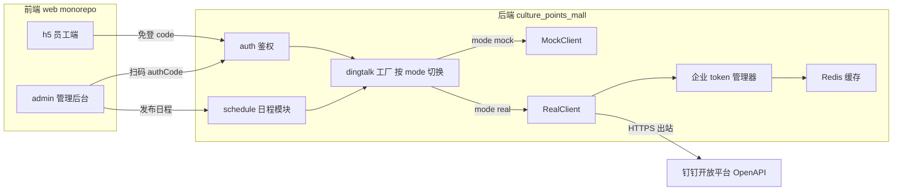
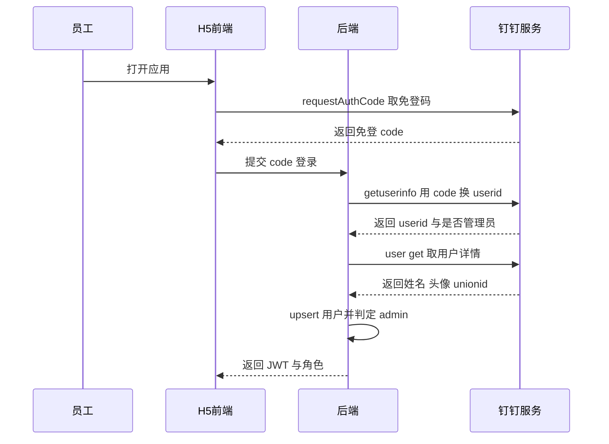
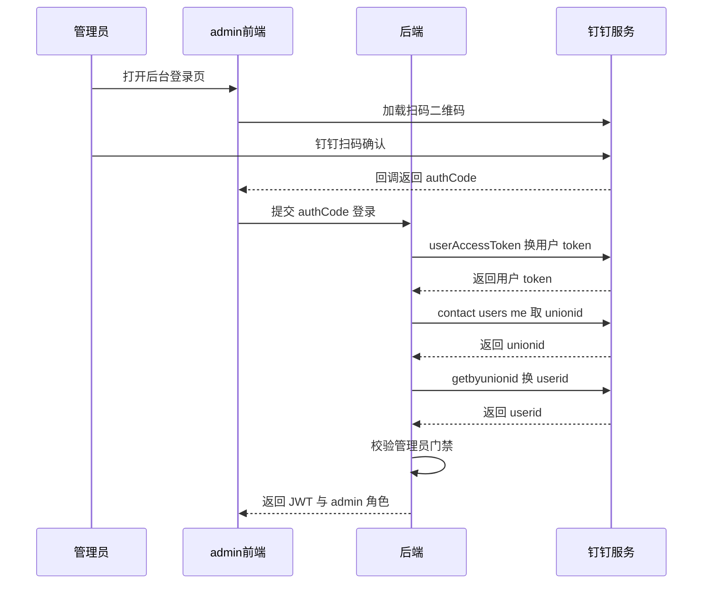
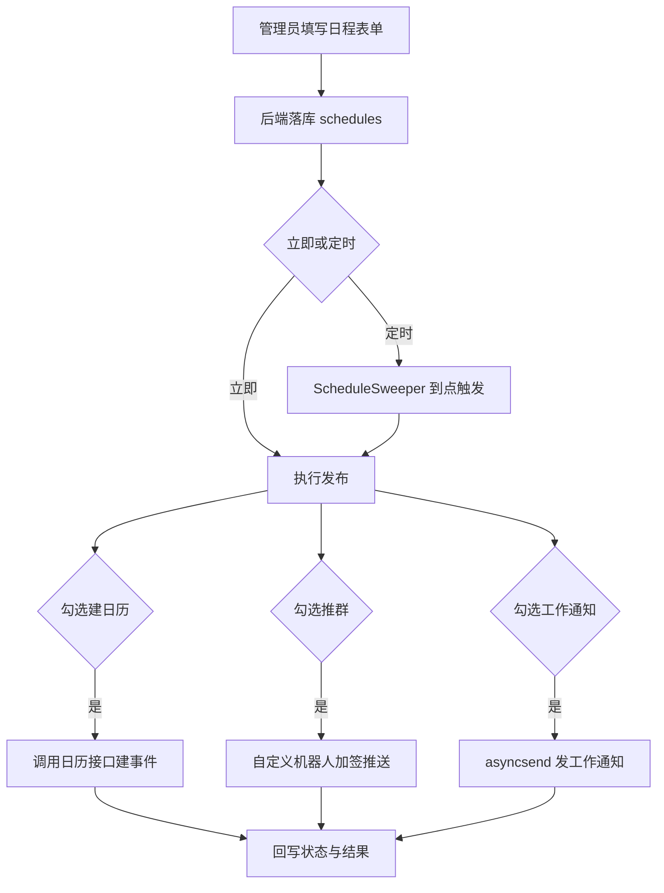

# 钉钉对接 设计文档（用户授权登录 + 日程发布与群推送）

> 适用项目：`culture_points_mall`（Go 1.24 / Gin / GORM / JWT / Redis）+ `culture_points_mall_web`（pnpm + turbo + React 19）
> 钉钉应用类型：**企业内部应用（H5 微应用）**
> 文档日期：2026-06-06

## 背景与目标

文化积分管理应用整体框架已完成，钉钉对接此前以 **Mock 实现**占位：`internal/platform/dingtalk` 已定义 `Client` 接口与 `MockClient`，登录路由、前端登录壳、后台“钉钉推送”监控页均已就绪，配置里 `DingTalkCfg.Mode` 字段已留好却未启用。

本次目标是把空壳填实，交付两项真实能力：

1. **用户授权登录**：员工 H5 免登做实；管理后台改为钉钉扫码登录（替换现有 dev 假登录）；并加管理员角色门禁。
2. **后台发布日程并推送到钉钉群**：后台直接发布日程，**同时**在参与人钉钉日历创建真实日程事件，并通过**自定义机器人 Webhook**推送到相关钉钉群（可选附带工作通知）。

核心策略：**新增满足现有 `dingtalk.Client` 接口的 `RealClient`，用配置 `mode` 在 mock / real 间切换**，不改动既有架构与调用方。本地继续用 mock，生产/联调用 real。

### 关键现状（带证据）

| 现状 | 证据 |
|---|---|
| `Client` 接口已含所需全部方法 | `internal/platform/dingtalk/client.go:5-16` |
| 实现仅有 Mock，写假表 + 事件总线 | `internal/platform/dingtalk/mock.go` |
| 工厂点硬编码为 mock，`Mode` 未用 | `cmd/server/main.go:46-48` |
| 登录链路已通：`code → GetUserByCode → upsertUser → Issue` | `internal/auth/handler.go:58-127` |
| `users` 表已有 `ding_user_id` 唯一键 | `migrations/001_init_schema.up.sql`（`uk_tenant_ding`） |
| JWT 已支持 roles，且 roles 已注入 context | `internal/auth/jwt.go:13,22`、`internal/auth/middleware.go:63` |
| 后台“钉钉推送”页读 `dingtalk_mock_outbox` | `apps/admin/src/pages/dingtalk/MockOutboxPage.tsx` |
| 后台 outbox 接口当前挂在**无鉴权**的 open 组 | `internal/router/router.go:104` |
| `expandEnv` 只展开 LLM key，未覆盖钉钉密钥 | `internal/config/config.go:97-102` |
| 定时任务范式为 goroutine + ticker | `internal/modules/mall/worker/freeze_sweeper.go:17-30` |
| `asynq`、`robfig/cron` 已引入但**全项目未使用** | `go.mod`（无任何调用） |

## 整体架构



## 方案对比与决策

下列关键决策已确认，记录选择与理由：

| 决策点 | 选择 | 备选 | 理由 |
|---|---|---|---|
| mock/real 切换 | 配置 `mode` 工厂，新增 `RealClient` | 直接改 Mock | 保留本地零依赖开发，调用方零改动 |
| 登录入口 | H5 免登 + 后台扫码 | 仅其一 | 两端都要生产可用；后台是发布日程入口，必须真实鉴权 |
| 权限控制 | 轻量 RBAC（管理员门禁） | 不做 / 完整多角色 RBAC | JWT 已支持 roles，门禁成本低；完整 RBAC 超出当前需要 |
| 群推送机制 | 自定义机器人 Webhook（加签） | 企业内部机器人 OpenAPI | 最快打通、无需 access_token 与 openConversationId；按群维护 webhook |
| 日程落地 | 真实日历事件 + 群消息推送 | 仅消息 / 仅日历 | 用户明确要“两者都要” |
| 定时发布 | 沿用 goroutine + ticker sweeper | 引入 asynq / cron | 与现有 `FreezeSweeper` 一致，避免引入未使用的新运行时 |

## 详细设计

### 一、公共基础（功能①②共用）

#### 1.1 配置扩展

扩展 `DingTalkCfg`（`internal/config/config.go:33-39`），新增管理员白名单、群机器人列表、可选日历组织者：

```yaml
dingtalk:
  mode: real                        # mock | real
  app_key: "${DINGTALK_APP_KEY}"
  app_secret: "${DINGTALK_APP_SECRET}"
  corp_id: "..."
  agent_id: 0
  admin_user_ids: ["manager01"]     # 管理员门禁白名单，与钉钉 is_admin 取并集
  calendar_organizer_unionid: ""    # 可选，默认用发布人 unionId
  robots:                           # groupID -> webhook + secret
    - id: "culture"
      name: "文化积分群"
      webhook: "https://oapi.dingtalk.com/robot/send?access_token=xxx"
      secret: "${DINGTALK_ROBOT_CULTURE_SECRET}"
```

对应 struct 新增 `AdminUserIDs []string`、`CalendarOrganizerUnionID string`、`Robots []RobotCfg{ID,Name,Webhook,Secret}`。**同步扩展 `expandEnv`（`config.go:97-102`）**，对 `AppKey`、`AppSecret` 及每个 robot 的 `Webhook`、`Secret` 执行 `os.ExpandEnv`，否则 `${...}` 占位符不生效。

#### 1.2 企业 access_token 管理器

新文件 `internal/platform/dingtalk/token.go`：

- `getCorpToken(ctx)`：先读 Redis key `dingtalk:corp_token:{appKey}`；miss 则 `POST https://api.dingtalk.com/v1.0/oauth2/accessToken`，body `{appKey, appSecret}`，响应 `{accessToken, expireIn}`，按 `expireIn - 300s` 回写 Redis。
- 用 `SetNX` 小锁防并发击穿（参考已有锁写法 `internal/modules/points/service/service.go:126`）。
- Redis 客户端通过 `NewReal` 注入（连接初始化见 `internal/platform/storage/redis.go`）。

#### 1.3 钉钉 HTTP helper

新文件 `internal/platform/dingtalk/http.go`：封装两套域名风格，统一 JSON 编解码与错误信封解析。

| 域名 | token 传递 | 用途 |
|---|---|---|
| `oapi.dingtalk.com` | `?access_token=` 查询参数 | `topapi/*` 系列、robot/send |
| `api.dingtalk.com/v1.0` | header `x-acs-dingtalk-access-token` | `oauth2/*`、`contact/users/me`、`calendar/*` |

错误信封：老接口判 `errcode != 0`（读 `errmsg`），新接口判 HTTP 非 2xx（读 `code`/`message`）。HTTP 客户端沿用项目范式 `&http.Client{Timeout:...}` + `http.NewRequestWithContext`（对齐 `internal/platform/llm/claude.go:53-58`，项目未用 resty）。

#### 1.4 mode 工厂

新文件 `internal/platform/dingtalk/real.go` 定义 `RealClient` 并实现 `Client` 全部方法；新增工厂函数。`cmd/server/main.go:46-48` 改为：

```go
mock := dingtalk.NewMock(db, bus)
var ding dingtalk.Client
switch cfg.DingTalk.Mode {
case "real":
    ding = dingtalk.NewReal(cfg.DingTalk, redisClient, db, bus)
default:
    ding = mock
}
```

**可观测性**：让 `RealClient` 的每次出站调用也写入 `dingtalk_mock_outbox`（当审计日志用），后台“钉钉推送”页在 real 模式下照样能看到真实出站记录。做法：把 `MockClient.record()`（`mock.go:33-51`）抽成共享 `outbox` recorder，mock 与 real 共用。

### 二、功能①：用户授权登录 + 登录权限

#### 2.0 扩展 `User` 结构

`internal/platform/dingtalk/types.go:5-10` 的 `User` 新增 `UnionID string`（日历接口需要）、`IsAdmin bool`（RBAC 需要）。mock 与 real 均填充。

#### 2.1 员工 H5 免登做实（`GetUserByCode`）

前端 `apps/h5/src/auth/dingtalkLogin.ts` 已调 `dd.runtime.permission.requestAuthCode()` 并 `POST /auth/dingtalk/login {code}`，**后端做实后前端几乎不动**，仅需确认 `requestAuthCode` 使用真实 `corpId`（前端环境变量注入）。



real 实现步骤：

1. `token = getCorpToken()`
2. `POST oapi.dingtalk.com/topapi/v2/user/getuserinfo?access_token={token}`，body `{code}` → `userid`、`unionid`、`sys`（是否管理员）。
3. `POST oapi.dingtalk.com/topapi/v2/user/get?access_token={token}`，body `{userid}` → `name`、`avatar`、`dept_id_list`、`unionid`。
4. 返回 `User{DingUserID: userid, Name, AvatarURL, DeptIDs, UnionID, IsAdmin: sys}`。

#### 2.2 后台扫码登录（新增）



- **接口新增**：`Client` 接口加 `GetUserByOAuthCode(ctx, authCode) (User, error)`；mock 返回一个 mock 管理员；real 实现：
  1. `POST api.dingtalk.com/v1.0/oauth2/userAccessToken`，body `{clientId, clientSecret, code, grantType:"authorization_code"}` → 用户 token。
  2. `GET api.dingtalk.com/v1.0/contact/users/me`（header 带用户 token）→ `unionId`。
  3. `POST oapi.dingtalk.com/topapi/user/getbyunionid?access_token={corp}`，body `{unionid}` → `userid`。
  4. `topapi/v2/user/get` 取详情 → 返回同一 `User`。
- **后端路由**：`internal/auth/handler.go:42-45` 新增 `rg.POST("/auth/dingtalk/qr-login", h.qrLogin)`，逻辑与 `dingLogin` 同构，复用 `upsertUser`、`Signer.Issue`。
- **前端**：`apps/admin/src/auth/AdminLoginPage.tsx` 用钉钉扫码替换 dev 假登录（推荐官方 `DTFrameLogin` 内嵌二维码；admin 已装 `qrcode.react`，亦可重定向 `login.dingtalk.com/oauth2/auth` 再回调）。拿到 `authCode` → `POST /auth/dingtalk/qr-login` → 存 `cpm_admin_jwt`。dev 登录保留在本地开发开关后。

#### 2.3 管理员门禁（轻量 RBAC）

- **判定**：登录时 `isAdmin = 钉钉 sys 标志 || userid ∈ cfg.admin_user_ids`。
- **写入 JWT**：`Signer.Issue` 第三参 `roles` 已支持（`jwt.go:22`），现两条登录均传 `nil`；admin 时传 `["admin"]`。
- **中间件**：`internal/auth/middleware.go` 新增 `RequireRole("admin")`，从 context 取 roles 判定，缺失返回 403。roles 在 `attachContext` 已注入（`middleware.go:63`），getter `cpmctx.Roles(ctx)` 已存在（`ctx.go:36`），直接复用。
- **路由收口**：在 `router.go` 新增 `admin := r.Group("/", auth.RequireJWTWithUser(signer, deps.DB), auth.RequireRole("admin"))` 组，把后台路由迁入：当前在 **open（无鉴权）组**的 outbox（`router.go:104`）以及后续 schedule、agent admin 接口，统一挂到 admin 组。
- **持久化**：迁移给 `users` 加 `is_admin`，便于后台列管理员。

### 三、功能②：日程发布 + 群推送

后台目前无 `schedule` 模块（活动是经 HR-Agent 自然语言创建）。新建 `schedule` 模块，照搬现有分层 `domain / repository / service / handler`（参考 `internal/modules/activities/`）。



#### 3.1 schedule 模块（后端）

- 接口 `POST /admin/schedules`（admin 门禁），入参：`title, start_at, end_at, location, detail, attendee_user_ids[], group_ids[], channels{calendar,group,work_notice}, publish_at?`。
- service 编排发布：
  - **建日历**（`channels.calendar`）：调 `CreateCalendarEvent`。
  - **推群**（`channels.group`）：对每个 `group_id` 调 `BotBroadcast(group_id, Card)`。
  - **工作通知**（`channels.work_notice`，可选）：`SendWorkNotice(attendee_user_ids, Card)`。
- 落库日程行 + 回写 `calendar_event_ids` 与各通道结果（成功/失败），失败可重试。

#### 3.2 真实日历事件（`CreateCalendarEvent` 的 real 实现）

- 接口：`POST https://api.dingtalk.com/v1.0/calendar/users/{organizerUnionId}/calendars/primary/events`，header 带企业 token。body：`summary / description / start{dateTime,timeZone} / end / location{displayName} / attendees:[{id: unionId}]`，返回 `{id}`。
- **组织者 unionId**：默认用发布人管理员的 `union_id`（登录时已存），或取 `cfg.calendar_organizer_unionid`。
- **参与人 userid → unionId**：优先用 `users.union_id`，缺失则现查 `topapi/v2/user/get` 补全。
- 接口签名 `CreateCalendarEvent(ctx, CalendarRequest)` 保持不变（入参仍是 corp userid），unionId 解析在 real 内部完成。
- ⚠️ 待实现时按钉钉最新文档核对路径参数 `{userId}` 究竟取 unionId 还是 userid（不臆测，联调实测确认）。

#### 3.3 群推送（`BotBroadcast` 的 real 实现，自定义机器人加签）

- `groupID` → 从 `cfg.robots` 找 `{webhook, secret}`。
- 加签：`timestamp = 当前毫秒`，`sign = urlEncode(base64(HmacSHA256(secret, timestamp + "\n" + secret)))`，最终 `POST {webhook}&timestamp={timestamp}&sign={sign}`。
- body 用 markdown：`{"msgtype":"markdown","markdown":{"title":"日程","text":"### 标题 ..."}}`，`Card{Title,Detail,Extra}` 渲染为 markdown 文本。
- 仅用 Go 标准库 `crypto/hmac` + `crypto/sha256`，无需新依赖。
- 注意限速：自定义机器人 20 条/分钟，多群推送需排队。

#### 3.4 工作通知（`SendWorkNotice` 的 real 实现）

- `POST https://oapi.dingtalk.com/topapi/message/corpconversation/asyncsend_v2?access_token={corp}`，body `{agent_id: cfg.agent_id, userid_list, msg:{msgtype:"markdown",markdown:{...}}}` → `{task_id}`。

#### 3.5 定时发布

- MVP 先做“立即发布”。
- 定时发布新增 `ScheduleSweeper`（goroutine + `time.Ticker`，直接对齐 `internal/modules/mall/worker/freeze_sweeper.go:17-30`），每分钟扫 `status='scheduled' AND publish_at <= now()` 的日程并发布；启动入口在 `cmd/server/main.go` 仿 `FreezeSweeper`（`main.go:74-75`）。

## 数据模型变更（`migrations/`，自实现 runner 按文件名序执行）

| 文件 | 内容 |
|---|---|
| `002_add_dingtalk_user_fields.up.sql` | `users` 加 `union_id VARCHAR(128) DEFAULT NULL`、`is_admin TINYINT(1) NOT NULL DEFAULT 0`，加 `uk_tenant_union (tenant_id, union_id)` |
| `003_create_schedules.up.sql` | `schedules` 表：`id, tenant_id, title, start_at, end_at, location, detail, attendee_user_ids JSON, group_ids JSON, channels JSON, status ENUM('draft','scheduled','published','failed'), publish_at, calendar_event_ids JSON, created_by, created_at, updated_at` |
| 各自 `*.down.sql` | 对应回滚 |

执行：`go run cmd/migrate/main.go -action up -config ./configs`。

## 前后端改动清单

### 后端

| 文件 | 改动 |
|---|---|
| `internal/config/config.go` | 扩展 `DingTalkCfg`（admin/robots/organizer）+ `expandEnv` 覆盖钉钉密钥 |
| `internal/platform/dingtalk/token.go`（新） | 企业 token 管理器 + Redis 缓存 |
| `internal/platform/dingtalk/http.go`（新） | 两套域名 HTTP helper |
| `internal/platform/dingtalk/real.go`（新） | `RealClient` 实现 `Client` 全部方法 |
| `internal/platform/dingtalk/types.go` | `User` 加 `UnionID`、`IsAdmin` |
| `internal/platform/dingtalk/client.go` | 接口加 `GetUserByOAuthCode` |
| `internal/platform/dingtalk/mock.go` | mock 补 `GetUserByOAuthCode`、填新字段；`record` 抽共享 outbox |
| `cmd/server/main.go` | mode 工厂选 mock/real；启动 `ScheduleSweeper` |
| `internal/auth/handler.go` | 新增 `qrLogin`；登录判定并写入 admin 角色 |
| `internal/auth/middleware.go` | 新增 `RequireRole` |
| `internal/router/router.go` | 新增 admin 组并收口后台路由（outbox/schedule/agent admin） |
| `internal/modules/schedule/*`（新） | 日程模块 domain/repo/service/handler |
| `internal/modules/schedule/worker`（新） | `ScheduleSweeper` |
| `migrations/002,003` | 见上 |

### 前端

| App / 包 | 改动 |
|---|---|
| `apps/admin` | 登录页换钉钉扫码；新增“日程发布”页 + 路由（`router.tsx`）+ 侧边栏菜单（`layout/Sidebar.tsx`） |
| `apps/h5` | 基本不动；确认 `requestAuthCode` 用真实 `corpId`（环境变量化） |
| `packages/api-client` | 新增 `useCreateSchedule / useSchedules`、qr-login 调用 |
| `packages/types` | 新增 schedule 相关类型 |

token 注入、401 拦截已有统一封装（`packages/api-client/src/http.ts`），无需重做。

## 钉钉开放平台后台准备（编码前置）

1. 创建企业内部应用（H5 微应用）→ 取 `AppKey / AppSecret / AgentId / CorpId`。
2. 安全设置 → **服务器出口 IP 白名单**（填后端公网出口 IP）。
3. 权限管理 → 申请：通讯录个人信息读权限/免登、成员信息读权限（`user/get`、`getbyunionid`）、企业会话消息（工作通知）、日历读写。
4. 登录与分享 → 开启扫码登录，配置 **redirect_uri / 回调域名白名单**。
5. 每个目标群 → 群设置 → 智能群助手 → 添加自定义机器人 → 安全设置选“加签” → 记 `webhook` 与 `secret`。
6. H5 首页地址 / PC 端地址填前端线上地址；前端注入真实 `corpId`。

> 密钥（AppSecret、各 robot secret）一律走环境变量注入，不进 git。

## 本地开发与网络（局域网 / 无公网）

所选两功能**全部只需出站**（后端→钉钉，或浏览器侧跳转），**不需要公网入站 IP 或回调地址**。

- **能出网（NAT 后亦可）**：本地直接 `mode: real` 连真钉钉，仅需在钉钉后台加白**公网出口 IP**（非内网 IP）。
- **完全内网隔离**：本地全程 `mode: mock` 开发（schedule、RBAC、前端、登录闭环均可联调），真实对接放到能出网的测试机做。
- H5 免登：`dingtalkLogin.ts` 已有“非钉钉环境 → mock code”分支，本地 `mode: mock` 即可跑完整闭环。
- 后台扫码 redirect_uri 对 localhost 接受度有限，真实扫码建议放有域名的测试环境，本地用 dev/mock 登录。
- 将来若需入站回调（监听群消息、日程 RSVP），用钉钉 **Stream 模式**（出站 WebSocket）即可，仍不需公网 IP；当前功能用不到，日程响应用轮询 `ListCalendarResponses`。

## 测试要点

1. **mock 回归**：`mode: mock` 全量绿，行为与现状一致（出库页继续可用）。
2. **联调顺序**（real）：token → H5 免登 → 后台扫码 → 群 webhook（最易，先打通）→ 工作通知 → 日历（unionId 坑多，放最后）。
3. **集成测试**：token 缓存走真实 Redis、schedule/upsert 走真实测试库，不只测 mock（避免序列化/缓存副作用漏测）。
4. **门禁验证**：非 admin token 访问 `/admin/*` 应 403；admin token 正常。
5. **加签验证**：webhook timestamp 与钉钉服务器偏差 > 1 小时会被拒，校验服务器时间。

## 风险与注意

- **unionId 依赖**：真实日历需组织者/参与人 unionId，故登录即落 `union_id`；是“两者都要”里最易卡点。
- **IP 白名单**：出口 IP 未加白则全部 OpenAPI 403。
- **token 并发**：多 pod 同刷 token，用 Redis 锁兜底。
- **机器人限速**：自定义机器人 20 条/分钟。
- **后台路由当前无鉴权**：`router.go:104` 的 outbox 在 open 组，本次随 RBAC 一并收口。

## 分期与里程碑

| 阶段 | 范围 |
|---|---|
| Phase 1 | 公共基础（配置/token/http/工厂）+ H5 免登做实 + 管理员门禁 |
| Phase 2 | 后台扫码登录 |
| Phase 3 | 日程模块 + 群推送 + 工作通知 + 真实日历 + 定时发布 |
