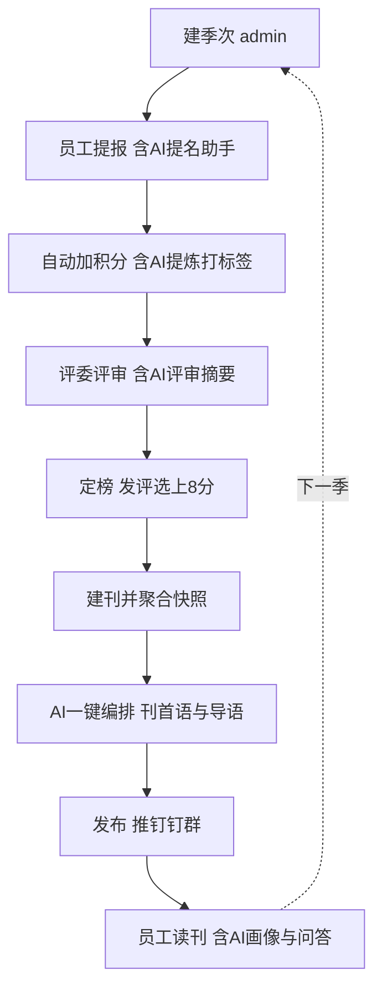
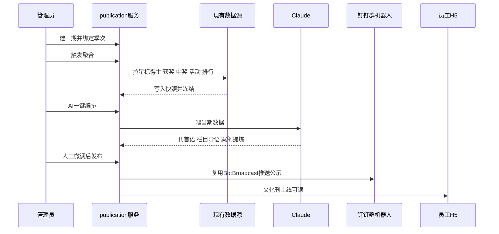
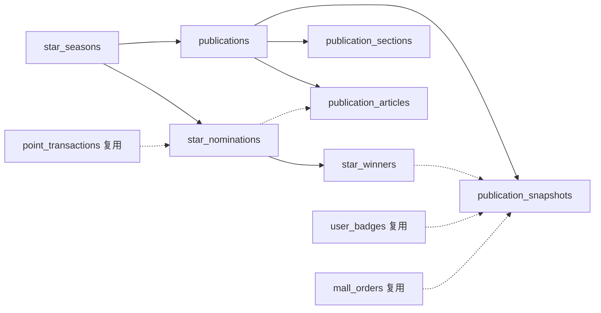
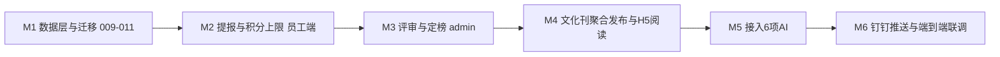

# 文化刊模块 设计文档

> 日期：2026-06-07　范围：culture_points_mall（后端 Go/Gin/GORM + 前端 React monorepo）
> 决策已定：**方案 B（提报评选进 app）+ 评选机制甲（评委制）+ 6 项 AI 全上 + H5 仅加 1 个 Tab**

## 背景与目标

### 现状

- H5 端功能不少（排行榜 / 活动 / 商城 / 徽章 / 价值观 / AI DNA），但**全是功能页，没有"可读"的内容载体**，员工没有持续回访的理由。
- 「文化星标」全套业务（季度提报、星标评选、幸运转盘公示）目前**都在钉钉外部跑**：提报靠钉钉表单，星标榜靠海报，中奖名单靠群消息。app 里没有这条业务，数据也沉淀不下来。
- 后端已接入 Claude（`platform/llm`），并在 insights 模块落地了 DNA 报告 / 教练 / 排行解读，AI 能力具备但未用于文化内容生产。

### 目标

1. 新增**文化刊**模块，作为企业文化内容的统一出口（季刊节奏），把星标公示、获奖公示、中奖公示、价值观专区等编排成一本可读的电子刊。
2. 把**提报 + 评选**搬进 app（替代钉钉表单），评选采用**评委制**；文化刊作为评选结果的展示出口。
3. H5 **只新增 1 个 Tab「文化刊」**，提报 / 我的提报 / AI 入口全部收纳其内，控制模块数量。
4. **6 项 AI** 贯穿提报、评审、成刊、阅读全程，全部复用已接入的 Claude，不引入新依赖。

### 非目标（本期不做）

- 全员投票评选（已选评委制，无投票期 / 防刷票逻辑）。
- 对接钉钉表单 API 拉取历史提报（星标得主由 admin 录入或 app 内提报产生）。
- AI 配图 / 文生图（项目暂无图像生成能力，封面用预置图或手工上传）。

---

## 范围与边界（已定决策）

| 决策项 | 结论 | 说明 |
|--------|------|------|
| 业务范围 | **方案 B** | 提报 + 评选进 app，文化刊作为出口（非纯展示层） |
| 评选机制 | **甲 评委制** | HR/管理层打分定榜，无全员投票。链路更短、贴合现状 |
| H5 模块 | **仅 1 个 Tab** | 提报评选入口收进文化刊内，不单开模块 |
| 评选可见性 | **仅 Admin** | 评审定榜是后台动作，H5 不出现「评选」入口 |
| AI 功能 | **1～6 全上** | 导语 / 案例提炼 / 个性化画像 / 问答 / 提名助手 / 评委辅助 |
| 积分规则 | **沿用海报** | 提报 +2（上限 6/月）、被提名 +4（上限 16/月）、评选上 +8 |

---

## 整体流程

### 季度生命周期



### 发刊时序



---

## 方案对比

### 业务范围

| 方案 | 优点 | 缺点 | 取舍 |
|------|------|------|------|
| A 聚合展示层 | 快、稳、复用为主 | 提报评选仍在钉钉，数据不闭环 | 未选 |
| **B 业务闭环** | 提报评选数据沉淀进 app，文化刊有真实出口 | 工作量翻倍 | **已选** |

### 评选机制

| 机制 | 优点 | 缺点 | 取舍 |
|------|------|------|------|
| **甲 评委制** | 可控、质量高、贴合现状、链路短 | H5 参与感靠提报与阅读支撑 | **已选** |
| 乙 全员投票 | 互动最强 | 易拉票刷票、人缘大于实绩 | 未选 |
| 丙 投票加评委 | 兼顾热闹与质量 | 流程最长 | 未选 |

**结论**：B + 甲。H5 的活跃度由「提报参与 + 文化刊阅读 + AI 个性化画像 + AI 问答」承载，无需投票即可显著丰富 H5。

---

## 详细设计

### 数据模型

净新增 **7 张表** + `value_dimensions` 轻量加 3 字段，其余全复用现有表。



#### A 组 提报评选

```sql
-- 009_create_stars_tables.up.sql
CREATE TABLE star_seasons (
  id BIGINT AUTO_INCREMENT PRIMARY KEY,
  tenant_id BIGINT NOT NULL,
  name VARCHAR(64) NOT NULL,
  quarter_code VARCHAR(16) NOT NULL,
  status ENUM('nominating','judging','published','closed') NOT NULL DEFAULT 'nominating',
  nominate_start_at TIMESTAMP NULL,
  nominate_end_at TIMESTAMP NULL,
  created_at TIMESTAMP DEFAULT CURRENT_TIMESTAMP,
  updated_at TIMESTAMP DEFAULT CURRENT_TIMESTAMP ON UPDATE CURRENT_TIMESTAMP,
  UNIQUE KEY uk_tenant_quarter (tenant_id, quarter_code),
  KEY idx_tenant_status (tenant_id, status)
) ENGINE=InnoDB CHARSET=utf8mb4;

CREATE TABLE star_nominations (
  id BIGINT AUTO_INCREMENT PRIMARY KEY,
  tenant_id BIGINT NOT NULL,
  season_id BIGINT NOT NULL,
  nominator_id BIGINT NOT NULL,
  nominee_id BIGINT NOT NULL,
  dimension_id BIGINT NOT NULL,
  case_text TEXT NOT NULL,
  case_refined TEXT NULL,
  ai_tags JSON NULL,
  status ENUM('submitted','duplicate','shortlisted','selected','rejected') NOT NULL DEFAULT 'submitted',
  score DECIMAL(4,1) NULL,
  created_at TIMESTAMP DEFAULT CURRENT_TIMESTAMP,
  updated_at TIMESTAMP DEFAULT CURRENT_TIMESTAMP ON UPDATE CURRENT_TIMESTAMP,
  UNIQUE KEY uk_dedup (season_id, nominator_id, nominee_id, dimension_id),
  KEY idx_season_nominee (season_id, nominee_id),
  KEY idx_season_status (season_id, status),
  KEY idx_nominator_month (tenant_id, nominator_id, created_at),
  KEY idx_nominee_month (tenant_id, nominee_id, created_at)
) ENGINE=InnoDB CHARSET=utf8mb4;

CREATE TABLE star_winners (
  id BIGINT AUTO_INCREMENT PRIMARY KEY,
  tenant_id BIGINT NOT NULL,
  season_id BIGINT NOT NULL,
  user_id BIGINT NOT NULL,
  dimension_id BIGINT NOT NULL,
  citation TEXT NULL,
  source_nomination_id BIGINT NULL,
  created_at TIMESTAMP DEFAULT CURRENT_TIMESTAMP,
  UNIQUE KEY uk_season_user_dim (season_id, user_id, dimension_id),
  KEY idx_tenant_season (tenant_id, season_id)
) ENGINE=InnoDB CHARSET=utf8mb4;
```

- `uk_dedup`：同一季同一提报人对同一对象同一价值观只能提报一次，从 DB 层杜绝重复刷分。
- `idx_nominator_month` / `idx_nominee_month`：支撑月度上限的当月窗口计数（见核心逻辑）。
- `star_winners` 与 `star_nominations` 分离：评委选的是「人」，一人一季一维度一条，便于颁奖词与文化刊展示。

#### B 组 文化刊

```sql
-- 010_create_publication_tables.up.sql
CREATE TABLE publications (
  id BIGINT AUTO_INCREMENT PRIMARY KEY,
  tenant_id BIGINT NOT NULL,
  season_id BIGINT NULL,
  title VARCHAR(128) NOT NULL,
  period_code VARCHAR(16) NOT NULL,
  cover_image_url VARCHAR(255) NULL,
  intro_text TEXT NULL,
  status ENUM('draft','published','archived') NOT NULL DEFAULT 'draft',
  published_at TIMESTAMP NULL,
  created_at TIMESTAMP DEFAULT CURRENT_TIMESTAMP,
  updated_at TIMESTAMP DEFAULT CURRENT_TIMESTAMP ON UPDATE CURRENT_TIMESTAMP,
  KEY idx_tenant_status (tenant_id, status),
  KEY idx_tenant_period (tenant_id, period_code)
) ENGINE=InnoDB CHARSET=utf8mb4;

CREATE TABLE publication_sections (
  id BIGINT AUTO_INCREMENT PRIMARY KEY,
  publication_id BIGINT NOT NULL,
  type ENUM('editorial','star','values','honors','lottery','activity','leaderboard','innovation','custom') NOT NULL,
  title VARCHAR(64) NOT NULL,
  sort_order INT NOT NULL DEFAULT 0,
  visible TINYINT(1) NOT NULL DEFAULT 1,
  ai_copy TEXT NULL,
  config_json JSON NULL,
  created_at TIMESTAMP DEFAULT CURRENT_TIMESTAMP,
  KEY idx_pub (publication_id, sort_order)
) ENGINE=InnoDB CHARSET=utf8mb4;

CREATE TABLE publication_articles (
  id BIGINT AUTO_INCREMENT PRIMARY KEY,
  tenant_id BIGINT NOT NULL,
  publication_id BIGINT NULL,
  section_id BIGINT NULL,
  title VARCHAR(128) NOT NULL,
  summary VARCHAR(255) NULL,
  content_html TEXT NOT NULL,
  cover_image_url VARCHAR(255) NULL,
  source_type ENUM('manual','from_nomination') NOT NULL DEFAULT 'manual',
  source_id BIGINT NULL,
  value_dimension_id BIGINT NULL,
  author_id BIGINT NULL,
  status ENUM('draft','published') NOT NULL DEFAULT 'draft',
  published_at TIMESTAMP NULL,
  created_at TIMESTAMP DEFAULT CURRENT_TIMESTAMP,
  updated_at TIMESTAMP DEFAULT CURRENT_TIMESTAMP ON UPDATE CURRENT_TIMESTAMP,
  KEY idx_pub_section (publication_id, section_id),
  KEY idx_tenant_status (tenant_id, status)
) ENGINE=InnoDB CHARSET=utf8mb4;

CREATE TABLE publication_snapshots (
  id BIGINT AUTO_INCREMENT PRIMARY KEY,
  publication_id BIGINT NOT NULL,
  section_id BIGINT NOT NULL,
  data_json JSON NOT NULL,
  created_at TIMESTAMP DEFAULT CURRENT_TIMESTAMP,
  UNIQUE KEY uk_pub_section (publication_id, section_id)
) ENGINE=InnoDB CHARSET=utf8mb4;
```

```sql
-- 011_add_value_dimension_fields.up.sql
ALTER TABLE value_dimensions
  ADD COLUMN description VARCHAR(255) NULL AFTER name,
  ADD COLUMN icon VARCHAR(64) NULL AFTER description,
  ADD COLUMN color VARCHAR(16) NULL AFTER icon;
```

> **快照表是核心**：`publication_snapshots` 在发刊瞬间把"会变的数据"（排行 / 获奖 / 中奖 / 活动）冻结进 `data_json`，保证历史刊永不变样。"成稿内容"（星标颁奖词、价值观案例）落 `publication_articles`，其中价值观案例可由评选上的提名经 AI 提炼自动生成（`source_type=from_nomination` + `source_id` 回链）。

> 迁移编号：现有到 008，新表从 **009** 起；裸 `CREATE TABLE` + `ENGINE=InnoDB CHARSET=utf8mb4` + `uk_`/`idx_` 命名 + up/down 双文件，与现有惯例一致。

### 后端模块与分层

新增 2 个模块，沿用项目 `domain / repository / service / handler` 四层（参 points、activities）。

```
internal/modules/stars/          # 提报评选
  domain/        season.go nomination.go winner.go repository.go(接口)
  repository/    gorm_repo.go
  service/       service.go         # 提报+上限、评审打分、定榜发分、状态机、AI⑤⑥
  handler/       handler.go         # Register(员工) + RegisterAdmin(后台)

internal/modules/publication/    # 文化刊
  domain/        publication.go section.go article.go snapshot.go repository.go(接口)
  repository/    gorm_repo.go
  service/       service.go         # 聚合快照、AI编排、发布、推钉钉、H5读取、AI①②③④
  handler/       handler.go
```

**复用（0 改动）**：`points`（加分 + 月度上限统计）、`values`、`leaderboard`（快照取数）、`achievements`（获奖公示）、`mall`（中奖公示）、`activities`（活动回顾）、`platform/llm`（Claude）、`dingtalk.BotBroadcast`（推群）、`agent`（问答会话表）。

### 接口清单

#### 员工端 `/api/v1`（authed 组：JWT + 用户存在校验）

| 方法 | 路径 | 说明 | AI |
|------|------|------|----|
| GET | `/api/v1/stars/seasons/current` | 当期季次 + 我的剩余配额 | |
| POST | `/api/v1/stars/nominations` | 提交提报 | |
| POST | `/api/v1/stars/nominations/ai-draft` | 由关键词生成案例草稿 | AI⑤ |
| GET | `/api/v1/stars/nominations/mine` | 我提报的 + 我被提名的 | |
| GET | `/api/v1/publications` | 刊物列表（已发布） | |
| GET | `/api/v1/publications/current` | 当期刊 | |
| GET | `/api/v1/publications/:id` | 刊物详情（栏目+文章+快照） | |
| GET | `/api/v1/me/culture-portrait` | 个性化文化画像 | AI③ |
| POST | `/api/v1/culture-qa/ask` | 文化官问答（复用 agent 表） | AI④ |

#### 管理端 `/admin`（admin 组：JWT + 用户存在 + RequireRole("admin")）

| 方法 | 路径 | 说明 | AI |
|------|------|------|----|
| POST | `/admin/stars/seasons` | 建季次 + 设提报窗口 | |
| PUT | `/admin/stars/seasons/:id/status` | 推进状态机 | |
| GET | `/admin/stars/seasons/:id/nominations` | 评委看全部提报 | |
| POST | `/admin/stars/seasons/:id/ai-digest` | 生成评审摘要 + 查重 | AI⑥ |
| POST | `/admin/stars/nominations/:id/score` | 评委打分 | |
| POST | `/admin/stars/seasons/:id/select` | 定榜（写 winner + 发 +8 分，原子） | |
| POST | `/admin/publications` | 建一期（绑定季次） | |
| POST | `/admin/publications/:id/aggregate` | 聚合快照 | |
| POST | `/admin/publications/:id/ai-compose` | 一键生成刊首语/导语/案例提炼 | AI①② |
| PUT | `/admin/publications/:id/sections` | 栏目勾选/排序/隐藏 | |
| PUT | `/admin/publications/:id/articles/:aid` | 文章微调（含中奖名单手录） | |
| POST | `/admin/publications/:id/publish` | 发布 | |
| POST | `/admin/publications/:id/push-dingtalk` | 复用群机器人推送 | |

> 响应包装沿用现有惯例：成功 `c.JSON(200, gin.H{"items":...})` 或 view struct，失败 `c.JSON(code, gin.H{"error": ...})`；`gorm.ErrRecordNotFound`→404、业务冲突→409、参数→400、未认证→401、角色不足→403。**不新造 response helper。**

### 文化刊栏目（9 栏目，admin 每期可勾选/排序/隐藏）

| 栏目 type | 名称 | 内容 | 数据来源 | 入快照 |
|------|------|------|----------|--------|
| editorial | 📝 刊首语 | 开篇导语 | AI① 生成 | 否（存 publications.intro_text） |
| star | 🌟 星标公示 | 本季星标得主 + 颁奖词 | star_winners + AI 颁奖词 | 是 |
| values | 💎 价值观专区 | 四观释义+金句、践行案例、本季最受认可价值观 | value_dimensions + 提名(AI②) | 部分 |
| honors | 🏅 获奖公示 | 徽章里程碑 / 季度荣誉名单 | user_badges | 是 |
| lottery | 🎁 中奖公示 | 幸运转盘/盲盒中奖（特等+普通） | mall_orders + 可手录 article | 是 |
| activity | 📸 活动回顾 | 本季活动剪影 | activities | 是 |
| leaderboard | 📊 文化分榜 | 本季文化分 TOP | leaderboard 快照 | 是 |
| innovation | 💡 创新项目 | 创新提报展示 | custom article | 否 |
| custom | ✍️ 自定义 | 领导寄语等富文本 | manual article | 否 |

**快照策略**：勾选「入快照」的栏目在 `aggregate` 时把当期数据写 `publication_snapshots.data_json`；成稿类（刊首语 / 价值观案例 / 创新 / 自定义）走 `publication_articles`。H5 阅读时：快照栏目读 snapshot，成稿栏目读 article，二者按 `sort_order` 合并渲染。

### 核心服务逻辑

**提报 `stars.Service.Nominate`**：
1. 校验季次 `status=nominating` 且在 `[nominate_start_at, nominate_end_at]` 窗口内（否则中文哨兵 error → 409）。
2. 区分自荐（`nominee_id == nominator_id`）与提名他人。
3. 插入 `star_nominations`（命中 `uk_dedup` → 标记 duplicate，不发分）。
4. **月度上限校验后再发分**（见下方决策点）：提报人 `AddPoints(+2)`（当月提报积分 < 6）、被提名人 `AddPoints(+4)`（当月被提名积分 < 16）。
5. 若 `deps.LLM != nil`，best-effort 调 AI② 写 `case_refined` + `ai_tags`（失败不阻断提报）。

**定榜 `stars.Service.SelectWinners`**：在**单事务**内：写 `star_winners`（含 AI 颁奖词）+ 对每位得主 `AddPoints(评选上 +8)` + 置相关 `star_nominations.status=selected`。为保证原子性，**显式把事务 `*gorm.DB` 传入 repo 方法**（见决策点）。

**聚合 `publication.Service.Aggregate`**：遍历可见且需入快照的栏目，按 type 查对应来源（star_winners / user_badges / mall_orders / activities / leaderboard），写 `publication_snapshots`，幂等覆盖（`uk_pub_section`）。

**AI 编排 `publication.Service.AiCompose`**：基于已聚合的快照数据，生成 `intro_text`（刊首语）+ 各栏目 `ai_copy`（导语）+ 把评选上的提名 AI 提炼成 `publication_articles`（价值观案例）。沿用 insights 的非流式 + Redis 缓存范式。

**发布 `Publish` / 推送 `PushDingtalk`**：置 `status=published` + `published_at`；推送复用 `dingtalk.BotBroadcast` 自定义机器人加签。

### AI 落点设计（6 项）

统一走 `platform/llm` 工厂；**默认照 insights 范式：非流式 `Messages` + system 中文角色 + `fmt.Sprintf` 拼 user（内嵌期望 JSON）+ 剥代码块截 JSON + Redis 缓存**。

| AI | 触发位置 | 输入 → 输出 | 模式 |
|----|----------|-------------|------|
| ① 刊首语/导语 | Admin 文化刊·一键编排 | 当期聚合数据 → 文案 | 非流式 |
| ② 案例提炼+标签 | 提报提交(自动) + Admin 编排 | 案例原文 → 精炼故事 + 价值观标签 | 非流式 |
| ③ 个性化画像 | H5 文化刊·我的文化画像 | 个人积分/维度/徽章 → 画像 | 非流式 + 缓存 |
| ④ 文化官问答 | H5 文化刊·AI 文化官 | 提问 → 答复（复用 agent 表） | SSE（仅 claude，否则降级非流式） |
| ⑤ 提名助手 | H5 提报表单·AI 帮我写 | 关键词/口述 → 案例草稿 | SSE（仅 claude，否则降级非流式） |
| ⑥ 评委辅助 | Admin 评审台·生成摘要 | 全季提报 → 评审摘要 + 查重 | 非流式 |

> 流式仅 claude 实现（OpenAI 系 `MessagesStream` 为空实现）。问答/提名助手在 `provider=claude` 时用 SSE（参 agent/publish handler 的 SSE 写法），否则回退非流式。所有 AI 调用前判 `deps.LLM != nil`，未配置则隐藏入口或返回降级提示。

### H5 页面（仅 1 个 Tab）

底部导航新增 **📖 文化刊**（排行/活动/商城/我的 原样不动）。文化刊 Tab 内含：

| 二级页 | 路由 | 说明 |
|--------|------|------|
| 文化刊首页 | `/publications/current` | 封面 + 9 栏目 + 提报 CTA + AI 双入口 |
| 刊物历史 | `/publications` | 往期列表 |
| 提报表单 | `/stars/nominate` | 提报对象/价值观/案例 + AI⑤ 帮我写 |
| 我的提报 | `/stars/mine` | 我提报的 + 我被提名的 |
| 我的文化画像 | `/me/culture-portrait` | AI③ |
| AI 文化官 | `/culture-qa` | AI④ 问答 |

**复用现成组件**：LeaderboardRow、BadgeWall、GlassCard、DimensionTag、StatCard、PageHeader、AiCoachCard（作内容卡模板）。评选（评委制）不在 H5 出现。

### Admin 页面（新增 2 组导航）

- **🏆 文化星标（评选）**：季次管理（建季次/窗口/状态机）、评委评审台（看全部提报含 AI 提炼/标签/查重标记、打分、AI⑥ 一键摘要）、定榜（勾选得主→自动发 +8 分）。
- **📖 文化刊**：期次管理（建期绑季次）、一键聚合快照 + AI①② 一键编排、栏目编辑（勾选/排序 9 栏目 + 富文本 + 中奖名单手录）、预览 → 发布 → 推钉钉。

技术栈沿用 admin 现状（React 19 + Vite + unoCSS + @dnd-kit 拖拽排序 + React Query）。

### 关键决策点

1. **月度积分上限**：项目 `AddPoints` 无内置额度，`reason` 无结构化前缀。**不解析 reason**，改用 `star_nominations` 表的**当月行数/积分窗口求和**判定：提报人当月已得 `count*2`，被提名人当月已得 `count*4`，超限则**只记录提报、不再发分**（参与不受限，仅积分封顶）。窗口 SQL 参 insights 的"近 7 天求和"写法。
2. **定榜原子性（幂等而非事务）**：现有 `AddPoints` 的事务闭包并未把 `db` 传入 repo（跨 repo 不共享事务），做跨模块真事务成本高且需改动共享的 points 代码。定榜改用**幂等三步**：winner 表 `uk_season_user_dim` 作闸门，`CreateWinnerIfAbsent` 返回 `created`，仅新晋者发 +8 分；置提名状态与发分各自幂等，可安全重跑、保证 exactly-once。不引跨模块事务、0 改动 points。
3. **reason 取值**：三类加分 reason 用可读中文 + 统一可识别措辞（如「文化提报」「被提名加分」「评选当选」），便于审计；上限判定走 star_nominations 计数而非 reason 解析。
4. **repo 接口位置**：跟 points 一致，在 `domain/repository.go` 定接口，service 持接口类型，利于单测内存 fake。

---

## 现有框架复用（项目惯例 audit 结论）

> 写代码时严格照抄以下范式，避免凭印象偏离。证据为审计读全文所得。

- **domain**：全字段 PascalCase + `gorm:"column:snake_case"`，首字段 `TenantID int64`，`CreatedAt time.Time`（需更新加 `UpdatedAt`），可空用指针，写 `func (T) TableName() string`，枚举 `type XStatus string` + const，**无软删除**。参 `points/domain/transaction.go`、`activities/domain/activity.go`。
- **repository**：`type GormRepo struct{ DB *gorm.DB }` + `New(db)`；方法 `(ctx, ...)`，体内 `r.DB.WithContext(ctx)....Error`；事务不写在 repo。参 `points/repository/gorm_repo.go`。
- **service**：`struct{ DB *gorm.DB; Repo 接口; 其他Service; Redis }` + `New(...)`；入参 `XxxCmd`；哨兵中文 error + `fmt.Errorf("%w")`；跨表写 `s.DB.WithContext(ctx).Transaction(...)`。参 `points/service/service.go`、`insights/service/service.go`。
- **handler**：`Handler{Svc}` + `New`；`Register(rg)` 挂 `/api/v1/*`、`RegisterAdmin(rg)` 挂 `/admin/*`；`ShouldBindJSON` 进带 `binding:"required"` 的 req struct；从 `cpmctx` 取 tid/uid；`c.JSON(200, gin.H{"items":...})` / `c.JSON(code, gin.H{"error":...})`。参 `activities/handler/handler.go`。
- **装配**：composition root 在 `router.go 的 Build(deps)`；按 `repo→svc→handler` new，复用已 new 的 `pointsSvc/valuesSvc`；用户端 `Register(authed)`、后台端 `RegisterAdmin(admin)`；AI 模块放 `if deps.LLM != nil` 块。admin 组 = `RequireJWTWithUser(...)` + `RequireRole("admin")`。
- **迁移**：从 009 起，裸 `CREATE TABLE` + `InnoDB/utf8mb4` + `uk_/idx_` 命名 + up/down 双文件；runner 无版本表（手动跑，server 不自动跑）。
- **LLM**：`Client.Messages(ctx, req)`（非流式首选）/ `MessagesStream`（仅 claude）；`req.System` 中文角色 + `req.Messages` 内 `Block{Type:"text"}`；取 `resp.Content` 文本 → 剥 ```json 代码块 → 截首尾大括号 → `json.Unmarshal`；结果 Redis 缓存 key 形如 `culture:xxx:%d:%d`。参 `insights/service/service.go` 的 `callLLMJSON`。
- **config**：新建 `StarsCfg`/`PublicationCfg` 子 struct（字段带 `mapstructure`）挂 `Config` 顶层，yaml 写默认值（积分上限、季次默认），service 经 `Build` 注入。
- **积分复用**：`points.Service.AddPoints(ctx, AddPointsCmd{TenantID,UserID,Amount,DimensionID/DimCode,Reason,...})`，负值即减分；无内置上限，需自查自拦。统计可用 `GetEarnedTotal` 等，但月度按类窗口求和需自写。
- **测试**：自有 repo 用内存 fake 单测；至少 1 条 `//go:build integration` 集成测试用 dockertest 真 MySQL + 真 repo + `migrate.Runner.Up()` + 每测 `TRUNCATE`；LLM 用 httptest 假服务器；钉钉用现成 mock。**不 mock 自有 repo/service**。

---

## 实现里程碑



- **M1**：3 个迁移 + domain + repository（接口 + GormRepo）+ 内存 fake 单测。
- **M2**：stars 提报 service（窗口校验 + dedup + 月度上限 + 发分）+ 员工端提报接口 + H5 提报表单页（先不含 AI⑤）。
- **M3**：评委评审台接口（看全部 / 打分）+ 定榜原子事务 + admin 评选页。
- **M4**：publication 聚合快照 + 栏目/文章 CRUD + 发布 + H5 文化刊阅读页（9 栏目渲染）+ admin 编排页。
- **M5**：6 项 AI 落点（先 ②⑤ 提报相关，再 ①③④⑥）。
- **M6**：push-dingtalk + 集成测试 + 联调。

---

## 测试要点

**单元（内存 fake repo）**：
- 月度上限：提报第 4 次（>6 分）不再发分但提报成功；被提名超 16 分封顶。
- 季次状态门禁：非 `nominating` 期提报被拒；非 `judging` 不能打分。
- dedup：同季同提报人同对象同维度重复提报命中 `uk_dedup`。
- 自荐：`nominee_id == nominator_id` 正确处理。

**集成（dockertest 真库）**：
- 提报 → `point_transactions` + `user_dimension_scores` 正确写入（验证序列化副作用）。
- 定榜 → `star_winners` 写入 + 评选上 +8 分，**事务原子**（中途失败全回滚）。
- 聚合 → 快照冻结后，改动源数据不影响已发布刊物。

**AI（httptest 假 LLM）**：
- AI② 提炼返回非法 JSON 时容错（剥代码块 / 截括号 / 失败不阻断提报）。
- `deps.LLM == nil` 时 AI 入口降级、主流程不受影响。

**端到端验收**：建季次 → 提报（AI⑤）→ 加分 → 评审（AI⑥）→ 定榜 → 建刊聚合 → AI 编排 → 发布 → 推钉钉 → H5 读刊 + AI③④，全链路打通。

---

## 风险与缓解

| 风险 | 缓解 |
|------|------|
| 定榜重复发分 | 幂等三步（winner uk 闸门 + created 判断），集成测试跑两次验证 exactly-once |
| AI 输出不稳定/费 token | 非流式 + Redis 缓存 + JSON 容错；admin 编排可人工微调后再发布 |
| 仅 claude 支持流式 | 问答/助手在非 claude provider 降级非流式 |
| 月度上限项目无内置 | 用 star_nominations 当月窗口计数自拦，不依赖 reason 解析 |
| 迁移 runner 无版本表会重跑 | 沿用现有手动跑约定；如需幂等可在新迁移用 IF NOT EXISTS（标注偏离） |
| 钉钉机器人限速 20 条/分钟 | 推送合并为单条富文本公示，不逐人发 |
